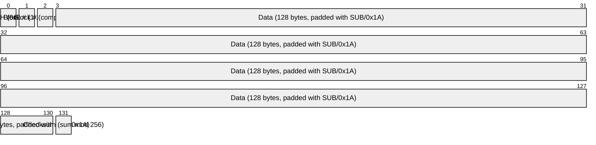
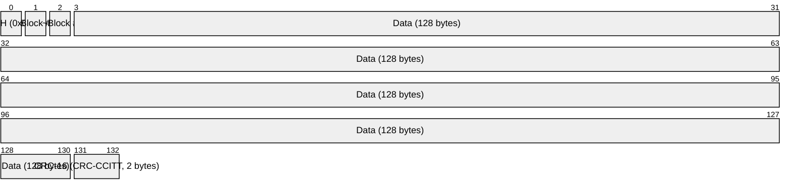
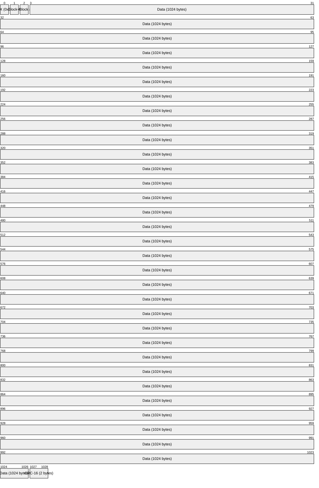
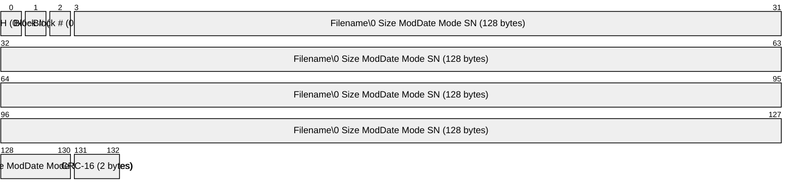
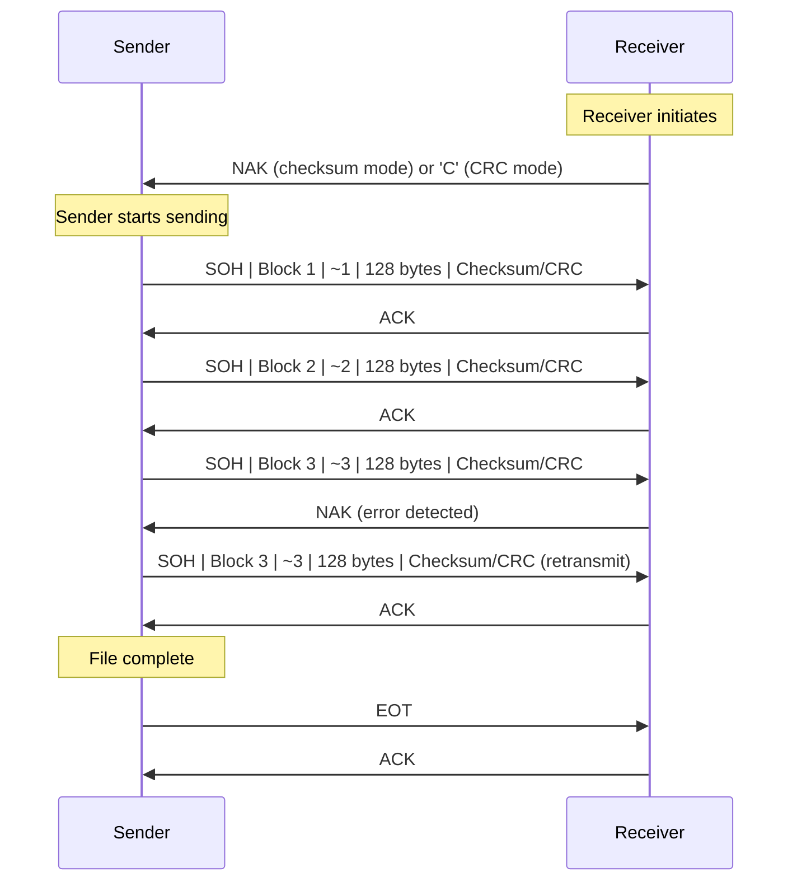
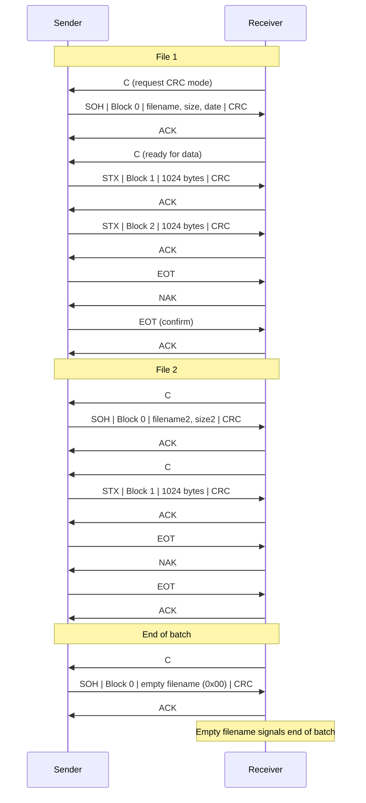

# XMODEM / YMODEM

> **Standard:** [Ward Christensen's XMODEM Protocol](http://textfiles.com/programming/xmodem.txt), [Chuck Forsberg's YMODEM Spec](https://web.archive.org/web/20230607123654/https://pauillac.inria.fr/~doligez/zmodem/ymodem.txt) | **Layer:** Application (serial file transfer) | **Wireshark filter:** N/A (serial protocol, not IP)

XMODEM is the first widely used file transfer protocol for microcomputers, created by Ward Christensen in 1977 for CP/M systems. It enabled ordinary users to reliably transfer files over noisy telephone lines using modems and terminal programs. YMODEM (Chuck Forsberg, 1985) extended XMODEM with batch file transfers, filenames, file sizes, and larger blocks. Together they defined the era of BBS file transfers and remain supported by virtually every terminal emulator.

## XMODEM Block (Checksum)

## XMODEM-CRC Block

## XMODEM-1K Block

## YMODEM Block 0 (File Header)

Block 0 carries metadata: the filename (null-terminated), followed by the file size in ASCII decimal, modification date as an octal Unix timestamp, optional file mode, and optional serial number, all space-separated within the 128-byte data field.

## Key Fields

| Field | Size | Description |
|-------|------|-------------|
| SOH | 1 byte | Start of Header (0x01) -- indicates 128-byte data block |
| STX | 1 byte | Start of Text (0x02) -- indicates 1024-byte data block (XMODEM-1K / YMODEM) |
| Block Number | 1 byte | Sequence number, starts at 1 (or 0 for YMODEM header), wraps at 255 |
| Block Complement | 1 byte | One's complement of block number (255 - block#) for integrity |
| Data | 128 or 1024 bytes | File data, padded with SUB (0x1A) if final block is short |
| Checksum | 1 byte | Sum of all data bytes mod 256 (original XMODEM only) |
| CRC-16 | 2 bytes | CRC-CCITT (polynomial 0x1021), big-endian (XMODEM-CRC and later) |

## Control Characters

| Character | Hex | Name | Purpose |
|-----------|-----|------|---------|
| SOH | 0x01 | Start of Header | Begins 128-byte data block |
| STX | 0x02 | Start of Text | Begins 1024-byte data block |
| EOT | 0x04 | End of Transmission | Sender signals file complete |
| ACK | 0x06 | Acknowledge | Receiver confirms block received OK |
| NAK | 0x15 | Negative Acknowledge | Receiver requests retransmission (or initiates checksum mode) |
| CAN | 0x18 | Cancel | Abort transfer -- send two or more to confirm |
| 'C' | 0x43 | CRC request | Receiver sends to request CRC mode instead of checksum |
| SUB | 0x1A | Substitute / Ctrl-Z | Padding byte for short final blocks |

## XMODEM File Transfer

The receiver is the driver: it initiates the transfer by sending NAK (for checksum mode) or 'C' (for CRC mode). The sender does not begin until it receives this initiation character. If a block is corrupted, the receiver NAKs and the sender retransmits. After 10 consecutive retries on the same block, the transfer is aborted.

## YMODEM Batch Transfer

YMODEM wraps each file with a Block 0 header containing metadata. After the last file, an empty Block 0 (null filename) signals the end of the batch. The receiver confirms each EOT with a NAK/EOT/ACK handshake to guard against line noise.

## YMODEM-G (Streaming Variant)

YMODEM-G is a streaming variant designed for error-free links (hardware flow control or error-correcting modems). The receiver sends 'G' instead of 'C' to initiate. The sender then streams blocks without waiting for per-block ACKs. Any error causes the transfer to abort entirely -- there is no per-block retransmission.

## Protocol Comparison

| Feature | XMODEM | XMODEM-CRC | XMODEM-1K | YMODEM | YMODEM-G |
|---------|--------|------------|-----------|--------|----------|
| Year | 1977 | ~1982 | ~1983 | 1985 | 1985 |
| Block size | 128 | 128 | 1024 | 1024 (default) | 1024 |
| Error check | Checksum (8-bit) | CRC-CCITT (16-bit) | CRC-CCITT (16-bit) | CRC-CCITT (16-bit) | CRC-CCITT (16-bit) |
| Filename sent | No | No | No | Yes (Block 0) | Yes (Block 0) |
| File size sent | No | No | No | Yes | Yes |
| Batch transfer | No | No | No | Yes | Yes |
| Flow | ACK per block | ACK per block | ACK per block | ACK per block | Streaming (no per-block ACK) |
| Crash recovery | No | No | No | No | No |
| Initiation | Receiver sends NAK | Receiver sends 'C' | Receiver sends 'C' | Receiver sends 'C' | Receiver sends 'G' |

## Error Handling

| Condition | Behavior |
|-----------|----------|
| Bad checksum/CRC | Receiver sends NAK, sender retransmits block |
| Bad block number | Receiver sends NAK |
| Duplicate block (previous block#) | Receiver sends ACK (already received) and discards |
| 10 consecutive NAKs on same block | Transfer aborted |
| Timeout (no response) | Retry, then abort after 10 attempts |
| CAN received (2+ times) | Transfer cancelled by remote end |

## Historical Significance

XMODEM was the first practical file transfer protocol for personal computers. Ward Christensen wrote it in 8080 assembly for CP/M and placed it in the public domain, allowing it to spread across every BBS and terminal program of the 1980s. Its simplicity -- the entire protocol can be implemented in a few hundred lines of code -- made it the foundation for the YMODEM and ZMODEM protocols that followed. The receiver-driven design was well-suited to the half-duplex modems of the era, and the SUB padding convention (inherited from CP/M's lack of exact file sizes) persisted for years.

## Standards

| Document | Title |
|----------|-------|
| [XMODEM Protocol Reference](http://textfiles.com/programming/xmodem.txt) | Ward Christensen's original 1977 specification |
| [XMODEM/CRC Overview](https://web.archive.org/web/20230607123654/https://pauillac.inria.fr/~doligez/zmodem/ymodem.txt) | CRC extension documented in Forsberg's YMODEM spec |
| [YMODEM Batch File Transfer Protocol](https://web.archive.org/web/20230607123654/https://pauillac.inria.fr/~doligez/zmodem/ymodem.txt) | Chuck Forsberg's YMODEM specification (1985) |

## See Also

- [ZMODEM](zmodem.md) -- advanced streaming protocol with crash recovery
- [UART](uart.md) -- underlying asynchronous serial framing
- [RS-232](rs232.md) -- electrical standard for serial communication
- [FTP](../file-sharing/ftp.md) -- TCP/IP-based file transfer protocol
- [SFTP / SCP](../file-sharing/scp.md) -- encrypted file transfer over SSH
