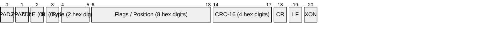
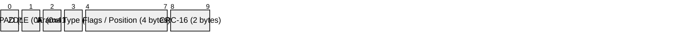
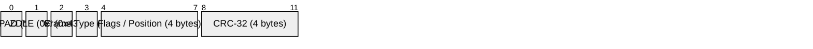
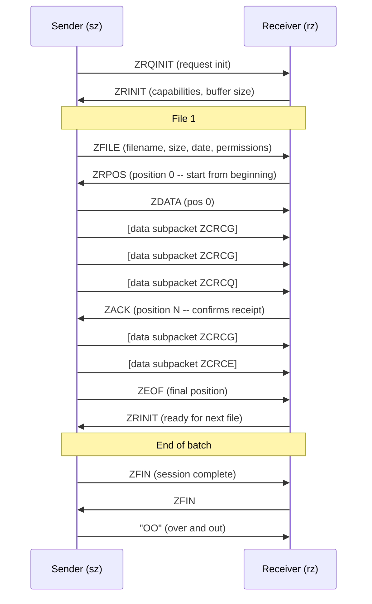
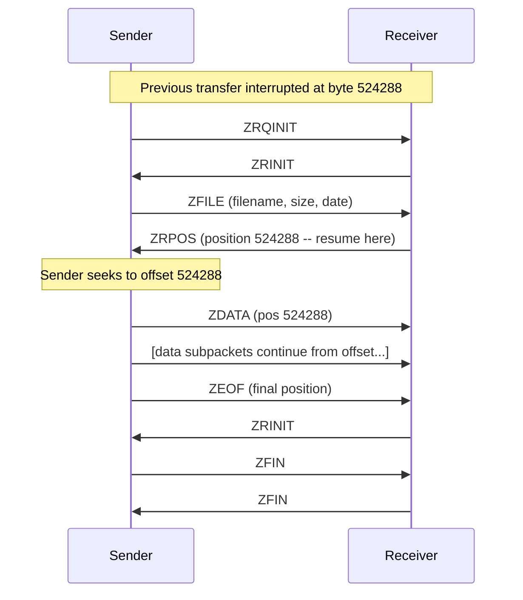

# ZMODEM

> **Standard:** [Chuck Forsberg's ZMODEM Protocol](https://web.archive.org/web/20230219031733/http://www.stratus.com/ftp/pub/vos/doc/reference/zmodem.txt) | **Layer:** Application (serial file transfer) | **Wireshark filter:** N/A (serial protocol, not IP)

ZMODEM is an advanced serial file transfer protocol designed by Chuck Forsberg in 1986. It was the protocol of choice on BBSes and Unix systems throughout the late 1980s and 1990s, largely replacing XMODEM and YMODEM. ZMODEM's key innovations are streaming data transfer (no per-block ACK), crash recovery (resume interrupted transfers at the exact byte offset), auto-start (the `rz`/`sz` commands can trigger automatically), variable-length data subpackets, and 32-bit CRC. These features made it dramatically faster than its predecessors, especially on high-latency links.

## Hex Header

Hex headers are human-readable (all printable characters) and used for initial negotiation frames. The two ZPAD characters (0x2A, asterisk) allow the receiver to detect the start of a ZMODEM session. ZDLE (0x18) followed by 'B' marks this as a hex-encoded header.

## Binary Header (16-bit CRC)

## Binary Header (32-bit CRC)

Binary headers are more compact and used during data transfer. The header type character distinguishes encoding: 'A' = binary with 16-bit CRC, 'B' = hex with 16-bit CRC, 'C' = binary with 32-bit CRC.

## Key Fields

| Field | Size | Description |
|-------|------|-------------|
| ZPAD | 1 byte | Padding character (0x2A, asterisk) -- allows receiver to detect ZMODEM |
| ZDLE | 1 byte | Escape character (0x18) -- marks header start and escapes special bytes in data |
| Header type | 1 byte | 'A' (binary/CRC16), 'B' (hex/CRC16), or 'C' (binary/CRC32) |
| Frame type | 1 byte | Identifies the frame function (ZRQINIT, ZFILE, ZDATA, etc.) |
| Flags / Position | 4 bytes | Frame-type-dependent: file position offset, capability flags, or parameters |
| CRC | 2 or 4 bytes | CRC-16 (CRC-CCITT) or CRC-32, covering type + flags |

## ZDLE Encoding

ZDLE (0x18) is the escape character for binary data. When a byte that must be escaped appears in the data stream, it is replaced by ZDLE followed by the byte XORed with 0x40. Bytes that must be escaped:

| Byte | Hex | Reason |
|------|-----|--------|
| ZDLE | 0x18 | Escape character itself |
| XON | 0x11 | Software flow control |
| XOFF | 0x13 | Software flow control |
| XON \| 0x80 | 0x91 | XON with bit 7 set |
| XOFF \| 0x80 | 0x93 | XOFF with bit 7 set |
| 0x10 | 0x10 | DLE -- interferes with some modems |
| CR following @ | 0x0D | Telenet escape sequence avoidance |

## Frame Type Codes

| Code | Name | Direction | Description |
|------|------|-----------|-------------|
| 0 | ZRQINIT | Sender | Request receiver initialization |
| 1 | ZRINIT | Receiver | Receiver capabilities and initialization |
| 2 | ZSINIT | Sender | Define attention string, set parameters |
| 3 | ZACK | Both | Acknowledge, position report |
| 4 | ZFILE | Sender | File name, attributes, and metadata |
| 5 | ZSKIP | Receiver | Skip this file |
| 6 | ZNAK | Receiver | Last header was garbled -- retransmit |
| 7 | ZABORT | Receiver | Abort batch transfer |
| 8 | ZFIN | Sender | Finish session |
| 9 | ZRPOS | Receiver | Resume data from this position (crash recovery) |
| 10 | ZDATA | Sender | Data follows at given position |
| 11 | ZEOF | Sender | End of file at given position |
| 12 | ZFERR | Receiver | Fatal file I/O error |
| 13 | ZCRC | Receiver | Request file CRC (for comparison) |
| 14 | ZCHALLENGE | Receiver | Security challenge |
| 15 | ZCOMPL | Sender | Request is complete |
| 16 | ZCAN | Both | Cancel -- 5 CAN chars (0x18) |
| 17 | ZFREECNT | Sender | Request free disk space |
| 18 | ZCOMMAND | Sender | Execute command on remote system |

## Data Subpackets

After a ZDATA header, the sender transmits variable-length data subpackets. Each subpacket ends with a ZDLE-encoded terminator byte followed by CRC:

| Terminator | Name | Meaning |
|------------|------|---------|
| ZCRCE | CRC next, end | End of data, no response expected |
| ZCRCG | CRC next, go | More data follows, no response expected |
| ZCRCQ | CRC next, query | More data follows, ACK requested (window sync) |
| ZCRCW | CRC next, wait | End of data, ACK required before continuing |

The sender can stream many ZCRCG subpackets without pausing. ZCRCQ is inserted periodically to implement sliding window flow control. ZCRCW forces a full stop-and-wait synchronization.

## ZMODEM File Transfer

The sender streams data subpackets continuously, only pausing at ZCRCQ/ZCRCW boundaries for receiver acknowledgment. This eliminates the round-trip delay that slowed XMODEM. The receiver interrupts with ZRPOS only when it detects an error.

## Crash Recovery (Resume)

When a transfer is interrupted and restarted, the receiver checks what it already has on disk. On receiving ZFILE, if a partial file exists with a matching name and size, the receiver responds with ZRPOS at the last known good offset instead of position 0. The sender seeks to that offset and resumes transmission.

## Window Management

ZMODEM supports a sliding window for flow control without stopping the data stream. The sender tracks how many unacknowledged bytes are outstanding. When the window fills, it inserts a ZCRCQ subpacket and waits for ZACK before continuing. The receiver's ZRINIT flags advertise its buffer size.

| Window Strategy | Description |
|----------------|-------------|
| Full streaming | No window limit, sender blasts at full speed (reliable links) |
| Windowed | Sender limits unacknowledged bytes, uses ZCRCQ for sync |
| Segmented | ZCRCW at each segment boundary (unreliable links) |

## Protocol Comparison

| Feature | XMODEM | YMODEM | ZMODEM | Kermit |
|---------|--------|--------|--------|--------|
| Year | 1977 | 1985 | 1986 | 1981 |
| Block size | 128 fixed | 1024 fixed | Variable (up to ~8K) | Variable |
| Error check | Checksum / CRC-16 | CRC-16 | CRC-16 or CRC-32 | 1-3 byte check |
| Streaming | No (stop-and-wait) | No (stop-and-wait) | Yes | Optional (sliding windows) |
| Crash recovery | No | No | Yes (ZRPOS) | Yes (in extended Kermit) |
| Batch transfer | No | Yes | Yes | Yes |
| Auto-start | No | No | Yes (rz/sz) | No |
| Filename transfer | No | Yes | Yes | Yes |
| File size known | No | Yes | Yes | Optional |
| 7-bit safe | No | No | Configurable (ZDLE encoding) | Yes (designed for it) |

## Auto-Start

ZMODEM's auto-start feature detects the beginning of a transfer without user intervention. When the sender starts `sz`, it emits a ZRQINIT frame preceded by `rz\r` as a text string. Terminal emulators that recognize this string automatically launch the receiver (`rz`). This made ZMODEM significantly easier to use than XMODEM/YMODEM, which required the user to manually invoke the receiver.

## Standards

| Document | Title |
|----------|-------|
| [ZMODEM Protocol](https://web.archive.org/web/20230219031733/http://www.stratus.com/ftp/pub/vos/doc/reference/zmodem.txt) | Chuck Forsberg's ZMODEM specification (1986) |
| [ZMODEM Technical Reference](http://www.stratus.com/ftp/pub/vos/doc/reference/zmodem.txt) | Detailed technical description ( Stratus) |
| [ZMODEM Application Note](https://web.archive.org/web/20230607123654/https://pauillac.inria.fr/~doligez/zmodem/ymodem.txt) | Forsberg's YMODEM/ZMODEM combined document |

## See Also

- [XMODEM / YMODEM](xmodem.md) -- predecessor protocols
- [UART](uart.md) -- underlying asynchronous serial framing
- [RS-232](rs232.md) -- electrical standard for serial communication
- [FTP](../file-sharing/ftp.md) -- TCP/IP-based file transfer protocol
- [SFTP / SCP](../file-sharing/scp.md) -- encrypted file transfer over SSH
