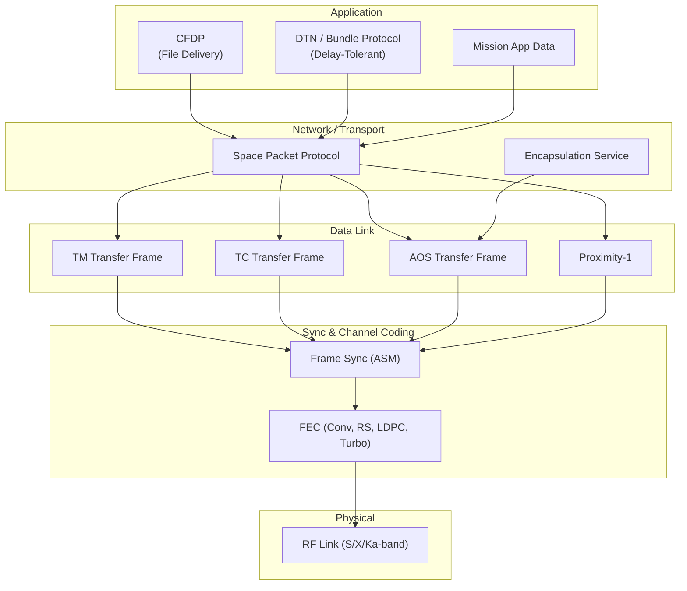
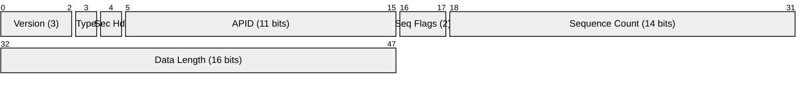
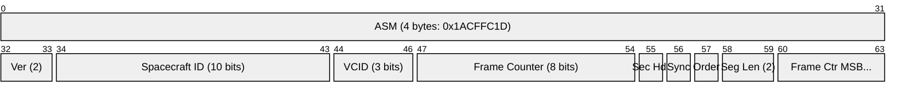
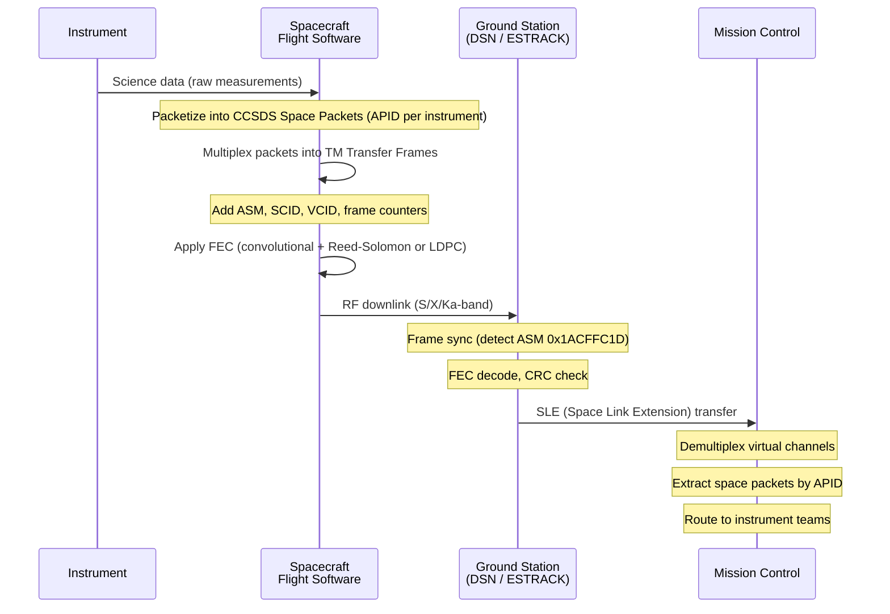

# CCSDS (Consultative Committee for Space Data Systems)

> **Standard:** [CCSDS 133.0-B (Space Packet Protocol)](https://public.ccsds.org/Pubs/133x0b2e1.pdf) | **Layer:** Full stack (Physical through Application) | **Wireshark filter:** `ccsds`

CCSDS defines the international standard protocols for spacecraft communication, used by virtually every space agency: NASA, ESA, JAXA, ROSCOSMOS, ISRO, and CNSA. The protocol stack covers space packet encapsulation, telemetry (TM) and telecommand (TC) data link framing, file delivery (CFDP), and delay-tolerant networking (DTN). CCSDS protocols carry data between spacecraft (or instruments) and ground stations, then onward to mission control. Missions from the ISS and Mars rovers to the James Webb Space Telescope and Voyager probes rely on CCSDS framing.

## Protocol Stack

## Space Packet Primary Header (6 bytes)

The Space Packet is the fundamental data unit. The primary header is always 6 bytes (48 bits), followed by an optional secondary header and user data field.

## Key Fields (Space Packet)

| Field | Size | Description |
|-------|------|-------------|
| Version | 3 bits | Packet version number (always 000 for current CCSDS) |
| Type | 1 bit | 0 = telemetry (TM), 1 = telecommand (TC) |
| Secondary Header Flag | 1 bit | 1 = secondary header present |
| APID | 11 bits | Application Process Identifier (0-2047) — routes packet to instrument/subsystem |
| Sequence Flags | 2 bits | 00 = continuation, 01 = first segment, 10 = last segment, 11 = unsegmented |
| Sequence Count | 14 bits | Packet sequence counter (0-16383), wraps around |
| Data Length | 16 bits | Number of bytes in data field minus 1 (0 = 1 byte, 65535 = 65536 bytes) |

### APID Allocation

| APID Range | Usage |
|------------|-------|
| 0 | Idle packet |
| 1-63 | Typically reserved or system-level |
| 64-2031 | Mission-assigned (instruments, subsystems) |
| 2032-2046 | Reserved |
| 2047 | Idle packet (all 1s fill) |

### Sequence Flags

| Value | Meaning |
|-------|---------|
| 00 | Continuation segment of a multi-packet group |
| 01 | First segment of a multi-packet group |
| 10 | Last segment of a multi-packet group |
| 11 | Unsegmented (complete packet, most common) |

## TM (Telemetry) Transfer Frame

The TM frame carries space packets from spacecraft to ground. Maximum frame length is 2048 bytes.

### TM Transfer Frame Fields

| Field | Size | Description |
|-------|------|-------------|
| ASM | 32 bits | Attached Sync Marker (0x1ACFFC1D) — frame synchronization |
| Version | 2 bits | Transfer frame version (00 for TM) |
| Spacecraft ID (SCID) | 10 bits | Identifies the spacecraft (0-1023) |
| Virtual Channel ID (VCID) | 3 bits | Multiplexes up to 8 virtual channels per spacecraft |
| Master Channel Frame Counter | 8 bits | Counts all frames from spacecraft |
| Virtual Channel Frame Counter | 8 bits | Counts frames per virtual channel |
| TF Secondary Header Flag | 1 bit | 1 = secondary header present |
| Synchronization Flag | 1 bit | 0 = octet-synchronized packets, 1 = other |
| Packet Order Flag | 1 bit | 0 = forward order |
| Segment Length ID | 2 bits | Segment header size (11 = no segmentation) |
| First Header Pointer | 11 bits | Offset to first packet header in data field |
| Data Field | Variable | Contains space packets (or idle fill) |
| CLCW | 32 bits | Command Link Control Word — operational control for TC acknowledgment |
| FECF | 16 bits | Frame Error Control Field (CRC-16-CCITT, optional) |

## TC (Telecommand) Transfer Frame

Shorter frames for commands sent from ground to spacecraft. Uses COP-1 (Command Operation Procedure) for reliable delivery with sequence control and retransmission.

| Field | Size | Description |
|-------|------|-------------|
| Version | 2 bits | Transfer frame version (00 for TC) |
| Bypass Flag | 1 bit | 0 = sequence controlled (Type-A), 1 = expedited (Type-B) |
| Control Command Flag | 1 bit | 0 = data, 1 = control command |
| SCID | 10 bits | Spacecraft ID |
| VCID | 6 bits | Virtual channel (up to 64 channels) |
| Frame Length | 10 bits | Frame length minus 1 |
| Frame Sequence Number | 8 bits | For COP-1 sequence control |
| Data Field | Variable | Contains space packets or directives |
| FECF | 16 bits | CRC-16 (mandatory for TC) |

## AOS (Advanced Orbiting Systems) Transfer Frame

For high-data-rate missions (Earth observation, ISS). Supports larger frames, insert zones for time-critical data, and Multiplexing Protocol Data Units (MPDUs).

| Feature | TM Frame | AOS Frame |
|---------|----------|-----------|
| Max frame size | 2048 bytes | Configurable (up to 65535) |
| Virtual channels | 8 (3 bits) | 64 (6 bits) |
| Insert zone | No | Yes (fixed-length, for real-time data) |
| Bitstream service | No | Yes |
| Frame counter | 8 bits | 24 bits |

## Telemetry Flow

## CCSDS File Delivery Protocol (CFDP)

CFDP provides reliable file transfer in space environments with long delays and intermittent links.

| Feature | Description |
|---------|-------------|
| Modes | Unreliable (Class 1) and Reliable (Class 2, with NAK retransmission) |
| Segmentation | Files split into PDUs with sequence numbers |
| Store-and-forward | Intermediate nodes can store and retransmit |
| Checksum | 32-bit modular checksum for file integrity |
| Metadata | File name, size, and optional user messages |
| Use cases | Mars rover data relay, ISS experiment files |

## Delay-Tolerant Networking (DTN)

The Bundle Protocol (BP) provides interplanetary networking:

| Feature | Description |
|---------|-------------|
| Bundle | Self-contained message with source/destination, expiration, priority |
| Store-and-forward | Nodes hold bundles until a link becomes available |
| Custody transfer | Receiving node takes responsibility for delivery |
| Convergence layers | Runs over TCP, LTP (Licklint Transmission Protocol), or CCSDS links |
| Demonstrated | ISS (operational since 2018), Mars relay (experimental) |

## Link Characteristics

| Mission Type | Band | Downlink Rate | Round-Trip Light Time |
|-------------|------|---------------|----------------------|
| LEO (ISS, Earth Obs) | S/X | 150-800 Mbps | ~5 ms |
| Lunar (Artemis) | S/Ka | 20-100 Mbps | 2.5 sec |
| Mars (Perseverance) | X/UHF relay | 0.5-2 Mbps (relay) | 4-24 min |
| Deep space (Voyager) | S/X | 160 bps | 20+ hours |
| L2 (JWST) | Ka | 28 Mbps | 10 sec |

## Notable Missions Using CCSDS

| Mission | Agency | CCSDS Protocols |
|---------|--------|-----------------|
| ISS | NASA/ESA/JAXA/ROSCOSMOS | TM/TC, AOS, CFDP, DTN |
| Mars Curiosity/Perseverance | NASA | Space Packet, Proximity-1 relay, CFDP |
| James Webb Space Telescope | NASA/ESA/CSA | TM/TC, Space Packet (Ka-band) |
| Voyager 1 & 2 | NASA | TM (legacy, pre-standard) |
| Artemis / Gateway | NASA | TM/TC, DTN, AOS |
| Rosetta / Philae | ESA | TM/TC, Proximity-1 |
| Chandrayaan / Mangalyaan | ISRO | TM/TC, Space Packet |

## Standards

| Document | Title |
|----------|-------|
| [CCSDS 133.0-B-2](https://public.ccsds.org/Pubs/133x0b2e1.pdf) | Space Packet Protocol |
| [CCSDS 132.0-B-3](https://public.ccsds.org/Pubs/132x0b3.pdf) | TM Space Data Link Protocol |
| [CCSDS 232.0-B-4](https://public.ccsds.org/Pubs/232x0b4.pdf) | TC Space Data Link Protocol |
| [CCSDS 732.0-B-4](https://public.ccsds.org/Pubs/732x0b4.pdf) | CCSDS File Delivery Protocol (CFDP) |
| [CCSDS 131.0-B-4](https://public.ccsds.org/Pubs/131x0b4e1.pdf) | TM Synchronization and Channel Coding |
| [CCSDS 734.2-B-1](https://public.ccsds.org/) | CCSDS Bundle Protocol Specification |
| [CCSDS 211.0-B-2](https://public.ccsds.org/) | Proximity-1 Space Link Protocol |
| [CCSDS 735.1-B-1](https://public.ccsds.org/) | AOS Space Data Link Protocol |

## See Also

- [GPS](gps.md) — satellite navigation using broadcast messages (not CCSDS-framed)
- [ADS-B](../aviation/adsb.md) — aircraft position broadcast
- [LRIT/HRIT](lrit.md) — weather satellite broadcast built on CCSDS framing
- [DVB-S2](../media/dvbs2.md) — digital video broadcast via satellite
