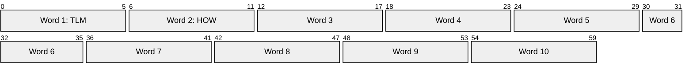
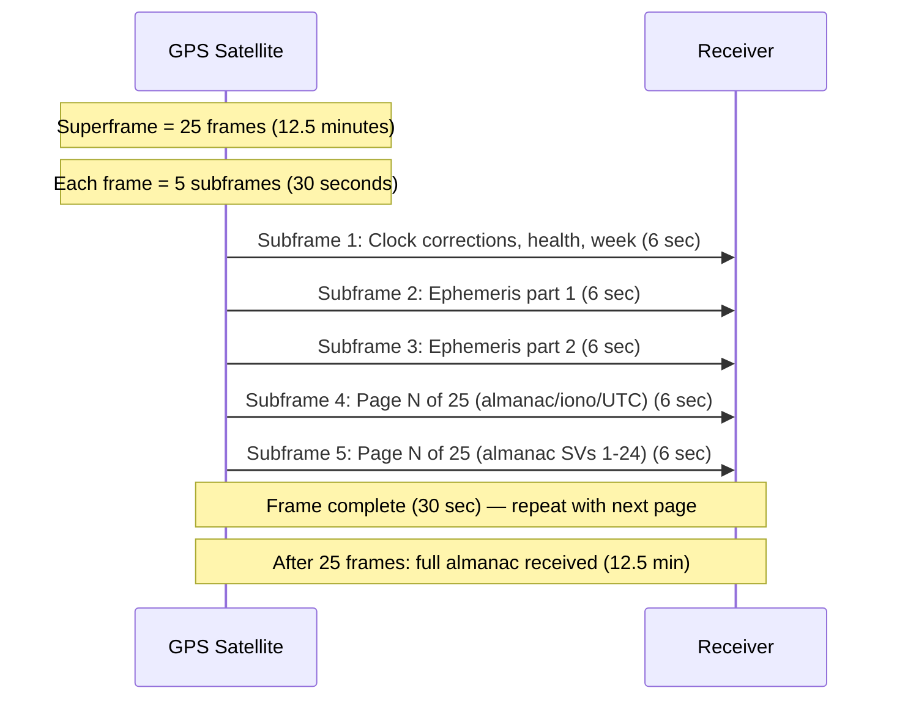
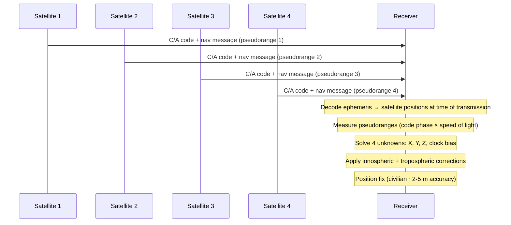

# GPS Navigation Message (L1 C/A)

> **Standard:** [IS-GPS-200 (GPS Interface Control Document)](https://www.gps.gov/technical/icwg/IS-GPS-200N.pdf) | **Layer:** Physical / Data Link (radio broadcast) | **Wireshark filter:** N/A (radio signal, decoded by GPS receivers)

GPS (Global Positioning System) is a satellite-based radionavigation system operated by the U.S. Space Force. The L1 C/A (Coarse/Acquisition) signal at 1575.42 MHz is the primary civilian signal, broadcasting a 50 bps navigation message modulated onto a 1.023 Mcps Gold code using BPSK. A receiver decodes messages from 4+ satellites to compute position via pseudorange trilateration. The navigation message provides satellite clock corrections, orbital ephemeris, ionospheric models, and almanac data for the entire constellation.

## Frame Structure

The navigation message is organized into a 25-frame **superframe** (12.5 minutes total). Each frame contains 5 **subframes** of 300 bits each (6 seconds per subframe, 30 seconds per frame). Each subframe contains 10 **words** of 30 bits (24 data bits + 6 parity bits).

Each subframe = 10 words x 30 bits = 300 bits. At 50 bps, one subframe takes 6 seconds.

## Word Structure (30 bits)

All words use Hamming-based parity with bits 25-30 providing error detection. The last two parity bits of the previous word feed into the encoding of the next word.

## TLM Word (Word 1 of Every Subframe)

## HOW Word (Word 2 of Every Subframe)

## Key Fields

| Field | Size | Description |
|-------|------|-------------|
| Preamble | 8 bits | Fixed pattern 10001011 — marks start of each subframe |
| TLM Message | 14 bits | Telemetry data (reserved for authorized users) |
| Integrity Status | 1 bit | Signal integrity flag |
| TOW Count | 17 bits | Time of Week in 6-second epochs (0-100799), truncated count at start of next subframe |
| Alert Flag | 1 bit | 1 = satellite may be unhealthy, use at own risk |
| Anti-Spoof Flag | 1 bit | 1 = anti-spoofing mode active (P(Y) code encrypted) |
| Subframe ID | 3 bits | Identifies subframe (1-5) |

## Subframe Contents

### Subframe 1 — Clock and Health

Transmitted every 30 seconds (same data for each frame).

| Field | Bits | Description |
|-------|------|-------------|
| GPS Week Number | 10 | Week count since Jan 6, 1980 (mod 1024, rollover every ~19.7 years) |
| SV Accuracy (URA) | 4 | User Range Accuracy index |
| SV Health | 6 | Satellite health summary |
| IODC | 10 | Issue of Data, Clock — change indicates new clock parameters |
| T_GD | 8 | Group delay differential (L1-L2 correction), seconds x 2^-31 |
| t_oc | 16 | Clock data reference time |
| af2 | 8 | Clock drift rate (sec/sec^2) |
| af1 | 16 | Clock drift (sec/sec) |
| af0 | 22 | Clock bias (seconds) |

### Subframes 2 and 3 — Ephemeris

Keplerian orbital elements describing the satellite's precise orbit. Updated every 2 hours.

| Parameter | Subframe | Description |
|-----------|----------|-------------|
| IODE | 2, 3 | Issue of Data, Ephemeris (8 bits, must match IODC lower 8 bits) |
| C_rs | 2 | Sine correction to orbital radius (meters) |
| delta_n | 2 | Mean motion difference (rad/sec) |
| M_0 | 2 | Mean anomaly at reference time (radians) |
| C_uc | 2 | Cosine correction to argument of latitude (radians) |
| e | 2 | Eccentricity (dimensionless) |
| C_us | 2 | Sine correction to argument of latitude (radians) |
| sqrt_A | 2 | Square root of semi-major axis (meters^1/2) |
| t_oe | 2 | Ephemeris reference time (seconds) |
| C_ic | 3 | Cosine correction to inclination (radians) |
| OMEGA_0 | 3 | Longitude of ascending node at weekly epoch (radians) |
| C_is | 3 | Sine correction to inclination (radians) |
| i_0 | 3 | Inclination angle at reference time (radians) |
| C_rc | 3 | Cosine correction to orbital radius (meters) |
| omega | 3 | Argument of perigee (radians) |
| OMEGA_dot | 3 | Rate of right ascension (rad/sec) |
| i_dot | 3 | Rate of inclination (rad/sec) |

### Subframe 4 — Almanac, Ionosphere, UTC (25 pages)

Each of the 25 frames carries a different page:

| Pages | Content |
|-------|---------|
| 1, 6, 11, 16, 21 | Reserved |
| 2, 3, 4, 5, 7, 8, 9, 10 | Almanac for SVs 25-32 and other data |
| 13 | NMCT (Navigation Message Correction Table) |
| 14, 15 | Reserved for system use |
| 17 | Special messages (ASCII text) |
| 18 | Ionospheric correction (Klobuchar alpha_0-3, beta_0-3) and UTC parameters |
| 25 | SV health for SVs 1-24 and almanac reference time |

### Subframe 5 — Almanac for SVs 1-24 (25 pages)

| Pages | Content |
|-------|---------|
| 1-24 | Almanac data for SVs 1-24 (one SV per page) |
| 25 | SV health for SVs 1-24, almanac reference time and week |

## Superframe Structure

## Position Fix

Minimum 4 satellites required: 3 for spatial position (X, Y, Z) plus 1 to solve for receiver clock bias. More satellites improve accuracy through overdetermined solution.

## Signal Characteristics

| Parameter | L1 C/A |
|-----------|--------|
| Carrier frequency | 1575.42 MHz (154 x 10.23 MHz) |
| Code type | Gold code (C/A) |
| Code rate | 1.023 Mcps (Megachips/sec) |
| Code length | 1023 chips (1 ms period) |
| Data rate | 50 bps |
| Modulation | BPSK |
| Signal power at surface | -158.5 dBW (minimum) |
| Bandwidth | ~2.046 MHz |

## GNSS Comparison

| System | Country | Civilian Signal | Frequency | Access | Satellites |
|--------|---------|----------------|-----------|--------|------------|
| GPS | USA | L1 C/A | 1575.42 MHz | CDMA | 31 (nominal 24) |
| GLONASS | Russia | L1OF | 1598.0625-1605.375 MHz | FDMA + CDMA | 24 |
| Galileo | EU | E1 OS | 1575.42 MHz | CDMA | 30 (nominal 24) |
| BeiDou | China | B1C | 1575.42 MHz | CDMA | 35+ |
| QZSS | Japan | L1 C/A | 1575.42 MHz | CDMA | 4 (regional) |
| NavIC | India | L5 | 1176.45 MHz | CDMA | 7 (regional) |

## GPS Modernization

| Signal | Frequency | Status | Key Improvement |
|--------|-----------|--------|-----------------|
| L1 C/A | 1575.42 MHz | Operational (legacy) | Original civilian signal |
| L2C | 1227.60 MHz | Operational | Second civilian frequency, ionospheric correction |
| L5 | 1176.45 MHz | Operational | Safety-of-life, higher power, longer code |
| L1C | 1575.42 MHz | Deploying (GPS III+) | CNAV-2 message, interoperable with Galileo/BeiDou |

L1C uses the CNAV (Civil Navigation) message format: variable-length messages, forward error correction (LDPC), and faster data delivery than the legacy 25-page superframe structure.

## Standards

| Document | Title |
|----------|-------|
| [IS-GPS-200](https://www.gps.gov/technical/icwg/) | GPS L1 C/A Interface Control Document |
| [IS-GPS-705](https://www.gps.gov/technical/icwg/) | GPS L5 Interface Control Document |
| [IS-GPS-800](https://www.gps.gov/technical/icwg/) | GPS L1C Interface Control Document |

## See Also

- [NMEA](../serial/nmea.md) — standard format for GPS receiver output sentences
- [RTCM](rtcm.md) — differential GNSS corrections for centimeter-level accuracy
- [ADS-B](../aviation/adsb.md) — aircraft surveillance using GPS-derived position
- [NTP](../naming/ntp.md) — network time synchronization (GPS is a stratum 0 source)
