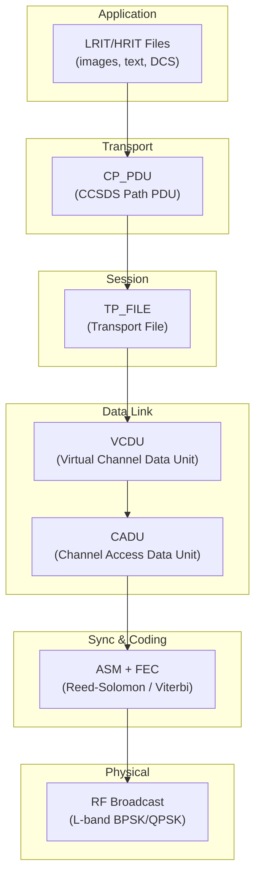
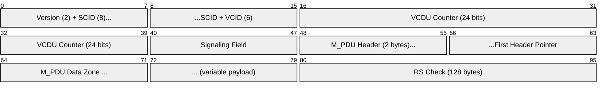
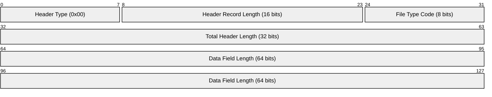
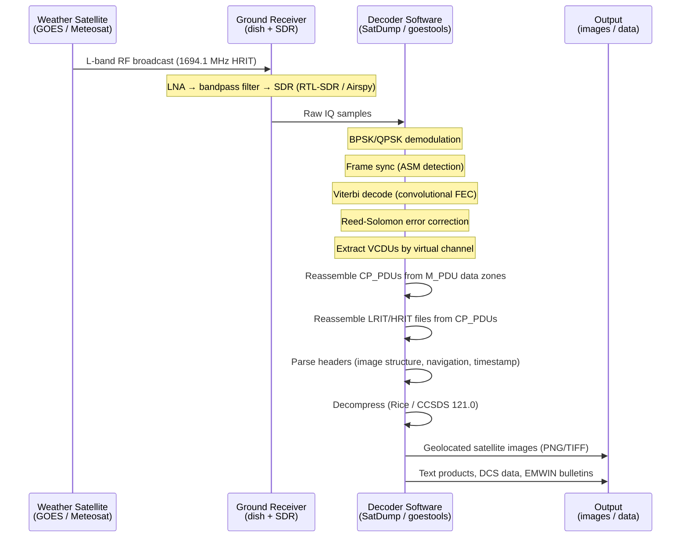

# LRIT / HRIT (Weather Satellite Downlink)

> **Standard:** [CGMS LRIT/HRIT Global Specification](https://www.cgms-info.org/) | **Layer:** Application / Data Link (radio broadcast) | **Wireshark filter:** N/A (radio signal, decoded by SatDump / goestools)

LRIT (Low Rate Information Transmission) and HRIT (High Rate Information Transmission) are the standard protocols for broadcasting weather satellite imagery and data products to ground receivers. Defined by the Coordination Group for Meteorological Satellites (CGMS), they are used by GOES (USA), Meteosat (Europe), Himawari (Japan), Fengyun (China), and other geostationary weather satellites. The protocols are built on the CCSDS space packet and TM transfer frame standards, encapsulating image files, text bulletins, and meteorological data within Virtual Channel Data Units (VCDUs) broadcast continuously on L-band frequencies.

## Protocol Layers

## VCDU (Virtual Channel Data Unit)

The VCDU is based on the CCSDS TM Transfer Frame. Each VCDU is 892 bytes for GOES HRIT.

### VCDU Fields

| Field | Size | Description |
|-------|------|-------------|
| Version | 2 bits | Frame version (01 for AOS/VCDU) |
| Spacecraft ID | 8 bits | Identifies satellite (e.g., GOES-16 = 0xC0) |
| Virtual Channel ID | 6 bits | Multiplexes data streams (images, admin, DCS, fill) |
| VCDU Counter | 24 bits | Sequential frame counter (0-16777215) |
| Signaling Field | 8 bits | Replay flag, VC frame count cycle |
| M_PDU Header | 16 bits | First Header Pointer — offset to first CP_PDU header in data zone |
| M_PDU Data Zone | Variable | Contains CP_PDUs (CCSDS space packets carrying LRIT/HRIT data) |
| Reed-Solomon Check | 128 bytes | RS(255,223) parity for error correction |

### GOES HRIT Virtual Channels

| VCID | Content |
|------|---------|
| 0 | Full disk images (Band 2, visible) |
| 1 | Full disk images (Band 7-16, IR) |
| 2 | EMWIN (Emergency Managers Weather Information Network) |
| 3 | Full disk images (additional bands) |
| 4 | GOES-R relay data |
| 5 | DCS (Data Collection System) |
| 63 | Fill frames (idle) |

## LRIT/HRIT File Structure

Each file transmitted via LRIT/HRIT consists of a primary header followed by optional secondary headers and the data payload.

### Primary Header (16 bytes)

### Primary Header Fields

| Field | Size | Description |
|-------|------|-------------|
| Header Type | 8 bits | Always 0x00 for primary header |
| Header Record Length | 16 bits | Length of this header record (16 bytes) |
| File Type Code | 8 bits | Type of file being transmitted |
| Total Header Length | 32 bits | Combined length of all headers (bytes) |
| Data Field Length | 64 bits | Length of the data field (bits) |

### File Type Codes

| Code | Description |
|------|-------------|
| 0 | Image data (satellite imagery) |
| 1 | GTS messages (WMO Global Telecommunication System) |
| 2 | Alphanumeric text |
| 3 | Encryption key message |
| 128 | EMWIN data (GOES) |
| 129+ | Mission-specific / user-defined |

### Secondary Headers

| Header Type | Description |
|-------------|-------------|
| 1 | Image structure (columns, lines, bits per pixel) |
| 2 | Image navigation (projection parameters, sub-satellite point) |
| 3 | Image data function (calibration lookup table) |
| 4 | Annotation text (human-readable metadata) |
| 5 | Timestamp (days since epoch, milliseconds of day) |
| 6 | Ancillary text (key=value metadata) |
| 7 | Key header (encryption parameters) |
| 128 | Segment identification (for multi-segment images) |
| 129 | NOAA-specific header |
| 130 | Header structure record |
| 131 | Rice compression parameters |

### Image Structure Header

| Field | Size | Description |
|-------|------|-------------|
| Header Type | 8 bits | 0x01 |
| Header Record Length | 16 bits | Length of this record |
| Bits per Pixel | 8 bits | Typically 8, 10, or 16 |
| Number of Columns | 16 bits | Image width in pixels |
| Number of Lines | 16 bits | Image height in pixels |
| Compression Flag | 8 bits | 0 = none, 1 = lossless (Rice), 2 = lossy (JPEG) |

## Image Reception Flow

## Signal Parameters

| Parameter | GOES LRIT | GOES HRIT | GOES GRB |
|-----------|-----------|-----------|----------|
| Frequency | 1691.0 MHz | 1694.1 MHz | 1686.6 MHz |
| Data rate | 128 kbps | 400 kbps (HRIT/EMWIN) | 31 Mbps |
| Modulation | BPSK | BPSK | DVB-S2 (QPSK/8PSK) |
| FEC | Viterbi (r=1/2) + RS(255,223) | Viterbi (r=1/2) + RS(255,223) | LDPC + BCH |
| Polarization | Linear | Linear | Dual circular |
| Dish size (typical) | 0.6-1.0 m | 1.0-1.8 m | 3.8 m |
| Full disk interval | 3 hours | 10-15 minutes | 10-15 min (all bands) |

## Comparison of Weather Satellite Downlink Formats

| Format | Data Rate | Coverage | Reception Difficulty | Satellite Examples |
|--------|-----------|----------|---------------------|--------------------|
| APT | 2.4 kbps | 2 channels, low-res | Easy (V-dipole, RTL-SDR) | NOAA 15/18/19 (LEO, analog) |
| LRPT | 72 kbps | 3 channels, medium-res | Moderate (V-dipole, SDR) | Meteor-M2 (LEO, digital) |
| LRIT | 128 kbps | Select bands, reduced-res | Moderate (1m dish, LNA) | GOES (GEO) |
| HRIT | 400 kbps - 3.5 Mbps | Most bands, full-res | Moderate-hard (1m+ dish) | GOES, Himawari, Meteosat |
| GRB | 31 Mbps | All 16 bands, full-res | Hard (3.8m dish, DVB-S2) | GOES-R series |
| HRD | 18.7 Mbps | All channels | Hard (dedicated ground station) | Meteosat Third Generation |

## Rice Compression (CCSDS 121.0)

LRIT/HRIT uses CCSDS 121.0 Rice compression for lossless image data reduction:

| Parameter | Description |
|-----------|-------------|
| Algorithm | Extended Rice (adaptive entropy coding) |
| Block size | Typically 16 pixels per block |
| Bits per pixel | 8-16 (preserves full dynamic range) |
| Compression ratio | ~1.5:1 to 2.5:1 (image dependent) |
| Standard | CCSDS 121.0-B-3 |

Preprocessing splits pixel values into a predictable component (coded with Golomb-Rice) and a remainder, achieving efficient lossless compression well-suited to smooth satellite imagery.

## Hobbyist Reception

Receiving GOES HRIT is achievable with consumer-grade equipment:

| Component | Example | Purpose |
|-----------|---------|---------|
| Dish | 1.0-1.2 m offset parabolic | Signal collection |
| Feed | Patch antenna or helix (1694 MHz) | L-band feed at focus |
| LNA | NooElec SAWbird+ GOES | Low-noise amplifier + filter |
| SDR | RTL-SDR v3 or Airspy Mini | IQ sampling |
| Software | SatDump, goestools | Demod, decode, image output |
| Pointing | Fixed mount aimed at GOES satellite | Geostationary = no tracking needed |

## Standards

| Document | Title |
|----------|-------|
| [CGMS LRIT/HRIT Global Spec](https://www.cgms-info.org/) | CGMS LRIT/HRIT Global Specification |
| [CCSDS 132.0-B-3](https://public.ccsds.org/Pubs/132x0b3.pdf) | TM Space Data Link Protocol (VCDU framing) |
| [CCSDS 133.0-B-2](https://public.ccsds.org/Pubs/133x0b2e1.pdf) | Space Packet Protocol (CP_PDU encapsulation) |
| [CCSDS 121.0-B-3](https://public.ccsds.org/Pubs/121x0b3.pdf) | Lossless Data Compression (Rice) |
| [CCSDS 131.0-B-4](https://public.ccsds.org/Pubs/131x0b4e1.pdf) | TM Synchronization and Channel Coding |
| [NOAA GOES-R PUG](https://www.goes-r.gov/) | GOES-R Product User Guide (HRIT/EMWIN) |

## See Also

- [CCSDS](ccsds.md) — the space data system standards that LRIT/HRIT is built upon
- [DVB-S2](../media/dvbs2.md) — used by GRB (GOES Rebroadcast) for full-rate downlink
- [GPS](gps.md) — satellite-based navigation signal (also L-band broadcast)
- [ADS-B](../aviation/adsb.md) — aircraft broadcast protocol (similar hobbyist SDR reception)
