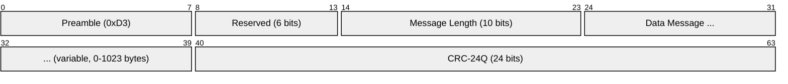
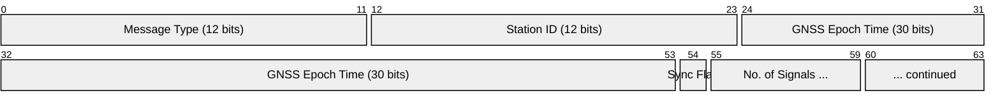
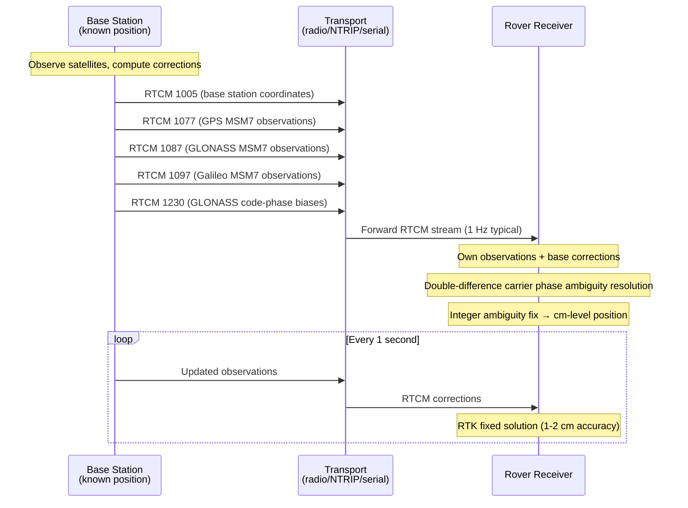
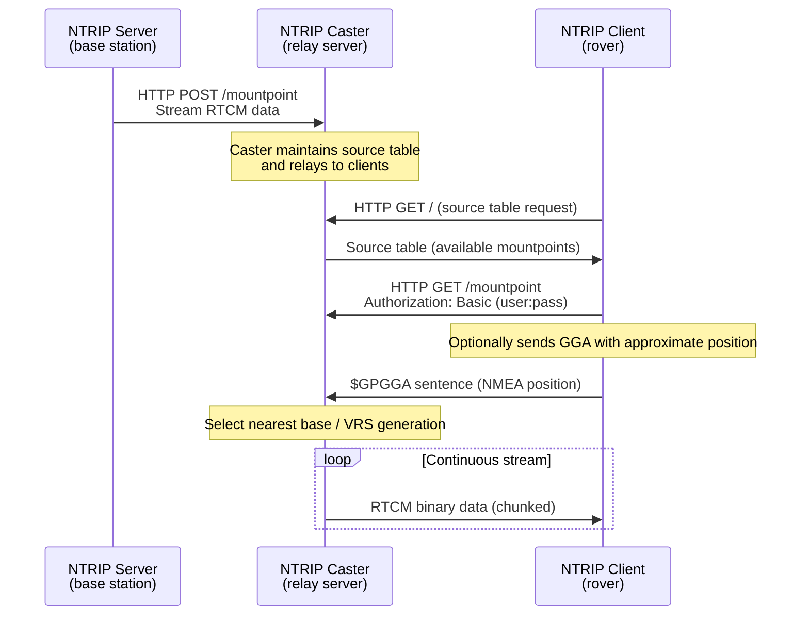

# RTCM 3.x (Differential GNSS Corrections)

> **Standard:** [RTCM Standard 10403.3](https://www.rtcm.org/differential-gnss) | **Layer:** Application (over serial, HTTP, or radio) | **Wireshark filter:** `rtcm` (limited support)

RTCM (Radio Technical Commission for Maritime Services) SC-104 defines the standard format for transmitting differential GNSS corrections from a base station (known position) to a rover receiver. RTCM 3.x is the current version, enabling RTK (Real-Time Kinematic) positioning with centimeter-level accuracy. Corrections include pseudorange and carrier-phase observations, base station coordinates, and satellite ephemerides. RTCM data is commonly transported over serial links (UART), radio modems (UHF/VHF), or the Internet via NTRIP.

## RTCM 3.x Frame

| Field | Size | Description |
|-------|------|-------------|
| Preamble | 8 bits | Fixed 0xD3 — synchronization byte |
| Reserved | 6 bits | Set to 0 |
| Message Length | 10 bits | Length of data message in bytes (0-1023) |
| Data Message | 0-1023 bytes | RTCM message content (starts with 12-bit message type ID) |
| CRC-24Q | 24 bits | Qualcomm CRC-24 for error detection |

Total frame overhead: 6 bytes (3 header + 3 CRC). Maximum frame size: 1029 bytes.

## Data Message Header

Every data message begins with a 12-bit message type number:

The exact field layout varies per message type, but the first 12 bits always identify the message.

## Key Message Types

### Legacy Observation Messages

| Message | Description |
|---------|-------------|
| 1001 | GPS L1 observations (compact) |
| 1002 | GPS L1 observations (extended — includes pseudorange, carrier phase, lock time) |
| 1003 | GPS L1/L2 observations (compact) |
| 1004 | GPS L1/L2 observations (extended — full dual-frequency) |

### Station and Antenna

| Message | Description |
|---------|-------------|
| 1005 | Station ARP (Antenna Reference Point) in ECEF XYZ, no antenna height |
| 1006 | Station ARP in ECEF XYZ with antenna height |
| 1007 | Antenna descriptor (name string) |
| 1008 | Antenna descriptor with serial number |
| 1033 | Receiver and antenna descriptor strings |

### Ephemeris

| Message | Description |
|---------|-------------|
| 1019 | GPS satellite ephemeris |
| 1020 | GLONASS satellite ephemeris |
| 1042 | BeiDou satellite ephemeris |
| 1045 | Galileo F/NAV ephemeris |
| 1046 | Galileo I/NAV ephemeris |

### GLONASS Observations

| Message | Description |
|---------|-------------|
| 1009 | GLONASS L1 observations (compact) |
| 1010 | GLONASS L1 observations (extended) |
| 1011 | GLONASS L1/L2 observations (compact) |
| 1012 | GLONASS L1/L2 observations (extended) |
| 1230 | GLONASS code-phase biases |

### MSM (Multiple Signal Messages) — Modern Format

MSM messages are the preferred modern format supporting all GNSS constellations uniformly. MSM types indicate data richness:

| MSM Type | Content | Typical Use |
|----------|---------|-------------|
| MSM1 | Pseudorange only (compact) | Low bandwidth |
| MSM2 | Pseudorange (extended) | — |
| MSM3 | Pseudorange + carrier phase (no Doppler/SNR) | — |
| MSM4 | Pseudorange + carrier phase + Doppler + SNR (compact) | Common for RTK |
| MSM5 | Full pseudorange + carrier phase + Doppler + SNR (extended) | Common for RTK |
| MSM6 | High-resolution pseudorange + carrier phase | — |
| MSM7 | Full high-resolution observations | Highest precision |

### MSM by Constellation

| Constellation | MSM1 | MSM4 | MSM5 | MSM7 |
|--------------|-------|------|------|------|
| GPS | 1071 | 1074 | 1075 | 1077 |
| GLONASS | 1081 | 1084 | 1085 | 1087 |
| Galileo | 1091 | 1094 | 1095 | 1097 |
| SBAS | 1101 | 1104 | 1105 | 1107 |
| BeiDou | 1111 | 1114 | 1115 | 1117 |
| QZSS | 1121 | 1124 | 1125 | 1127 |
| NavIC/IRNSS | 1131 | 1134 | 1135 | 1137 |

### Proprietary Messages

| Message | Source | Description |
|---------|--------|-------------|
| 4072 | u-blox | Reference station metadata (PVT, moving base) |
| 4094 | Various | Proprietary extensions |

## RTK Correction Flow

## NTRIP (Networked Transport of RTCM via Internet Protocol)

NTRIP allows streaming RTCM corrections over the Internet using HTTP/1.1. It consists of three components:

### NTRIP Architecture

| Component | Role |
|-----------|------|
| NTRIP Server | Connects to caster, sends RTCM data from a base station |
| NTRIP Caster | Internet relay, maintains source table, authenticates clients |
| NTRIP Client | Connects to caster, receives RTCM corrections for rover |
| Source Table | Lists available mountpoints with position, format, carrier info |

NTRIP v2.0 supports HTTP/1.1 chunked transfer, RTSP-based streaming, and UDP transport.

## Positioning Methods

| Method | Accuracy | Corrections | Convergence |
|--------|----------|-------------|-------------|
| Standalone GNSS | 2-5 m | None | Instant |
| DGNSS (Differential) | 0.5-1 m | RTCM pseudorange corrections | Instant |
| RTK (Real-Time Kinematic) | 1-2 cm | RTCM carrier-phase observations | 5-30 sec (fix) |
| Network RTK (VRS/MAC) | 1-2 cm | NTRIP from CORS network | 5-30 sec |
| PPP (Precise Point Positioning) | 2-5 cm | Precise orbits/clocks (SSR) | 15-30 min |
| PPP-RTK | 1-3 cm | SSR + atmospheric corrections | 1-5 min |

## Transport Options

| Transport | Medium | Range | Typical Use |
|-----------|--------|-------|-------------|
| Serial (UART) | Cable | Direct connection | Base to rover (survey) |
| UHF/VHF radio modem | 400-470 MHz | 5-20 km | Agriculture, survey |
| NTRIP (HTTP) | Internet | Global | CORS networks, cellular rovers |
| LoRa | 868/915 MHz | 2-15 km | Low-power, long-range |
| Cellular (4G/5G) | Mobile network | Network coverage | Machine control, autonomous vehicles |
| Wi-Fi | 2.4/5 GHz | ~50 m | Local reference station |

## Standards

| Document | Title |
|----------|-------|
| [RTCM 10403.3](https://www.rtcm.org/) | RTCM Standard for Differential GNSS Services, Version 3.3 |
| [RTCM 10410.1](https://www.rtcm.org/) | NTRIP Version 2.0 |
| [BKG NTRIP](https://igs.bkg.bund.de/ntrip/) | NTRIP Caster reference implementation (BKG) |

## See Also

- [GPS](gps.md) — the navigation message that RTCM corrections enhance
- [NMEA](../serial/nmea.md) — receiver output format, also used for GGA in NTRIP
- [LoRa](../wireless/lora.md) — low-power radio transport for RTCM
- [HTTP](../web/http.md) — transport protocol used by NTRIP
