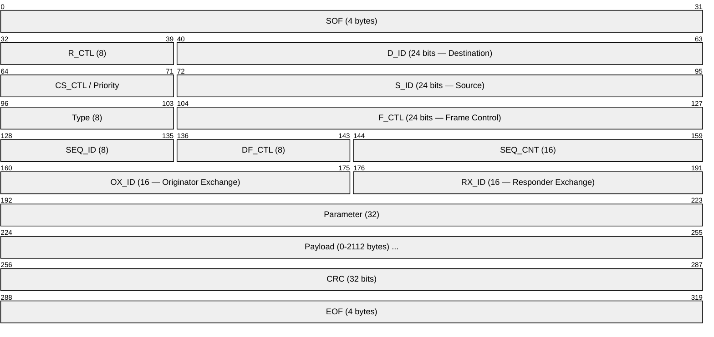
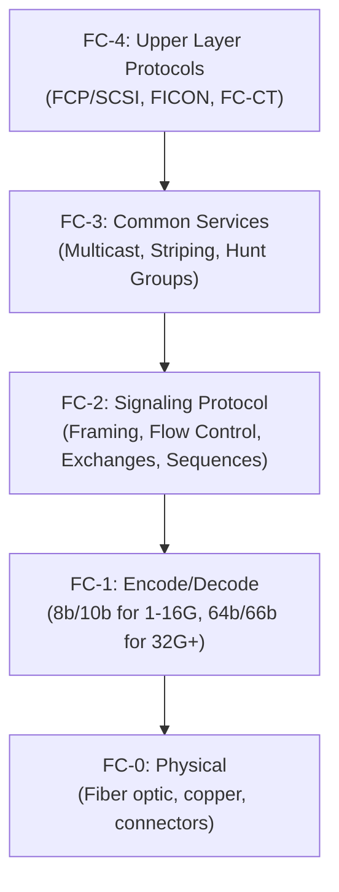
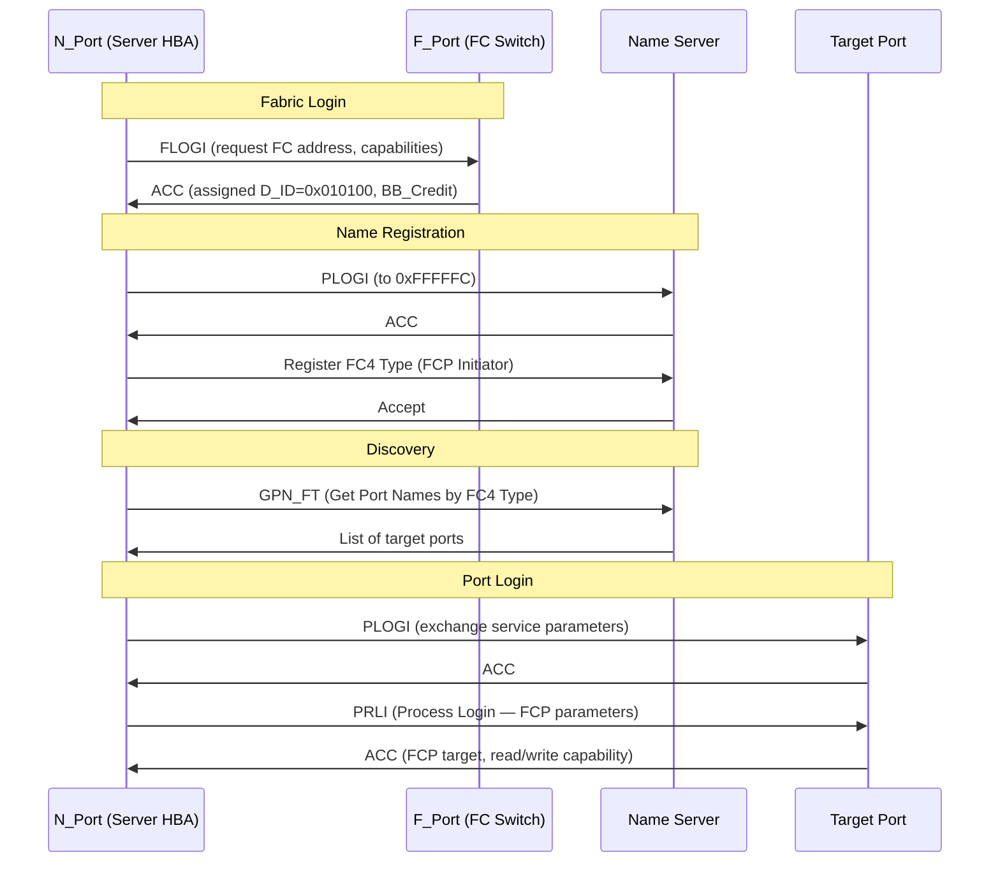
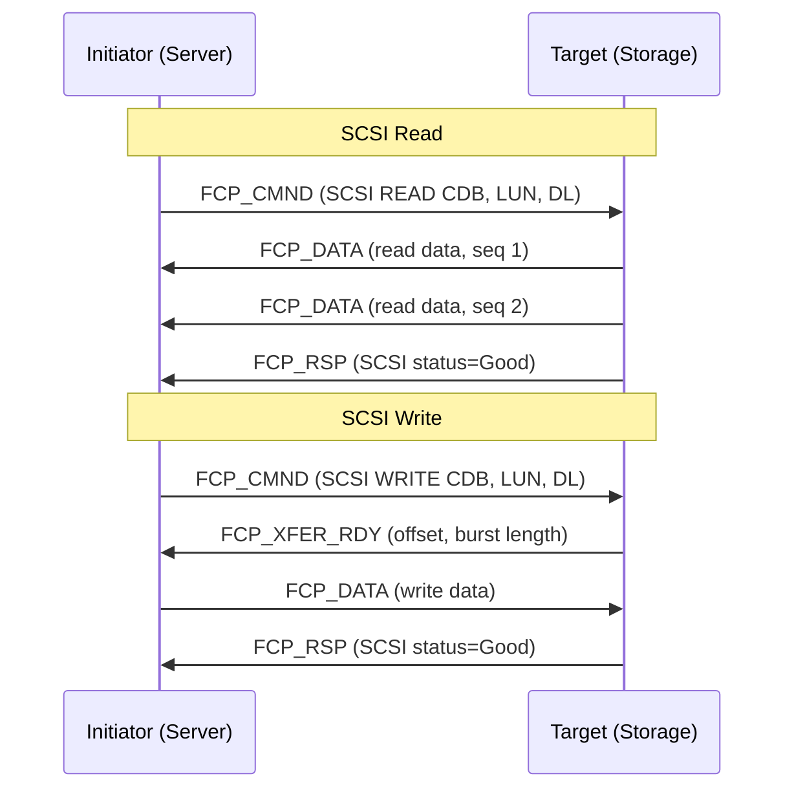
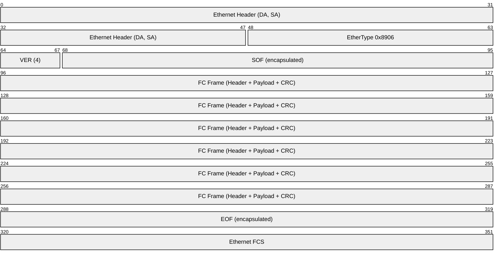

# Fibre Channel (FC)

> **Standard:** [INCITS FC-FS-5](https://www.t11.org/) | **Layer:** Full stack (FC-0 through FC-4) | **Wireshark filter:** `fc`

Fibre Channel is a high-speed, lossless network technology designed primarily for storage area networks (SANs). It provides in-order, guaranteed delivery of raw block data between servers and storage arrays at speeds from 1 Gbps to 256 Gbps per link. FC defines its own five-layer protocol stack (FC-0 through FC-4), with the upper layer (FC-4) mapping protocols like SCSI (FCP) and mainframe channels (FICON) onto the fabric. Fibre Channel over Ethernet (FCoE) encapsulates FC frames in Ethernet for convergence with data center networks.

## FC Frame Structure

## Key Fields

| Field | Size | Description |
|-------|------|-------------|
| SOF | 4 bytes | Start of Frame delimiter (defines frame class) |
| R_CTL | 8 bits | Routing Control — frame category and type |
| D_ID | 24 bits | Destination port address (Domain, Area, Port) |
| S_ID | 24 bits | Source port address |
| Type | 8 bits | Upper-layer protocol (0x08 = FCP/SCSI, 0x20 = FC-CT) |
| F_CTL | 24 bits | Frame Control — sequence context, exchange role, end flags |
| SEQ_ID | 8 bits | Identifies frames within a sequence |
| SEQ_CNT | 16 bits | Frame order within a sequence |
| OX_ID | 16 bits | Originator Exchange ID — identifies the I/O operation |
| RX_ID | 16 bits | Responder Exchange ID — assigned by target |
| Parameter | 32 bits | Relative offset for data frames |
| CRC | 32 bits | CRC-32 over header and payload |
| EOF | 4 bytes | End of Frame delimiter |

## Field Details

### R_CTL (Routing Control)

| R_CTL | Category | Meaning |
|-------|----------|---------|
| 0x00-0x0F | Device Data | Data frames (FCP_DATA) |
| 0x02 | Device Data | Unsolicited data |
| 0x04 | Device Data | Solicited data |
| 0x06 | Device Data | Unsolicited command |
| 0x20-0x2F | Extended Link Services | ELS frames (FLOGI, PLOGI) |
| 0x80-0x8F | FC-4 Link Data | FCP_CMND, FCP_XFER_RDY, FCP_RSP |

### F_CTL (Frame Control) Key Bits

| Bit | Name | Description |
|-----|------|-------------|
| 23 | Exchange Originator | 1 = sent by originator of the exchange |
| 22 | Sequence Recipient | 1 = sent by sequence recipient |
| 21 | First Sequence | 1 = first sequence of the exchange |
| 20 | Last Sequence | 1 = last sequence of the exchange |
| 19 | End Sequence | 1 = last frame of the sequence |
| 16 | Transfer Sequence Initiative | 1 = pass sequence initiative |

### Type Field

| Type | Protocol | Description |
|------|----------|-------------|
| 0x00 | BLS | Basic Link Services (ABTS, BA_ACC) |
| 0x01 | ELS | Extended Link Services (FLOGI, PLOGI, LOGO) |
| 0x08 | FCP | SCSI over Fibre Channel |
| 0x12 | FICON | IBM mainframe channel |
| 0x20 | FC-CT | Common Transport (name server queries) |

### FC Address Format

A 24-bit FC address is structured as Domain (8 bits) + Area (8 bits) + Port (8 bits):

| Address | Meaning |
|---------|---------|
| 0xFFFFFF | Broadcast |
| 0xFFFFFE | Fabric F_Port (fabric login) |
| 0xFFFFFC | Directory Server (Name Server) |
| 0xFFFFFB | Fabric Controller |
| 0x000000 | Unknown (not yet assigned) |

## FC Protocol Stack

## Fabric Login (FLOGI / PLOGI)

## FCP (SCSI over Fibre Channel) Exchange

## Classes of Service

| Class | Delivery | Flow Control | Description |
|-------|----------|-------------|-------------|
| Class 2 | Connectionless | Credit-based | Acknowledged, with possible out-of-order; rare |
| Class 3 | Connectionless | Credit-based | Unacknowledged datagram — dominant in SANs |
| Class F | Connectionless | Credit-based | Switch-to-switch inter-switch link frames |

Class 3 is overwhelmingly used in modern FC SANs; the fabric provides lossless, in-order delivery.

## Flow Control

| Level | Mechanism | Description |
|-------|-----------|-------------|
| Buffer-to-Buffer (BB) | BB_Credit | Controls frames between adjacent ports (link level) |
| End-to-End (EE) | EE_Credit | Controls frames between N_Ports (rarely used with Class 3) |

BB_Credit is exchanged during FLOGI/PLOGI. A sender can transmit BB_Credit frames before waiting for R_RDY primitives.

## Zoning and LUN Masking

| Mechanism | Layer | Description |
|-----------|-------|-------------|
| Zoning | Fabric (switch) | Restricts which ports can communicate — like VLANs |
| Hard Zoning | Port-based | Enforced by switch hardware (D_ID filtering) |
| Soft Zoning | WWN-based | Enforced by name server (can be bypassed) |
| LUN Masking | Target/array | Controls which initiators can see which LUNs |

## FC Speeds

| Generation | Line Rate | Throughput (per lane) | Encoding |
|------------|-----------|----------------------|----------|
| 1GFC | 1.0625 Gbaud | 100 MB/s | 8b/10b |
| 2GFC | 2.125 Gbaud | 200 MB/s | 8b/10b |
| 4GFC | 4.25 Gbaud | 400 MB/s | 8b/10b |
| 8GFC | 8.5 Gbaud | 800 MB/s | 8b/10b |
| 16GFC | 14.025 Gbaud | 1600 MB/s | 64b/66b |
| 32GFC | 28.05 Gbaud | 3200 MB/s | 64b/66b |
| 64GFC | 57.8 Gbaud | 6400 MB/s | 256b/257b |

## Fibre Channel over Ethernet (FCoE)

FCoE encapsulates FC frames directly in Ethernet, allowing FC traffic to share a converged Ethernet fabric:

| Parameter | Value |
|-----------|-------|
| EtherType | 0x8906 |
| Requires | DCB (Data Center Bridging) — PFC, ETS, DCBX |
| MTU | 2500+ bytes (baby jumbo for 2112-byte FC payload) |
| FIP | FCoE Initialization Protocol (discovery, FLOGI over Ethernet) |

## Standards

| Document | Title |
|----------|-------|
| [INCITS FC-FS-5](https://www.t11.org/) | Fibre Channel Framing and Signaling |
| [INCITS FC-PI-7](https://www.t11.org/) | Fibre Channel Physical Interface |
| [INCITS FC-LS-4](https://www.t11.org/) | Fibre Channel Link Services |
| [INCITS FC-GS-8](https://www.t11.org/) | Fibre Channel Generic Services (Name Server) |
| [INCITS FCP-5](https://www.t11.org/) | Fibre Channel Protocol for SCSI |
| [INCITS FC-BB-6](https://www.t11.org/) | Fibre Channel Backbone (includes FCoE) |

## See Also

- [iSCSI](iscsi.md) — SCSI over TCP/IP (lower cost alternative)
- [NVMe-oF](nvmeof.md) — NVMe over Fabrics (including FC-NVMe)
- [Ethernet](../link-layer/ethernet.md) — FCoE converges FC onto Ethernet
- [RDMA](../hpc/rdma.md) — competing high-performance fabric technology
