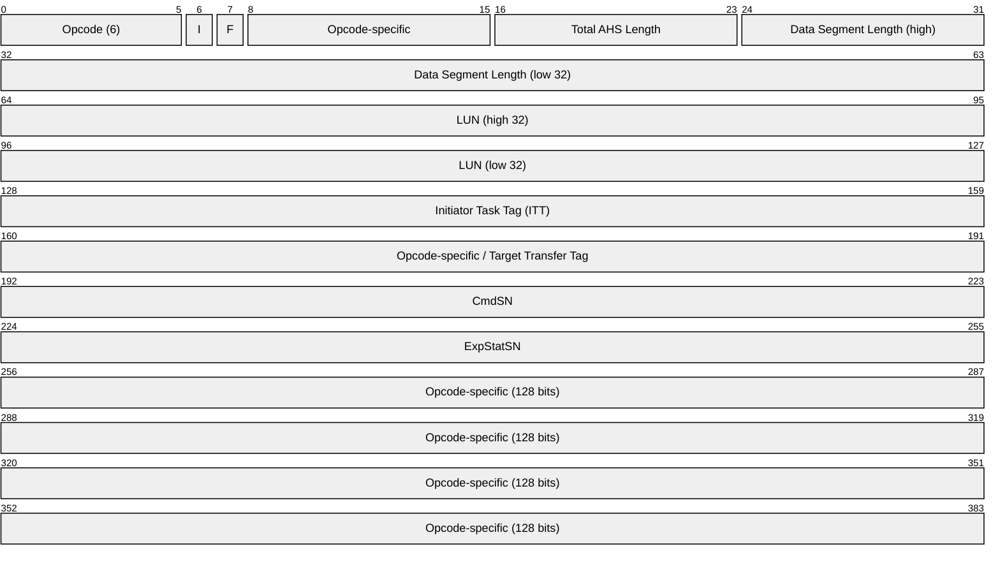
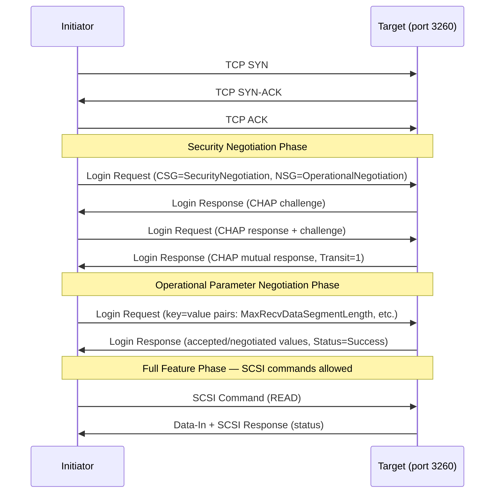
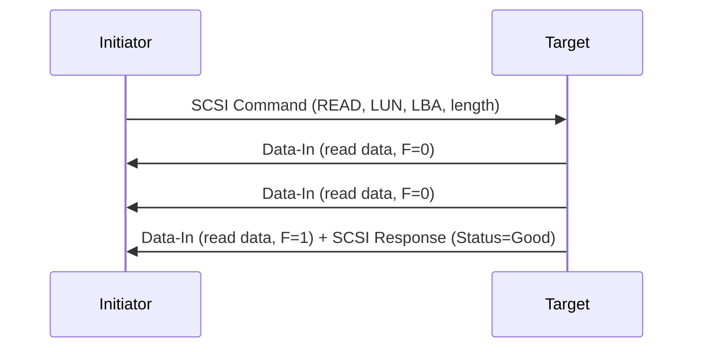
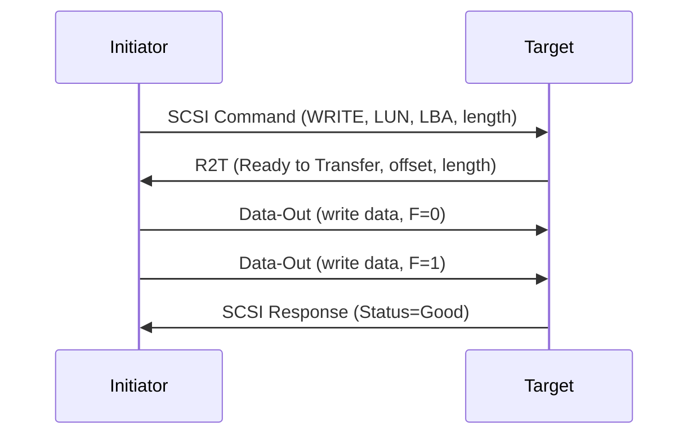
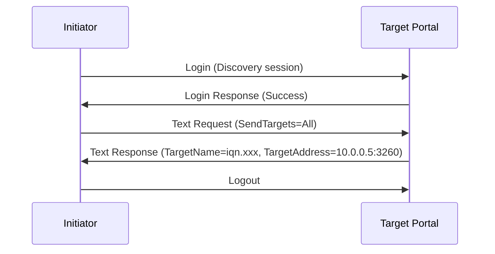

# iSCSI (Internet Small Computer Systems Interface)

> **Standard:** [RFC 7143](https://www.rfc-editor.org/rfc/rfc7143) | **Layer:** Application (SCSI over TCP/IP) | **Wireshark filter:** `iscsi`

iSCSI maps the SCSI command set onto TCP/IP, allowing block-level storage access over standard Ethernet networks. An initiator (client) sends SCSI commands encapsulated in iSCSI PDUs to a target (storage device or array) over one or more TCP connections on port 3260. iSCSI brought SAN-class storage to commodity networks, eliminating the need for dedicated Fibre Channel fabrics. It remains widely deployed in enterprise environments alongside newer protocols like NVMe-oF.

## Basic Header Segment (BHS) — 48 bytes

Every iSCSI PDU begins with a 48-byte Basic Header Segment:

## Key Fields

| Field | Size | Description |
|-------|------|-------------|
| Opcode | 6 bits | PDU type (command, response, data, login, etc.) |
| I (Immediate) | 1 bit | Immediate delivery — not queued in command window |
| F (Final) | 1 bit | Final PDU in a sequence |
| TotalAHSLength | 8 bits | Length of Additional Header Segments in 4-byte words |
| DataSegmentLength | 24 bits | Length of data segment in bytes |
| LUN | 64 bits | Logical Unit Number — identifies storage volume |
| ITT (Initiator Task Tag) | 32 bits | Unique tag matching commands to responses |
| CmdSN | 32 bits | Command Sequence Number — ordered command delivery |
| ExpStatSN | 32 bits | Expected Status Sequence Number — flow control |

## PDU Types (Opcodes)

### Initiator Opcodes

| Opcode | Name | Description |
|--------|------|-------------|
| 0x00 | NOP-Out | Keepalive / ping from initiator |
| 0x01 | SCSI Command | Carries a SCSI CDB to the target |
| 0x02 | Task Management Request | Abort task, LUN reset, target reset |
| 0x03 | Login Request | Session establishment and negotiation |
| 0x04 | Text Request | Parameter negotiation after login |
| 0x05 | Data-Out | Write data from initiator to target |
| 0x06 | Logout Request | Session teardown |
| 0x10 | SNACK | Request retransmission of a PDU |

### Target Opcodes

| Opcode | Name | Description |
|--------|------|-------------|
| 0x20 | NOP-In | Keepalive / ping response from target |
| 0x21 | SCSI Response | Status and sense data for a SCSI command |
| 0x22 | Task Management Response | Result of a task management request |
| 0x23 | Login Response | Login phase reply with negotiation parameters |
| 0x24 | Text Response | Parameter negotiation reply |
| 0x25 | Data-In | Read data from target to initiator |
| 0x26 | Logout Response | Logout acknowledgment |
| 0x31 | Ready to Transfer (R2T) | Target solicits write data from initiator |
| 0x32 | Async Message | Asynchronous event notification |
| 0x3F | Reject | Target rejects a PDU |

## Login Phase

The login phase establishes a session and negotiates parameters before any SCSI commands can be exchanged:

### Login Phases

| Phase | CSG Value | Description |
|-------|-----------|-------------|
| Security Negotiation | 0 | Authentication (CHAP, SRP, Kerberos) |
| Operational Negotiation | 1 | Negotiate parameters (burst lengths, queuing) |
| Full Feature Phase | 3 | SCSI command processing |

## SCSI Read Flow

## SCSI Write Flow

## Key Negotiation Parameters

| Parameter | Default | Description |
|-----------|---------|-------------|
| MaxRecvDataSegmentLength | 8192 | Maximum data segment size per PDU |
| MaxBurstLength | 262144 | Maximum unsolicited + solicited data per command |
| FirstBurstLength | 65536 | Maximum unsolicited data with immediate write |
| MaxConnections | 1 | Number of TCP connections per session |
| MaxOutstandingR2T | 1 | Outstanding R2T PDUs before more data |
| InitialR2T | Yes | Require R2T before sending write data |
| ImmediateData | Yes | Allow data with the command PDU |
| ErrorRecoveryLevel | 0 | 0=session, 1=digest, 2=connection recovery |
| HeaderDigest | None | CRC32C integrity check on headers |
| DataDigest | None | CRC32C integrity check on data |

## Naming and Discovery

### iSCSI Qualified Name (IQN)

Format: `iqn.YYYY-MM.reversed.domain:identifier`

Example: `iqn.2024-01.com.example:storage.lun0`

### Discovery Methods

| Method | Description |
|--------|-------------|
| Static | Manually configured target addresses |
| SendTargets | Query a known target portal for available targets |
| iSNS | Internet Storage Name Service — centralized discovery and management |
| SLP | Service Location Protocol (less common) |

### SendTargets Discovery

## Session Architecture

| Concept | Description |
|---------|-------------|
| Session | Initiator-to-target relationship (one or more connections) |
| Connection | Single TCP connection within a session |
| ISID | Initiator Session ID — identifies the session |
| TSIH | Target Session Identifying Handle — assigned by target |
| CID | Connection ID within a session |
| CmdSN Window | Flow control — target advertises ExpCmdSN to MaxCmdSN |

## Protocol Comparison

| Feature | iSCSI | Fibre Channel | NVMe-oF (TCP) |
|---------|-------|---------------|---------------|
| Transport | TCP/IP (Ethernet) | Dedicated FC fabric | TCP/IP (Ethernet) |
| Default Port | 3260 | N/A (lossless fabric) | 4420 |
| Latency | 100-500 us | 10-50 us | 50-200 us |
| Protocol Overhead | SCSI + iSCSI + TCP | SCSI + FCP | NVMe (native) |
| Queue Depth | Negotiated (128-256 typical) | Per-exchange | 64K queues x 64K depth |
| Network | Standard Ethernet | FC switches (dedicated) | Standard Ethernet |
| Cost | Low (commodity HW) | High (dedicated fabric) | Low-Medium |

## Encapsulation

## Standards

| Document | Title |
|----------|-------|
| [RFC 7143](https://www.rfc-editor.org/rfc/rfc7143) | Internet Small Computer System Interface (iSCSI) Protocol (consolidated) |
| [RFC 7144](https://www.rfc-editor.org/rfc/rfc7144) | iSCSI SCSI Features Update |
| [RFC 4171](https://www.rfc-editor.org/rfc/rfc4171) | iSNS — Internet Storage Name Service |
| [RFC 3723](https://www.rfc-editor.org/rfc/rfc3723) | Securing Block Storage Protocols over IP (IPsec for iSCSI) |
| [RFC 3720](https://www.rfc-editor.org/rfc/rfc3720) | iSCSI (original specification, obsoleted by RFC 7143) |

## See Also

- [Fibre Channel](fibrechannel.md) — dedicated storage fabric protocol
- [NVMe-oF](nvmeof.md) — NVMe over Fabrics (lower latency alternative)
- [RDMA](../hpc/rdma.md) — iSER (iSCSI Extensions for RDMA) runs iSCSI over RDMA
