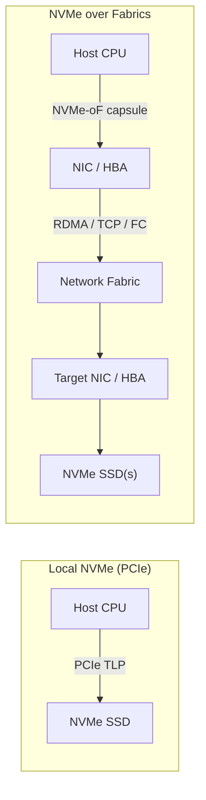
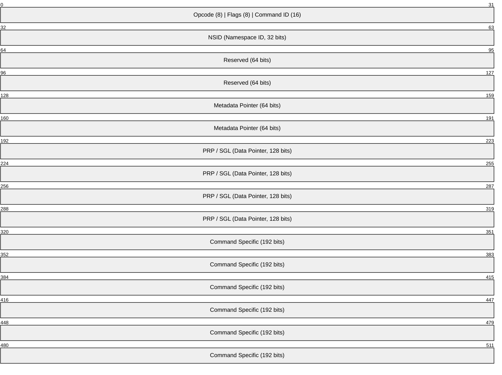
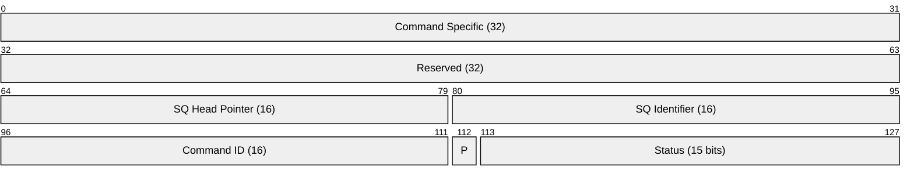
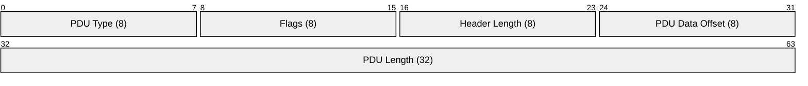
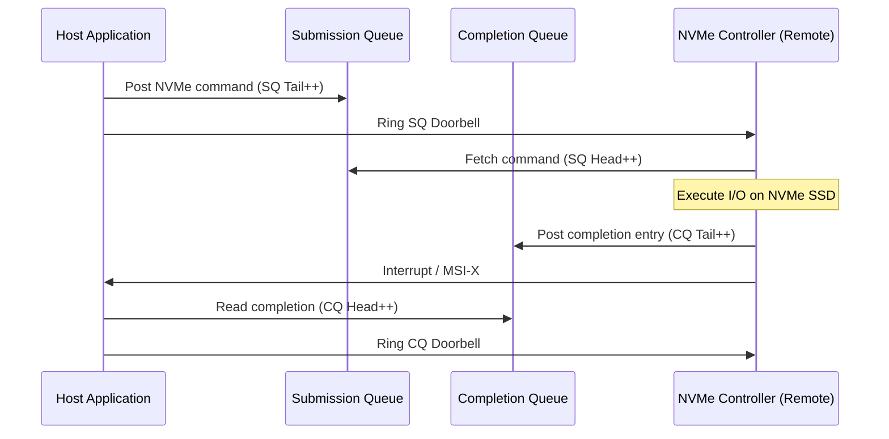
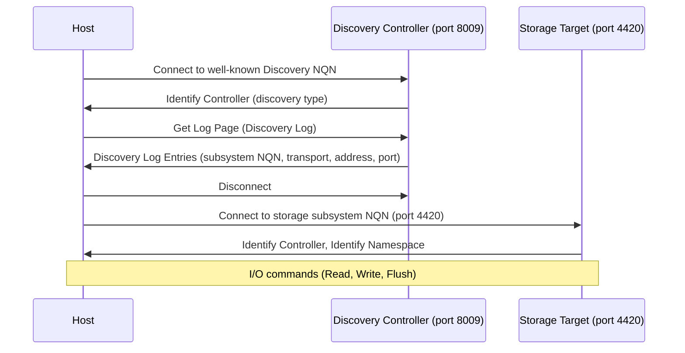
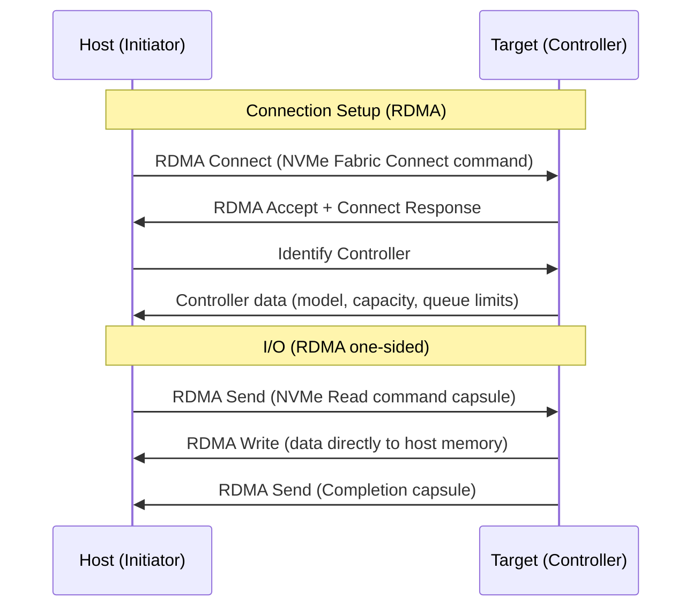
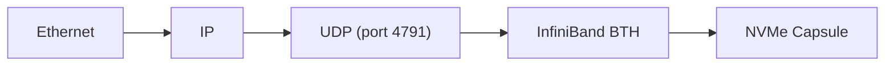

# NVMe-oF (NVMe over Fabrics)

> **Standard:** [NVMe over Fabrics 1.1 (nvmexpress.org)](https://nvmexpress.org/specifications/) | **Layer:** Application / Transport | **Wireshark filter:** `nvme`

NVMe over Fabrics extends the NVMe protocol beyond a single machine's PCIe bus, allowing hosts to access remote NVMe storage over a network fabric. NVMe-oF preserves the high-parallelism, low-latency architecture of local NVMe — with up to 65,535 I/O queues each supporting 65,536 outstanding commands — while transporting commands and data over RDMA (RoCE v2, InfiniBand), TCP, or Fibre Channel. The result is significantly lower latency and higher IOPS than iSCSI for disaggregated storage.

## NVMe Architecture (Local vs Fabric)

## Capsule Structure

NVMe-oF uses capsules to carry NVMe commands, responses, and data over a fabric:

### Command Capsule

### Response Capsule (Completion Queue Entry)

## Key Fields

| Field | Size | Description |
|-------|------|-------------|
| Opcode | 8 bits | NVMe command opcode (Read=0x02, Write=0x01, Identify=0x06) |
| Flags | 8 bits | Fused operation, PRP/SGL type |
| Command ID | 16 bits | Unique tag for matching completions to commands |
| NSID | 32 bits | Namespace ID — identifies the storage volume |
| SGL | 128 bits | Scatter-Gather List — describes data buffer locations |
| SQ Head Pointer | 16 bits | Submission Queue head — flow control |
| Status | 15 bits | Completion status (success, error codes) |
| P (Phase) | 1 bit | Phase tag — toggled to indicate new completion |

## NVMe-oF Transports

### Transport Binding Summary

| Transport | Port | Encapsulation | Latency | Requires |
|-----------|------|---------------|---------|----------|
| RDMA (RoCE v2) | 4420 | NVMe capsule in RDMA Send/Write | 10-30 us | Lossless Ethernet (DCB) or RoCE resilience |
| RDMA (InfiniBand) | 4420 | NVMe capsule in IB verbs | 5-15 us | InfiniBand fabric |
| TCP | 4420 | NVMe/TCP PDU over TCP | 50-200 us | Standard Ethernet |
| FC (FC-NVMe) | N/A | NVMe capsule in FC frames | 20-50 us | FC fabric (32G/64G) |

### NVMe/TCP PDU Header

| PDU Type | Value | Description |
|----------|-------|-------------|
| ICReq | 0x00 | Initialize Connection Request |
| ICResp | 0x01 | Initialize Connection Response |
| H2CData | 0x02 | Host-to-Controller Data |
| C2HData | 0x03 | Controller-to-Host Data |
| CapsuleCmd | 0x04 | Command Capsule |
| CapsuleResp | 0x05 | Response Capsule |
| H2CTermReq | 0x06 | Host-to-Controller Terminate Request |
| C2HTermReq | 0x07 | Controller-to-Host Terminate Request |
| R2T | 0x09 | Ready to Transfer |

## Submission Queue / Completion Queue Model

### Queue Parameters

| Parameter | Value | Description |
|-----------|-------|-------------|
| Admin Queue | 1 pair | Queue pair 0 — for management commands |
| I/O Queues | Up to 65,535 | One per CPU core is typical |
| Queue Depth | Up to 65,536 | Outstanding commands per queue |
| Total Commands | ~4 billion | 65,535 queues x 65,536 depth |

## Discovery Service

NVMe-oF provides a centralized Discovery Controller for locating storage targets:

### NVMe Qualified Name (NQN)

Format: `nqn.YYYY-MM.reversed.domain:identifier`

| Well-Known NQN | Purpose |
|----------------|---------|
| `nqn.2014-08.org.nvmexpress.discovery` | Discovery Controller |
| `nqn.2014-08.org.nvmexpress:uuid:<UUID>` | UUID-based naming |

## NVMe-oF over RDMA Flow

## Performance Comparison

| Metric | iSCSI | NVMe/TCP | NVMe/RDMA | NVMe/FC |
|--------|-------|----------|-----------|---------|
| Latency | 100-500 us | 50-200 us | 10-30 us | 20-50 us |
| IOPS (per target) | ~200K | ~500K | ~1M+ | ~800K |
| CPU Overhead | High (TCP + iSCSI + SCSI) | Medium (TCP + NVMe) | Very low (kernel bypass) | Low |
| Queue Depth | ~256 typical | 65K queues x 65K | 65K queues x 65K | 65K queues x 65K |
| Multi-queue | Limited | Yes (per-core) | Yes (per-core) | Yes (per-core) |

## Encapsulation (TCP Transport)

## Encapsulation (RDMA Transport)

## Standards

| Document | Title |
|----------|-------|
| [NVMe Base Spec 2.1](https://nvmexpress.org/specifications/) | NVM Express Base Specification |
| [NVMe-oF 1.1](https://nvmexpress.org/specifications/) | NVMe over Fabrics Specification |
| [NVMe/TCP Transport Binding](https://nvmexpress.org/specifications/) | TCP Transport Binding Specification |
| [RFC 7143](https://www.rfc-editor.org/rfc/rfc7143) | iSCSI (for comparison) |
| [INCITS FC-NVMe-2](https://www.t11.org/) | FC-NVMe Fibre Channel Transport |

## See Also

- [iSCSI](iscsi.md) — SCSI over TCP/IP (predecessor technology)
- [RDMA](../hpc/rdma.md) — transport substrate for NVMe/RDMA (RoCE, InfiniBand)
- [Fibre Channel](fibrechannel.md) — FC-NVMe transport
- [PCIe](../bus/pcie.md) — local NVMe transport (NVMe was designed for PCIe)
