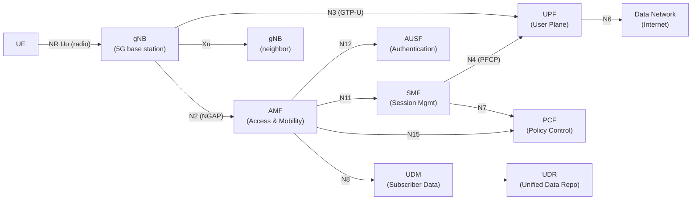
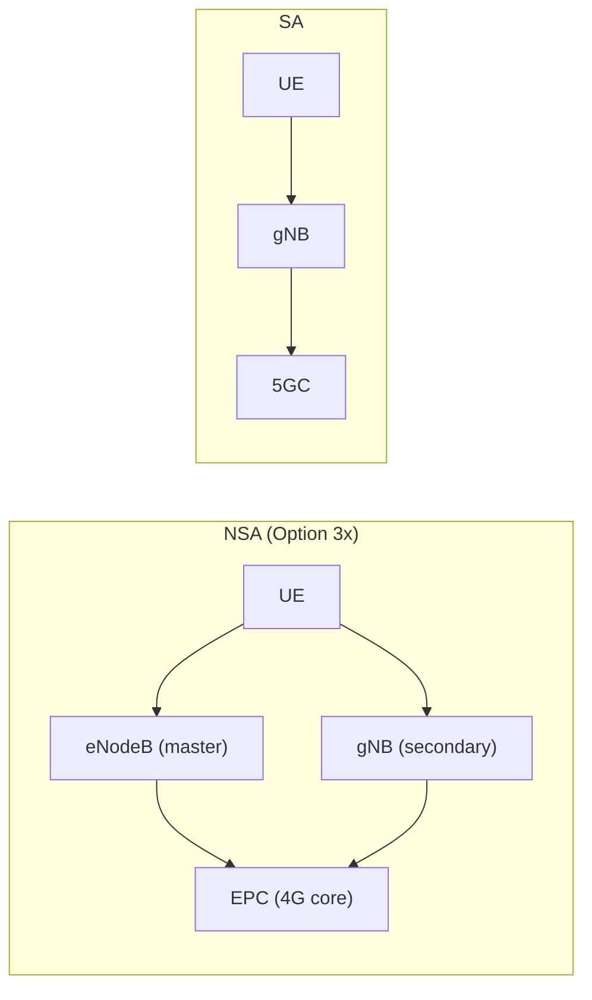
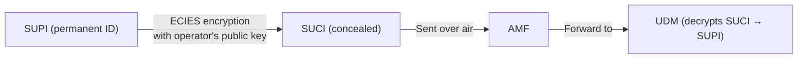

# 5G NR (New Radio)

> **Standard:** [3GPP TS 38 series](https://www.3gpp.org/specifications-technologies/releases) | **Layer:** Full stack | **Wireshark filter:** `nr-rrc` or `ngap` or `nas-5gs` or `pfcp`

5G NR is the fifth-generation mobile radio access technology, designed for three use cases: enhanced Mobile Broadband (eMBB — high speed), Ultra-Reliable Low-Latency Communication (URLLC — <1ms latency for industrial/automotive), and massive Machine-Type Communication (mMTC — millions of IoT devices). 5G NR introduces a flexible numerology (variable subcarrier spacing), massive MIMO (up to 256 antennas), mmWave support (24-100 GHz), and a service-based core architecture (5GC).

## Architecture (5GC — 5G Core)

### 5GC Network Functions (NFs)

| NF | Full Name | Replaces (LTE) | Role |
|----|-----------|----------------|------|
| AMF | Access and Mobility Management | MME (mobility part) | Registration, mobility, security |
| SMF | Session Management Function | MME (session part) + P-GW-C | PDU session, QoS, IP allocation |
| UPF | User Plane Function | S-GW-U + P-GW-U | Packet forwarding, QoS enforcement |
| UDM | Unified Data Management | HSS (data) | Subscription management |
| AUSF | Authentication Server Function | HSS (auth) | 5G-AKA authentication |
| PCF | Policy Control Function | PCRF | Policy and charging rules |
| NSSF | Network Slice Selection Function | — (new) | Selects network slice |
| NEF | Network Exposure Function | — (new) | API exposure to applications |
| NRF | NF Repository Function | — (new) | Service discovery for NFs |
| UDR | Unified Data Repository | — (new) | Central data storage |

### Key Interfaces

| Interface | Between | Protocol | Purpose |
|-----------|---------|----------|---------|
| N1 | UE ↔ AMF | NAS-5GS | Registration, auth, session management |
| N2 | gNB ↔ AMF | NGAP (SCTP) | Control plane signaling |
| N3 | gNB ↔ UPF | GTP-U (UDP) | User data tunneling |
| N4 | SMF ↔ UPF | PFCP (UDP) | User plane rules and reporting |
| N6 | UPF ↔ DN | IP | External data network |
| Xn | gNB ↔ gNB | XnAP (SCTP) | Handover, dual connectivity |

## Radio Interface

| Parameter | Sub-6 GHz | mmWave |
|-----------|-----------|--------|
| Frequency | 410 MHz - 7.125 GHz (FR1) | 24.25 - 52.6 GHz (FR2) |
| Bandwidth | Up to 100 MHz | Up to 400 MHz |
| Subcarrier spacing | 15, 30, 60 kHz | 60, 120 kHz |
| Modulation | QPSK, 16/64/256-QAM | QPSK, 16/64/256-QAM |
| MIMO | Up to 256 antenna elements (Massive MIMO) | Up to 1024 elements (beamforming) |
| Peak DL | ~4.7 Gbps (100 MHz, 256-QAM, 4×4) | ~20 Gbps (theoretical) |
| Peak UL | ~2.5 Gbps | ~10 Gbps (theoretical) |
| Latency | ~4 ms (eMBB), <1 ms (URLLC) | ~1 ms |

### Flexible Numerology

| Numerology (μ) | Subcarrier Spacing | Slot Duration | Slots/Subframe | Use Case |
|----------------|-------------------|---------------|-----------------|----------|
| 0 | 15 kHz | 1 ms | 1 | Sub-6 GHz, compatible with LTE |
| 1 | 30 kHz | 0.5 ms | 2 | Sub-6 GHz, typical |
| 2 | 60 kHz | 0.25 ms | 4 | Sub-6 GHz or mmWave |
| 3 | 120 kHz | 0.125 ms | 8 | mmWave |
| 4 | 240 kHz | 0.0625 ms | 16 | mmWave (SS/PBCH blocks) |

Shorter slots = lower latency. The network can mix numerologies for different use cases.

## Deployment Modes

| Mode | Description |
|------|-------------|
| NSA (Non-Standalone) | 5G NR radio + LTE core (EPC). Uses LTE for control plane. |
| SA (Standalone) | 5G NR radio + 5G core (5GC). Full 5G capabilities. |
| EN-DC | E-UTRA NR Dual Connectivity (LTE master + NR secondary) |
| NR-DC | NR Dual Connectivity (NR master + NR secondary) |

### NSA vs SA

## Network Slicing

5G allows the network to be divided into virtual slices, each tailored for a specific use case:

| Slice Type (SST) | Name | Use Case |
|-------------------|------|----------|
| 1 | eMBB | Enhanced Mobile Broadband (video, web) |
| 2 | URLLC | Ultra-Reliable Low Latency (industry 4.0, autonomous driving) |
| 3 | mMTC | Massive Machine Type Communication (IoT sensors) |
| 4 | V2X | Vehicle-to-Everything |

Each slice is identified by an S-NSSAI (Single Network Slice Selection Assistance Information) = SST + optional SD (Slice Differentiator).

## Security (5G-AKA)

5G improves on LTE security:

| Feature | LTE | 5G |
|---------|-----|-----|
| Authentication | EPS-AKA | 5G-AKA or EAP-AKA' |
| SUPI privacy | IMSI sent in cleartext | SUCI (encrypted SUPI) — prevents IMSI catchers |
| Integrity (user plane) | Optional (rarely used) | Mandatory support |
| Key hierarchy | KASME → KeNB | KAUSF → KSEAF → KAMF → KgNB |

### SUCI (Subscription Concealed Identifier)

The IMSI is never sent in cleartext over the air — a major improvement over GSM/LTE.

## 5G vs LTE vs GSM

| Feature | GSM (2G) | LTE (4G) | 5G NR |
|---------|----------|----------|-------|
| Year | 1991 | 2009 | 2019 |
| Access | TDMA | OFDMA | OFDMA (flexible) |
| Peak DL | 14 kbps | 300 Mbps - 3 Gbps | 20 Gbps (theoretical) |
| Latency | ~300 ms | ~10-20 ms | ~1-4 ms |
| Core | Circuit + Packet (GPRS) | All-IP (EPC) | Service-Based (5GC) |
| Voice | Circuit-switched | VoLTE (SIP/IMS) | VoNR (SIP/IMS) |
| Slicing | No | Limited | Native |
| mmWave | No | No | Yes (FR2) |

## Standards

| Document | Title |
|----------|-------|
| [3GPP TS 38.300](https://www.3gpp.org/DynaReport/38300.htm) | NR overall description |
| [3GPP TS 38.331](https://www.3gpp.org/DynaReport/38331.htm) | NR RRC Protocol |
| [3GPP TS 24.501](https://www.3gpp.org/DynaReport/24501.htm) | NAS Protocol (5GMM + 5GSM) |
| [3GPP TS 38.211](https://www.3gpp.org/DynaReport/38211.htm) | NR physical channels and modulation |
| [3GPP TS 23.501](https://www.3gpp.org/DynaReport/23501.htm) | 5G System architecture |
| [3GPP TS 33.501](https://www.3gpp.org/DynaReport/33501.htm) | 5G security architecture |

## See Also

- [LTE](lte.md) — 4G predecessor
- [GSM](gsm.md) — 2G predecessor
- [GTP](../tunneling/gtp.md) — user plane tunneling (GTP-U on N3)
- [Diameter](diameter.md) — replaced by HTTP/2-based SBI in 5GC
- [SIP](../voip/sip.md) — VoNR voice calls via IMS
