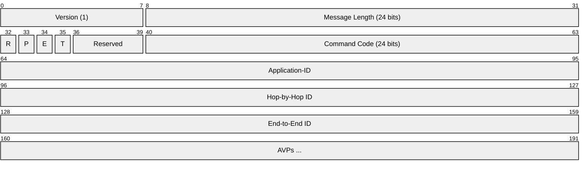
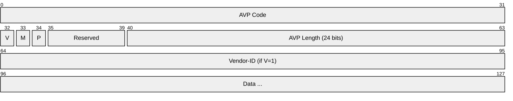
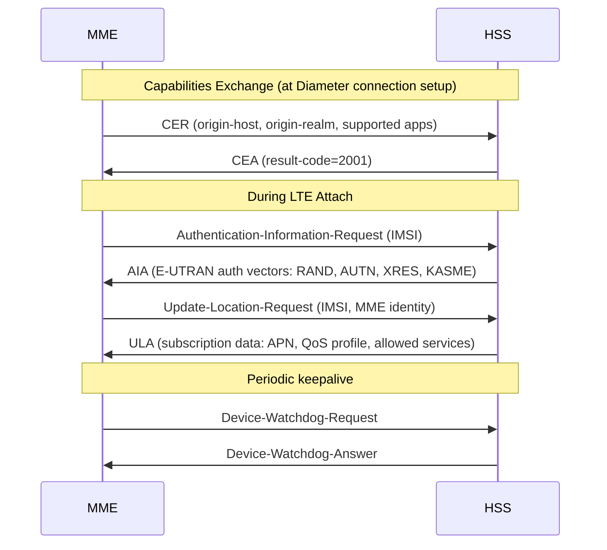
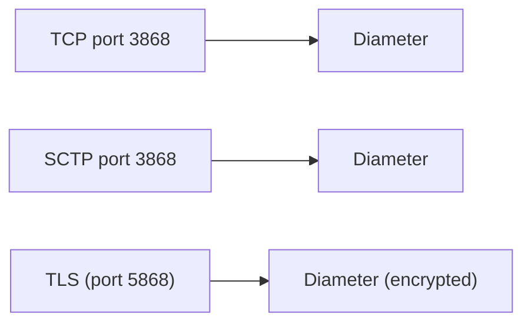

# Diameter

> **Standard:** [RFC 6733](https://www.rfc-editor.org/rfc/rfc6733) | **Layer:** Application (Layer 7) | **Wireshark filter:** `diameter`

Diameter is the AAA (Authentication, Authorization, and Accounting) protocol for modern mobile networks. It replaced RADIUS in 3GPP networks starting with LTE, providing reliable transport (TCP/SCTP), larger message sizes, and better extensibility. Diameter is used between the MME and HSS for subscriber authentication (S6a), between the P-GW and PCRF for policy/charging (Gx), and in many other 3GPP interfaces. The name is a play on words — Diameter is "twice RADIUS."

## Message Format

## Key Fields

| Field | Size | Description |
|-------|------|-------------|
| Version | 8 bits | Always 1 |
| Message Length | 24 bits | Total message length including header |
| R flag | 1 bit | 1 = Request, 0 = Answer |
| P flag | 1 bit | Proxiable (can be forwarded by agents) |
| E flag | 1 bit | Error (indicates an error answer) |
| T flag | 1 bit | Retransmitted message |
| Command Code | 24 bits | Identifies the operation |
| Application-ID | 32 bits | Identifies the Diameter application |
| Hop-by-Hop ID | 32 bits | Matches requests/answers on a single hop |
| End-to-End ID | 32 bits | Matches requests/answers end-to-end |

## AVP (Attribute-Value Pair)

| Field | Description |
|-------|-------------|
| AVP Code | Identifies the attribute (IANA-registered or vendor-specific) |
| V flag | 1 = Vendor-ID field present |
| M flag | 1 = Mandatory (receiver must understand) |
| P flag | 1 = End-to-end encryption needed |
| AVP Length | Length of entire AVP including header |
| Vendor-ID | IANA enterprise number (if V=1) |
| Data | Attribute value (typed: OctetString, Unsigned32, UTF8String, Grouped, etc.) |

## Base Protocol Commands

| Code | Name | Description |
|------|------|-------------|
| 257 | CER / CEA | Capabilities Exchange (session setup) |
| 258 | RAR / RAA | Re-Auth (server requests re-authentication) |
| 271 | ACR / ACA | Accounting |
| 274 | ASR / ASA | Abort-Session (server terminates session) |
| 280 | DWR / DWA | Device-Watchdog (keepalive) |
| 282 | DPR / DPA | Disconnect-Peer (graceful shutdown) |

## 3GPP Diameter Applications

| Interface | Application-ID | Command | Between | Purpose |
|-----------|---------------|---------|---------|---------|
| S6a | 16777251 | AIR/AIA | MME ↔ HSS | Authentication Info (auth vectors) |
| S6a | 16777251 | ULR/ULA | MME ↔ HSS | Update Location (subscription data) |
| Gx | 16777238 | CCR/CCA | P-GW ↔ PCRF | Credit-Control (QoS policy, charging) |
| Gy | 4 | CCR/CCA | P-GW ↔ OCS | Online Charging (real-time prepaid) |
| Rx | 16777236 | AAR/AAA | P-CSCF ↔ PCRF | QoS for IMS/VoLTE sessions |
| Sh | 16777217 | UDR/UDA | AS ↔ HSS | User Data (IMS application server) |
| Cx | 16777216 | MAR/MAA | I-CSCF/S-CSCF ↔ HSS | IMS registration |
| SWx | 16777265 | MAR/MAA | ePDG ↔ HSS | WiFi calling authentication |
| S13 | 16777252 | ECR/ECA | MME ↔ EIR | Equipment Identity Check (IMEI) |

## Session Flow (S6a — LTE Attach)

## Common AVPs

| AVP Code | Name | Description |
|----------|------|-------------|
| 1 | User-Name | Username (often IMSI for 3GPP) |
| 25 | Class | Opaque data passed between sessions |
| 263 | Session-Id | Unique session identifier |
| 264 | Origin-Host | Sending node's FQDN |
| 268 | Result-Code | Success/failure (2001=success) |
| 277 | Auth-Session-State | Stateful or stateless |
| 283 | Destination-Realm | Target realm for routing |
| 293 | Destination-Host | Target host (if known) |
| 416 | CC-Request-Type | Initial, Update, Termination (for Gx/Gy) |
| 444 | Subscription-Id | Subscriber identity (IMSI, MSISDN) |

## Result Codes

| Code | Name | Description |
|------|------|-------------|
| 2001 | DIAMETER_SUCCESS | Request completed successfully |
| 3001 | DIAMETER_COMMAND_UNSUPPORTED | Command not supported |
| 3002 | DIAMETER_UNABLE_TO_DELIVER | Cannot route to destination |
| 4001 | DIAMETER_AUTHENTICATION_REJECTED | Auth failed |
| 5001 | DIAMETER_AVP_UNSUPPORTED | Required AVP not understood |
| 5004 | DIAMETER_MISSING_AVP | Required AVP missing |
| 5012 | DIAMETER_UNABLE_TO_COMPLY | General failure |

## Diameter vs RADIUS

| Feature | RADIUS | Diameter |
|---------|--------|----------|
| Transport | UDP (unreliable) | TCP or SCTP (reliable) |
| Max message size | ~4096 bytes | ~16 MB |
| Security | Shared secret (per-packet) | IPsec or TLS (per-connection) |
| Agent types | Proxy only | Proxy, Relay, Redirect, Translation |
| Error handling | Silent discard | Explicit error answers |
| Failover | Application-dependent | Built-in (TCP/SCTP transport) |
| Server-initiated | Limited (CoA, DM) | Native (RAR, ASR) |
| Capability negotiation | None | CER/CEA at connection setup |
| Use case | Wi-Fi/VPN/ISP | 3GPP mobile core (LTE/5G) |

## Encapsulation

## Standards

| Document | Title |
|----------|-------|
| [RFC 6733](https://www.rfc-editor.org/rfc/rfc6733) | Diameter Base Protocol |
| [RFC 4006](https://www.rfc-editor.org/rfc/rfc4006) | Diameter Credit-Control Application |
| [3GPP TS 29.272](https://www.3gpp.org/DynaReport/29272.htm) | S6a/S6d (MME/SGSN ↔ HSS) |
| [3GPP TS 29.212](https://www.3gpp.org/DynaReport/29212.htm) | Gx (Policy and Charging Control) |
| [3GPP TS 29.214](https://www.3gpp.org/DynaReport/29214.htm) | Rx (IMS QoS) |
| [3GPP TS 29.229](https://www.3gpp.org/DynaReport/29229.htm) | Cx/Dx (IMS registration) |

## See Also

- [RADIUS](../security/radius.md) — predecessor AAA protocol
- [LTE](lte.md) — the network Diameter was built for
- [5G NR](5gnr.md) — 5GC replaces Diameter with HTTP/2-based SBI
- [GTP](../tunneling/gtp.md) — user/control plane tunneling alongside Diameter
- [TCP](../transport-layer/tcp.md) — primary transport
- [SCTP](../transport-layer/sctp.md) — alternative transport
