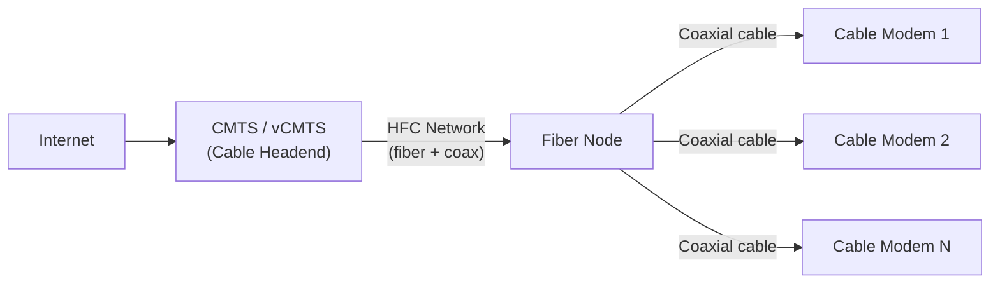
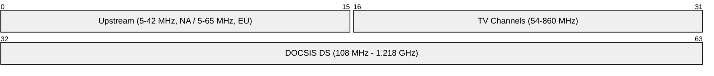
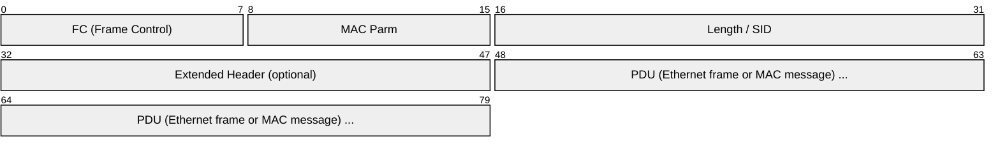
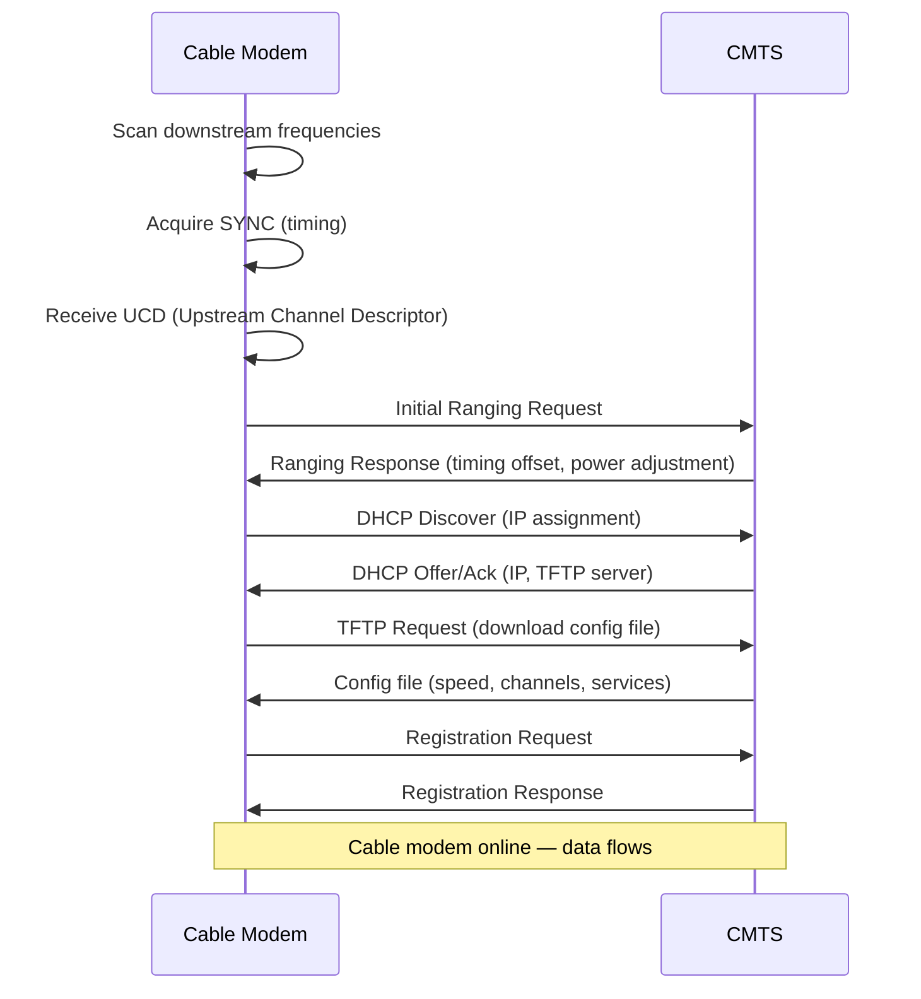
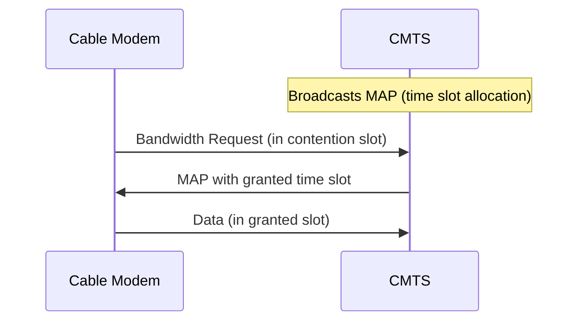
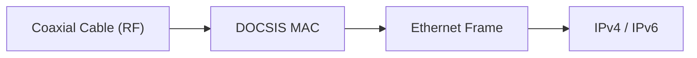

# DOCSIS (Data Over Cable Service Interface Specification)

> **Standard:** [CableLabs DOCSIS 3.1 / 4.0](https://www.cablelabs.com/technologies/docsis) | **Layer:** Physical / Data Link (Layers 1-2) | **Wireshark filter:** `docsis`

DOCSIS is the standard for delivering broadband Internet over hybrid fiber-coaxial (HFC) cable television networks. It allows cable operators to provide high-speed data alongside television services on the same coaxial infrastructure. DOCSIS defines downstream (headend to subscriber) and upstream (subscriber to headend) communication using frequency-division multiplexing on the cable plant. DOCSIS 3.1 supports multi-gigabit speeds, and DOCSIS 4.0 enables symmetric 10 Gbps.

## DOCSIS Versions

| Version | Year | Downstream | Upstream | Key Features |
|---------|------|-----------|----------|-------------|
| 1.0 | 1997 | 38 Mbps | 9 Mbps | Basic data over cable |
| 1.1 | 2001 | 38 Mbps | 9 Mbps | QoS, fragmentation |
| 2.0 | 2002 | 38 Mbps | 27 Mbps | Improved upstream (A-TDMA, S-CDMA) |
| 3.0 | 2006 | 1 Gbps+ | 100 Mbps+ | Channel bonding (up to 32 DS / 8 US) |
| 3.1 | 2013 | 10 Gbps | 1-2 Gbps | OFDM, 4096-QAM, wider channels |
| 4.0 | 2017 | 10 Gbps | 6 Gbps | Full Duplex DOCSIS (FDX), Extended Spectrum |

## Network Architecture

| Component | Description |
|-----------|-------------|
| CMTS | Cable Modem Termination System — headend equipment (operator side) |
| HFC | Hybrid Fiber-Coaxial — fiber to the neighborhood, coax to the home |
| Fiber Node | Converts between fiber optics and coaxial RF |
| CM | Cable Modem — customer premises equipment |
| CPE | Customer devices behind the cable modem |

## Frequency Plan

| Direction | DOCSIS 3.0 | DOCSIS 3.1 |
|-----------|-----------|-----------|
| Downstream | 6/8 MHz SC-QAM channels (up to 256-QAM) | Up to 192 MHz OFDM channels (up to 4096-QAM) |
| Upstream | 6.4 MHz channels (up to 64-QAM) | Up to 96 MHz OFDMA channels (up to 4096-QAM) |

## MAC Frame

### Downstream

| Field | Size | Description |
|-------|------|-------------|
| FC | 8 bits | Frame control — type, encryption, extended header flag |
| MAC Parm | 8 bits | Depends on frame type (EHDR length or MAC type) |
| Length/SID | 16 bits | PDU length (downstream) or Service ID (upstream) |
| EHDR | Variable | Extended header (BPI+, fragmentation, etc.) |
| PDU | Variable | Payload — typically an Ethernet frame |
| CRC | 32 bits | CRC over the entire MAC frame |

### Frame Control Types

| FC Type | Name | Description |
|---------|------|-------------|
| 00 | Packet PDU | Data frame (Ethernet payload) |
| 01 | ATM PDU | ATM cell (legacy, rare) |
| 10 | Reserved | — |
| 11 | MAC Management | CMTS-CM signaling messages |

## Registration and Ranging

### Cable Modem Initialization

### Key MAC Management Messages

| Type | Name | Description |
|------|------|-------------|
| 1 | SYNC | Downstream timing synchronization |
| 2 | UCD | Upstream Channel Descriptor (modulation, frequency) |
| 3 | MAP | Upstream bandwidth allocation map |
| 4 | RNG-REQ | Ranging Request |
| 5 | RNG-RSP | Ranging Response (timing/power corrections) |
| 6 | REG-REQ | Registration Request |
| 7 | REG-RSP | Registration Response |
| 11 | UCC-REQ | Upstream Channel Change Request |
| 18 | DBC-REQ | Dynamic Bonding Change Request |
| 29 | CM-STATUS | Cable Modem Status Report |
| 33 | DCD | Downstream Channel Descriptor |
| 35 | MDD | MAC Domain Descriptor |

## Upstream Access — TDMA/OFDMA

The upstream is a shared medium. The CMTS allocates timeslots to cable modems using MAP messages:

| Mechanism | DOCSIS Version | Description |
|-----------|---------------|-------------|
| TDMA | 1.x-3.0 | Time Division Multiple Access — modems transmit in assigned time slots |
| S-CDMA | 2.0-3.0 | Synchronous Code Division — multiple modems share same timeslot with codes |
| OFDMA | 3.1+ | Orthogonal Frequency Division Multiple Access — modems assigned subcarrier groups |

### Contention and Grants

## Channel Bonding (DOCSIS 3.0)

Multiple channels are bonded together for higher throughput:

| Direction | DOCSIS 3.0 | DOCSIS 3.1 |
|-----------|-----------|-----------|
| Downstream | Up to 32 × 6 MHz channels = ~1.2 Gbps | 2 × 192 MHz OFDM = ~10 Gbps |
| Upstream | Up to 8 × 6.4 MHz channels = ~120 Mbps | 2 × 96 MHz OFDMA = ~1.5 Gbps |

## Security (BPI+ — Baseline Privacy Interface Plus)

| Feature | Description |
|---------|-------------|
| Authentication | X.509 certificates (CM has manufacturer certificate) |
| Key exchange | Authenticated key agreement (CMTS → CM) |
| Encryption | AES-128-CBC (traffic encryption keys per SAID) |
| Key refresh | TEKs rotated periodically |

## DOCSIS 4.0

| Feature | Description |
|---------|-------------|
| FDX (Full Duplex) | Same frequencies used for both upstream and downstream simultaneously |
| Extended Spectrum | Upstream expanded up to 684 MHz |
| Target speeds | 10 Gbps downstream, 6 Gbps upstream |
| Backward compatible | Coexists with DOCSIS 3.1 on the same plant |

## Encapsulation

Unlike DSL (which typically uses PPPoE), DOCSIS presents a standard Ethernet interface to the customer. Most cable ISPs use IPoE (IP over Ethernet) with DHCP for addressing.

## Standards

| Document | Title |
|----------|-------|
| [DOCSIS 3.1 PHY](https://www.cablelabs.com/specifications) | DOCSIS 3.1 Physical Layer Specification |
| [DOCSIS 3.1 MAC](https://www.cablelabs.com/specifications) | DOCSIS 3.1 MAC and Upper Layer Protocols |
| [DOCSIS 4.0](https://www.cablelabs.com/specifications) | DOCSIS 4.0 Specification |
| [DOCSIS 3.0](https://www.cablelabs.com/specifications) | DOCSIS 3.0 Specifications |
| [BPI+](https://www.cablelabs.com/specifications) | Baseline Privacy Plus Interface Specification |

## See Also

- [xDSL](xdsl.md) — telephone-line alternative to cable broadband
- [Ethernet](../link-layer/ethernet.md) — interface presented to customer
- [DHCP](../naming/dhcp.md) — IP address assignment for cable modems
- [IPv4](../network-layer/ip.md)
