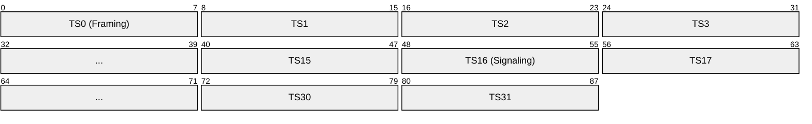
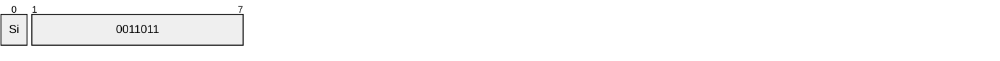
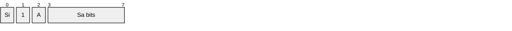
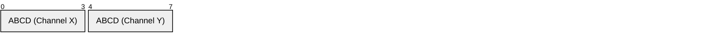

# E1

> **Standard:** [ITU-T G.703 / G.704](https://www.itu.int/rec/T-REC-G.704) | **Layer:** Physical (Layer 1) | **Wireshark filter:** N/A (sub-packet-capture)

E1 is the digital transmission standard used outside North America and Japan, carrying 2.048 Mbps over two twisted pairs or coaxial cable. It multiplexes 32 timeslots of 64 kbps each using TDM. Timeslot 0 is reserved for framing/synchronization and timeslot 16 is typically used for signaling, leaving 30 channels for voice or data. E1 is the fundamental building block of the European/international digital hierarchy (PDH) and is used for voice trunks, ISDN PRI, SS7 signaling, and data circuits.

## Frame

An E1 frame is 256 bits (32 bytes), transmitted 8,000 times per second:

| Field | Size | Description |
|-------|------|-------------|
| Timeslot 0 | 8 bits | Frame alignment and service bits |
| Timeslots 1-15 | 8 bits each | Bearer channels (voice/data) |
| Timeslot 16 | 8 bits | Signaling (CAS) or bearer (CCS) |
| Timeslots 17-31 | 8 bits each | Bearer channels (voice/data) |

**Total:** 32 × 8 = 256 bits × 8,000 frames/sec = **2,048,000 bps**

## Key Parameters

| Parameter | Value |
|-----------|-------|
| Line rate | 2.048 Mbps |
| Total timeslots | 32 × DS0 (64 kbps) |
| Bearer channels | 30 (TS1-15, TS17-31) |
| Frame size | 256 bits (32 bytes) |
| Frame rate | 8,000 frames/sec |
| Encoding | HDB3 (High Density Bipolar 3) |
| Cable | 2 twisted pairs (120Ω) or coax (75Ω) |
| Connector | RJ-48C (twisted pair) or BNC (coax) |

## Frame Structure

### Timeslot 0 (Framing)

Alternating frames carry Frame Alignment Signal (FAS) and Not-FAS patterns:

**Even frames (FAS):**

**Odd frames (Not-FAS):**

| Field | Description |
|-------|-------------|
| Si | International bit (spare, set to 1) |
| 0011011 | Frame Alignment Signal — fixed pattern for frame sync |
| A | Remote Alarm Indication (RAI); 1 = alarm |
| Sa4-Sa8 | Spare bits (used for CRC-4 in extended framing) |

### CRC-4 Multiframe

When CRC-4 is enabled, 16 frames form a multiframe. The Sa bits in timeslot 0 carry a CRC-4 over the preceding sub-multiframe, providing error detection.

### Timeslot 16 (Signaling)

#### CAS (Channel Associated Signaling)

16 frames form a signaling multiframe. Each frame carries signaling for two channels (A/B/C/D bits):

Frame 0 of the multiframe contains the Multiframe Alignment Signal: `0000 1101`

| Bits | Typical Meaning |
|------|----------------|
| A=1, B=1 | Off-hook (active) |
| A=0, B=0 | On-hook (idle) |
| A=1, B=0 | Seizure / wink |

#### CCS (Common Channel Signaling)

When timeslot 16 carries signaling using HDLC (LAPD for ISDN PRI or SS7), all 64 kbps are available for the D-channel, and all 30 bearer channels get full 64 kbps.

## Configurations

| Configuration | TS0 | TS16 | Bearer | Total Bearer |
|---------------|-----|------|--------|-------------|
| CAS (30B+D) | Framing | CAS signaling | TS1-15, TS17-31 | 30 × 64 kbps |
| PRI ISDN (30B+D) | Framing | D-channel (Q.931) | TS1-15, TS17-31 | 30 × 64 kbps |
| Unframed | — | — | All 32 timeslots | 2.048 Mbps clear channel |
| Fractional E1 | Framing | — | Selected timeslots | N × 64 kbps |

## Line Coding

| Encoding | Description |
|----------|-------------|
| HDB3 (High Density Bipolar 3) | Bipolar AMI with substitution of 4 consecutive zeros to maintain clock sync. Always used on E1. |

HDB3 replaces strings of 4 zeros with a pattern containing a bipolar violation, ensuring sufficient signal transitions for clock recovery.

## PDH Hierarchy (International)

| Level | Rate | Channels | Composition |
|-------|------|----------|-------------|
| E0 | 64 kbps | 1 | Single channel |
| E1 | 2.048 Mbps | 32 (30 bearer) | 32 × E0 |
| E2 | 8.448 Mbps | 128 | 4 × E1 |
| E3 | 34.368 Mbps | 512 | 4 × E2 (16 × E1) |
| E4 | 139.264 Mbps | 2048 | 4 × E3 (64 × E1) |

## E1 vs T1

| Parameter | E1 | T1 |
|-----------|----|----|
| Line rate | 2.048 Mbps | 1.544 Mbps |
| Total timeslots | 32 | 24 + 1 framing bit |
| Bearer channels | 30 | 23 (PRI) or 24 (CAS) |
| Signaling channel | TS16 (dedicated) | TS24 or robbed-bit |
| Frame size | 256 bits | 193 bits |
| Line coding | HDB3 | AMI or B8ZS |
| Framing overhead | TS0 (in-slot) | 1 bit per frame (out-of-slot) |
| Geography | Europe, Asia, Africa, South America | North America, Japan |

## Standards

| Document | Title |
|----------|-------|
| [ITU-T G.703](https://www.itu.int/rec/T-REC-G.703) | Physical/electrical characteristics of hierarchical digital interfaces |
| [ITU-T G.704](https://www.itu.int/rec/T-REC-G.704) | Synchronous frame structures at 1544, 6312, 2048, 8488, and 44736 kbit/s |
| [ITU-T G.706](https://www.itu.int/rec/T-REC-G.706) | Frame alignment and CRC procedures |
| [ITU-T G.732](https://www.itu.int/rec/T-REC-G.732) | Characteristics of primary PCM multiplex equipment at 2048 kbit/s |

## See Also

- [T1](t1.md) — North American equivalent (1.544 Mbps, 24 channels)
- [ISDN](isdn.md) — PRI signaling over E1
- [SS7](ss7.md) — signaling carried in E1 timeslots
