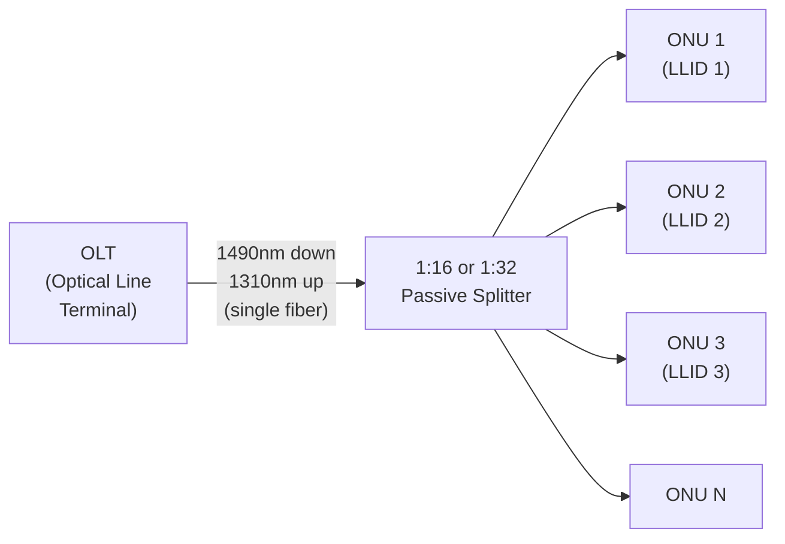
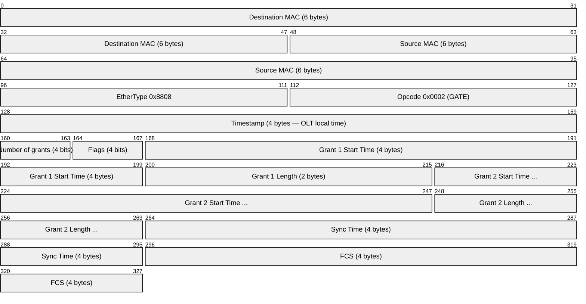
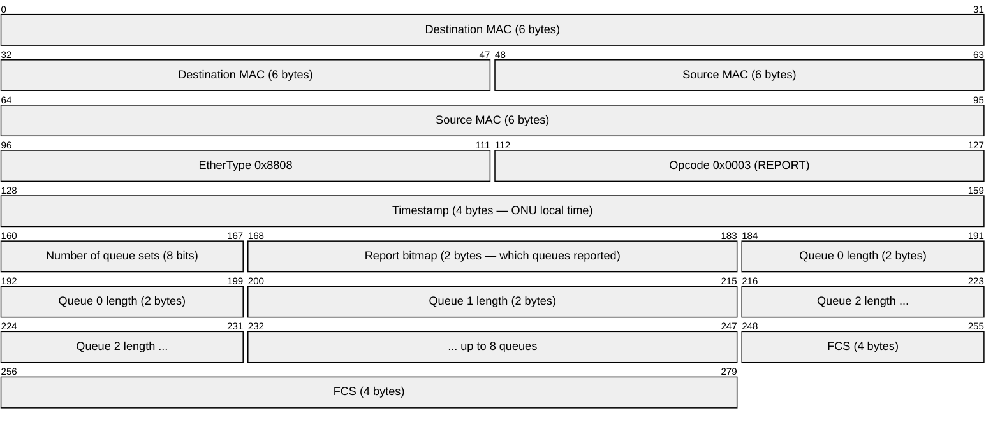
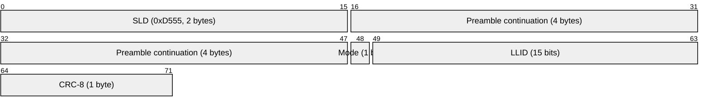
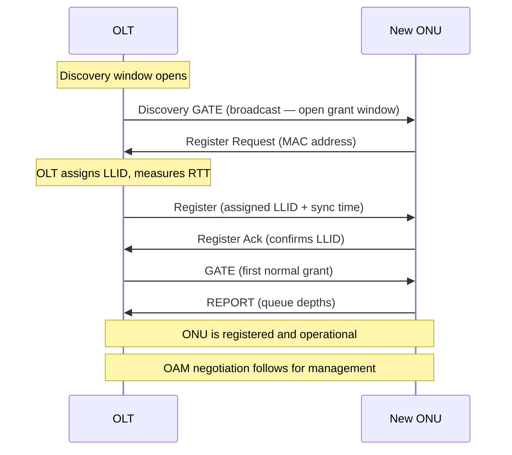

# EPON / 10G-EPON (Ethernet Passive Optical Network)

> **Standard:** [IEEE 802.3ah](https://standards.ieee.org/standard/802_3ah-2004.html) | **Layer:** Physical + Data Link (Layers 1-2) | **Wireshark filter:** `epon`

EPON is the IEEE-standardized approach to passive optical networking, using native Ethernet framing rather than a custom encapsulation like GPON's GEM. It shares the same physical topology — OLT to passive splitter to ONUs — but manages upstream access through MPCP (Multi-Point Control Protocol), an extension to Ethernet. EPON is dominant in Asia (especially Japan and China) while GPON dominates in Europe and the Americas. 10G-EPON (IEEE 802.3av) extends the architecture to 10 Gbps, with asymmetric (10G/1G) and symmetric (10G/10G) variants.

## Architecture

| Parameter | EPON (802.3ah) | 10G-EPON (802.3av) |
|-----------|---------------|---------------------|
| Downstream rate | 1.25 Gbps | 10.3125 Gbps |
| Upstream rate | 1.25 Gbps | 1.25 Gbps (asym) or 10.3125 Gbps (sym) |
| Downstream wavelength | 1490 nm | 1577 nm |
| Upstream wavelength | 1310 nm | 1270 nm |
| Split ratio | 1:16 / 1:32 | 1:16 / 1:32 |
| Max reach | 20 km | 20 km |
| Line coding | 8b/10b | 64b/66b (10G) |
| FEC | RS(255,239) optional | RS(255,223) mandatory |

## Key Difference from GPON

EPON carries **standard Ethernet frames** directly over the PON — no GEM encapsulation, no GTC framing. The Ethernet frame itself is the transport unit. This simplicity is EPON's primary advantage:

| Aspect | EPON | GPON |
|--------|------|------|
| Transport unit | Ethernet frame | GEM frame (5-byte header) |
| Fragmentation | No (full Ethernet frames) | Yes (GEM fragments large frames) |
| Overhead | Lower (native Ethernet) | Higher (GEM + GTC headers) |
| Efficiency | ~95% at 1G | ~93% at 2.5G |
| Upstream control | MPCP (GATE/REPORT) | BWmap in GTC header |
| Management | IEEE 802.3ah OAM | OMCI (ITU-T G.988) |
| TDM support | Not native (use CES) | Native GEM TDM mapping |

## MPCP (Multi-Point Control Protocol)

MPCP manages the point-to-multipoint Ethernet link by controlling upstream TDMA access. It uses Ethernet frames with EtherType **0x8808** (MAC Control):

### GATE Message (OLT to ONU)

The OLT sends GATE messages to grant upstream transmission windows to each ONU:

| Field | Size | Description |
|-------|------|-------------|
| Opcode | 2 bytes | 0x0002 = GATE |
| Timestamp | 4 bytes | OLT's local time when frame was sent |
| Number of grants | 4 bits | Number of grant windows (0-4) |
| Grant Start Time | 4 bytes | When the ONU may begin transmitting (32-bit time) |
| Grant Length | 2 bytes | Duration of the grant (in time quanta = 16 ns) |
| Sync Time | 4 bytes | Used for clock synchronization |

A single GATE message can carry up to 4 grant windows, allowing burst scheduling for different priority queues.

### REPORT Message (ONU to OLT)

ONUs send REPORT messages to inform the OLT of their queue depths for DBA:

| Field | Size | Description |
|-------|------|-------------|
| Opcode | 2 bytes | 0x0003 = REPORT |
| Timestamp | 4 bytes | ONU's local time (used for RTT calculation) |
| Number of queue sets | 1 byte | Number of queue set reports included |
| Report bitmap | 2 bytes | Bitmask of which queue lengths are reported |
| Queue length | 2 bytes each | Pending data per queue (in time quanta) |

The OLT uses REPORT data to run its DBA algorithm and determine grant sizes for the next cycle.

## LLID (Logical Link ID)

Each ONU is assigned a unique LLID during registration, embedded in the Ethernet preamble:

| LLID Value | Meaning |
|-----------|---------|
| 0x7FFF | Broadcast (all ONUs) |
| 0x0001 - 0x7FFE | Unicast (specific ONU) |
| Mode bit = 0 | Single ONU (unicast LLID) |
| Mode bit = 1 | OLT emulated (broadcast/multicast) |

**Downstream:** The OLT broadcasts all frames; each ONU checks the LLID in the preamble and only accepts frames matching its LLID (or broadcast).

**Upstream:** Each ONU stamps its LLID in the preamble so the OLT knows which ONU sent each frame.

## ONU Discovery and Registration

### Discovery Process Details

1. **Discovery GATE:** OLT periodically opens a discovery window (broadcast GATE with a grant for unregistered ONUs)
2. **Register Request:** New ONUs transmit their MAC address with a random delay to reduce collisions
3. **Register:** OLT assigns a unique LLID and provides timing correction (RTT compensation)
4. **Register Ack:** ONU confirms the LLID assignment
5. **Normal operation:** OLT begins sending unicast GATE messages; ONU sends REPORT messages

## OAM (IEEE 802.3ah)

EPON uses IEEE 802.3ah OAM for link management, carried on EtherType **0x8809**:

| Function | Description |
|----------|-------------|
| Discovery | OAM capability negotiation between OLT and ONU |
| Link monitoring | Error counters, symbol errors, frame errors |
| Remote fault indication | ONU signals link problems to OLT |
| Remote loopback | OLT places ONU in loopback mode for testing |
| Variable retrieval | Read ONU MIB variables |
| Organization-specific | Vendor extensions (DPoE, CTC, etc.) |

### OAM PDU Types

| Code | Type | Description |
|------|------|-------------|
| 0x00 | Information | Periodic keepalive + capability exchange |
| 0x01 | Event Notification | Threshold-crossing alarm |
| 0x02 | Variable Request | Read MIB variables |
| 0x03 | Variable Response | MIB variable values |
| 0x04 | Loopback Control | Enable/disable remote loopback |
| 0xFE | Organization Specific | Vendor/operator extensions |

## DPoE (DOCSIS Provisioning of EPON)

CableLabs defined DPoE to allow cable operators to deploy EPON using their existing DOCSIS provisioning infrastructure:

| Component | Role |
|-----------|------|
| DPoE OLT | Looks like a CMTS to the provisioning system |
| DPoE ONU | Looks like a cable modem to the provisioning system |
| DPoE System | Maps DOCSIS provisioning messages to OAM |

DPoE enables TFTP-based config file provisioning, BPI+ security, and DOCSIS QoS classifiers over EPON — letting cable operators use their existing OSS/BSS.

## 10G-EPON and Beyond

### 10G-EPON (IEEE 802.3av)

| Mode | Downstream | Upstream | Wavelengths |
|------|-----------|----------|-------------|
| 10G/1G (asymmetric) | 10.3125 Gbps | 1.25 Gbps | 1577nm down, 1310nm up |
| 10G/10G (symmetric) | 10.3125 Gbps | 10.3125 Gbps | 1577nm down, 1270nm up |

Can coexist with 1G-EPON on the same fiber using WDM.

### 25G/50G-EPON (IEEE 802.3ca)

| Mode | Downstream | Upstream |
|------|-----------|----------|
| 25G | 25.78125 Gbps | 10 or 25 Gbps |
| 50G | 2 x 25G (channel bonding) | 2 x 25G |

Uses NRZ modulation at 25G per wavelength, with optional channel bonding for 50G.

## EPON vs GPON Comparison

| Feature | EPON | GPON |
|---------|------|------|
| Standards body | IEEE | ITU-T |
| Transport | Native Ethernet | GEM encapsulation |
| Upstream control | MPCP (GATE/REPORT) | BWmap in GTC |
| Management | 802.3ah OAM | OMCI (G.988) |
| DS / US rate | 1G / 1G | 2.5G / 1.2G |
| Split ratio | 1:32 typical | 1:64 typical |
| TDM support | Circuit Emulation Service | Native GEM mapping |
| Fragmentation | None | GEM fragments large frames |
| Market | Japan, China, cable (DPoE) | Europe, Americas, global |
| 10G upgrade | 10G-EPON (802.3av) | XGS-PON (G.9807) |
| Next-gen | 25G/50G-EPON (802.3ca) | 50G-PON (G.9804) |

## Standards

| Document | Title |
|----------|-------|
| [IEEE 802.3ah-2004](https://standards.ieee.org/standard/802_3ah-2004.html) | Ethernet in the First Mile (EPON) |
| [IEEE 802.3av-2009](https://standards.ieee.org/standard/802_3av-2009.html) | 10Gb/s Ethernet Passive Optical Network (10G-EPON) |
| [IEEE 802.3ca-2020](https://standards.ieee.org/standard/802_3ca-2020.html) | 25Gb/s and 50Gb/s EPON |
| [CableLabs DPoE](https://www.cablelabs.com/specs/CM-SP-DPoE) | DOCSIS Provisioning of EPON |
| [IEEE 802.3-2022 Clause 64](https://standards.ieee.org/standard/802_3-2022.html) | MPCP specification |
| [IEEE 802.3-2022 Clause 57](https://standards.ieee.org/standard/802_3-2022.html) | 802.3ah OAM specification |

## See Also

- [GPON](gpon.md) — ITU-T counterpart using GEM encapsulation
- [50G-PON / NG-PON2](pon_50g.md) — next-generation PON technologies
- [Ethernet](../link-layer/ethernet.md) — the frame format EPON carries natively
- [LACP](../link-layer/lacp.md) — link aggregation (related 802.3 control protocol)
- [LLDP](../link-layer/lldp.md) — discovery protocol often run over PON
- [TR-069 / TR-369](../monitoring/tr069.md) — remote management of ONUs
