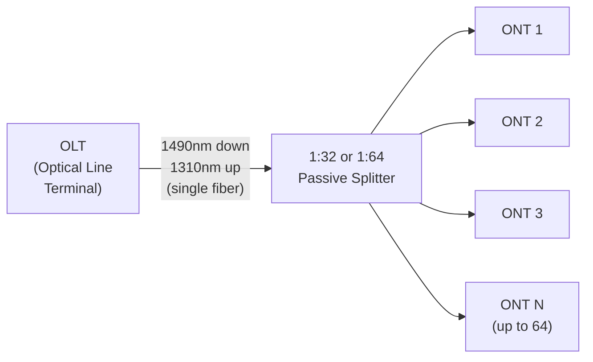
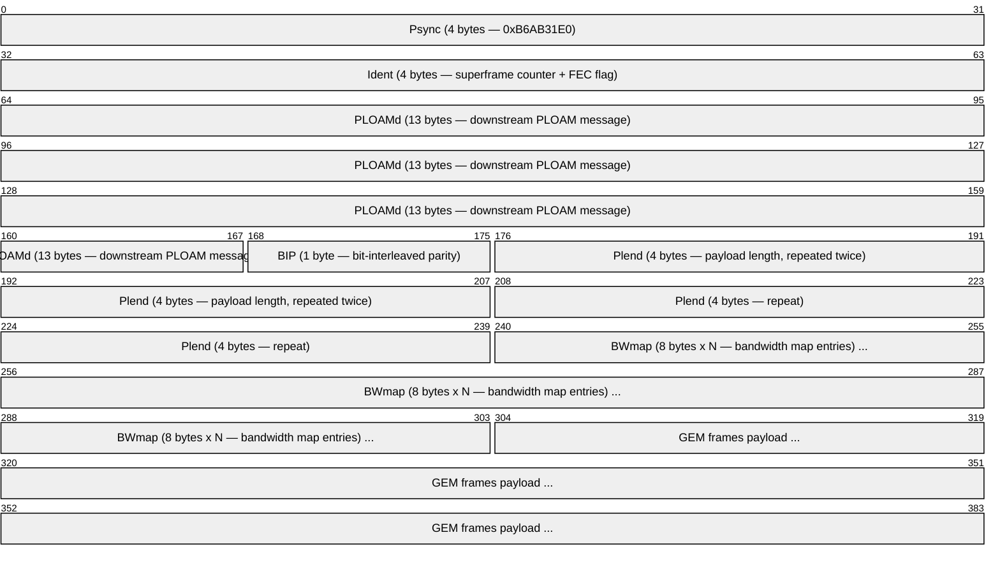
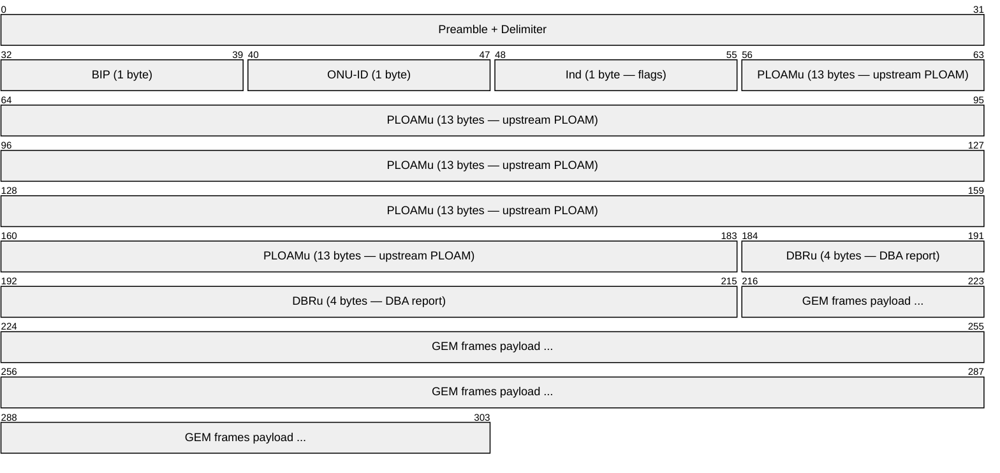
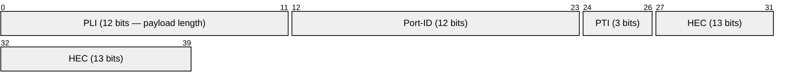
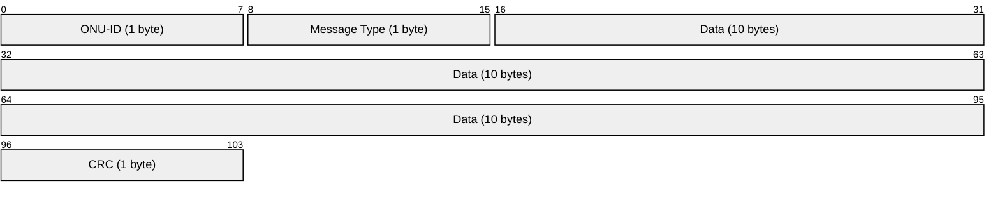
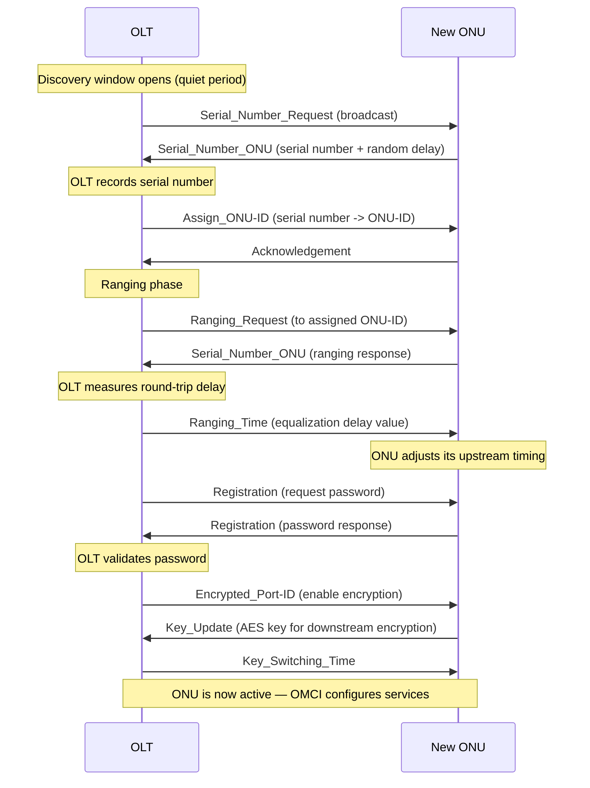

# GPON / XGS-PON (Gigabit Passive Optical Network)

> **Standard:** [ITU-T G.984](https://www.itu.int/rec/T-REC-G.984.1) | **Layer:** Physical + Data Link (Layers 1-2) | **Wireshark filter:** `gpon`

GPON is the dominant fiber-to-the-premises (FTTP) technology, delivering gigabit broadband over a point-to-multipoint passive optical network. A single fiber from an OLT (Optical Line Terminal) at the central office reaches up to 64 subscribers via passive splitters, with each subscriber connected through an ONT/ONU (Optical Network Terminal/Unit). GPON uses wavelength-division multiplexing to separate downstream (1490nm) and upstream (1310nm) traffic on the same fiber. XGS-PON (G.9807) is the 10G symmetric successor, coexisting on the same infrastructure using different wavelengths.

## Architecture

| Parameter | GPON (G.984) | XGS-PON (G.9807) |
|-----------|-------------|-------------------|
| Downstream rate | 2.488 Gbps | 9.953 Gbps |
| Upstream rate | 1.244 Gbps | 9.953 Gbps |
| Downstream wavelength | 1490 nm | 1577 nm |
| Upstream wavelength | 1310 nm | 1270 nm |
| Split ratio | 1:32 / 1:64 | 1:32 / 1:64 |
| Max reach | 20 km (up to 60 km with extenders) | 20 km |
| Encryption | AES-128 (downstream) | AES-256 |
| Frame period | 125 us | 125 us |

## GTC Downstream Frame

The GTC (GPON Transmission Convergence) layer organizes data into 125 us frames. Downstream frames are broadcast to all ONTs; each ONT filters by its Alloc-ID and GEM Port-ID.

### PCBd (Physical Control Block downstream) Fields

| Field | Size | Description |
|-------|------|-------------|
| Psync | 4 bytes | Fixed pattern `0xB6AB31E0` for frame synchronization |
| Ident | 4 bytes | Superframe counter (30 bits) + FEC indicator (1 bit) + reserved |
| PLOAMd | 13 bytes | Downstream PLOAM (Physical Layer OAM) message |
| BIP | 1 byte | Bit-interleaved parity over previous frame (error monitoring) |
| Plend | 4 bytes x 2 | Payload length and BWmap length (transmitted twice for reliability) |
| BWmap | 8 bytes x N | Bandwidth map: upstream timeslot allocations for each ONU |

### BWmap Entry

Each BWmap entry grants an ONU a specific upstream transmission window:

| Field | Size | Description |
|-------|------|-------------|
| Alloc-ID | 12 bits | T-CONT allocation identifier |
| Flags | 12 bits | PLOAMu flag, FEC, send DBRu |
| StartTime | 16 bits | Start of upstream burst (in bytes, from frame start) |
| StopTime | 16 bits | End of upstream burst |
| CRC | 8 bits | CRC-8 over the entry |

## GTC Upstream Frame

Upstream uses TDMA: each ONU transmits in its assigned timeslot per the BWmap. Bursts from different ONUs are interleaved in the 125 us frame.

## GEM Header (GPON Encapsulation Method)

GEM encapsulates Ethernet frames, TDM traffic, and OMCI messages into GEM frames for transport over the PON:

### GEM Key Fields

| Field | Size | Description |
|-------|------|-------------|
| PLI | 12 bits | Payload Length Indicator (0-4095 bytes) |
| Port-ID | 12 bits | GEM port identifier — maps to a service flow (up to 4096 ports) |
| PTI | 3 bits | Payload Type Indicator |
| HEC | 13 bits | Header Error Control (BCH code + parity — corrects 2-bit errors) |

### PTI Values

| PTI | Meaning |
|-----|---------|
| 000 | User data, not end of fragment |
| 001 | User data, end of fragment |
| 010 | OAM (OMCI) |
| 100 | GEM idle frame |

GEM can fragment large Ethernet frames across multiple GEM frames, and multiple small frames can share a single GEM payload through multiplexing.

## PLOAM Messages (Physical Layer OAM)

PLOAM messages carry control-plane signaling between OLT and ONUs. Each message is 13 bytes:

### Key PLOAM Messages

| Message | Direction | Description |
|---------|-----------|-------------|
| Upstream_Overhead | OLT -> ONU | Configures preamble, delimiter, burst profile |
| Assign_ONU-ID | OLT -> ONU | Assigns ONU-ID after serial number match |
| Ranging_Time | OLT -> ONU | Sets equalization delay for ONU time alignment |
| Serial_Number_Request | OLT -> all | Requests serial numbers during discovery |
| Serial_Number_ONU | ONU -> OLT | ONU responds with its serial number |
| Registration | OLT -> ONU | Requests password for authentication |
| Key_Update | ONU -> OLT | Sends new AES encryption key |
| Deactivate_ONU-ID | OLT -> ONU | Deactivates an ONU |
| Encrypted_Port-ID | OLT -> ONU | Enables/disables encryption on a GEM port |
| Physical_Equipment_Error | ONU -> OLT | Reports hardware failure |

## ONU Activation (Discovery and Ranging)

## DBA (Dynamic Bandwidth Allocation)

The OLT dynamically allocates upstream bandwidth to ONUs based on traffic demand. Each ONU has one or more T-CONTs (Transmission Containers) representing traffic queues:

### T-CONT Types

| Type | Priority | Behavior | Use Case |
|------|----------|----------|----------|
| T-CONT 1 | Highest | Fixed bandwidth — guaranteed, always allocated | Voice (TDM), real-time |
| T-CONT 2 | High | Assured bandwidth — guaranteed rate, may burst | Video, premium data |
| T-CONT 3 | Medium | Assured + non-assured — guaranteed minimum, best-effort surplus | Business data |
| T-CONT 4 | Low | Best-effort only — no guarantee | Residential internet |
| T-CONT 5 | Mixed | Combination of all types in one container | Mixed services |

### DBA Methods

| Method | Mechanism | Latency |
|--------|-----------|---------|
| Status Reporting (SR-DBA) | ONU sends DBRu (buffer occupancy report) to OLT | Higher (report + grant cycle) |
| Traffic Monitoring (TM-DBA) | OLT infers demand from idle GEM frames | Lower (no report needed) |
| Hybrid | Combines SR-DBA and TM-DBA | Balanced |

## OMCI (ONT Management and Control Interface)

OMCI runs over a dedicated GEM port (typically Port-ID 65535) and manages ONT configuration:

| Managed Entity | Purpose |
|---------------|---------|
| GEM Port Network CTP | GEM port configuration |
| MAC Bridge Port Config | Bridge port mapping |
| VLAN Tagging Filter | VLAN filtering rules |
| T-CONT | Upstream bandwidth container |
| Traffic Descriptor | QoS profile (CIR/PIR) |
| IP Host Config | ONT management IP |
| PPTP Ethernet UNI | Physical Ethernet port |
| Extended VLAN Tagging | Complex VLAN operations (translate, add, remove) |

OMCI uses a request/response model: the OLT sends Get/Set/Create/Delete operations on Managed Entities, and the ONT responds with results.

## XGS-PON Differences

| Feature | GPON (G.984) | XGS-PON (G.9807) |
|---------|-------------|-------------------|
| Downstream rate | 2.488 Gbps | 9.953 Gbps |
| Upstream rate | 1.244 Gbps | 9.953 Gbps |
| Downstream wavelength | 1490 nm | 1577 nm |
| Upstream wavelength | 1310 nm | 1270 nm |
| Encapsulation | GEM (5-byte header) | XGEM (variable, 8-byte header) |
| Framing | GTC | XGTC (larger BWmap, flexible burst profiles) |
| Encryption | AES-128 | AES-256 |
| FEC | RS(255,239) optional | RS(248,216) mandatory downstream |
| PLOAM | 13 bytes | 48 bytes (larger, more message types) |
| ONU activation | Serial number + password | + mutual authentication (OMCI-based) |

## GPON Security

| Mechanism | Direction | Description |
|-----------|-----------|-------------|
| AES-128 encryption (GPON) | Downstream | ONU generates key, sends to OLT via PLOAM |
| AES-256 encryption (XGS-PON) | Downstream | Enhanced encryption with key exchange |
| Password authentication | Upstream | ONU sends password during registration |
| Serial number verification | Both | Each ONU has unique vendor-assigned serial |
| Port-ID filtering | Downstream | ONUs only process GEM frames matching their ports |

**Note:** GPON upstream traffic is inherently isolated by TDMA (each ONU can only transmit in its allocated window), but upstream is **not encrypted** by default. A compromised ONU could potentially sniff downstream broadcast traffic for other ONUs if encryption is disabled.

## Wavelength Coexistence

GPON and XGS-PON can coexist on the same fiber using a Coexistence Element (CEx) or WDM filter:

| Technology | Downstream | Upstream |
|-----------|-----------|----------|
| GPON | 1490 nm | 1310 nm |
| XGS-PON | 1577 nm | 1270 nm |
| RF Video overlay | 1550 nm | N/A |

This allows operators to incrementally upgrade subscribers from GPON to XGS-PON without replacing the fiber or splitters.

## PON Technology Comparison

| Feature | GPON | XGS-PON | EPON (1G) | 10G-EPON |
|---------|------|---------|-----------|----------|
| Standard | ITU-T G.984 | ITU-T G.9807 | IEEE 802.3ah | IEEE 802.3av |
| DS / US rate | 2.5G / 1.2G | 10G / 10G | 1G / 1G | 10G / 10G |
| Encapsulation | GEM | XGEM | Native Ethernet | Native Ethernet |
| Max split | 1:64 | 1:64 | 1:32 | 1:32 |
| Frame period | 125 us | 125 us | Variable | Variable |
| DBA mechanism | BWmap + T-CONT | BWmap + T-CONT | MPCP GATE/REPORT | MPCP |
| Management | OMCI | OMCI | OAM (802.3ah) | OAM |
| Primary market | Worldwide | Worldwide | Asia (Japan, China) | Asia, cable |

## Standards

| Document | Title |
|----------|-------|
| [ITU-T G.984.1](https://www.itu.int/rec/T-REC-G.984.1) | GPON — General characteristics |
| [ITU-T G.984.2](https://www.itu.int/rec/T-REC-G.984.2) | GPON — Physical media dependent layer |
| [ITU-T G.984.3](https://www.itu.int/rec/T-REC-G.984.3) | GPON — Transmission convergence layer (GTC) |
| [ITU-T G.984.4](https://www.itu.int/rec/T-REC-G.984.4) | GPON — ONT management and control interface (OMCI) |
| [ITU-T G.9807.1](https://www.itu.int/rec/T-REC-G.9807.1) | XGS-PON — 10-Gigabit-capable symmetric PON |
| [ITU-T G.988](https://www.itu.int/rec/T-REC-G.988) | ONU management and control interface (OMCI) specification |
| [ITU-T G.987](https://www.itu.int/rec/T-REC-G.987) | XG-PON (10G asymmetric — predecessor to XGS-PON) |

## See Also

- [EPON](epon.md) — IEEE-based passive optical network (Ethernet-native)
- [50G-PON / NG-PON2](pon_50g.md) — next-generation PON technologies
- [Ethernet](../link-layer/ethernet.md) — carried as payload inside GEM frames
- [PPP](../link-layer/ppp.md) — PPPoE often used over GPON for subscriber access
- [TR-069 / TR-369](../monitoring/tr069.md) — remote management of ONTs
- [VLAN (802.1Q)](../link-layer/vlan8021q.md) — VLAN tagging configured via OMCI
