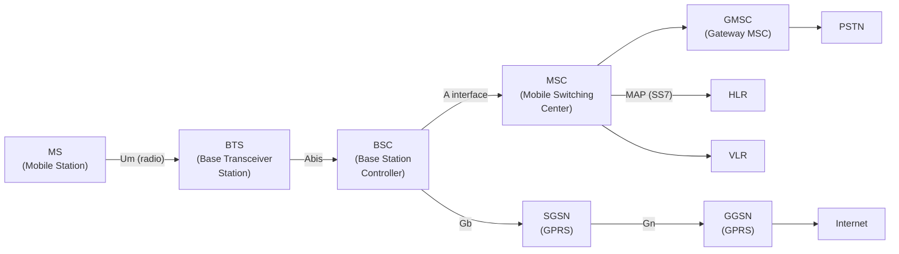
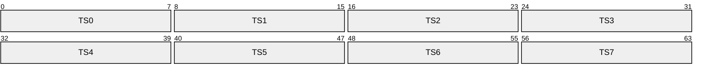
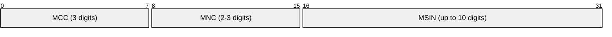
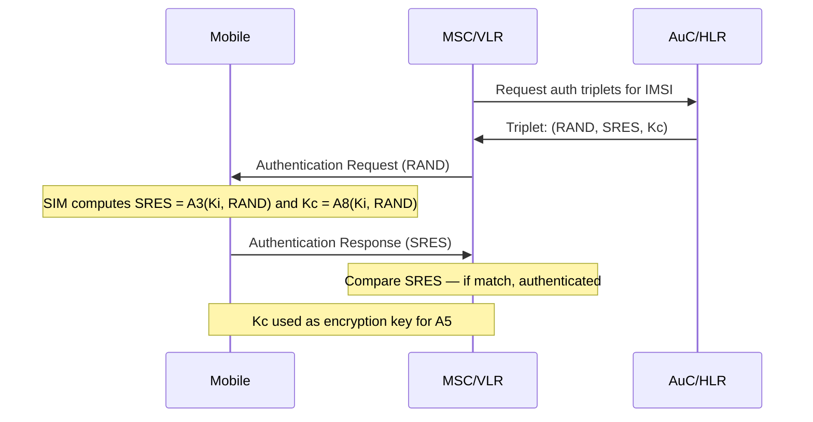
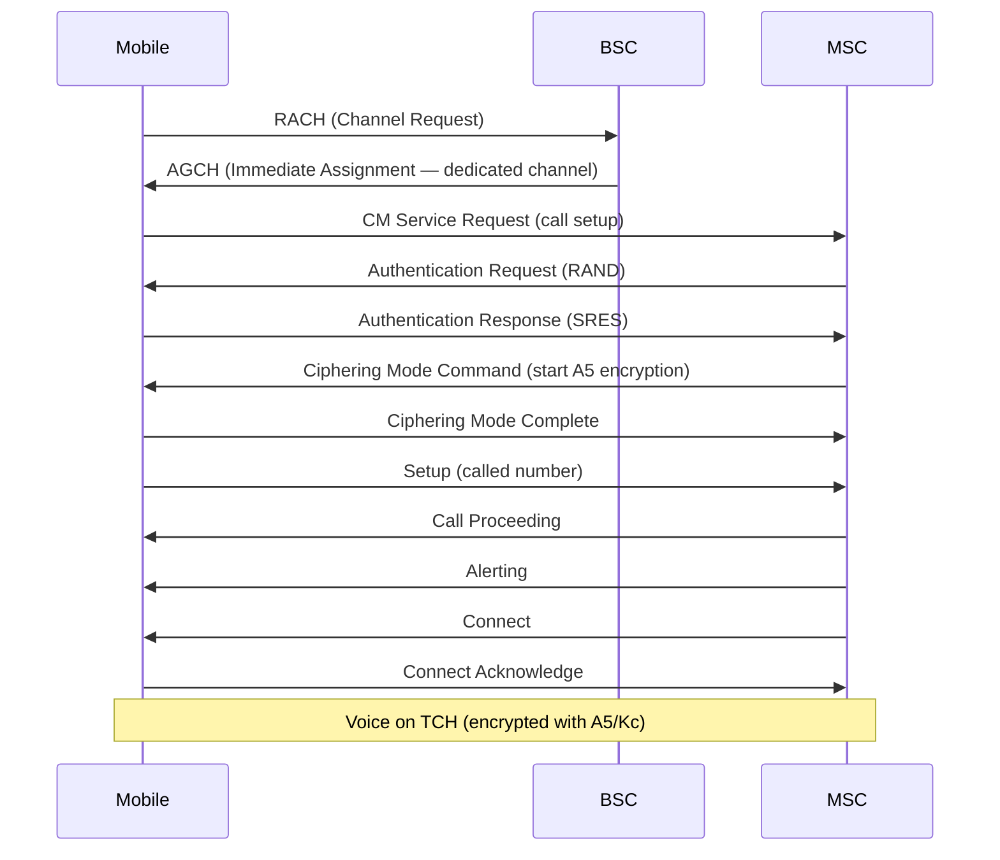

# GSM (Global System for Mobile Communications)

> **Standard:** [3GPP TS 05 series (GSM)](https://www.3gpp.org/specifications-technologies/releases) | **Layer:** Full stack (Physical through Application) | **Wireshark filter:** `gsm_a` or `gsm_map` or `lapdm`

GSM is the second-generation (2G) digital cellular standard that replaced analog mobile networks in the 1990s and became the most widely deployed mobile technology in history (billions of subscribers). It defines the radio interface (TDMA-based), core network architecture (MSC, HLR, VLR), signaling (MAP over SS7), and security (A5 encryption, SIM-based authentication). While voice is being sunset, GSM's architecture and concepts (SIM cards, IMSI, roaming) carry through to LTE and 5G.

## Architecture

### Network Elements

| Element | Full Name | Role |
|---------|-----------|------|
| MS | Mobile Station | Handset + SIM |
| BTS | Base Transceiver Station | Radio tower |
| BSC | Base Station Controller | Manages multiple BTS, handover |
| MSC | Mobile Switching Center | Call routing, auth, handover |
| HLR | Home Location Register | Subscriber database (master) |
| VLR | Visitor Location Register | Temporary subscriber data (current MSC) |
| AuC | Authentication Center | Generates auth triplets |
| EIR | Equipment Identity Register | IMEI blacklist |
| SMSC | Short Message Service Center | SMS store-and-forward |
| SGSN | Serving GPRS Support Node | Packet data (2.5G GPRS) |
| GGSN | Gateway GPRS Support Node | Internet gateway (GPRS) |

## Radio Interface (Um)

| Parameter | Value |
|-----------|-------|
| Frequency bands | 850, 900, 1800, 1900 MHz |
| Access method | TDMA (Time Division Multiple Access) |
| Timeslots per carrier | 8 |
| Channel bandwidth | 200 kHz |
| Modulation | GMSK (Gaussian Minimum Shift Keying) |
| Frame duration | 4.615 ms |
| Data rate (voice) | 13 kbps (full rate), 5.6 kbps (half rate) |
| Data rate (GPRS) | Up to 171.2 kbps (8 timeslots, CS-4) |
| Data rate (EDGE) | Up to 473.6 kbps (8 timeslots, MCS-9) |

### TDMA Frame

Each timeslot = 577 µs. 8 timeslots = 1 TDMA frame (4.615 ms). Each timeslot carries one normal burst of 148 bits.

### Channel Types

| Channel | Direction | Purpose |
|---------|-----------|---------|
| TCH | Both | Traffic Channel (voice/data) |
| BCCH | Downlink | Broadcast Control (cell info, frequency list) |
| CCCH (PCH, AGCH, RACH) | Both | Common Control (paging, access grant, random access) |
| SDCCH | Both | Standalone Dedicated Control (SMS, location update) |
| SACCH | Both | Slow Associated Control (measurements, timing advance) |
| FACCH | Both | Fast Associated Control (handover commands, replaces TCH) |

## Identifiers

| Identifier | Full Name | Description |
|-----------|-----------|-------------|
| IMSI | International Mobile Subscriber Identity | Unique subscriber ID on SIM (MCC+MNC+MSIN) |
| TMSI | Temporary Mobile Subscriber Identity | Temporary ID assigned by VLR (privacy) |
| IMEI | International Mobile Equipment Identity | Unique handset ID (15 digits) |
| MSISDN | Mobile Subscriber ISDN Number | Phone number (E.164) |
| LAI | Location Area Identity | MCC+MNC+LAC (tracks subscriber location) |
| Cell ID | Cell Identifier | Individual cell within a location area |

### IMSI Structure

| Field | Description | Example |
|-------|-------------|---------|
| MCC | Mobile Country Code | 310 (USA), 234 (UK) |
| MNC | Mobile Network Code | 410 (AT&T), 15 (Vodafone) |
| MSIN | Mobile Subscriber Identification Number | Unique within the operator |

## Authentication

GSM uses challenge-response authentication based on a shared secret (Ki) stored on the SIM and in the AuC:

### Security Algorithms

| Algorithm | Purpose | Notes |
|-----------|---------|-------|
| A3 | Authentication (SRES generation) | On SIM card |
| A5/1 | Encryption (strong) | Used in most networks |
| A5/2 | Encryption (weak, export version) | **Broken — deprecated** |
| A5/3 (KASUMI) | Encryption (3G-strength for 2G) | Upgrade path |
| A8 | Key generation (Kc from Ki+RAND) | On SIM card |

## Call Setup

## GSM Evolution

| Generation | Technology | Data Rate | Standard |
|-----------|-----------|-----------|----------|
| 2G GSM | Circuit-switched voice + SMS | 9.6 kbps CSD | 3GPP Release 97/98 |
| 2.5G GPRS | Packet-switched data overlay | 171 kbps | 3GPP Release 97 |
| 2.75G EDGE | Enhanced GPRS (8PSK modulation) | 474 kbps | 3GPP Release 4 |
| 3G UMTS | W-CDMA, new radio interface | 384 kbps - 2 Mbps | 3GPP Release 99 |
| 3.5G HSPA | High-Speed Packet Access | 14.4 Mbps DL | 3GPP Release 5/6 |
| 4G LTE | OFDMA, all-IP | 150 Mbps+ | 3GPP Release 8 |

## Standards

| Document | Title |
|----------|-------|
| [3GPP TS 05.01](https://www.3gpp.org/) | Physical layer on the radio path |
| [3GPP TS 04.08](https://www.3gpp.org/) | Mobile radio interface layer 3 (call control, mobility) |
| [3GPP TS 03.20](https://www.3gpp.org/) | Security-related network functions |
| [3GPP TS 09.02](https://www.3gpp.org/) | MAP specification (SS7 signaling) |

## See Also

- [LTE](lte.md) — 4G successor
- [5G NR](5gnr.md) — 5G successor
- [SS7](ss7.md) — signaling network GSM uses
- [ISDN](isdn.md) — MSC uses ISUP for PSTN interworking
- [T1](t1.md) / [E1](e1.md) — backhaul between BTS and BSC
