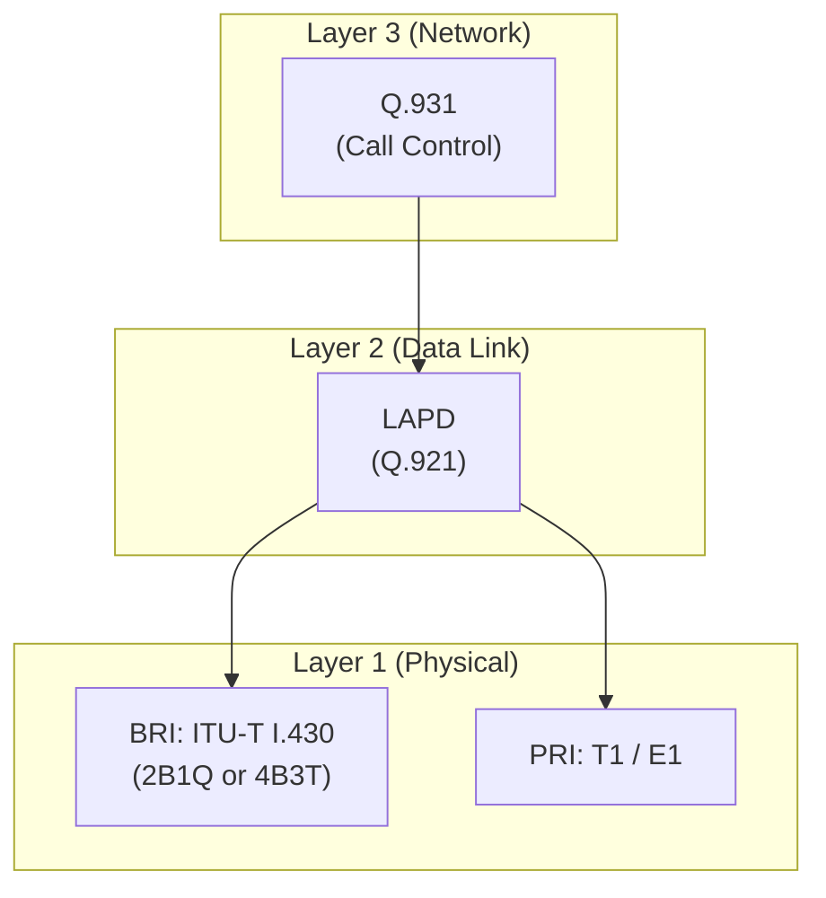
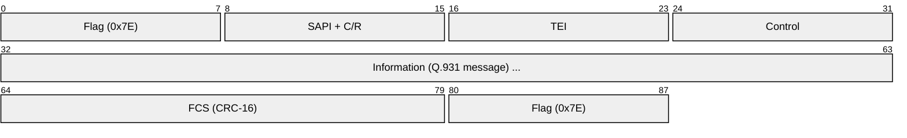
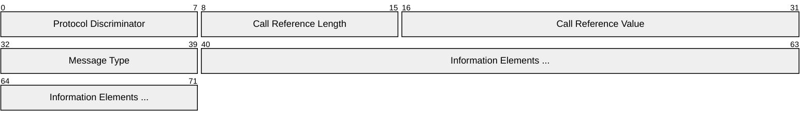
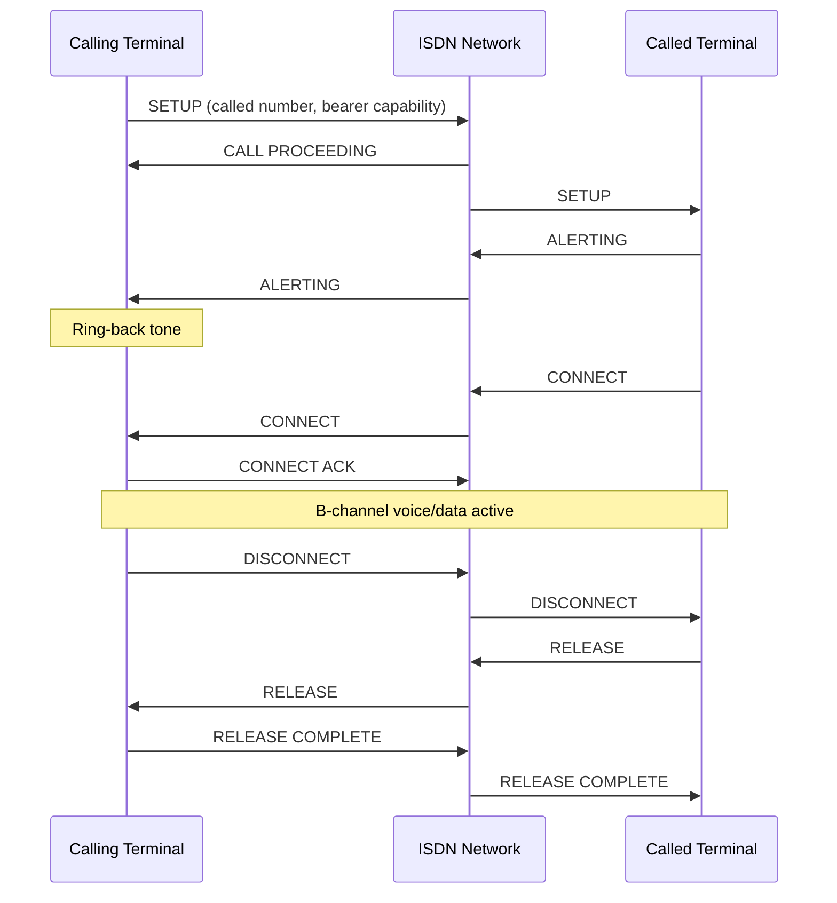
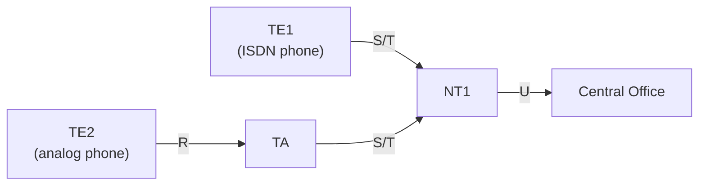

# ISDN (Integrated Services Digital Network)

> **Standard:** [ITU-T I-series / Q.920-Q.931](https://www.itu.int/rec/T-REC-Q.931) | **Layer:** Physical / Data Link / Network (Layers 1-3) | **Wireshark filter:** `isdn` or `q931`

ISDN is a set of standards for digital transmission of voice, data, and signaling over the traditional telephone network. It replaced analog signaling with digital end-to-end connectivity, offering faster call setup, caller ID, and multiple simultaneous channels on a single line. ISDN defines two service levels: Basic Rate Interface (BRI) for homes/small offices and Primary Rate Interface (PRI) for enterprises/carriers. While largely superseded by VoIP, ISDN PRI remains widely deployed in enterprise PBX systems and as a carrier interconnect.

## Interface Types

| Interface | Channels | Total Bandwidth | Usage |
|-----------|----------|-----------------|-------|
| BRI (2B+D) | 2 × 64 kbps B + 1 × 16 kbps D | 144 kbps (192 kbps gross) | Residential, small office |
| PRI (T1) | 23 × 64 kbps B + 1 × 64 kbps D | 1.544 Mbps | Enterprise (North America/Japan) |
| PRI (E1) | 30 × 64 kbps B + 1 × 64 kbps D | 2.048 Mbps | Enterprise (international) |

### Channel Types

| Channel | Rate | Purpose |
|---------|------|---------|
| B (Bearer) | 64 kbps | Voice or data payload |
| D (Delta) | 16 kbps (BRI) / 64 kbps (PRI) | Signaling (Q.931) and packet data |
| H0 | 384 kbps | 6 × B channels bonded |
| H11 | 1536 kbps | 24 × B channels (full T1) |
| H12 | 1920 kbps | 30 × B channels (full E1) |

## Protocol Stack

## LAPD Frame (Q.921 — Layer 2)

| Field | Size | Description |
|-------|------|-------------|
| Flag | 8 bits | HDLC frame delimiter `0x7E` |
| SAPI | 6 bits | Service Access Point Identifier |
| C/R | 1 bit | Command/Response |
| TEI | 7 bits | Terminal Endpoint Identifier (0-63 non-auto, 64-126 auto, 127 broadcast) |
| Control | 8-16 bits | Frame type (I, S, or U frame) |
| Information | Variable | Q.931 message payload |
| FCS | 16 bits | Frame Check Sequence (CRC-16) |

### SAPI Values

| SAPI | Purpose |
|------|---------|
| 0 | Q.931 call control signaling |
| 16 | X.25 packet data |
| 63 | LAPD management |

## Q.931 Message (Layer 3)

| Field | Size | Description |
|-------|------|-------------|
| Protocol Discriminator | 8 bits | Always 0x08 for Q.931 |
| Call Reference Length | 8 bits | Length of call reference value (1-2 bytes) |
| Call Reference Value | 8-16 bits | Identifies the call this message relates to |
| Message Type | 8 bits | The Q.931 message type |
| Information Elements | Variable | Parameters for the message |

### Q.931 Message Types

| Type | Name | Direction | Description |
|------|------|-----------|-------------|
| 0x05 | SETUP | Either | Initiate a call |
| 0x07 | CONNECT | Called → Calling | Call answered |
| 0x0F | CONNECT ACK | Calling → Called | Acknowledge answer |
| 0x02 | CALL PROCEEDING | Network → User | Call is being routed |
| 0x01 | ALERTING | Called → Calling | Called party is ringing |
| 0x45 | DISCONNECT | Either | Initiate call clearing |
| 0x4D | RELEASE | Either | Release the call reference |
| 0x5A | RELEASE COMPLETE | Either | Call reference released |
| 0x03 | PROGRESS | Network → User | In-band information available |
| 0x20 | STATUS ENQUIRY | Either | Request status |
| 0x7D | STATUS | Either | Report current call state |

### Call Setup Flow

### Key Information Elements

| IE | Name | Description |
|----|------|-------------|
| 0x04 | Bearer Capability | Type of service (speech, data, video) |
| 0x14 | Date/Time | Current date and time |
| 0x18 | Channel Identification | B-channel to use |
| 0x1C | Facility | Supplementary service invocation |
| 0x1E | Progress Indicator | In-band information status |
| 0x28 | Display | Text to display (caller name, etc.) |
| 0x6C | Calling Party Number | Caller ID number and type |
| 0x70 | Called Party Number | Destination number |
| 0x74 | Redirecting Number | Original called number (on forwarding) |

## ISDN Reference Points

| Point | Between | Description |
|-------|---------|-------------|
| U | NT1 ↔ Network | Two-wire subscriber line (North America) |
| S/T | TE ↔ NT | Four-wire bus (up to 8 terminals on BRI) |
| R | TE2 ↔ TA | Non-ISDN device to terminal adapter |

## Standards

| Document | Title |
|----------|-------|
| [ITU-T Q.921](https://www.itu.int/rec/T-REC-Q.921) | LAPD — ISDN Data Link Layer |
| [ITU-T Q.931](https://www.itu.int/rec/T-REC-Q.931) | ISDN Call Control (Layer 3) |
| [ITU-T I.430](https://www.itu.int/rec/T-REC-I.430) | BRI Layer 1 specification |
| [ITU-T I.431](https://www.itu.int/rec/T-REC-I.431) | PRI Layer 1 specification |
| [ITU-T Q.932](https://www.itu.int/rec/T-REC-Q.932) | Generic procedures for supplementary services |

## See Also

- [SS7](ss7.md) — carrier signaling network (ISUP handles ISDN calls between switches)
- [T1](t1.md) — physical carrier for PRI in North America
- [E1](e1.md) — physical carrier for PRI internationally
- [SIP](../application-layer/sip.md) — VoIP successor to ISDN signaling
