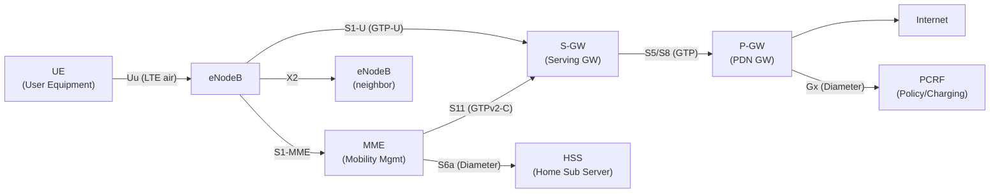
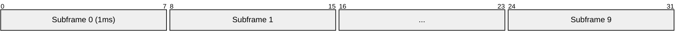
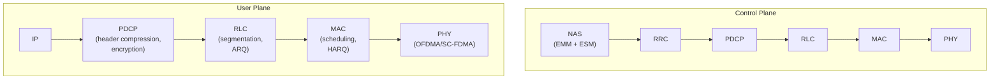
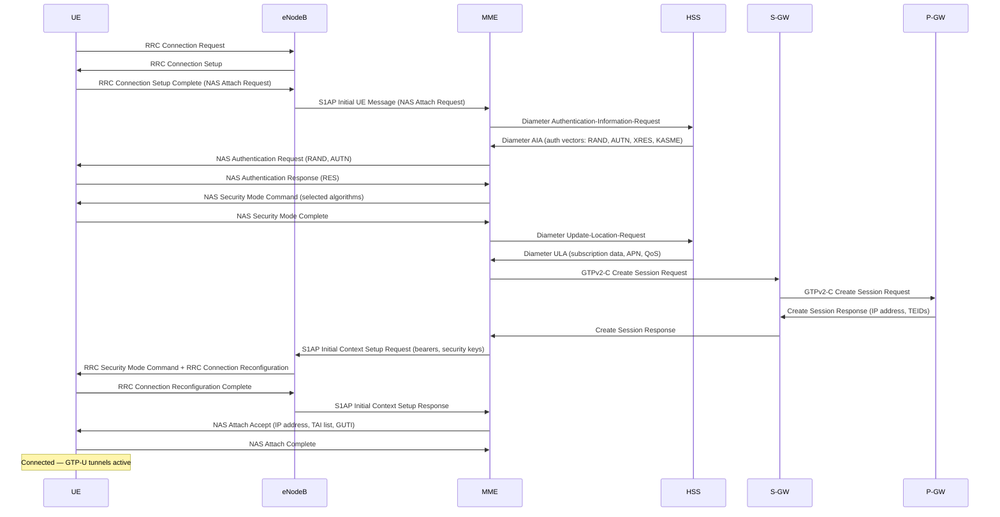
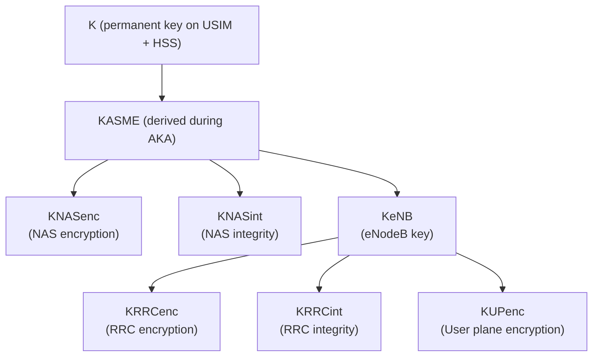

# LTE (Long Term Evolution — 4G)

> **Standard:** [3GPP TS 36 series](https://www.3gpp.org/specifications-technologies/releases) | **Layer:** Full stack | **Wireshark filter:** `lte_rrc` or `nas-eps` or `s1ap` or `diameter`

LTE is the fourth-generation (4G) mobile broadband standard, designed as an all-IP network with no circuit-switched voice (VoLTE uses SIP/IMS for voice over the data path). It uses OFDMA for the downlink and SC-FDMA for the uplink, achieving peak rates of 300 Mbps DL / 75 Mbps UL (LTE) and 3 Gbps DL (LTE-Advanced Pro). LTE's flat architecture eliminates legacy BSC/RNC controllers, connecting the eNodeB directly to the core network (EPC).

## Architecture (EPC — Evolved Packet Core)

### Core Network Elements

| Element | Full Name | Role |
|---------|-----------|------|
| eNodeB | Evolved NodeB | Base station (radio + some control) |
| MME | Mobility Management Entity | Signaling: attach, handover, paging, security |
| S-GW | Serving Gateway | User plane anchor for handover between eNodeBs |
| P-GW | PDN Gateway | Internet gateway, IP address allocation, policy |
| HSS | Home Subscriber Server | Subscriber database (replaces HLR) |
| PCRF | Policy and Charging Rules Function | QoS policies, charging rules |

### Interfaces

| Interface | Between | Protocol | Purpose |
|-----------|---------|----------|---------|
| Uu | UE ↔ eNodeB | LTE air interface | Radio access |
| S1-MME | eNodeB ↔ MME | S1AP (SCTP) | Control plane signaling |
| S1-U | eNodeB ↔ S-GW | GTP-U (UDP) | User data tunneling |
| S5/S8 | S-GW ↔ P-GW | GTP (C+U) | Inter-gateway tunneling |
| S6a | MME ↔ HSS | Diameter | Authentication, subscription data |
| S11 | MME ↔ S-GW | GTPv2-C | Session management |
| X2 | eNodeB ↔ eNodeB | X2AP (SCTP) | Handover, load balancing |
| Gx | P-GW ↔ PCRF | Diameter | Policy and charging control |
| SGi | P-GW ↔ Internet | IP | External data network |

## Radio Interface

| Parameter | Value |
|-----------|-------|
| Downlink access | OFDMA |
| Uplink access | SC-FDMA |
| Frequency bands | 700 MHz - 3.5 GHz (many bands) |
| Channel bandwidth | 1.4, 3, 5, 10, 15, 20 MHz |
| Subcarrier spacing | 15 kHz |
| Modulation | QPSK, 16-QAM, 64-QAM (256-QAM in Cat 11+) |
| MIMO | 2×2, 4×4 (up to 8×8 in LTE-A) |
| Peak DL rate | 300 Mbps (Cat 5), 3 Gbps (Cat 20, LTE-A Pro) |
| Peak UL rate | 75 Mbps (Cat 5), 1.5 Gbps (Cat 20) |
| Latency | ~10-20 ms (user plane) |
| Frame duration | 10 ms (20 slots of 0.5 ms) |

### Resource Grid

Each subframe = 2 slots = 1 ms. One radio frame = 10 subframes = 10 ms.

A **Resource Block** = 12 subcarriers × 1 slot (0.5 ms) = 84 resource elements (normal CP).

## Protocol Stack

### Layer Functions

| Layer | Function |
|-------|----------|
| NAS (Non-Access Stratum) | UE ↔ MME: attach, authentication, bearer setup, tracking area update |
| RRC (Radio Resource Control) | UE ↔ eNodeB: connection setup, measurement config, handover, RRC states |
| PDCP | Header compression (ROHC), ciphering, integrity (control plane) |
| RLC | Segmentation/reassembly, ARQ (AM mode), reordering |
| MAC | Scheduling (uplink grants, downlink assignments), HARQ, multiplexing |
| PHY | Modulation, coding, MIMO, OFDMA/SC-FDMA |

## Attach Procedure

## Security

| Algorithm | Purpose | Standard |
|-----------|---------|----------|
| AES (EEA2) | User/control plane encryption | Default |
| SNOW 3G (EEA1) | User/control plane encryption | Alternative |
| ZUC (EEA3) | User/control plane encryption | Chinese standard |
| AES-CMAC (EIA2) | Integrity protection | Default |
| KASME | Root key derived from AKA | Per-session |

### Key Hierarchy

## LTE Categories

| Category | Max DL | Max UL | MIMO | Year |
|----------|--------|--------|------|------|
| Cat 1 | 10 Mbps | 5 Mbps | 1×1 | 2009 |
| Cat 4 | 150 Mbps | 50 Mbps | 2×2 | 2009 |
| Cat 6 | 300 Mbps | 50 Mbps | 2×2 CA | 2013 |
| Cat 9 | 450 Mbps | 50 Mbps | 3CC CA | 2014 |
| Cat 12 | 600 Mbps | 100 Mbps | 4×4 MIMO | 2015 |
| Cat 16 | 1 Gbps | 150 Mbps | 4×4, 3CC | 2016 |
| Cat 20 | 2 Gbps | 316 Mbps | 8×8, 5CC | 2017 |
| Cat-M1 | 1 Mbps | 1 Mbps | 1×1 | IoT (eMTC) |
| Cat-NB1 | 0.026 Mbps | 0.066 Mbps | 1×1 | IoT (NB-IoT) |

## Standards

| Document | Title |
|----------|-------|
| [3GPP TS 36.300](https://www.3gpp.org/DynaReport/36300.htm) | E-UTRA / E-UTRAN overall description |
| [3GPP TS 36.331](https://www.3gpp.org/DynaReport/36331.htm) | RRC Protocol |
| [3GPP TS 24.301](https://www.3gpp.org/DynaReport/24301.htm) | NAS Protocol (EMM + ESM) |
| [3GPP TS 36.211](https://www.3gpp.org/DynaReport/36211.htm) | Physical channels and modulation |
| [3GPP TS 23.401](https://www.3gpp.org/DynaReport/23401.htm) | EPS architecture |

## See Also

- [GSM](gsm.md) — 2G predecessor
- [5G NR](5gnr.md) — 5G successor
- [GTP](../tunneling/gtp.md) — user plane tunneling
- [Diameter](../application-layer/diameter.md) — authentication and policy signaling
- [SIP](../application-layer/sip.md) — VoLTE voice calls
- [SS7](ss7.md) — legacy signaling (interworking via SGs)
