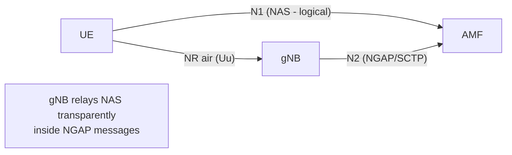
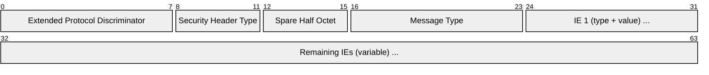
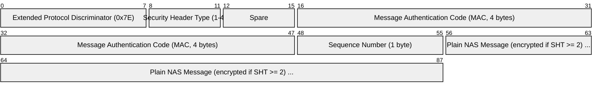
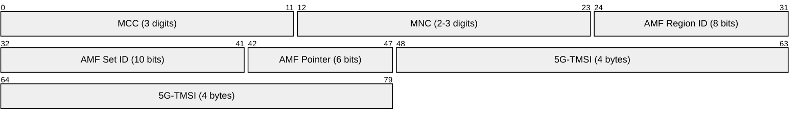
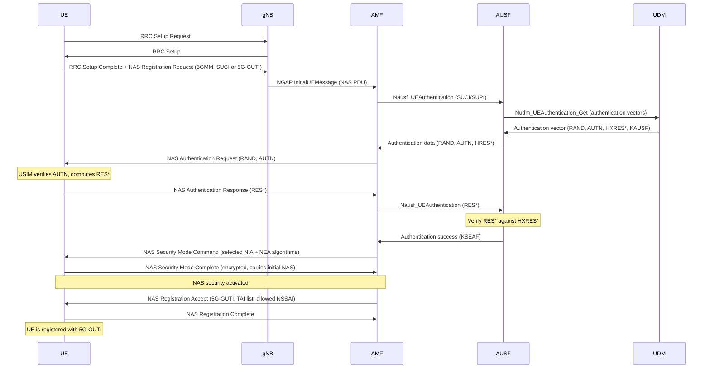
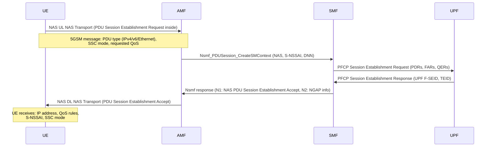

# 5G NAS (Non-Access Stratum)

> **Standard:** [3GPP TS 24.501](https://www.3gpp.org/DynaReport/24501.htm) | **Layer:** Application (NAS signaling) | **Wireshark filter:** `nas-5gs`

5G NAS is the signaling protocol between the UE and the AMF (Access and Mobility Management Function) for mobility management and session management in 5G networks. It operates on the N1 interface -- a logical connection where the gNB acts as a transparent relay, encapsulating NAS messages inside NGAP on the N2 interface. 5G NAS consists of two sub-protocols: 5GMM (5G Mobility Management) for registration, authentication, and security, and 5GSM (5G Session Management) for PDU session lifecycle. It replaces EMM/ESM from 4G LTE.

## Protocol Stack

The gNB does not interpret NAS messages -- it encapsulates them as opaque NAS PDU IEs within NGAP InitialUEMessage, DownlinkNASTransport, and UplinkNASTransport.

## NAS Message Header (Plain)

## Key Fields

| Field | Size | Description |
|-------|------|-------------|
| Extended Protocol Discriminator | 8 bits | 0x7E = 5GMM, 0x2E = 5GSM |
| Security Header Type | 4 bits | 0 = plain, 1 = integrity protected, 2 = integrity + ciphered, 3 = integrity + new security context, 4 = integrity + ciphered + new security context |
| Message Type | 8 bits | Identifies the specific NAS message |

### Extended Protocol Discriminator

| Value | Protocol |
|-------|----------|
| 0x7E | 5GS Mobility Management (5GMM) |
| 0x2E | 5GS Session Management (5GSM) |

## Security Protected NAS Message

After security is established, NAS messages are integrity-protected and optionally ciphered:

| Field | Size | Description |
|-------|------|-------------|
| MAC | 32 bits | Integrity check value computed over Sequence Number + NAS message |
| Sequence Number | 8 bits | NAS COUNT (mod 256) for replay protection |
| Plain NAS Message | Variable | The actual NAS message (encrypted with NEA if ciphered) |

### Security Algorithms

| Algorithm Type | ID 0 | ID 1 | ID 2 | ID 3 |
|----------------|-------|-------|-------|-------|
| NIA (integrity) | Null | 128-NIA1 (SNOW) | 128-NIA2 (AES) | 128-NIA3 (ZUC) |
| NEA (ciphering) | Null (NEA0) | 128-NEA1 (SNOW) | 128-NEA2 (AES) | 128-NEA3 (ZUC) |

## NAS vs AS (Access Stratum)

| Aspect | NAS (Non-Access Stratum) | AS (Access Stratum) |
|--------|--------------------------|---------------------|
| Endpoints | UE <-> AMF | UE <-> gNB |
| Protocol | 5G NAS (TS 24.501) | NR RRC (TS 38.331) |
| Scope | Mobility management, session management | Radio resource control, measurements |
| Security | NAS encryption + integrity (NEA/NIA) | PDCP encryption + integrity (AS keys) |
| Transparency | gNB cannot read NAS | gNB terminates AS |

## 5GMM Messages (Mobility Management)

### Registration

| Message Type | Value | Direction | Purpose |
|-------------|-------|-----------|---------|
| Registration Request | 0x41 | UE -> AMF | Request registration (initial, mobility, periodic, emergency) |
| Registration Accept | 0x42 | AMF -> UE | Registration successful (5G-GUTI, allowed NSSAI, TAI list) |
| Registration Complete | 0x43 | UE -> AMF | Acknowledge registration accept |
| Registration Reject | 0x44 | AMF -> UE | Registration denied (with 5GMM cause) |

### Authentication

| Message Type | Value | Direction | Purpose |
|-------------|-------|-----------|---------|
| Authentication Request | 0x56 | AMF -> UE | Send RAND + AUTN (5G-AKA) or EAP message |
| Authentication Response | 0x57 | UE -> AMF | Send RES* (5G-AKA) or EAP response |
| Authentication Failure | 0x59 | UE -> AMF | Authentication failed (sync failure, MAC failure) |
| Authentication Result | 0x5A | AMF -> UE | EAP success/failure |
| Authentication Reject | 0x58 | AMF -> UE | Reject (invalid credentials) |

### Security

| Message Type | Value | Direction | Purpose |
|-------------|-------|-----------|---------|
| Security Mode Command | 0x5D | AMF -> UE | Activate NAS security (selected algorithms, key set) |
| Security Mode Complete | 0x5E | UE -> AMF | Confirm security activation (carries encrypted Registration data) |
| Security Mode Reject | 0x5F | UE -> AMF | UE cannot comply with security request |

### Other 5GMM

| Message Type | Value | Direction | Purpose |
|-------------|-------|-----------|---------|
| Deregistration Request | 0x45 | Either | Detach from network |
| Deregistration Accept | 0x46 | Either | Confirm detach |
| Service Request | 0x4C | UE -> AMF | Request service (idle to connected, data, signaling) |
| Service Accept | 0x4E | AMF -> UE | Service granted |
| Service Reject | 0x4D | AMF -> UE | Service denied (with cause) |
| Configuration Update Command | 0x54 | AMF -> UE | Update GUTI, TAI list, NSSAI, LADN |
| Configuration Update Complete | 0x55 | UE -> AMF | Acknowledge configuration update |
| Identity Request | 0x5B | AMF -> UE | Request SUCI, SUPI, 5G-GUTI, IMEI |
| Identity Response | 0x5C | UE -> AMF | Provide requested identity |

## 5GSM Messages (Session Management)

| Message Type | Value | Direction | Purpose |
|-------------|-------|-----------|---------|
| PDU Session Establishment Request | 0xC1 | UE -> AMF -> SMF | Request new PDU session (PDU type, SSC mode) |
| PDU Session Establishment Accept | 0xC2 | SMF -> AMF -> UE | Session created (QoS rules, IP address, S-NSSAI) |
| PDU Session Establishment Reject | 0xC3 | SMF -> AMF -> UE | Session denied (with 5GSM cause) |
| PDU Session Modification Request | 0xC5 | Either | Modify existing session (QoS, rules) |
| PDU Session Modification Complete | 0xCA | UE -> SMF | Acknowledge modification |
| PDU Session Modification Reject | 0xC7 | Either | Modification denied |
| PDU Session Release Request | 0xC9 | UE -> SMF | Request session teardown |
| PDU Session Release Command | 0xCB | SMF -> UE | Network-initiated release |
| PDU Session Release Complete | 0xCC | UE -> SMF | Confirm release |
| PDU Session Authentication Command | 0xC5 | SMF -> UE | Secondary authentication for DN |
| PDU Session Authentication Complete | 0xC6 | UE -> SMF | Auth response for DN |

## Registration Types

| Type | Value | Description |
|------|-------|-------------|
| Initial Registration | 1 | First registration or after deregistration |
| Mobility Registration Update | 2 | Tracking Area Update equivalent (UE moved to new TA) |
| Periodic Registration Update | 3 | Periodic keepalive (like periodic TAU in LTE) |
| Emergency Registration | 4 | Emergency services without full credentials |

## 5G Identifiers

### 5G-GUTI (Globally Unique Temporary Identifier)

| Field | Size | Description |
|-------|------|-------------|
| MCC + MNC | 5-6 digits | PLMN identity (country + operator) |
| AMF Region ID | 8 bits | Identifies a region of AMFs |
| AMF Set ID | 10 bits | Identifies a set of AMFs within the region |
| AMF Pointer | 6 bits | Identifies a specific AMF within the set |
| 5G-TMSI | 32 bits | Temporary subscriber identity assigned by AMF |

The combination of AMF Region ID + AMF Set ID + AMF Pointer forms the GUAMI (Globally Unique AMF Identifier).

### Authentication Methods

| Method | Description |
|--------|-------------|
| 5G-AKA | Native 5G authentication (RAND, AUTN, RES*) using USIM |
| EAP-AKA' | Extensible Authentication Protocol variant (also USIM-based) |
| EAP-TLS | Certificate-based authentication (IoT, private networks) |

## Initial Registration Flow

## PDU Session Establishment Flow

## 5G NAS vs 4G NAS Comparison

| Feature | 5G NAS (5GMM/5GSM) | 4G NAS (EMM/ESM) |
|---------|---------------------|-------------------|
| Standard | 3GPP TS 24.501 | 3GPP TS 24.301 |
| Core network endpoint | AMF | MME |
| Protocol discriminator | 0x7E (5GMM), 0x2E (5GSM) | 0x07 (EMM), 0x02 (ESM) |
| Registration | Registration Request/Accept | Attach Request/Accept |
| Mobility update | Mobility Registration Update | Tracking Area Update |
| Session | PDU Session Establishment | PDN Connectivity + Activate Default Bearer |
| Session types | IPv4, IPv6, IPv4v6, Ethernet, Unstructured | IPv4, IPv6, IPv4v6 |
| Identity | SUCI (concealed SUPI), 5G-GUTI | IMSI (plain), GUTI |
| Privacy | SUPI concealment (ECIES encryption) | IMSI sent in clear (initial attach) |
| Authentication | 5G-AKA, EAP-AKA', EAP-TLS | EPS-AKA |
| Security algorithms | NEA0-3, NIA0-3 | EEA0-3, EIA0-3 |
| Network slicing | S-NSSAI in registration | Not supported |
| QoS model | Flow-based (QoS rules, QFI) | Bearer-based (EPS bearer, QCI) |

## Standards

| Document | Title |
|----------|-------|
| [3GPP TS 24.501](https://www.3gpp.org/DynaReport/24501.htm) | 5GMM and 5GSM NAS specification |
| [3GPP TS 33.501](https://www.3gpp.org/DynaReport/33501.htm) | 5G security architecture and procedures |
| [3GPP TS 24.301](https://www.3gpp.org/DynaReport/24301.htm) | 4G NAS (EMM/ESM) -- predecessor |
| [3GPP TS 23.003](https://www.3gpp.org/DynaReport/23003.htm) | Numbering, addressing, identification (SUPI, GUTI) |
| [3GPP TS 23.501](https://www.3gpp.org/DynaReport/23501.htm) | 5G system architecture |

## See Also

- [NGAP](ngap.md) -- N2 protocol that carries NAS messages between gNB and AMF
- [PFCP](pfcp.md) -- N4 user plane control (SMF programs UPF after PDU session setup)
- [GTP](../tunneling/gtp.md) -- user plane tunneling for PDU sessions
- [5G NR](5gnr.md) -- radio interface (Access Stratum)
- [LTE](lte.md) -- 4G predecessor (uses EMM/ESM NAS)
- [5G SBI](sbi.md) -- service-based interfaces between core NFs (AMF, AUSF, UDM, SMF)
