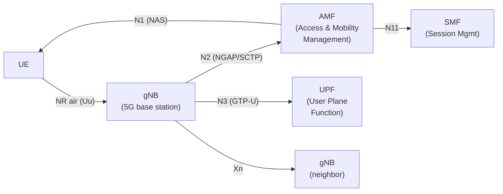
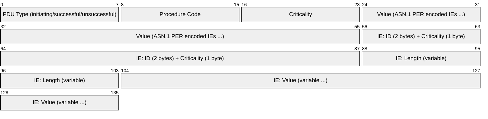
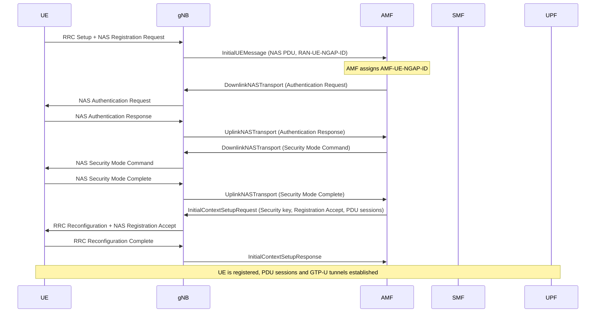
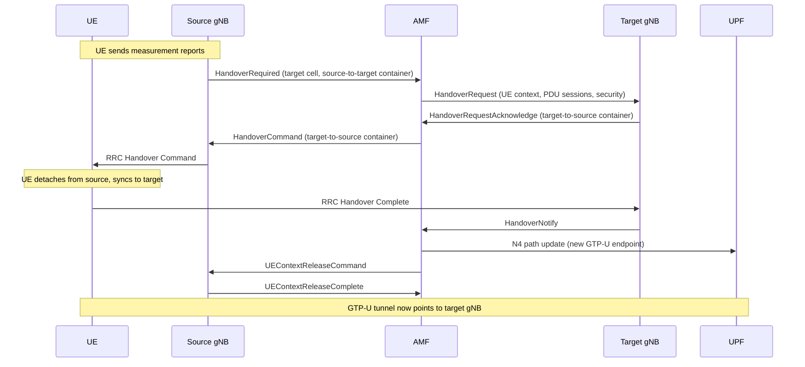

# NGAP (Next Generation Application Protocol)

> **Standard:** [3GPP TS 38.413](https://www.3gpp.org/DynaReport/38413.htm) | **Layer:** Application (signaling) | **Wireshark filter:** `ngap`

NGAP is the control plane protocol for the N2 interface between the gNB (5G base station) and the AMF (Access and Mobility Management Function) in the 5G Core. It replaces S1AP from 4G LTE and carries UE-associated and non-UE-associated signaling, including NAS message transport, UE context management, PDU session resource management, handover, and paging. NGAP runs over SCTP (multi-homed, multi-stream) and uses ASN.1 with Packed Encoding Rules (PER) for message encoding.

## 5G RAN Architecture (N2 Interface)

## NGAP PDU Structure

All NGAP messages are encoded as a single NGAP-PDU, which is one of three choices:

### PDU Types

| PDU Type | Description |
|----------|-------------|
| InitiatingMessage | Starts a procedure (request, indication, or command) |
| SuccessfulOutcome | Positive response to an InitiatingMessage |
| UnsuccessfulOutcome | Negative response (with cause) to an InitiatingMessage |

Each message contains a Procedure Code identifying the operation, a Criticality flag (reject, ignore, notify), and a sequence of Information Elements (IEs) encoded in ASN.1 PER.

## Key Fields

| Field | Size | Description |
|-------|------|-------------|
| Procedure Code | 8 bits | Identifies the NGAP procedure (e.g., 21 = NGSetup, 14 = InitialContextSetup) |
| Criticality | 2 bits | reject (0), ignore (1), notify (2) — how receiver handles unknown IEs |
| AMF-UE-NGAP-ID | 40 bits | AMF-assigned UE identifier for this NGAP association |
| RAN-UE-NGAP-ID | 32 bits | gNB-assigned UE identifier for this NGAP association |

### UE Context Identification

The pair (AMF-UE-NGAP-ID, RAN-UE-NGAP-ID) uniquely identifies a UE context on the N2 interface. The RAN side assigns the RAN-UE-NGAP-ID in the first uplink message (e.g., InitialUEMessage), and the AMF assigns the AMF-UE-NGAP-ID in its first response (e.g., InitialContextSetupRequest).

## NGAP Procedures

### Interface Management (Non-UE-Associated)

| Procedure | Direction | Purpose |
|-----------|-----------|---------|
| NG Setup | gNB -> AMF | Establish N2 association (exchange capabilities, PLMN, TAIs) |
| RAN Configuration Update | gNB -> AMF | gNB reports changed configuration (cells, TAIs) |
| AMF Configuration Update | AMF -> gNB | AMF reports changed GUAMI, PLMN list |
| NG Reset | Either | Reset all or selected UE contexts on N2 |
| Error Indication | Either | Report protocol errors |
| Overload Start/Stop | AMF -> gNB | AMF signals load control |
| AMF Status Indication | AMF -> gNB | AMF availability per GUAMI |

### UE Context Management

| Procedure | Direction | Purpose |
|-----------|-----------|---------|
| Initial UE Message | gNB -> AMF | First NAS message from UE (carries NAS PDU + establishment cause) |
| Downlink NAS Transport | AMF -> gNB | Deliver NAS message to UE |
| Uplink NAS Transport | gNB -> AMF | Forward NAS message from UE |
| Initial Context Setup | AMF -> gNB | Establish UE context (security, PDU sessions, UE capabilities) |
| UE Context Release (Command/Complete) | AMF -> gNB | Tear down UE context (idle, detach, failure) |
| UE Context Modification | AMF -> gNB | Update existing UE context |

### PDU Session Resource Management

| Procedure | Direction | Purpose |
|-----------|-----------|---------|
| PDU Session Resource Setup | AMF -> gNB | Establish PDU session resources (QoS flows, GTP-U tunnels) |
| PDU Session Resource Modify | AMF -> gNB | Modify existing PDU session QoS/tunnel parameters |
| PDU Session Resource Release | AMF -> gNB | Release PDU session resources |
| PDU Session Resource Notify | gNB -> AMF | gNB notifies of PDU session status changes |

### Mobility (Handover)

| Procedure | Direction | Purpose |
|-----------|-----------|---------|
| Handover Required | gNB -> AMF | Source gNB requests handover |
| Handover Command | AMF -> gNB | AMF instructs source gNB with target cell info |
| Handover Request | AMF -> gNB | AMF requests target gNB to prepare resources |
| Handover Request Acknowledge | gNB -> AMF | Target gNB confirms resources prepared |
| Handover Notify | gNB -> AMF | Target gNB confirms UE arrival |
| Handover Cancel | gNB -> AMF | Source gNB cancels in-progress handover |
| Path Switch Request | gNB -> AMF | Xn handover — new gNB requests path update |
| Paging | AMF -> gNB | Page idle UE in a Tracking Area |

## Initial Registration Flow (UE Attach)

## N2 Handover (Inter-gNB via AMF)

## NGAP vs S1AP Comparison

| Feature | NGAP (5G) | S1AP (4G LTE) |
|---------|-----------|---------------|
| Standard | 3GPP TS 38.413 | 3GPP TS 36.413 |
| Interface | N2 (gNB - AMF) | S1-MME (eNodeB - MME) |
| Transport | SCTP | SCTP |
| Encoding | ASN.1 PER | ASN.1 PER |
| UE ID (network side) | AMF-UE-NGAP-ID (40 bits) | MME-UE-S1AP-ID (32 bits) |
| UE ID (RAN side) | RAN-UE-NGAP-ID (32 bits) | eNB-UE-S1AP-ID (24 bits) |
| Session concept | PDU Session (multiple QoS flows) | EPS Bearer (one QoS per bearer) |
| QoS model | Flow-based (QFI per flow) | Bearer-based (QCI per bearer) |
| NAS transport | Carries 5G NAS (5GMM/5GSM) | Carries EPS NAS (EMM/ESM) |
| Network slicing | Supported (S-NSSAI in messages) | Not supported |
| Handover | N2 handover + Xn handover | S1 handover + X2 handover |
| AMF selection | Based on GUAMI, S-NSSAI | Based on GUMMEI |

## Standards

| Document | Title |
|----------|-------|
| [3GPP TS 38.413](https://www.3gpp.org/DynaReport/38413.htm) | NGAP specification |
| [3GPP TS 38.401](https://www.3gpp.org/DynaReport/38401.htm) | NG-RAN architecture |
| [3GPP TS 38.300](https://www.3gpp.org/DynaReport/38300.htm) | NR and NG-RAN overall description |
| [3GPP TS 23.501](https://www.3gpp.org/DynaReport/23501.htm) | 5G system architecture |
| [3GPP TS 36.413](https://www.3gpp.org/DynaReport/36413.htm) | S1AP (4G predecessor) |

## See Also

- [NAS 5G](nas5g.md) -- 5G Non-Access Stratum (carried inside NGAP)
- [PFCP](pfcp.md) -- Packet Forwarding Control Protocol (N4 user plane control)
- [GTP](../tunneling/gtp.md) -- GPRS Tunneling Protocol (user plane tunnels on N3/N9)
- [SCTP](../transport-layer/sctp.md) -- transport for NGAP
- [5G NR](5gnr.md) -- 5G New Radio (air interface)
- [LTE](lte.md) -- 4G predecessor (uses S1AP)
- [Diameter](diameter.md) -- AAA protocol (used alongside NGAP in 4G, replaced by SBI in 5G)
