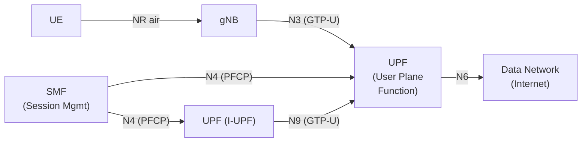
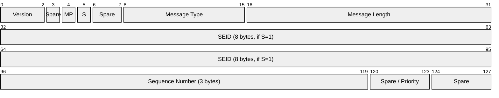
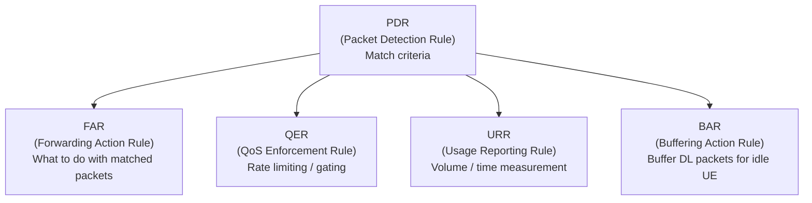
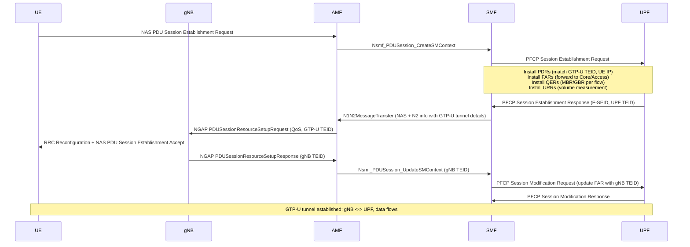
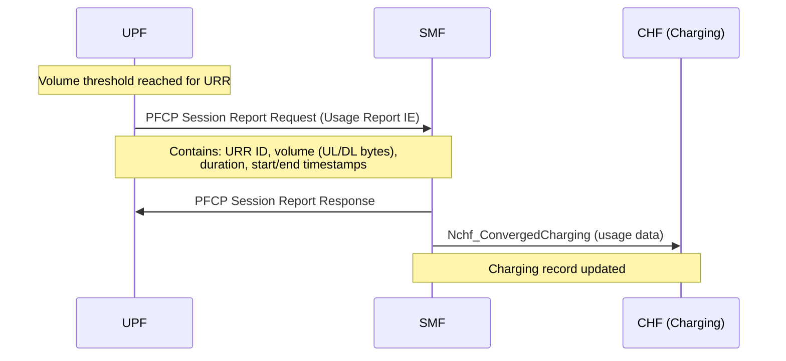

# PFCP (Packet Forwarding Control Protocol)

> **Standard:** [3GPP TS 29.244](https://www.3gpp.org/DynaReport/29244.htm) | **Layer:** Application (user plane control) | **Wireshark filter:** `pfcp`

PFCP is the control protocol for the N4 interface between the SMF (Session Management Function) and UPF (User Plane Function) in the 5G Core. It separates user plane forwarding from control plane logic, allowing the SMF to install packet detection, forwarding, QoS, and usage reporting rules on the UPF. PFCP also applies to 4G EPC with CUPS (Control and User Plane Separation), operating between SGW-C/SGW-U and PGW-C/PGW-U. It runs over UDP port 8805.

## 5G User Plane Architecture

## PFCP Header

## Key Fields

| Field | Size | Description |
|-------|------|-------------|
| Version | 3 bits | PFCP version (currently 1) |
| MP | 1 bit | Message Priority present (for node-related messages) |
| S | 1 bit | SEID flag -- 1 = SEID field present (session messages) |
| Message Type | 8 bits | Identifies the PFCP message |
| Message Length | 16 bits | Length of payload after this field (excludes first 4 bytes) |
| SEID | 64 bits | Session Endpoint Identifier -- identifies a PFCP session |
| Sequence Number | 24 bits | Matches requests to responses |

### SEID

The SEID (Session Endpoint Identifier) uniquely identifies a PFCP session at each endpoint (SMF and UPF). Each side assigns its own SEID during Session Establishment, similar to how GTP uses TEIDs. Node-level messages (heartbeat, association) do not carry a SEID (S=0).

## Message Types

### Node-Level Messages (S=0, no SEID)

| Type | Name | Direction | Purpose |
|------|------|-----------|---------|
| 1 | Heartbeat Request | Either | Path keepalive |
| 2 | Heartbeat Response | Either | Keepalive reply (includes Recovery Timestamp) |
| 5 | Association Setup Request | Either | Establish PFCP association (capabilities, features) |
| 6 | Association Setup Response | Either | Confirm association |
| 7 | Association Update Request | Either | Update association parameters |
| 8 | Association Update Response | Either | Confirm update |
| 9 | Association Release Request | Either | Tear down association |
| 10 | Association Release Response | Either | Confirm release |
| 12 | Node Report Request | UPF -> SMF | UPF reports node-level events (user plane path failure) |
| 13 | Node Report Response | SMF -> UPF | Acknowledge node report |

### Session-Level Messages (S=1, with SEID)

| Type | Name | Direction | Purpose |
|------|------|-----------|---------|
| 50 | Session Establishment Request | SMF -> UPF | Create a new PFCP session (install PDRs, FARs, QERs, URRs) |
| 51 | Session Establishment Response | UPF -> SMF | Confirm with F-SEID, created resources |
| 52 | Session Modification Request | SMF -> UPF | Update rules in an existing session |
| 53 | Session Modification Response | UPF -> SMF | Confirm modification |
| 54 | Session Deletion Request | SMF -> UPF | Delete a PFCP session (remove all rules) |
| 55 | Session Deletion Response | UPF -> SMF | Confirm deletion with final usage reports |
| 56 | Session Report Request | UPF -> SMF | UPF reports events (usage, DL data notification) |
| 57 | Session Report Response | SMF -> UPF | Acknowledge report |

## PFCP Rules (Information Elements)

The core of PFCP is the rule model. The SMF installs rules on the UPF that define how to detect, forward, rate-limit, and measure user plane packets:

### PDR (Packet Detection Rule)

| IE | Description |
|----|-------------|
| PDR ID | Unique identifier for this rule |
| Precedence | Priority (lower = higher priority, evaluated first) |
| PDI (Packet Detection Information) | Match criteria for incoming packets |
| -- Source Interface | Core, Access, CP-function, or SGi-LAN |
| -- UE IP Address | Subscriber IP to match |
| -- GTP-U TEID | Tunnel endpoint to match (for N3/N9 encapsulated traffic) |
| -- SDF Filter | 5-tuple filter (src/dst IP, ports, protocol) |
| -- QFI | QoS Flow Identifier to match |
| FAR ID | Associated forwarding action |
| QER ID(s) | Associated QoS enforcement rules |
| URR ID(s) | Associated usage reporting rules |

### FAR (Forwarding Action Rule)

| IE | Description |
|----|-------------|
| FAR ID | Unique identifier |
| Apply Action | Forward, Drop, Buffer, Duplicate, Notify CP |
| Forwarding Parameters | Destination interface, outer header creation |
| -- Destination Interface | Access (toward gNB), Core (toward DN), CP-function |
| -- Outer Header Creation | GTP-U encapsulation (TEID + peer IP for tunneling) |
| -- Redirect Information | HTTP redirect or forwarding to another destination |

### QER (QoS Enforcement Rule)

| IE | Description |
|----|-------------|
| QER ID | Unique identifier |
| Gate Status | UL gate (open/closed), DL gate (open/closed) |
| MBR (Maximum Bit Rate) | UL MBR, DL MBR |
| GBR (Guaranteed Bit Rate) | UL GBR, DL GBR |
| QFI | QoS Flow Identifier to mark on forwarded packets |

### URR (Usage Reporting Rule)

| IE | Description |
|----|-------------|
| URR ID | Unique identifier |
| Measurement Method | Volume, Duration, Event |
| Reporting Triggers | Periodic, Volume threshold, Time threshold, Start/Stop of traffic |
| Measurement Period | Timer for periodic reporting |
| Volume Threshold | Byte count trigger |

## PDU Session Establishment (PFCP Session Setup)

## Usage Reporting

## PFCP vs GTP-C Comparison

| Feature | PFCP (5G / 4G CUPS) | GTP-C v2 (4G LTE) |
|---------|---------------------|---------------------|
| Standard | 3GPP TS 29.244 | 3GPP TS 29.274 |
| Interface | N4 (SMF - UPF) | S11 (MME - SGW), S5 (SGW - PGW) |
| Transport | UDP 8805 | UDP 2123 |
| Session ID | SEID (64 bits) | TEID (32 bits) |
| Architecture | Separated control/user plane | Combined control/user in SGW, PGW |
| Rule model | PDR/FAR/QER/URR/BAR | Bearer-based QoS (EPS bearer) |
| QoS granularity | Per-flow (QFI) | Per-bearer (QCI) |
| Usage reporting | Built-in (URR) | Separate Gy/Gz Diameter |
| Scope | User plane rule programming | Session/bearer management |
| Encoding | Grouped TLV IEs | Grouped TLV IEs |

## Standards

| Document | Title |
|----------|-------|
| [3GPP TS 29.244](https://www.3gpp.org/DynaReport/29244.htm) | PFCP specification (N4 interface) |
| [3GPP TS 23.501](https://www.3gpp.org/DynaReport/23501.htm) | 5G system architecture |
| [3GPP TS 23.502](https://www.3gpp.org/DynaReport/23502.htm) | 5G procedures |
| [3GPP TS 29.281](https://www.3gpp.org/DynaReport/29281.htm) | GTP-U (user plane tunneling controlled by PFCP) |
| [3GPP TS 23.214](https://www.3gpp.org/DynaReport/23214.htm) | CUPS architecture (4G control/user plane separation) |

## See Also

- [GTP](../tunneling/gtp.md) -- user plane tunneling (N3/N9) controlled by PFCP
- [NGAP](ngap.md) -- N2 signaling (carries PDU session setup to gNB)
- [NAS 5G](nas5g.md) -- UE-AMF signaling that triggers PFCP sessions
- [5G SBI](sbi.md) -- service-based interfaces between core NFs
- [Diameter](diameter.md) -- 4G AAA/charging (partially replaced by PFCP usage reporting)
- [SCTP](../transport-layer/sctp.md) -- transport for NGAP (PFCP itself uses UDP)
