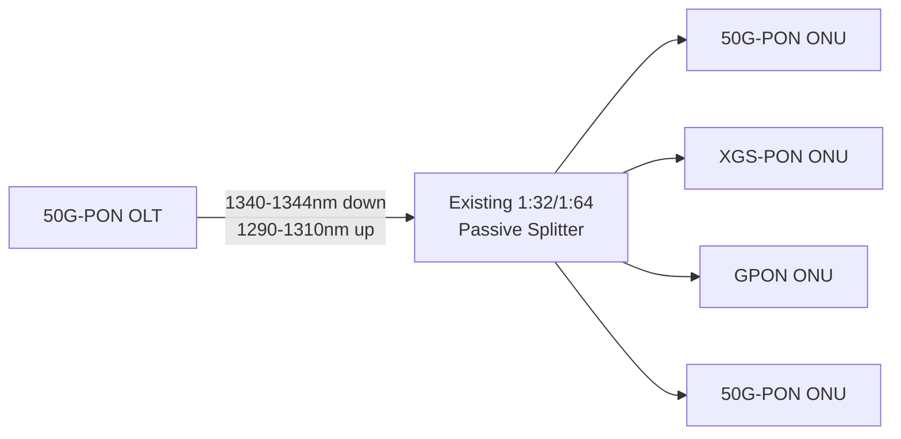
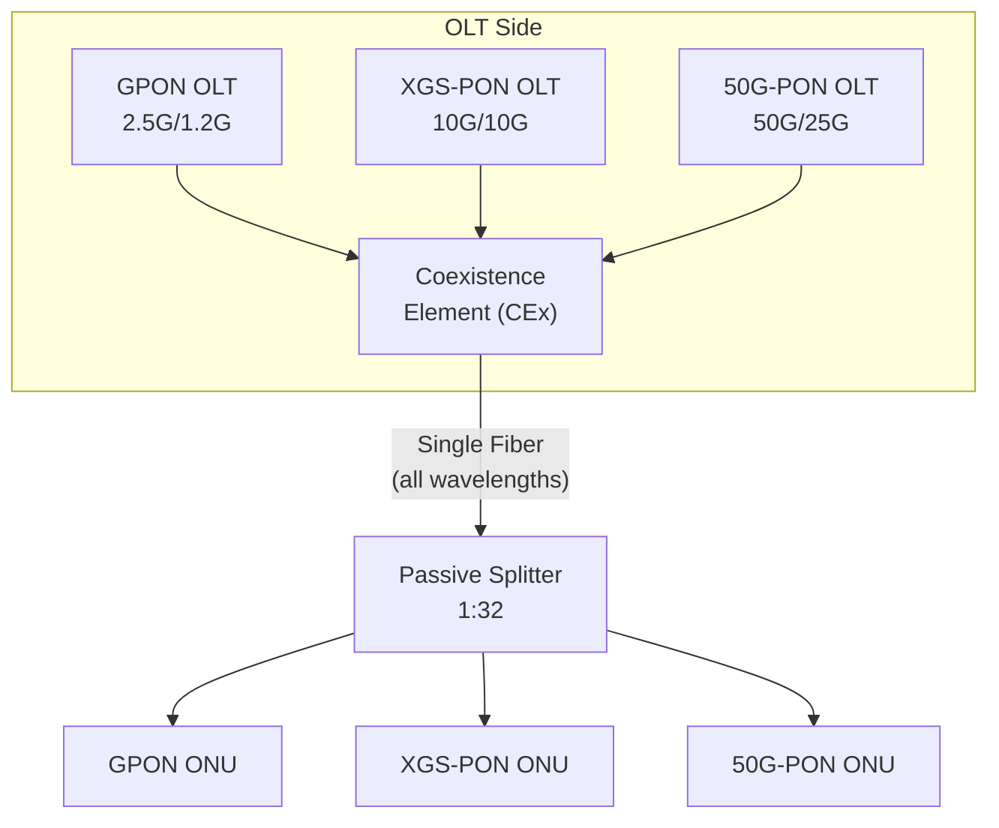
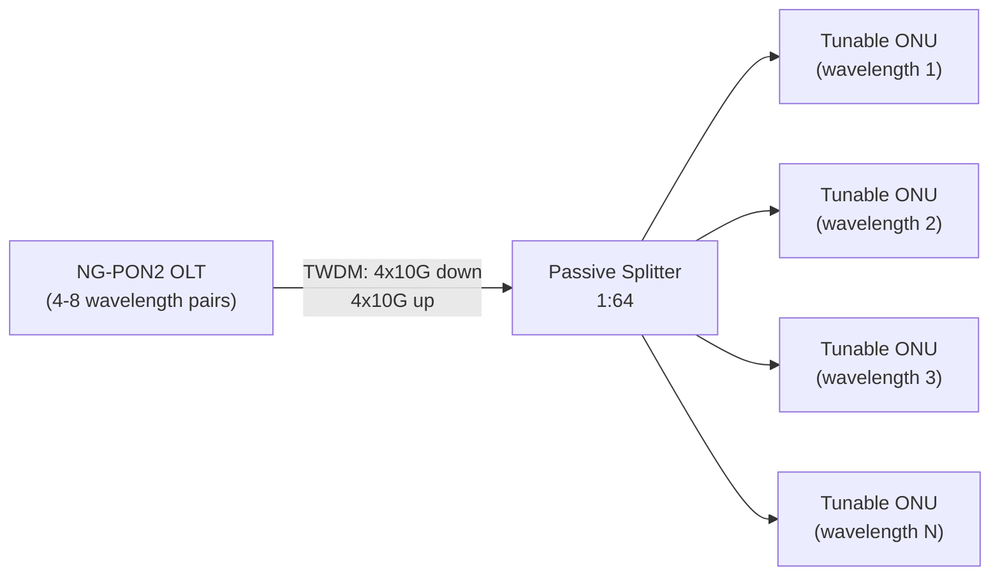
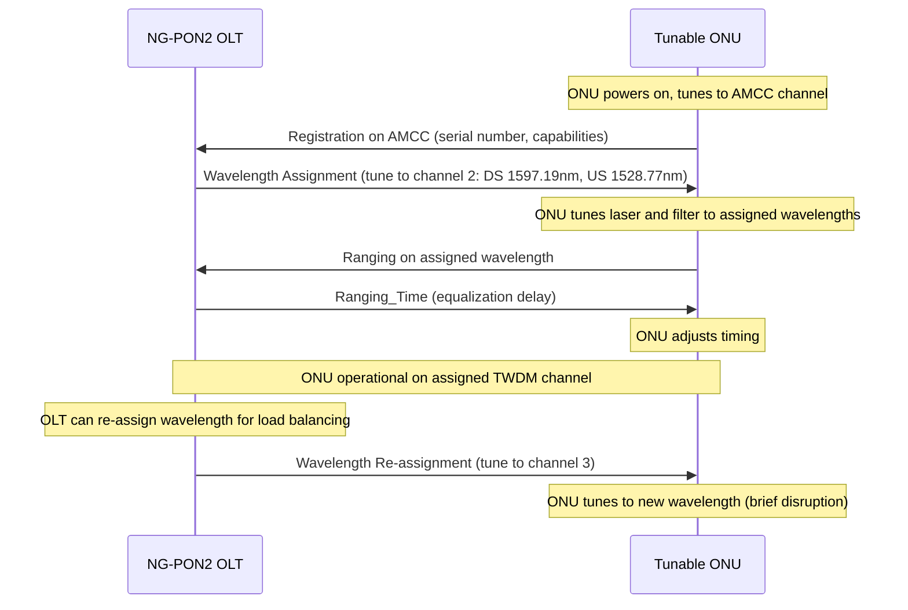

# 50G-PON / NG-PON2 (Next-Generation PON)

> **Standard:** [ITU-T G.9804](https://www.itu.int/rec/T-REC-G.9804.1) | **Layer:** Physical + Data Link (Layers 1-2) | **Wireshark filter:** N/A (emerging technology)

50G-PON and NG-PON2 represent the next generation of passive optical networking beyond XGS-PON. 50G-PON (ITU-T G.9804) targets 50 Gbps downstream / 25 Gbps upstream on a single wavelength, using advanced modulation (NRZ or PAM4) and coexisting with existing GPON and XGS-PON deployments on the same fiber. NG-PON2 (ITU-T G.989) takes a different approach, combining multiple 10G wavelength pairs (TWDM) for 40-80 Gbps aggregate capacity with wavelength-tunable ONUs. While NG-PON2 saw limited deployment due to tunable optic costs, 50G-PON has emerged as the industry's chosen path forward.

## 50G-PON (ITU-T G.9804)

### Overview

50G-PON is designed as a smooth evolutionary step from XGS-PON, reusing the same ODN (Optical Distribution Network) infrastructure — fiber, splitters, and cabinets. It achieves higher speeds through faster optics and optional advanced modulation, while maintaining the same fundamental PON architecture.

### Key Parameters

| Parameter | 50G-PON (G.9804) |
|-----------|-----------------|
| Downstream rate | 49.7664 Gbps |
| Upstream rate | 24.8832 Gbps (asym) or 49.7664 Gbps (sym) |
| Downstream wavelength | 1340-1344 nm |
| Upstream wavelength | 1290-1310 nm |
| Modulation (downstream) | NRZ at 50G or PAM4 at 25 Gbaud |
| Modulation (upstream) | NRZ at 25G (asym) or NRZ/PAM4 at 50G (sym) |
| Split ratio | 1:32 / 1:64 (same as GPON/XGS-PON) |
| Max reach | 20 km (40 km with reach extenders) |
| Encryption | AES-256 |
| FEC | LDPC (Low-Density Parity-Check) |
| Line coding | 64b/66b |
| Frame period | 125 us |

### Modulation Options

| Approach | Symbol Rate | Modulation | Advantage |
|----------|-----------|------------|-----------|
| NRZ at 50G | ~50 Gbaud | NRZ (2-level) | Simple, proven, but requires 50G optics |
| PAM4 at 25G | ~25 Gbaud | PAM4 (4-level) | Uses 25G optics (cheaper), but lower noise margin |

The industry consensus is moving toward **NRZ at ~25 Gbaud** for the 24.8832 Gbps upstream and advanced FEC to close the link budget. Downstream uses either approach depending on vendor implementation.

### Framing (Enhanced XGTC)

50G-PON extends the XGTC framing from XGS-PON:

| Feature | XGS-PON (G.9807) | 50G-PON (G.9804) |
|---------|------------------|------------------|
| Frame period | 125 us | 125 us |
| Encapsulation | XGEM | Enhanced XGEM |
| XGEM header | 8 bytes | 8 bytes (extended fields) |
| PLOAM | 48 bytes | 48 bytes (enhanced) |
| BWmap | Per Alloc-ID | Per Alloc-ID (larger burst sizes) |
| FEC | RS(248,216) | LDPC |
| Encryption | AES-256 | AES-256 |

### AMCC (Auxiliary Management and Control Channel)

50G-PON introduces AMCC for out-of-band ONU management during activation, before the main data channel is established:

| Feature | Description |
|---------|-------------|
| Purpose | ONU discovery, wavelength assignment, initial provisioning |
| Rate | Low-rate (e.g., 155 Mbps) management channel |
| Wavelength | Separate from data wavelengths |
| Usage | Used during ONU activation before high-speed link is up |
| Shared with | NG-PON2 also uses AMCC |

### Coexistence with Legacy PON

50G-PON is designed to coexist with GPON and XGS-PON on the same fiber using WDM. A Coexistence Element (CEx) at the OLT side multiplexes/demultiplexes the wavelengths:

## NG-PON2 (ITU-T G.989)

### Overview

NG-PON2 uses Time and Wavelength Division Multiplexed PON (TWDM-PON) — multiple wavelength pairs, each carrying 10G, for aggregate capacity of 40-80 Gbps. ONUs have **tunable optics** that can lock to any of the available wavelengths, allowing dynamic wavelength assignment.

### Key Parameters

| Parameter | NG-PON2 (G.989) |
|-----------|----------------|
| Architecture | TWDM-PON (Time and Wavelength Division Multiplexing) |
| Wavelength pairs | 4 (baseline) to 8 (extended) |
| Rate per wavelength | 10 Gbps downstream / 10 Gbps upstream |
| Aggregate downstream | 40 Gbps (4 x 10G) to 80 Gbps (8 x 10G) |
| Aggregate upstream | 40 Gbps (4 x 10G) to 80 Gbps (8 x 10G) |
| Downstream band | 1596-1603 nm (4 wavelengths in 100 GHz grid) |
| Upstream band | 1524-1544 nm (4 wavelengths in 100 GHz grid) |
| Split ratio | 1:64 |
| Max reach | 40 km |
| ONU optics | Tunable laser + tunable filter |
| Encryption | AES-256 |

### TWDM Wavelength Plan

| Wavelength Pair | Downstream (nm) | Upstream (nm) |
|----------------|-----------------|---------------|
| Channel 1 | 1596.34 | 1524.50 |
| Channel 2 | 1597.19 | 1528.77 |
| Channel 3 | 1598.04 | 1533.07 |
| Channel 4 | 1598.89 | 1537.40 |

Each channel operates independently as a 10G-PON, sharing the same ODN. ONUs tune to one wavelength pair at a time.

### PtP WDM Overlay

NG-PON2 also supports a Point-to-Point WDM overlay for dedicated wavelength services:

| Feature | TWDM | PtP WDM |
|---------|------|---------|
| Topology | Point-to-multipoint | Point-to-point (dedicated wavelength) |
| Bandwidth | Shared 10G per wavelength | Dedicated wavelength per ONU |
| Use case | Residential, business | Mobile fronthaul, enterprise leased line |
| Wavelength band | C-band (as above) | Additional wavelengths in expanded spectrum |

### ONU Wavelength Assignment

### NG-PON2 Deployment Challenges

| Challenge | Impact |
|-----------|--------|
| Tunable optics cost | Significantly more expensive than fixed-wavelength ONUs |
| Complexity | Wavelength management, tuning time, inventory |
| Market timing | Arrived when XGS-PON was "good enough" for most deployments |
| 50G-PON competition | Single-wavelength 50G is simpler and cheaper |
| Limited vendors | Fewer ONU/OLT vendors compared to GPON/XGS-PON |

## Wavelength Plan (Full Coexistence)

All ITU-T PON generations can coexist on the same fiber:

| Technology | Downstream (nm) | Upstream (nm) | Notes |
|-----------|-----------------|---------------|-------|
| GPON | 1480-1500 | 1290-1330 | Widest deployment |
| XGS-PON | 1575-1580 | 1260-1280 | 10G symmetric |
| 50G-PON | 1340-1344 | 1290-1310 | Next generation |
| NG-PON2 TWDM | 1596-1603 | 1524-1544 | Multi-wavelength |
| RF Video | 1550-1560 | N/A | Analog/QAM video overlay |

This careful wavelength allocation means an operator can deploy all generations simultaneously on the same fiber and splitter infrastructure.

## Technology Comparison

| Feature | GPON | XGS-PON | 50G-PON | NG-PON2 |
|---------|------|---------|---------|---------|
| Standard | G.984 | G.9807 | G.9804 | G.989 |
| DS rate | 2.5 Gbps | 10 Gbps | 50 Gbps | 40-80 Gbps (aggregate) |
| US rate | 1.2 Gbps | 10 Gbps | 25-50 Gbps | 40-80 Gbps (aggregate) |
| Wavelengths | 1 pair | 1 pair | 1 pair | 4-8 pairs |
| ONU optics | Fixed | Fixed | Fixed | Tunable |
| Modulation | NRZ | NRZ | NRZ or PAM4 | NRZ |
| FEC | RS optional | RS mandatory | LDPC | RS mandatory |
| Encryption | AES-128 | AES-256 | AES-256 | AES-256 |
| Split ratio | 1:64 | 1:64 | 1:64 | 1:64 |
| Max reach | 20 km | 20 km | 20 km | 40 km |
| Deployment status | Mature | Active deployment | Standards complete, early trials | Limited deployment |
| ONU cost | Low | Low-moderate | Moderate | High (tunable) |

## IEEE Alternatives

For completeness, the IEEE track pursues similar goals:

| Standard | Rate | Status |
|----------|------|--------|
| IEEE 802.3ca (25G-EPON) | 25G DS / 10G or 25G US | Published 2020 |
| IEEE 802.3ca (50G-EPON) | 50G (2 x 25G bonded) | Published 2020 |
| IEEE 802.3cs | 400G+ EPON (study) | Under study |

## Standards

| Document | Title |
|----------|-------|
| [ITU-T G.9804.1](https://www.itu.int/rec/T-REC-G.9804.1) | 50G-PON — General requirements |
| [ITU-T G.9804.2](https://www.itu.int/rec/T-REC-G.9804.2) | 50G-PON — Physical media dependent layer |
| [ITU-T G.9804.3](https://www.itu.int/rec/T-REC-G.9804.3) | 50G-PON — Transmission convergence layer |
| [ITU-T G.989.1](https://www.itu.int/rec/T-REC-G.989.1) | NG-PON2 — General requirements |
| [ITU-T G.989.2](https://www.itu.int/rec/T-REC-G.989.2) | NG-PON2 — Physical media dependent layer |
| [ITU-T G.989.3](https://www.itu.int/rec/T-REC-G.989.3) | NG-PON2 — Transmission convergence layer |
| [IEEE 802.3ca-2020](https://standards.ieee.org/standard/802_3ca-2020.html) | 25G/50G EPON (IEEE alternative) |

## See Also

- [GPON](gpon.md) — current-generation ITU-T PON (2.5G/1.2G)
- [EPON](epon.md) — IEEE-based PON using native Ethernet
- [Ethernet](../link-layer/ethernet.md) — payload carried over PON
- [TR-069 / TR-369](../monitoring/tr069.md) — CPE management for PON ONTs
