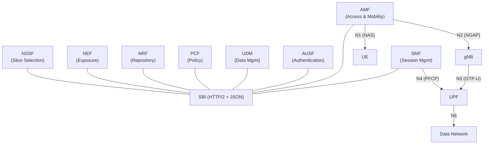
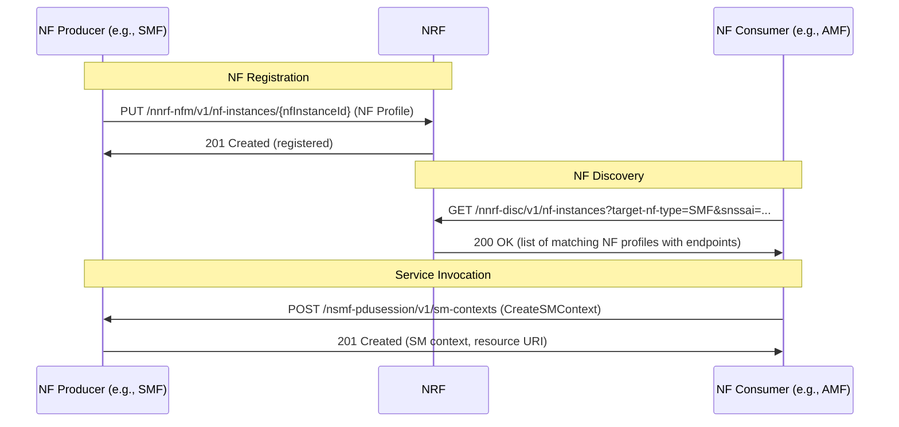
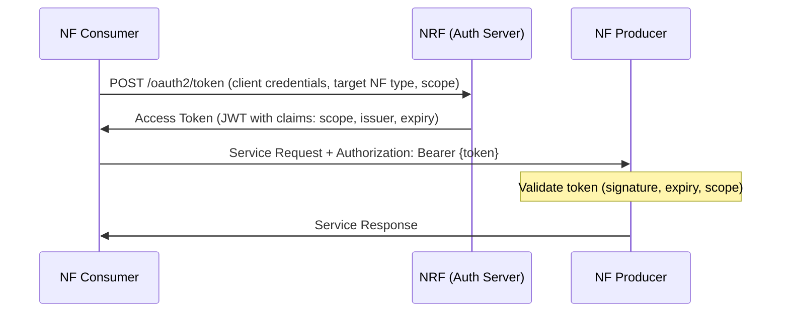
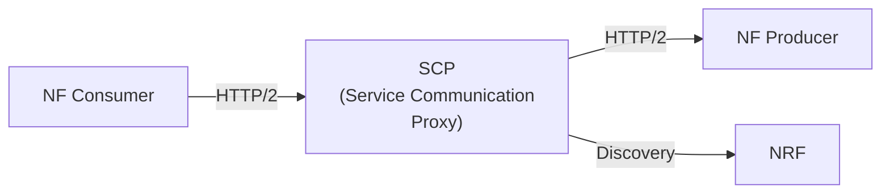
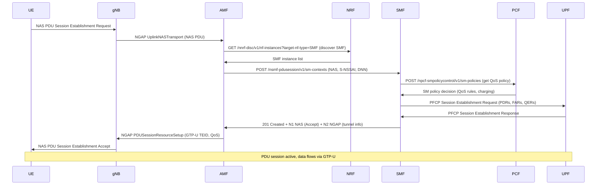

# 5G SBI (Service-Based Interface)

> **Standard:** [3GPP TS 29.500](https://www.3gpp.org/DynaReport/29500.htm) | **Layer:** Application (HTTP/2 + JSON) | **Wireshark filter:** `http2`

5G SBI is the service-based architecture (SBA) framework for communication between Network Functions (NFs) in the 5G Core. Unlike 4G's point-to-point interfaces (S6a, Gx, S11, each with its own protocol), 5G NFs expose RESTful APIs over HTTP/2 with JSON payloads. Any NF can discover and consume services from any other NF through the NRF (NF Repository Function). This architecture enables cloud-native deployment, independent NF scaling, and service mesh patterns.

## 5G Service-Based Architecture



Note: The UPF uses PFCP on N4, not SBI -- it is a user plane element, not part of the service-based architecture.

## Network Functions and Services

| NF | Service Name | Key Operations |
|----|-------------|----------------|
| AMF | Namf_Communication | N1N2MessageTransfer, UEContextTransfer, registration notification |
| AMF | Namf_EventExposure | Subscribe/notify for UE reachability, location, connectivity |
| SMF | Nsmf_PDUSession | CreateSMContext, UpdateSMContext, ReleaseSMContext |
| SMF | Nsmf_EventExposure | Subscribe/notify for PDU session events |
| NRF | Nnrf_NFManagement | NFRegister, NFUpdate, NFDeregister, NFStatusSubscribe |
| NRF | Nnrf_NFDiscovery | NFDiscover (query NF instances by type, services, S-NSSAI) |
| AUSF | Nausf_UEAuthentication | Authenticate, deregister notification |
| UDM | Nudm_UECM | Registration, deregistration of AMF for subscriber |
| UDM | Nudm_SDM | Subscription data retrieval, subscribe to data change |
| UDM | Nudm_UEAuthentication | Get authentication data (vectors) |
| PCF | Npcf_AMPolicy | Create/update access and mobility policy |
| PCF | Npcf_SMPolicyControl | Create/update/delete session policy (QoS, charging rules) |
| NSSF | Nnssf_NSSelection | Slice selection (get allowed/configured NSSAI, target AMF set) |
| NEF | Nnef_EventExposure | Expose network events to external AF (applications) |

## API Structure

All SBI APIs follow a common URL pattern:

```
{apiRoot}/{apiName}/{apiVersion}/{resource}
```

| Component | Example | Description |
|-----------|---------|-------------|
| apiRoot | `https://amf.5gc.mnc001.mcc001.3gppnetwork.org` | NF base URI (FQDN or IP) |
| apiName | `namf-comm` | Service name (lowercase, hyphenated) |
| apiVersion | `v1` | API version |
| resource | `/ue-contexts/{ueContextId}/n1-n2-messages` | Resource path |

Full example: `https://amf.5gc.example.com/namf-comm/v1/ue-contexts/{ueContextId}/n1-n2-messages`

### HTTP Methods

| HTTP Method | SBI Usage |
|-------------|-----------|
| POST | Create resource, trigger action, custom operations |
| GET | Retrieve resource, query/discover |
| PUT | Full replacement of resource |
| PATCH | Partial update (JSON Merge Patch or JSON Patch) |
| DELETE | Remove resource |

### Service Operation Patterns

| Pattern | Mechanism | Example |
|---------|-----------|---------|
| Request-Response | HTTP request + response | POST Nsmf_PDUSession_CreateSMContext |
| Subscribe-Notify | POST subscription, then callback POST on events | POST Nnrf_NFManagement_NFStatusSubscribe |

For subscribe-notify, the consumer provides a callback URI in the subscription request. The producer POSTs notifications to that URI when events occur.

## NF Discovery and Registration



### NF Profile (Registration Data)

| Field | Description |
|-------|-------------|
| nfInstanceId | UUID of the NF instance |
| nfType | AMF, SMF, UDM, AUSF, NRF, PCF, NSSF, NEF, etc. |
| nfStatus | REGISTERED, SUSPENDED, UNDISCOVERABLE |
| fqdn | Fully Qualified Domain Name |
| ipv4Addresses / ipv6Addresses | IP endpoints |
| nfServices | List of services (name, versions, scheme, URI) |
| sNssais | Supported network slices (SST + SD) |
| plmnList | Supported PLMNs (MCC + MNC) |
| capacity | Relative capacity (for load balancing) |
| priority | Selection priority |
| load | Current load (0-100) |
| nfServicePersistence | Whether NF supports service persistence |

## Authorization (OAuth 2.0)

NF-to-NF communication is authorized using OAuth 2.0 with the NRF acting as the authorization server:



The access token is a signed JWT containing the consumer NF instance ID, producer NF type, allowed services (scope), and expiration.

## SCP (Service Communication Proxy)

The SCP provides indirect communication between NFs, acting as a service mesh layer:



| Communication Model | Description |
|---------------------|-------------|
| Direct (Model A) | Consumer discovers producer via NRF, calls directly |
| Indirect without delegated discovery (Model C) | Consumer discovers via NRF, routes through SCP |
| Indirect with delegated discovery (Model D) | Consumer sends to SCP, SCP discovers and routes |

The SCP handles load balancing, topology hiding, monitoring, and message forwarding. In Models C/D, the SCP adds `3gpp-Sbi-Target-apiRoot` headers to route requests.

## PDU Session Establishment via SBI



## SBI vs 4G Point-to-Point Interfaces

| Aspect | 5G SBI | 4G EPC Interfaces |
|--------|--------|-------------------|
| Architecture | Service-based (any NF to any NF) | Point-to-point (fixed interface pairs) |
| Transport | HTTP/2 over TCP/TLS | Diameter (SCTP/TCP), GTPv2-C (UDP) |
| Encoding | JSON (text-based) | Diameter AVPs (binary), GTPv2-C IEs (binary) |
| Discovery | Dynamic via NRF | Static configuration or DNS |
| Authorization | OAuth 2.0 (JWT tokens) | Diameter CER/CEA peer exchange |
| API style | RESTful (resources, HTTP methods) | Command-response (request/answer codes) |
| Versioning | URI-based (/v1, /v2) | Diameter Application-ID |
| Extensibility | New NF services, OpenAPI specs | New Diameter AVPs, command codes |
| 4G equivalent interfaces | -- | S6a (MME-HSS), Gx (PGW-PCRF), S11 (MME-SGW) |
| Deployment | Cloud-native, containerized, scalable | Appliance-based, monolithic |

### 4G-to-5G Interface Mapping

| 4G Interface | Protocol | 5G Equivalent | 5G Protocol |
|-------------|----------|---------------|-------------|
| S6a (MME - HSS) | Diameter | AMF - UDM/AUSF | SBI (Nudm, Nausf) |
| S11 (MME - SGW) | GTPv2-C | AMF - SMF | SBI (Nsmf) |
| Gx (PGW - PCRF) | Diameter | SMF - PCF | SBI (Npcf) |
| S5/S8 control (SGW - PGW) | GTPv2-C | SMF - UPF | PFCP (N4, not SBI) |
| Rx (AF - PCRF) | Diameter | AF - NEF/PCF | SBI (Nnef) |

## Standards

| Document | Title |
|----------|-------|
| [3GPP TS 29.500](https://www.3gpp.org/DynaReport/29500.htm) | 5G SBI framework and technical realization |
| [3GPP TS 29.501](https://www.3gpp.org/DynaReport/29501.htm) | SBI principles and guidelines |
| [3GPP TS 29.510](https://www.3gpp.org/DynaReport/29510.htm) | NRF services (discovery, management) |
| [3GPP TS 29.502](https://www.3gpp.org/DynaReport/29502.htm) | SMF services (Nsmf) |
| [3GPP TS 29.518](https://www.3gpp.org/DynaReport/29518.htm) | AMF services (Namf) |
| [3GPP TS 29.509](https://www.3gpp.org/DynaReport/29509.htm) | AUSF services (Nausf) |
| [3GPP TS 29.503](https://www.3gpp.org/DynaReport/29503.htm) | UDM services (Nudm) |
| [3GPP TS 29.507](https://www.3gpp.org/DynaReport/29507.htm) | PCF services (Npcf) |
| [3GPP TS 23.501](https://www.3gpp.org/DynaReport/23501.htm) | 5G system architecture |

## See Also

- [NGAP](ngap.md) -- N2 RAN signaling (gNB to AMF, not SBI)
- [PFCP](pfcp.md) -- N4 user plane control (SMF to UPF, not SBI)
- [NAS 5G](nas5g.md) -- UE-AMF signaling carried via SBI between AMF and SMF
- [GTP](../tunneling/gtp.md) -- user plane tunneling (N3/N9)
- [Diameter](diameter.md) -- 4G AAA/policy protocol replaced by SBI
- [LTE](lte.md) -- 4G architecture with point-to-point interfaces
