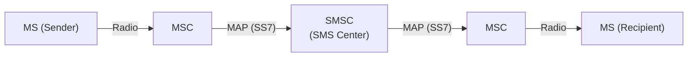
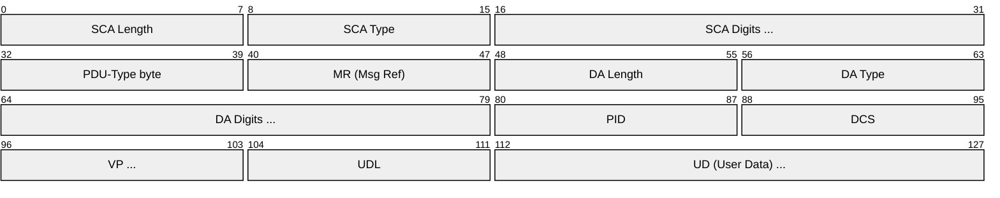
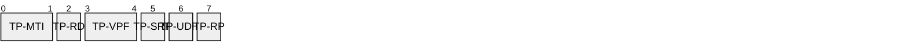
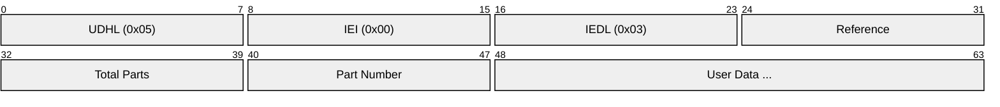
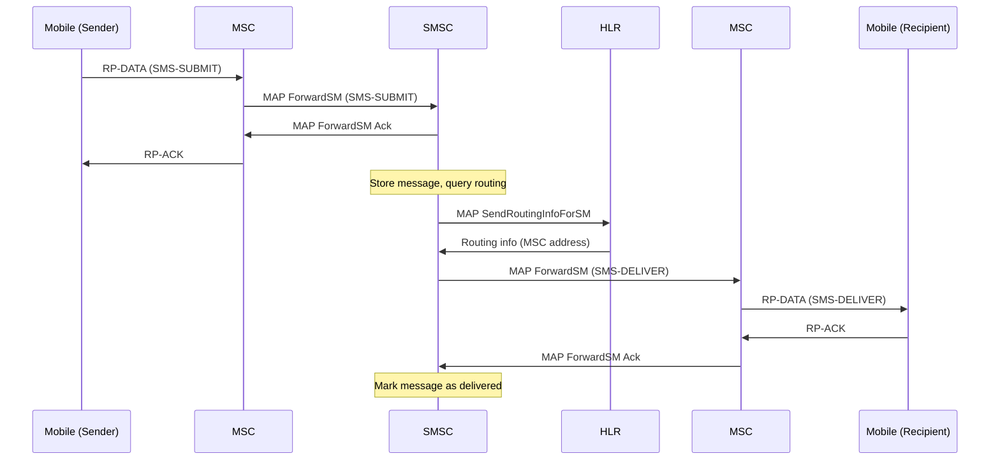
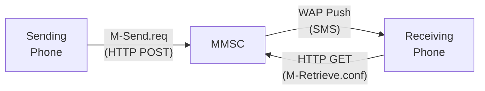
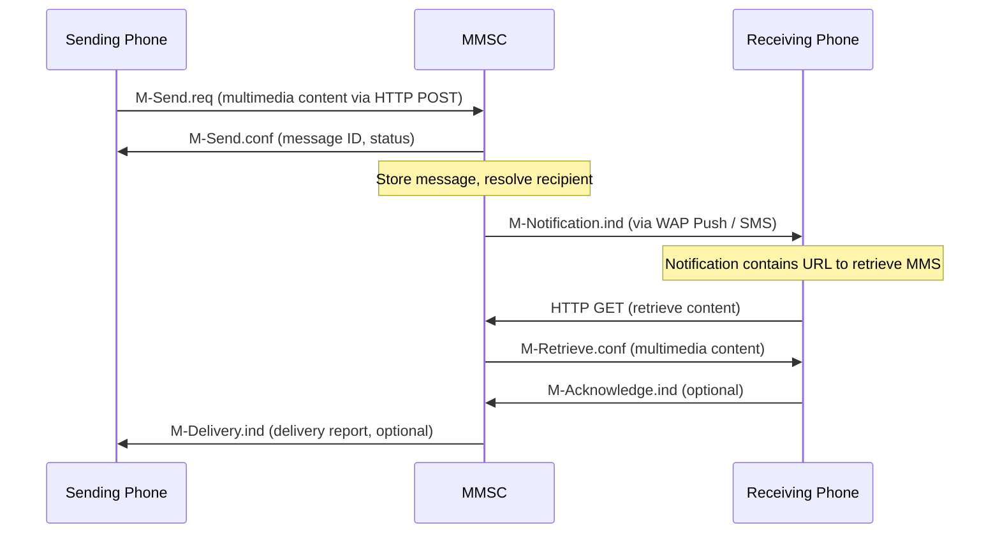

# SMS / MMS (Short Message Service / Multimedia Messaging Service)

> **Standard:** [3GPP TS 23.040 (SMS)](https://www.3gpp.org/DynaReport/23040.htm) / [3GPP TS 23.140 (MMS)](https://www.3gpp.org/DynaReport/23140.htm) | **Layer:** Application (over SS7 MAP / IP) | **Wireshark filter:** `gsm_sms` or `gsm_sms_ud` or `mmse`

SMS is a store-and-forward messaging service that allows sending text messages of up to 160 characters (GSM 7-bit encoding) between mobile devices. Originally defined as part of GSM, SMS routes through a Short Message Service Center (SMSC) and uses the SS7 MAP signaling network for delivery. MMS extends messaging to support images, audio, video, and rich text by leveraging WAP and HTTP for content delivery through a Multimedia Messaging Service Center (MMSC). Together, SMS and MMS form the foundation of mobile messaging, with billions of messages delivered daily worldwide.

---

## SMS Architecture

### Network Elements

| Element | Role |
|---------|------|
| MS | Mobile Station (handset) |
| MSC | Mobile Switching Center — routes SMS to/from SMSC |
| SMSC | Short Message Service Center — store-and-forward hub |
| HLR | Home Location Register — provides routing info for delivery |

## SMS TP-PDU Types

| PDU Type | Direction | Description |
|----------|-----------|-------------|
| SMS-SUBMIT | MS → SMSC | Mobile-originated message |
| SMS-SUBMIT-REPORT | SMSC → MS | Acknowledgment of SMS-SUBMIT |
| SMS-DELIVER | SMSC → MS | Mobile-terminated message |
| SMS-DELIVER-REPORT | MS → SMSC | Acknowledgment of SMS-DELIVER |
| SMS-STATUS-REPORT | SMSC → MS | Delivery status of a previously sent message |
| SMS-COMMAND | MS → SMSC | Command to SMSC regarding a previous message |

## SMS-SUBMIT PDU

## Key Fields

| Field | Size | Description |
|-------|------|-------------|
| SCA | Variable | Service Centre Address (SMSC number) |
| PDU-Type | 1 byte | Message type and flag bits |
| MR | 1 byte | Message Reference — sequence number set by MS |
| DA / OA | Variable | Destination Address (SUBMIT) or Originating Address (DELIVER) |
| PID | 1 byte | Protocol Identifier (0x00 = default SMS) |
| DCS | 1 byte | Data Coding Scheme (encoding and message class) |
| VP | 0, 1, or 7 bytes | Validity Period (duration SMSC retains message) |
| UDL | 1 byte | User Data Length (characters or octets) |
| UD | Variable | User Data (message content, optionally with UDH) |

## PDU-Type Bits (SMS-SUBMIT)

| Bit(s) | Field | Description |
|--------|-------|-------------|
| 0-1 | TP-MTI | Message Type Indicator (01 = SMS-SUBMIT) |
| 2 | TP-RD | Reject Duplicates (1 = reject duplicate MR) |
| 3-4 | TP-VPF | Validity Period Format (00=none, 01=enhanced, 10=relative, 11=absolute) |
| 5 | TP-SRR | Status Report Request (1 = request delivery report) |
| 6 | TP-UDHI | User Data Header Indicator (1 = UDH present in UD) |
| 7 | TP-RP | Reply Path (1 = reply path set) |

## Data Coding Scheme

| DCS Value | Encoding | Max Chars per SMS |
|-----------|----------|-------------------|
| 0x00 | GSM 7-bit default alphabet | 160 |
| 0x04 | 8-bit binary data | 140 |
| 0x08 | UCS-2 (UTF-16 BE) | 70 |

### GSM 7-bit Packing

160 characters x 7 bits = 1,120 bits = 140 bytes. Characters are packed right-to-left, filling 7 bits per character into 8-bit octets.

## Concatenated SMS (Long Messages)

Messages exceeding the single-SMS character limit are split across multiple SMS segments using a User Data Header (UDH).

### Concatenation UDH

| Field | Size | Description |
|-------|------|-------------|
| UDHL | 1 byte | User Data Header Length (0x05 for 8-bit ref, 0x06 for 16-bit ref) |
| IEI | 1 byte | Information Element Identifier (0x00 = concatenation, 8-bit ref) |
| IEDL | 1 byte | Information Element Data Length (0x03 for 8-bit ref) |
| Reference | 1 byte | Concatenation reference number (same across all parts) |
| Total Parts | 1 byte | Total number of segments |
| Part Number | 1 byte | Sequence number of this segment (1-based) |

With the UDH overhead, each segment carries 153 characters (GSM 7-bit) or 67 characters (UCS-2) instead of the full single-SMS capacity.

## SMS-SUBMIT Flow

## SMS Transport Variants

| Transport | Network | Protocol Stack |
|-----------|---------|---------------|
| SMS over MAP/SS7 | 2G/3G (GSM, UMTS) | RP → MAP → TCAP → SCCP → MTP |
| SMS over SGs | 4G (LTE) | NAS → SGs → MAP → TCAP → SCCP |
| SMS over IMS | VoLTE, 5G | SIP MESSAGE → IP-SM-GW → SMSC |
| SMS over NAS | 5G NR | NAS → AMF → SMSF → SMSC |

---

## MMS (Multimedia Messaging Service)

MMS extends SMS to support multimedia content (images, audio, video, contacts, calendar entries) through a WAP/HTTP-based architecture centered on the Multimedia Messaging Service Center (MMSC).

### MMS Architecture

### MMS Transaction Flow

### MMS PDU Types

| PDU Type | Direction | Description |
|----------|-----------|-------------|
| M-Send.req | Phone → MMSC | Submit multimedia message |
| M-Send.conf | MMSC → Phone | Submission acknowledgment |
| M-Notification.ind | MMSC → Phone | Notification of waiting message (via WAP Push) |
| M-Retrieve.conf | MMSC → Phone | Message content delivery (HTTP response) |
| M-Acknowledge.ind | Phone → MMSC | Retrieval acknowledgment |
| M-Delivery.ind | MMSC → Phone | Delivery report |
| M-Read-Rec.ind | Phone → MMSC | Read receipt |
| M-Forward.req | Phone → MMSC | Forward a stored message |

### MMS Headers

| Header | Description |
|--------|-------------|
| X-Mms-Message-Type | PDU type identifier (M-Send.req, M-Notification.ind, etc.) |
| X-Mms-Transaction-ID | Correlates requests with responses |
| X-Mms-MMS-Version | MMS version (e.g., 1.0, 1.2, 1.3) |
| From | Sender address (phone number or email) |
| To | Recipient address(es) |
| Subject | Message subject line |
| Content-Type | Top-level content type (multipart/mixed or multipart/related) |
| X-Mms-Message-Class | personal, advertisement, informational, auto |
| X-Mms-Expiry | Message expiry time on MMSC |
| X-Mms-Message-Size | Size of the multimedia content in bytes |
| X-Mms-Content-Location | URL to retrieve the message (in M-Notification.ind) |

### MMS Content Structure

MMS messages are encoded as multipart MIME bodies, typically using SMIL (Synchronized Multimedia Integration Language) for layout:

| Part | Content-Type | Purpose |
|------|-------------|---------|
| SMIL | application/smil | Presentation layout (slide timing, positioning) |
| Text | text/plain | Text portion of each slide |
| Image | image/jpeg, image/gif, image/png | Picture attachments |
| Audio | audio/amr, audio/mpeg | Audio clips |
| Video | video/3gpp, video/mp4 | Video clips |
| vCard | text/x-vcard | Contact cards |
| vCalendar | text/x-vcalendar | Calendar entries |

MMS PDUs are binary-encoded using a WBXML-like format (WSP content type and header encoding) for compact transmission.

---

## SMS vs MMS vs RCS

| Feature | SMS | MMS | RCS (Rich Communication Services) |
|---------|-----|-----|-----------------------------------|
| Content | Text only | Multimedia (images, video, audio) | Multimedia, interactive cards, actions |
| Max Size | 160 chars (7-bit) / 70 chars (UCS-2) | ~300 KB - 1 MB (carrier dependent) | Up to 100 MB |
| Encoding | GSM 7-bit, UCS-2, 8-bit | MIME multipart (WBXML headers) | HTTP/JSON |
| Transport | SS7 MAP / NAS | WAP Push + HTTP | IMS / HTTP (MSRP, HTTP) |
| Store-and-Forward | Yes (SMSC) | Yes (MMSC) | Yes (RCS hub) |
| Delivery Reports | Optional (Status Report) | Optional (M-Delivery.ind) | Built-in (read receipts, typing) |
| Group Messaging | Separate SMS to each recipient | Group MMS (single MMS to group) | Native group chat |
| Encryption | None (air interface only) | None (air interface only) | Optional (E2E in some implementations) |
| Fallback | N/A | Falls back to SMS | Falls back to SMS/MMS |
| Era | 1992+ | 2002+ | 2016+ |

## Standards

| Document | Title |
|----------|-------|
| [3GPP TS 23.040](https://www.3gpp.org/DynaReport/23040.htm) | Technical realization of the Short Message Service (SMS) |
| [3GPP TS 23.038](https://www.3gpp.org/DynaReport/23038.htm) | Alphabets and language-specific information (GSM 7-bit) |
| [3GPP TS 24.011](https://www.3gpp.org/DynaReport/24011.htm) | SMS point-to-point (relay layer) |
| [3GPP TS 29.002](https://www.3gpp.org/DynaReport/29002.htm) | MAP specification (SMS routing over SS7) |
| [3GPP TS 23.140](https://www.3gpp.org/DynaReport/23140.htm) | MMS — Functional description; Stage 2 |
| [OMA MMS](https://www.openmobilealliance.org/release/MMS/) | OMA MMS Architecture and Protocols |
| [3GPP TS 23.040 Annex E](https://www.3gpp.org/DynaReport/23040.htm) | Concatenated SMS (UDH specification) |

## See Also

- [WAP](wap.md) — MMS notification delivered via WAP Push
- [SMPP](../mobile-sync/smpp.md) — application-level SMS submission protocol
- [GSM](gsm.md) — mobile network architecture for SMS delivery
- [USSD](ussd.md) — session-based alternative to SMS
- [WBXML](../mobile-sync/wbxml.md) — binary encoding used in MMS PDUs
