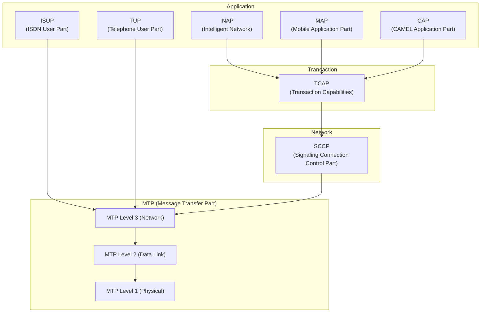
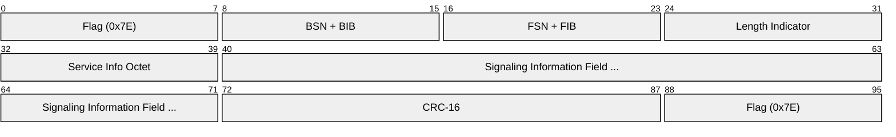
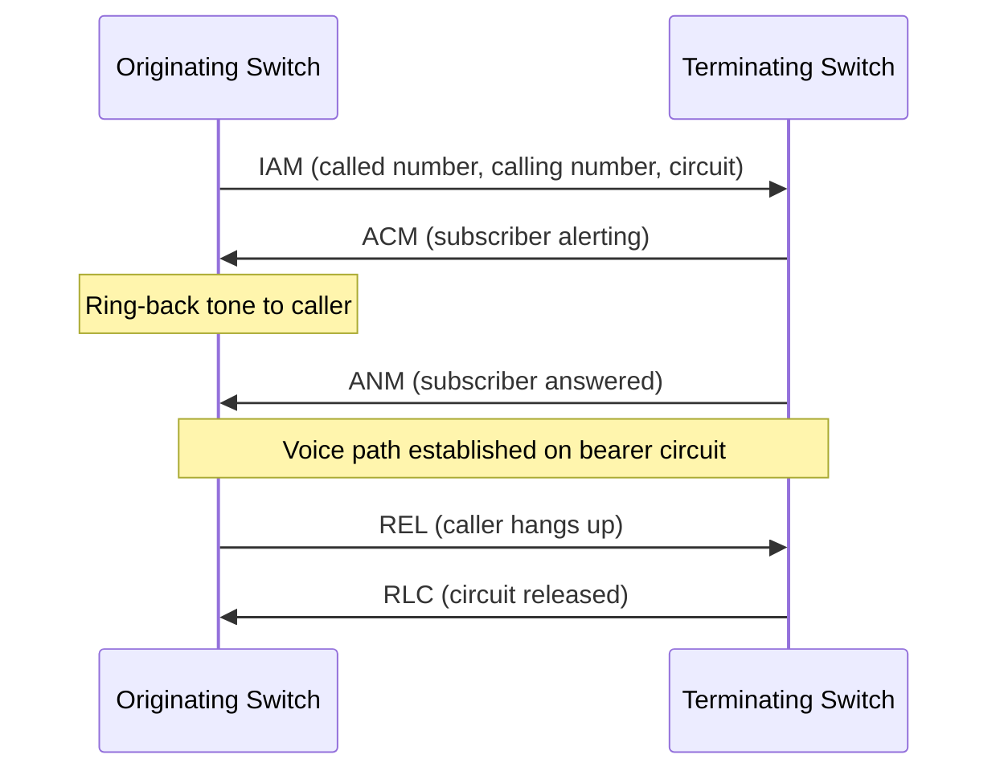
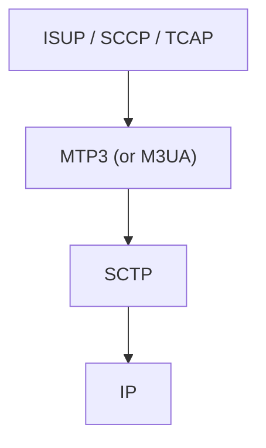

# SS7 (Signaling System No. 7)

> **Standard:** [ITU-T Q.700 series](https://www.itu.int/rec/T-REC-Q.700) | **Layer:** Full stack (Layers 1-7) | **Wireshark filter:** `mtp3` or `isup` or `sccp` or `tcap`

SS7 is the signaling protocol suite used by telephone networks worldwide to set up and tear down calls, route SMS, manage number portability, provide roaming, and support intelligent network services. It operates on a dedicated signaling network separate from the voice/data bearer channels. SS7 was developed in the 1970s-80s and remains the backbone of PSTN and mobile signaling, though modern networks increasingly carry SS7 over IP using SIGTRAN.

## Protocol Stack

## MTP (Message Transfer Part)

### MTP Level 1 (Physical)

The physical signaling link — typically a 64 kbps timeslot within a [T1](t1.md) or [E1](e1.md) frame, or an IP connection (SIGTRAN).

### MTP Level 2 (Data Link)

Provides reliable delivery of signaling messages over a single link using HDLC-like framing:

| Field | Size | Description |
|-------|------|-------------|
| Flag | 8 bits | HDLC flag `0x7E` — frame delimiter |
| BSN | 7 bits | Backward Sequence Number (acknowledgment) |
| BIB | 1 bit | Backward Indicator Bit (retransmission control) |
| FSN | 7 bits | Forward Sequence Number |
| FIB | 1 bit | Forward Indicator Bit |
| LI | 6 bits | Length Indicator (length of SIF + SIO) |
| SIO | 8 bits | Service Information Octet (service indicator + sub-service) |
| SIF | Variable | Signaling Information Field (payload) |
| CRC-16 | 16 bits | Error check |

### MTP Level 3 (Network)

Routes messages between signaling points. Key concepts:

| Term | Description |
|------|-------------|
| Originating Point Code (OPC) | Address of the sending node |
| Destination Point Code (DPC) | Address of the receiving node |
| Service Indicator (SI) | Identifies the user part (ISUP, SCCP, etc.) |
| Signaling Link Selection (SLS) | Load balancing across link sets |

### Service Indicator Values

| SI | User Part |
|----|-----------|
| 0 | Signaling Network Management |
| 1 | Signaling Network Testing |
| 3 | SCCP |
| 4 | TUP (Telephone User Part) |
| 5 | ISUP |
| 6 | DUP (Data User Part) |

### Point Codes

| Variant | Format | Size |
|---------|--------|------|
| ITU | 14 bits (3-8-3) | Zone-Area-SP |
| ANSI | 24 bits (8-8-8) | Network-Cluster-Member |

## ISUP (ISDN User Part)

ISUP handles call setup and teardown. Key messages:

| Abbreviation | Message | Direction | Description |
|-------------|---------|-----------|-------------|
| IAM | Initial Address Message | Forward | Initiates a call (contains called number) |
| ACM | Address Complete | Backward | Called party is being alerted |
| ANM | Answer | Backward | Called party has answered |
| REL | Release | Either | Request to release the circuit |
| RLC | Release Complete | Either | Circuit released |
| CPG | Call Progress | Backward | In-band information available |
| CON | Connect | Backward | Alternative to ANM |

### Basic Call Flow

## SCCP (Signaling Connection Control Part)

Provides global title routing and connection-oriented/connectionless transport above MTP3. Used by TCAP, MAP, and INAP.

| Service | Description |
|---------|-------------|
| Global Title Translation | Routes messages using E.164 numbers instead of point codes |
| Connection-oriented | Virtual circuits for long transactions |
| Connectionless | Datagram service for short queries |

## TCAP (Transaction Capabilities Application Part)

Provides a transaction framework for remote operations. Used by MAP, INAP, and CAP.

| Component | Description |
|-----------|-------------|
| Invoke | Request a remote operation |
| Return Result | Successful response |
| Return Error | Error response |
| Reject | Protocol error |

## MAP (Mobile Application Part)

Used in mobile networks for:

| Operation | Purpose |
|-----------|---------|
| UpdateLocation | Register subscriber at new MSC/VLR |
| SendRoutingInfo | Resolve MSISDN for call routing |
| SendRoutingInfoForSM | Resolve MSISDN for SMS delivery |
| InsertSubscriberData | Push subscriber profile from HLR to VLR |
| AuthenticationInfo | Retrieve authentication vectors |

## SIGTRAN (SS7 over IP)

Modern SS7 transport replaces MTP1/MTP2 with IP:

| Protocol | RFC | Replaces |
|----------|-----|----------|
| M2UA | RFC 3331 | MTP2 |
| M3UA | RFC 4666 | MTP3 |
| SUA | RFC 3868 | SCCP |
| SCTP | RFC 9260 | MTP2 reliable delivery |

## Standards

| Document | Title |
|----------|-------|
| [ITU-T Q.700](https://www.itu.int/rec/T-REC-Q.700) | Introduction to SS7 |
| [ITU-T Q.703](https://www.itu.int/rec/T-REC-Q.703) | MTP Level 2 — Signaling Link |
| [ITU-T Q.704](https://www.itu.int/rec/T-REC-Q.704) | MTP Level 3 — Signaling Network Functions |
| [ITU-T Q.711-Q.716](https://www.itu.int/rec/T-REC-Q.711) | SCCP |
| [ITU-T Q.761-Q.764](https://www.itu.int/rec/T-REC-Q.761) | ISUP |
| [ITU-T Q.771-Q.775](https://www.itu.int/rec/T-REC-Q.771) | TCAP |
| [3GPP TS 29.002](https://www.3gpp.org/DynaReport/29002.htm) | MAP specification |
| [RFC 4666](https://www.rfc-editor.org/rfc/rfc4666) | M3UA — MTP3 User Adaptation Layer |

## See Also

- [ISDN](isdn.md) — uses SS7 (ISUP) for call signaling
- [T1](t1.md) — physical bearer for SS7 links in North America
- [E1](e1.md) — physical bearer for SS7 links internationally
- [MM5](../application-layer/mm5.md) — MMS interface using MAP over SS7
- [SMPP](../application-layer/smpp.md) — SMS protocol that interfaces with SS7/MAP
