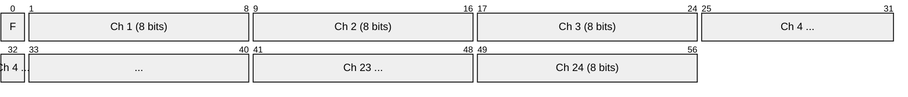
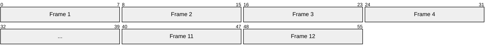

# T1 (DS1)

> **Standard:** [ANSI T1.403 / ITU-T G.703](https://www.itu.int/rec/T-REC-G.703) | **Layer:** Physical (Layer 1) | **Wireshark filter:** N/A (sub-packet-capture)

T1 is a digital transmission standard carrying 1.544 Mbps over two twisted pairs (one for each direction). It multiplexes 24 channels of 64 kbps (DS0) using time-division multiplexing (TDM). T1 is the fundamental digital carrier in North America and Japan, used for voice trunks, PRI ISDN, point-to-point data, and SS7 signaling links. The signal format is DS1; "T1" strictly refers to the physical line, though the terms are used interchangeably.

## Frame

A T1 frame is 193 bits, transmitted 8,000 times per second:

| Field | Size | Description |
|-------|------|-------------|
| F (Framing bit) | 1 bit | Framing, synchronization, and signaling |
| Channel 1-24 | 8 bits each | 24 timeslots, each carrying one DS0 (64 kbps) |

**Total:** 1 + (24 × 8) = 193 bits × 8,000 frames/sec = **1,544,000 bps**

## Key Parameters

| Parameter | Value |
|-----------|-------|
| Line rate | 1.544 Mbps |
| Channels | 24 × DS0 (64 kbps) |
| Frame size | 193 bits |
| Frame rate | 8,000 frames/sec |
| Encoding | AMI or B8ZS |
| Cable | 2 twisted pairs (4 wires), 100Ω |
| Max distance | ~1.8 km (6,000 ft) without repeaters |
| Connector | RJ-48C (8-pin) |

## Framing Formats

### D4 (Superframe — SF)

Groups 12 consecutive frames into a superframe. The framing bit follows the pattern `100011011100` for alignment:

- **Framing bits (odd frames):** Terminal framing `1 0 1 0 1 0` — frame sync
- **Framing bits (even frames):** Signaling framing `0 0 1 1 1 0` — multiframe sync
- **Robbed-bit signaling:** In frames 6 and 12, the LSB of each channel is "robbed" for A/B signaling bits

### ESF (Extended Superframe)

Groups 24 frames into an extended superframe. The framing bit is divided into three functions:

| Bits (frame positions) | Purpose |
|------------------------|---------|
| 4, 8, 12, 16, 20, 24 | FDL — Facilities Data Link (4 kbps data channel) |
| 2, 6, 10, 14, 18, 22 | CRC-6 — Error checking over the superframe |
| 1, 3, 5, 7, 9, 11, 13, 15, 17, 19, 21, 23 | Frame alignment: `001011` |

- **Robbed-bit signaling:** In frames 6, 12, 18, 24 — provides A/B/C/D signaling bits
- **CRC-6:** Detects transmission errors without taking the circuit down
- **FDL:** 4 kbps out-of-band data channel for performance monitoring and alarms

## Line Coding

| Encoding | Description |
|----------|-------------|
| AMI (Alternate Mark Inversion) | 1s alternate between +V and -V; 0s are no pulse. Must enforce ones-density rules. |
| B8ZS (Bipolar with 8-Zero Substitution) | Replaces 8 consecutive zeros with a violation pattern; maintains clock sync. Standard for ESF. |

## Signaling

### Channel Associated Signaling (CAS / Robbed-Bit)

In voice applications, the LSB of each channel is periodically "robbed" to carry A/B (SF) or A/B/C/D (ESF) signaling bits:

| Bits | State (typical E&M) |
|------|---------------------|
| A=0, B=0 | On-hook (idle) |
| A=1, B=1 | Off-hook (active) |
| A=1, B=0 | Wink (acknowledgment) |

This reduces each voice channel from 64 kbps to 56 kbps effective payload.

### Common Channel Signaling (CCS)

Channel 24 (or another designated channel) carries [ISDN](isdn.md) PRI signaling (Q.931) or [SS7](ss7.md) instead of voice. The remaining 23 channels carry bearer traffic.

| Configuration | Signaling | Bearer Channels |
|---------------|-----------|-----------------|
| CAS (robbed-bit) | In-band per channel | 24 × 56 kbps |
| PRI (ISDN) | Channel 24 (D) | 23 × 64 kbps B + 1 × 64 kbps D |
| SS7 | Dedicated timeslot(s) | Remaining channels |

## DS Hierarchy (North America)

| Level | Rate | Channels | Composition |
|-------|------|----------|-------------|
| DS0 | 64 kbps | 1 | Single channel |
| DS1 (T1) | 1.544 Mbps | 24 | 24 × DS0 |
| DS2 (T2) | 6.312 Mbps | 96 | 4 × DS1 |
| DS3 (T3) | 44.736 Mbps | 672 | 28 × DS1 |
| DS4 (T4) | 274.176 Mbps | 4032 | 6 × DS3 |

## Standards

| Document | Title |
|----------|-------|
| [ANSI T1.403](https://www.atis.org/) | DS1 Electrical Interface |
| [ITU-T G.703](https://www.itu.int/rec/T-REC-G.703) | Physical/electrical characteristics of hierarchical digital interfaces |
| [ITU-T G.704](https://www.itu.int/rec/T-REC-G.704) | Synchronous frame structures |
| [ANSI T1.107](https://www.atis.org/) | DS1/DS3 Digital Hierarchy Formats |

## See Also

- [E1](e1.md) — international equivalent (2.048 Mbps, 32 channels)
- [ISDN](isdn.md) — PRI signaling over T1
- [SS7](ss7.md) — signaling carried in T1 timeslots
