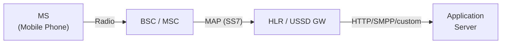
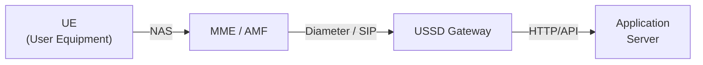
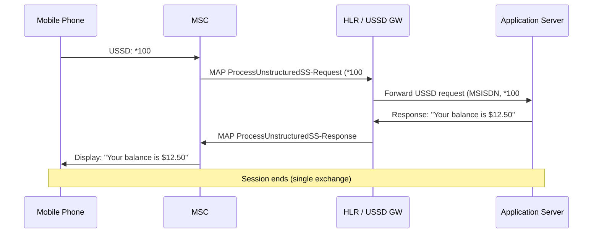
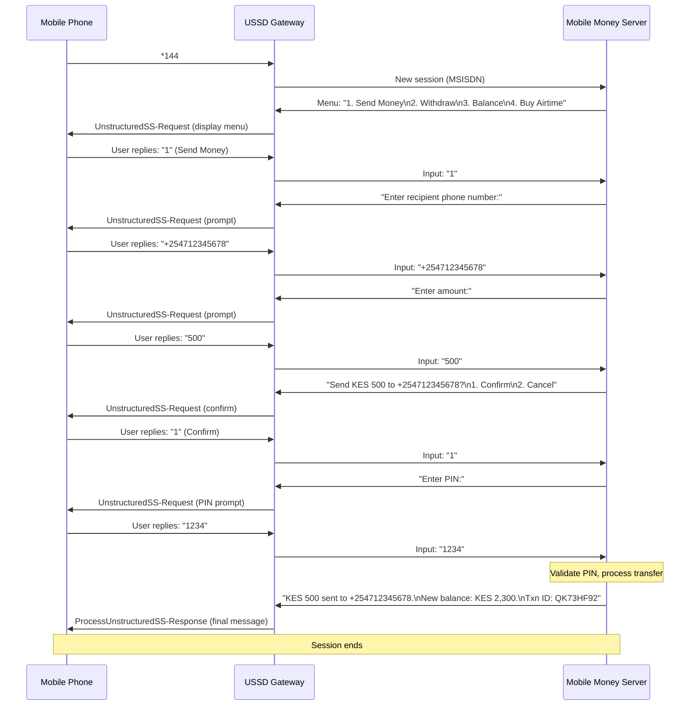

# USSD (Unstructured Supplementary Service Data)

> **Standard:** [3GPP TS 22.090](https://www.3gpp.org/DynaReport/22090.htm) / [3GPP TS 23.090](https://www.3gpp.org/DynaReport/23090.htm) / [3GPP TS 24.090](https://www.3gpp.org/DynaReport/24090.htm) | **Layer:** Application (over MAP/SS7 or Diameter/SIP) | **Wireshark filter:** `gsm_map` (USSD is carried within MAP operations)

USSD is a real-time, session-based GSM signaling protocol that allows mobile phones to communicate with network applications through short text commands. Unlike SMS, which is store-and-forward, USSD maintains a live session between the handset and the network — responses arrive in real time and the session stays open for multi-step interactions. USSD is widely used for balance inquiries, prepaid top-up, mobile money services (M-Pesa), operator self-service menus, call forwarding setup, and SIM Toolkit applications. It operates over the SS7 MAP signaling network (2G/3G) and has been adapted for 4G/5G via Diameter and SIP.

## USSD String Format

USSD commands follow a structured dialing string pattern:

```
*service_code#
*service_code*param1*param2#
*service_code*param1*param2*param3#
**service_code*param#
```

### Common USSD Codes

| Code | Purpose | Example |
|------|---------|---------|
| `*#06#` | Display IMEI | Shows handset identity |
| `*100#` | Balance inquiry | Prepaid balance (carrier-specific) |
| `*#21#` | Query call forwarding | Check if call forwarding is active |
| `**21*number#` | Set call forwarding | Forward calls to another number |
| `##21#` | Cancel call forwarding | Disable call forwarding |
| `*131*amount*number#` | Airtime transfer | Send balance to another subscriber |
| `*144#` | Mobile money menu | M-Pesa / mobile banking (carrier-specific) |

## Architecture

### 2G/3G (MAP/SS7)



### 4G/5G (Diameter/SIP)



### Network Elements

| Element | Role |
|---------|------|
| MS / UE | Mobile device initiating or responding to USSD |
| MSC | Mobile Switching Center — relays USSD via MAP |
| HLR | Home Location Register — routes USSD or handles directly |
| USSD Gateway | Terminates USSD sessions, connects to application servers |
| Application Server | Business logic (mobile money, balance check, menus) |

## MAP Operations

USSD is carried within SS7 MAP (Mobile Application Part) using three operations:

| MAP Operation | Direction | Description |
|---------------|-----------|-------------|
| ProcessUnstructuredSS-Request | MS → Network | Mobile-initiated USSD request |
| UnstructuredSS-Request | Network → MS | Network-initiated prompt (expects response) |
| UnstructuredSS-Notify | Network → MS | Network-initiated one-way notification (no response expected) |

### MAP USSD Parameters

| Parameter | Description |
|-----------|-------------|
| USSD-DataCodingScheme | Encoding of the USSD string (typically GSM 7-bit) |
| USSD-String | The USSD message content (up to 182 characters) |
| MSISDN | Subscriber phone number |
| AlertingPattern | Optional alerting indication |

## Data Coding Scheme

| DCS | Encoding | Max Characters |
|-----|----------|---------------|
| 0x0F | GSM 7-bit default alphabet | 182 |
| 0x48 | UCS-2 (UTF-16) | 91 |

The GSM 7-bit default alphabet allows 182 characters per USSD message (compared to 160 for SMS), because USSD carries 160 bytes of user data and 7-bit packing yields 182 characters from 160 bytes.

## Session Model

USSD sessions are stateful and real-time. The network maintains session context between exchanges, allowing multi-step menu navigation:

| Property | USSD | SMS |
|----------|------|-----|
| Delivery model | Real-time, session-based | Store-and-forward |
| Session state | Maintained across exchanges | Stateless |
| Timeout | 30-180 seconds (network-defined) | Up to 72 hours (SMSC VP) |
| Billing | Per-session (often free or low-cost) | Per-message |
| Max length | 182 chars (GSM 7-bit) | 160 chars (GSM 7-bit) |
| Direction | Bidirectional within session | Unidirectional per PDU |

## USSD Session Flow

### Basic Balance Inquiry



### Multi-Step Menu Navigation (Mobile Money)



## USSD vs SMS vs STK

| Feature | USSD | SMS | STK (SIM Toolkit) |
|---------|------|-----|-------------------|
| Session | Real-time, interactive | Store-and-forward, stateless | On-device menus + SMS/USSD |
| Latency | Sub-second response | Seconds to minutes | Instant (local), varies (network) |
| Storage | No message storage | Stored on SMSC and handset | Menus stored on SIM |
| Max Length | 182 chars (GSM 7-bit) | 160 chars (GSM 7-bit) | Varies by SIM capacity |
| Cost | Often free / low-cost | Per-message charge | Free (SIM-based) |
| Works Offline | No (requires active radio) | Store-and-forward handles offline | Menus available; actions need network |
| Data Input | Free-form text reply | Full SMS compose | Predefined menus, limited input |
| Encryption | SS7 signaling (not encrypted E2E) | SS7 signaling (not encrypted E2E) | SIM-level security (OTA keys) |
| Use Cases | Balance, mobile money, menus | Messaging, notifications, 2FA | Operator menus, payments |

## USSD over 4G/5G

In LTE and 5G networks, traditional SS7-based USSD is adapted:

| Network | USSD Transport | Protocol |
|---------|---------------|----------|
| 2G GSM | MAP over SS7 (TCAP/SCCP/MTP) | 3GPP TS 24.090 |
| 3G UMTS | MAP over SS7 (same as 2G) | 3GPP TS 24.090 |
| 4G LTE | SGs interface to MSC (fallback) or IMS-based | 3GPP TS 29.338 (Diameter) |
| 5G NR | IMS-based or NEF API exposure | 3GPP TS 29.338 / TS 29.522 |

In 4G/5G, USSD requests may be tunneled through NAS signaling to an IMS USSD gateway, or routed via the SGs interface to a legacy MSC for MAP-based handling.

## Security Considerations

| Concern | Description |
|---------|-------------|
| No end-to-end encryption | USSD traverses SS7 signaling in cleartext |
| SS7 vulnerabilities | SS7 network access enables interception and session hijacking |
| PIN over USSD | Mobile money PINs sent in cleartext USSD strings |
| Session hijacking | Attacker with SS7 access can inject UnstructuredSS-Request |
| SIM swapping | Social engineering to obtain victim SIM and access USSD services |

## Standards

| Document | Title |
|----------|-------|
| [3GPP TS 22.090](https://www.3gpp.org/DynaReport/22090.htm) | Unstructured Supplementary Service Data (USSD) — Stage 1 (service description) |
| [3GPP TS 23.090](https://www.3gpp.org/DynaReport/23090.htm) | Unstructured Supplementary Service Data (USSD) — Stage 2 (functional description) |
| [3GPP TS 24.090](https://www.3gpp.org/DynaReport/24090.htm) | Unstructured Supplementary Service Data (USSD) — Stage 3 (protocol specification) |
| [3GPP TS 29.002](https://www.3gpp.org/DynaReport/29002.htm) | MAP specification (carries USSD operations) |
| [3GPP TS 23.038](https://www.3gpp.org/DynaReport/23038.htm) | Alphabets and language-specific information (GSM 7-bit DCS) |
| [3GPP TS 29.338](https://www.3gpp.org/DynaReport/29338.htm) | Diameter-based USSD signaling for LTE |

## See Also

- [SMS](sms.md) — store-and-forward messaging (complementary to USSD)
- [GSM](gsm.md) — mobile network architecture
- [WAP](wap.md) — WAP stack can use USSD as a bearer via WDP
- [SMPP](../mobile-sync/smpp.md) — application-level protocol for SMS/USSD gateway integration
