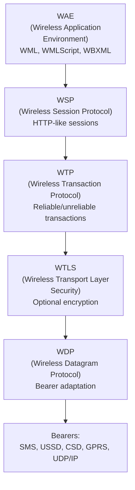
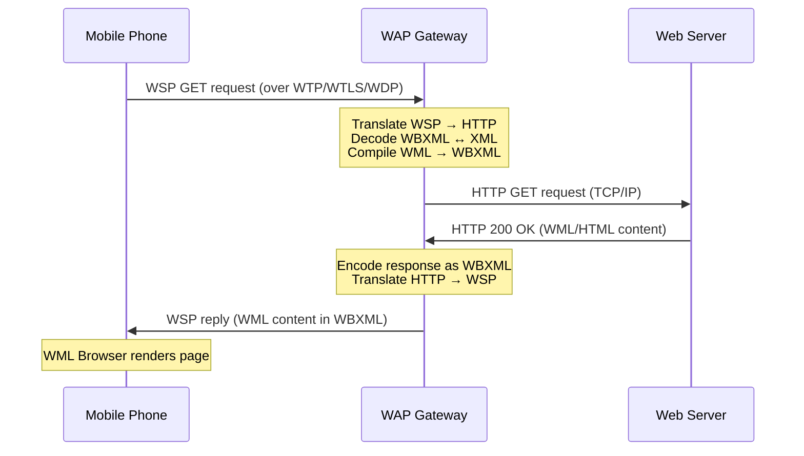
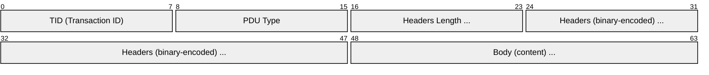
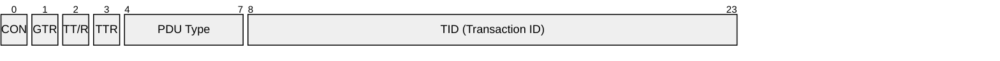
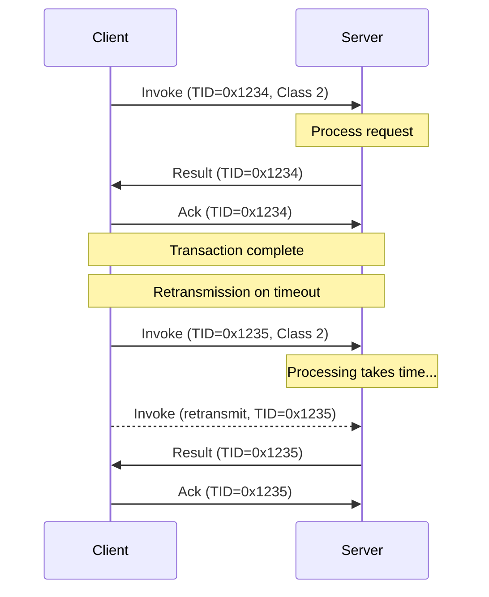
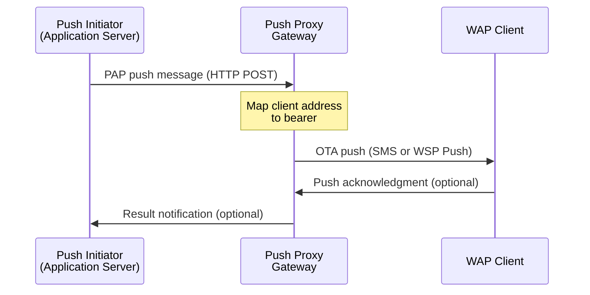

# WAP (Wireless Application Protocol)

> **Standard:** [OMA WAP Specifications](https://www.openmobilealliance.org/tech/affiliates/wap/wapindex.html) | **Layer:** Full stack (Transport through Application) | **Wireshark filter:** `wsp` or `wtp` or `wtls` or `wap`

WAP is a suite of protocols developed by the WAP Forum (later absorbed into the Open Mobile Alliance) to bring Internet-like services to mobile phones over low-bandwidth, high-latency 2G networks. WAP defined its own protocol stack optimized for constrained devices: WML instead of HTML, WBXML binary encoding, a compressed HTTP-like session layer (WSP), a lightweight transaction layer (WTP), optional security (WTLS), and bearer adaptation (WDP). WAP 1.x required a WAP Gateway to translate between the WAP stack and HTTP/TCP/IP. WAP 2.0 converged toward standard Internet protocols (XHTML-MP, TCP/IP, TLS), and WAP was eventually superseded by direct mobile web browsing.

## WAP Protocol Stack

### Stack Layers

| Layer | Role | Internet Equivalent |
|-------|------|---------------------|
| WAE | Content and scripting (WML, WMLScript, WBXML) | HTML, JavaScript |
| WSP | Session management, HTTP-like methods, push | HTTP |
| WTP | Transaction reliability (3 classes) | Subset of TCP semantics |
| WTLS | Encryption, authentication, integrity | TLS / SSL |
| WDP | Datagram adaptation over diverse bearers | UDP |

## WAP Gateway Model

WAP 1.x required a gateway to bridge between the WAP protocol stack on the phone and the Internet:

### WAP Ports

| Port | Service |
|------|---------|
| 9200 | WSP connectionless (WDP) |
| 9201 | WSP connection-oriented (WTP) |
| 9202 | WSP + WTLS connectionless |
| 9203 | WSP + WTLS connection-oriented |

## WSP (Wireless Session Protocol)

WSP provides HTTP-like functionality with binary-encoded headers, session resume, and push capability.

### WSP PDU

### WSP PDU Types

| Value | PDU Type | Description |
|-------|----------|-------------|
| 0x01 | Connect | Session establishment request |
| 0x02 | ConnectReply | Session establishment response |
| 0x03 | Redirect | Redirect client to another proxy |
| 0x04 | Reply | Response to a method invocation |
| 0x05 | Disconnect | Session termination |
| 0x06 | Push | Unsolicited content from server |
| 0x07 | ConfirmedPush | Push requiring acknowledgment |
| 0x08 | Suspend | Suspend session (session resume) |
| 0x09 | Resume | Resume a suspended session |
| 0x40 | GET | Retrieve a resource |
| 0x60 | POST | Submit data to a resource |

### WSP Method IDs

| ID | Method |
|----|--------|
| 0x40 | GET |
| 0x41 | OPTIONS |
| 0x42 | HEAD |
| 0x43 | DELETE |
| 0x44 | TRACE |
| 0x60 | POST |
| 0x61 | PUT |

### WSP Content Type Codes (Selected)

| Code | Content Type |
|------|-------------|
| 0x04 | text/plain |
| 0x08 | text/vnd.wap.wml |
| 0x12 | text/vnd.wap.wmlscript |
| 0x14 | application/vnd.wap.wbxml |
| 0x29 | application/vnd.wap.wmlc |
| 0x2A | application/vnd.wap.wmlscriptc |
| 0x30 | application/vnd.wap.multipart.mixed |

## WTP (Wireless Transaction Protocol)

WTP provides transaction-level reliability without the overhead of a full TCP connection. It defines three transaction classes.

### Transaction Classes

| Class | Name | Reliability | Description |
|-------|------|------------|-------------|
| 0 | Unreliable Push | None | One-way message, no acknowledgment |
| 1 | Reliable Push | Ack | One-way message with acknowledgment |
| 2 | Reliable Invoke | Invoke + Result + Ack | Request/response with acknowledgment |

### WTP PDU

### WTP PDU Types

| Value | PDU Type | Description |
|-------|----------|-------------|
| 0x01 | Invoke | Start a transaction (client request) |
| 0x02 | Result | Transaction result (server response) |
| 0x03 | Ack | Acknowledgment |
| 0x04 | Abort | Transaction abort |
| 0x05 | Segmented Invoke | Segmented large invoke PDU |
| 0x06 | Segmented Result | Segmented large result PDU |
| 0x07 | Negative Ack | Selective reject for missing segments |

### WTP Field Details

| Field | Bits | Description |
|-------|------|-------------|
| CON | 1 | Continuation flag (more PDUs follow) |
| GTR | 1 | Group trailer (last in a segmented group) |
| TT/R | 1 | Transaction trailer / Retransmission flag |
| PDU Type | 4 | Identifies the PDU type (Invoke, Result, Ack, Abort) |
| TID | 16 | Transaction ID (correlates request with response) |

### WTP Class 2 Transaction

## WTLS (Wireless Transport Layer Security)

WTLS provides TLS-like security optimized for wireless networks with smaller certificates, shorter handshakes, and reduced computational overhead.

### WTLS Record Types

| Type | Name | Description |
|------|------|-------------|
| 1 | ChangeCipherSpec | Switch to negotiated cipher |
| 2 | Alert | Warning or fatal error |
| 3 | Handshake | Key exchange and authentication |
| 4 | Application Data | Encrypted application payload |

### Authentication Modes

| Mode | Client Auth | Server Auth | Description |
|------|------------|-------------|-------------|
| Anonymous | No | No | No certificates; vulnerable to MITM |
| Server | No | Yes | Server certificate only (most common) |
| Mutual | Yes | Yes | Both client and server certificates |

### Certificate Types

| Type ID | Format | Description |
|---------|--------|-------------|
| 1 | WTLS | Compact WAP-specific certificate format |
| 2 | X.509 | Standard Internet PKI certificate |
| 3 | X9.68 | URL reference to a certificate |

### WTLS Cipher Suites (Selected)

| Suite | Key Exchange | Cipher | Hash |
|-------|-------------|--------|------|
| 1 | NULL | NULL | SHA-1 |
| 2 | ECDH_anon | RC5_CBC_56 | SHA-1 |
| 3 | ECDH_anon | RC5_CBC_56 | MD5 |
| 4 | ECDH_ECDSA | RC5_CBC_56 | SHA-1 |
| 6 | RSA_anon | RC5_CBC_56 | SHA-1 |
| 7 | RSA | RC5_CBC_56 | SHA-1 |
| 9 | RSA | DES_CBC_56 | SHA-1 |
| 10 | RSA | 3DES_CBC_EDE | SHA-1 |

## WDP (Wireless Datagram Protocol)

WDP adapts the upper WAP layers to diverse wireless bearers. When the bearer is IP-based, WDP maps directly to UDP. For non-IP bearers, WDP provides bearer-specific adaptation.

### Bearer Adaptation

| Bearer | Transport | WDP Mapping |
|--------|-----------|-------------|
| GSM CSD | Circuit-switched data | IP over PPP/CSD, WDP = UDP |
| GSM SMS | Store-and-forward | WDP payload in SMS user data |
| GSM USSD | Session-based signaling | WDP payload in USSD string |
| GPRS | Packet-switched data | IP/UDP directly |
| CDMA | IS-95/IS-2000 | UDP/IP or SMS bearer |
| UDP/IP | Any IP network | WDP = UDP (direct mapping) |

## WAE (Wireless Application Environment)

### WML Content Types

| Content | Description |
|---------|-------------|
| WML | Wireless Markup Language — card/deck metaphor for mobile pages |
| WMLScript | Lightweight scripting language (compiled to bytecode) |
| WBXML | Binary encoding of WML for compact transmission |
| WTA | Wireless Telephony Application — access to phone features |

## WML Push

WAP Push allows servers to send content to mobile devices without a prior request:

### Push Components

| Component | Protocol | Description |
|-----------|----------|-------------|
| Push Initiator (PI) | PAP (Push Access Protocol) | Application sending the push content |
| Push Proxy Gateway (PPG) | OTA (Over The Air) | Translates PAP to bearer-specific push delivery |
| WAP Client | WSP Push / SMS | Receives and renders push content |

### Push Content Types

| Type | Description |
|------|-------------|
| SI (Service Indication) | Notification with URL — user chooses to load |
| SL (Service Loading) | Automatically loads the URL |
| CO (Cache Operation) | Invalidates cached content on the device |

## WAP 1.x vs WAP 2.0 vs Mobile HTTP

| Feature | WAP 1.x | WAP 2.0 | Modern Mobile Web |
|---------|---------|---------|-------------------|
| Markup | WML (card/deck) | XHTML-MP | HTML5 |
| Encoding | WBXML binary | Text XML/XHTML | Text (gzip compressed) |
| Session Layer | WSP | HTTP (TCP) | HTTP/2, HTTP/3 |
| Transaction Layer | WTP | TCP | TCP, QUIC |
| Security | WTLS | TLS | TLS 1.2/1.3 |
| Transport | WDP (bearer-adapted) | TCP/IP | TCP/IP, UDP/IP |
| Gateway Required | Yes (WAP Gateway) | Optional (WAP Proxy) | No |
| Push | WAP Push (PAP/OTA) | WAP Push or OMA Push | Web Push (RFC 8030) |
| Scripting | WMLScript | ECMAScript Mobile Profile | JavaScript (full) |
| Era | 1998-2004 | 2002-2008 | 2007-present |

## Standards

| Document | Title |
|----------|-------|
| [WAP-230-WSP](https://www.openmobilealliance.org/tech/affiliates/wap/wapindex.html) | Wireless Session Protocol Specification |
| [WAP-224-WTP](https://www.openmobilealliance.org/tech/affiliates/wap/wapindex.html) | Wireless Transaction Protocol Specification |
| [WAP-261-WTLS](https://www.openmobilealliance.org/tech/affiliates/wap/wapindex.html) | Wireless Transport Layer Security Specification |
| [WAP-259-WDP](https://www.openmobilealliance.org/tech/affiliates/wap/wapindex.html) | Wireless Datagram Protocol Specification |
| [WAP-191-WML](https://www.openmobilealliance.org/tech/affiliates/wap/wapindex.html) | Wireless Markup Language Specification |
| [WAP-192-WBXML](https://www.openmobilealliance.org/tech/affiliates/wap/wap-192-wbxml-20010725-a.pdf) | WAP Binary XML Content Format |
| [WAP-235-PushOTA](https://www.openmobilealliance.org/tech/affiliates/wap/wapindex.html) | Push Over-The-Air Protocol |
| [WAP-247-PAP](https://www.openmobilealliance.org/tech/affiliates/wap/wapindex.html) | Push Access Protocol |

## See Also

- [HTTP](../web/http.md) — WSP is modeled after HTTP
- [TLS](../security/tls.md) — WTLS is derived from TLS
- [WBXML](../mobile-sync/wbxml.md) — binary encoding used by WAP
- [SMS](sms.md) — bearer for WAP push and WDP
- [USSD](ussd.md) — alternative bearer for WDP
- [GSM](gsm.md) — mobile network WAP operates over
