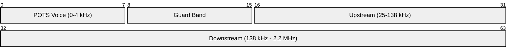
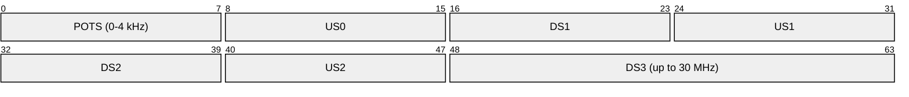
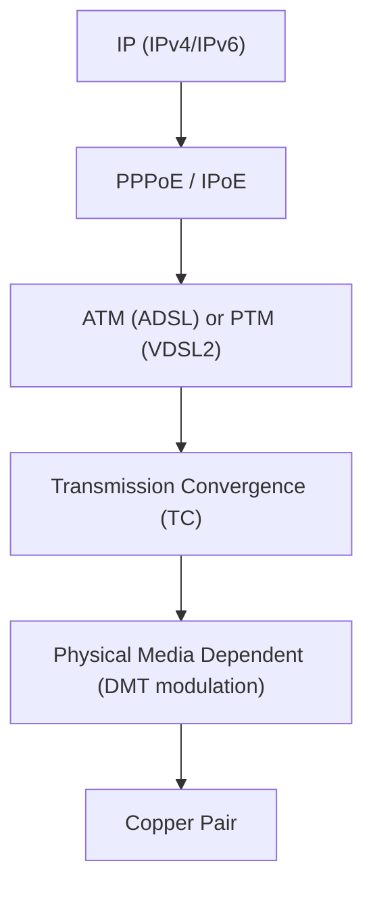
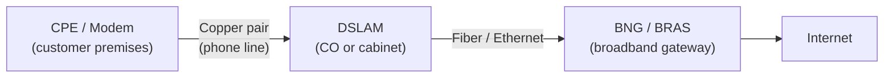
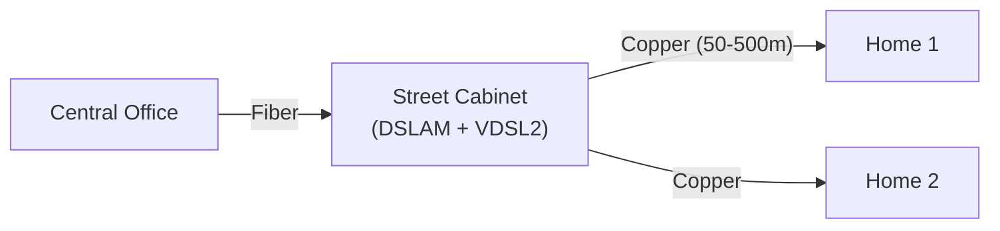

# xDSL (Digital Subscriber Line)

> **Standard:** [ITU-T G.992 (ADSL) / G.993 (VDSL)](https://www.itu.int/rec/T-REC-G.993.2) | **Layer:** Physical / Data Link (Layers 1-2) | **Wireshark filter:** N/A (sub-packet-capture; ATM/PPPoE visible above)

xDSL is a family of technologies that deliver high-speed data over existing copper telephone lines. "x" is a placeholder for the specific variant — ADSL, VDSL, SDSL, etc. DSL uses frequencies above the voice band (0-4 kHz) to transmit data, allowing simultaneous voice and data on the same line. A splitter or filter separates voice and data at each end. DSL is the most widely deployed broadband technology globally, connecting hundreds of millions of subscribers.

## DSL Variants

| Variant | Standard | Downstream | Upstream | Max Distance | Description |
|---------|----------|-----------|----------|-------------|-------------|
| ADSL | G.992.1 | 8 Mbps | 1 Mbps | 5.5 km | Asymmetric — first widely deployed DSL |
| ADSL2 | G.992.3 | 12 Mbps | 1.3 Mbps | 5.5 km | Improved modulation, power management |
| ADSL2+ | G.992.5 | 24 Mbps | 1.4 Mbps | 5.5 km | Doubled downstream bandwidth (2.2 MHz) |
| SDSL | — | 2.3 Mbps | 2.3 Mbps | 3 km | Symmetric — business use |
| VDSL | G.993.1 | 52 Mbps | 16 Mbps | 1.5 km | Very high bitrate, shorter range |
| VDSL2 | G.993.2 | 100 Mbps | 100 Mbps | 300 m (at max speed) | Profiles up to 30 MHz bandwidth |
| G.fast | G.9700/G.9701 | 1 Gbps | 1 Gbps | 250 m | Up to 212 MHz bandwidth |
| G.mgfast | G.9710/G.9711 | 10 Gbps | 10 Gbps | 100 m | Up to 848 MHz, emerging |

## Frequency Plan

### ADSL2+

### VDSL2

VDSL2 uses multiple upstream (US) and downstream (DS) bands, interleaved to reduce crosstalk. The exact band plan varies by profile and region (Annex A/B).

## Modulation

| Technique | Used By | Description |
|-----------|---------|-------------|
| DMT (Discrete Multi-Tone) | ADSL, VDSL | Divides bandwidth into 256-4096 subcarriers (tones), each carrying QAM-modulated data |
| QAM (per tone) | All xDSL | 2-15 bits per tone depending on SNR |
| Vectoring | VDSL2, G.fast | Cancels crosstalk between lines in the same bundle using DSP |

### DMT (Discrete Multi-Tone)

Each 4.3125 kHz subcarrier (tone) is independently loaded with as many bits as the SNR allows:

| SNR per Tone | Bits per Tone | Modulation |
|-------------|---------------|------------|
| ~7 dB | 1 | BPSK |
| ~13 dB | 2 | QPSK |
| ~19 dB | 4 | 16-QAM |
| ~25 dB | 6 | 64-QAM |
| ~37 dB | 10 | 1024-QAM |
| ~49 dB | 14 | 16384-QAM |
| ~55 dB | 15 | 32768-QAM (VDSL2/G.fast) |

Tones in frequency ranges with high noise or attenuation carry fewer bits or are disabled entirely. This adaptive loading is what makes DSL distance-sensitive — lines close to the DSLAM have better SNR and higher speeds.

## Protocol Stack

### ATM vs PTM

| Transport | Used By | Description |
|-----------|---------|-------------|
| ATM (Asynchronous Transfer Mode) | ADSL, ADSL2+ | Fixed 53-byte cells; high overhead |
| PTM (Packet Transfer Mode) | VDSL2, G.fast | Ethernet-like framing; 64/65-byte encapsulation; lower overhead |

Most ADSL deployments use ATM with AAL5 encapsulation. VDSL2 and newer use PTM for better efficiency.

## Network Architecture

| Component | Description |
|-----------|-------------|
| CPE | Customer Premises Equipment (DSL modem/router) |
| Splitter/Filter | Separates voice (POTS) from data (DSL) frequencies |
| DSLAM | DSL Access Multiplexer — terminates DSL lines, aggregates to backhaul |
| BNG/BRAS | Broadband Network Gateway — PPPoE termination, authentication, IP assignment |

### FTTx + DSL (Fiber to the Cabinet)

Modern deployments use fiber to a street cabinet with a DSLAM, then short copper runs to premises. Shorter copper = higher DSL speeds:

## Initialization

DSL line training (sync) takes 10-60 seconds:

| Phase | Description |
|-------|-------------|
| Handshake | CPE and DSLAM identify capabilities (G.994.1 / G.hs) |
| Channel Discovery | Measure line characteristics, identify usable tones |
| Training | Fine-tune equalizer, echo cancellation |
| Channel Analysis | Determine bits per tone (bit loading) |
| Exchange | Exchange operating parameters |
| Showtime | Data transfer begins |

## Key Performance Factors

| Factor | Effect |
|--------|--------|
| Line length | Longer = more attenuation = lower speed |
| Wire gauge | Thicker (24 AWG) better than thin (26 AWG) |
| Crosstalk | Adjacent DSL lines in the same bundle interfere |
| Bridge taps | Unterminated wire stubs cause reflections |
| Noise | AM radio, impulse noise, REIN degrade performance |
| Temperature | Hot weather increases attenuation |

## Standards

| Document | Title |
|----------|-------|
| [ITU-T G.992.1](https://www.itu.int/rec/T-REC-G.992.1) | ADSL |
| [ITU-T G.992.3](https://www.itu.int/rec/T-REC-G.992.3) | ADSL2 |
| [ITU-T G.992.5](https://www.itu.int/rec/T-REC-G.992.5) | ADSL2+ |
| [ITU-T G.993.2](https://www.itu.int/rec/T-REC-G.993.2) | VDSL2 |
| [ITU-T G.9701](https://www.itu.int/rec/T-REC-G.9701) | G.fast |
| [ITU-T G.994.1](https://www.itu.int/rec/T-REC-G.994.1) | Handshake (G.hs) |
| [ITU-T G.997.1](https://www.itu.int/rec/T-REC-G.997.1) | Physical layer management for xDSL |

## See Also

- [PPP / PPPoE](../link-layer/ppp.md) — data link protocol used over most DSL connections
- [Ethernet](../link-layer/ethernet.md) — delivered over VDSL2 PTM
- [DOCSIS](docsis.md) — cable modem alternative to DSL
- [RADIUS](../security/radius.md) — authenticates PPPoE sessions
- [T1](t1.md) / [E1](e1.md) — legacy digital access (DSL replaced leased lines for many uses)
