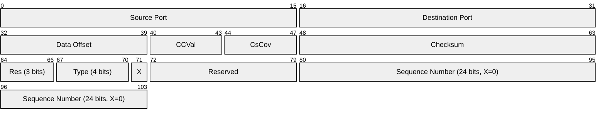
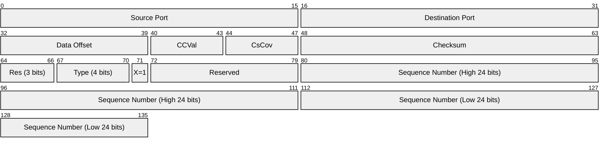
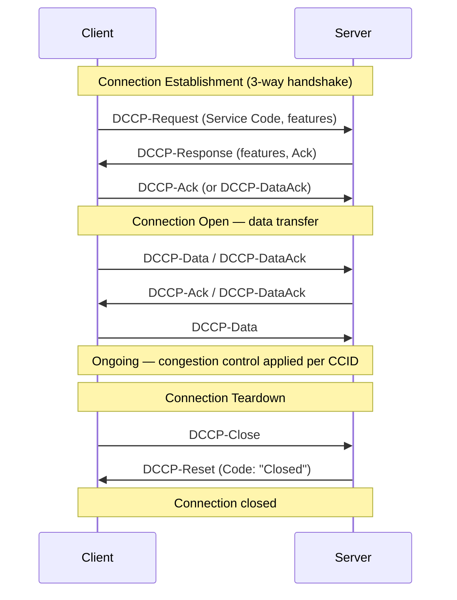
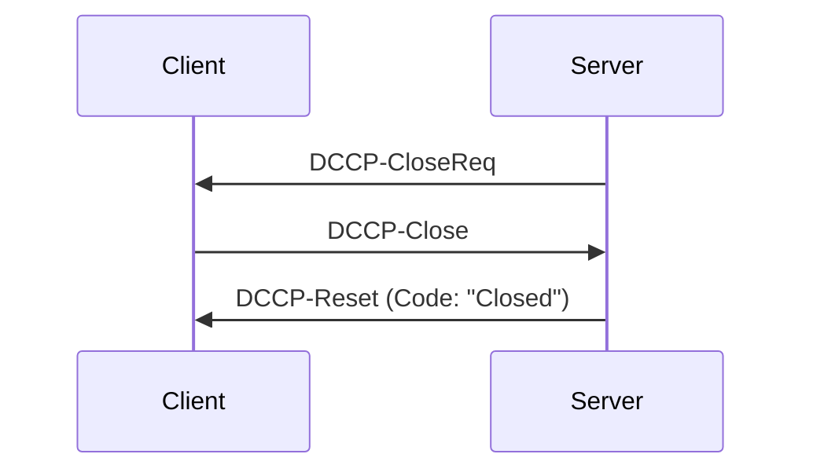
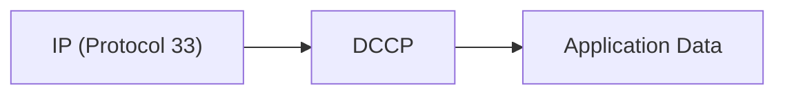

# DCCP (Datagram Congestion Control Protocol)

> **Standard:** [RFC 4340](https://www.rfc-editor.org/rfc/rfc4340) | **Layer:** Transport (Layer 4) | **Wireshark filter:** `dccp`

DCCP is a transport-layer protocol that provides unreliable, congestion-controlled datagram delivery. It fills the gap between TCP (reliable, congestion-controlled) and UDP (unreliable, no congestion control) by adding negotiable congestion control to datagrams without the overhead of reliability. DCCP is designed for applications where timely delivery matters more than completeness — streaming media, online gaming, VoIP, and real-time telemetry. It uses IP protocol number 33 and supports feature negotiation, allowing endpoints to agree on congestion control mechanisms.

## Generic Header

All DCCP packets share a generic header. The X bit determines whether the sequence number is 24 or 48 bits:

When X=1 (extended sequence numbers), the sequence number field expands to 48 bits:

## Key Fields

| Field | Size | Description |
|-------|------|-------------|
| Source Port | 16 bits | Sender's port number |
| Destination Port | 16 bits | Receiver's port number |
| Data Offset | 8 bits | Offset from start of header to payload (in 32-bit words) |
| CCVal | 4 bits | Used by the congestion control mechanism (CCID-specific) |
| CsCov (Checksum Coverage) | 4 bits | Portion of packet covered by checksum (0 = entire packet) |
| Checksum | 16 bits | Internet checksum (covers header + data per CsCov) |
| Res | 3 bits | Reserved, must be zero |
| Type | 4 bits | Packet type (0-9) |
| X (Extended) | 1 bit | 0 = 24-bit sequence numbers, 1 = 48-bit sequence numbers |
| Sequence Number | 24 or 48 bits | Packet sequence number |

## Packet Types

| Type | Value | Name | Description |
|------|-------|------|-------------|
| 0 | 0x0 | DCCP-Request | Client initiates connection (like TCP SYN) |
| 1 | 0x1 | DCCP-Response | Server accepts connection (like TCP SYN-ACK) |
| 2 | 0x2 | DCCP-Data | Application data |
| 3 | 0x3 | DCCP-Ack | Acknowledgment only (no data) |
| 4 | 0x4 | DCCP-DataAck | Data plus acknowledgment (piggybacked) |
| 5 | 0x5 | DCCP-CloseReq | Server requests connection close |
| 6 | 0x6 | DCCP-Close | Close the connection |
| 7 | 0x7 | DCCP-Reset | Abort the connection (with reason code) |
| 8 | 0x8 | DCCP-Sync | Re-synchronize sequence numbers after loss |
| 9 | 0x9 | DCCP-SyncAck | Acknowledge a Sync |

## Connection Lifecycle

DCCP uses a three-way handshake for connection setup, similar to TCP:

### Server-Initiated Close

The server can request the client to initiate the close:

## Congestion Control IDs (CCIDs)

DCCP's key innovation is pluggable congestion control, negotiated via feature negotiation during connection setup:

| CCID | Name | RFC | Behavior |
|------|------|-----|----------|
| 2 | TCP-like Congestion Control | [RFC 4341](https://www.rfc-editor.org/rfc/rfc4341) | AIMD (additive increase, multiplicative decrease) — mimics TCP Reno/NewReno |
| 3 | TCP-Friendly Rate Control (TFRC) | [RFC 4342](https://www.rfc-editor.org/rfc/rfc4342) | Equation-based — smoother rate, avoids halving; good for streaming |

### CCID 2 vs CCID 3

| Property | CCID 2 (TCP-like) | CCID 3 (TFRC) |
|----------|-------------------|---------------|
| Rate response to loss | Halves sending rate (like TCP) | Smoothly adjusts via TCP throughput equation |
| Burstiness | Bursty (like TCP) | Smooth sending rate |
| Best for | Bulk data transfer, applications tolerant of rate variation | Streaming media, VoIP, applications needing stable rate |
| Ack mechanism | Ack Vectors (selective ack) | Loss event rates |
| Fairness | TCP-fair | TCP-friendly (does not starve TCP) |

## Feature Negotiation

DCCP uses options in DCCP-Request and DCCP-Response to negotiate features:

| Feature | Description |
|---------|-------------|
| CCID | Congestion Control ID for each half-connection |
| Allow Short Seqno | Permit 24-bit sequence numbers (X=0) |
| Sequence Window | Size of valid sequence number window |
| ECN Incapable | Whether endpoint cannot use ECN |
| Ack Ratio | How many data packets per Ack (CCID 2) |
| Send Ack Vector | Whether Ack Vectors are sent (CCID 2) |

Each half-connection can use a different CCID — for example, CCID 2 in one direction and CCID 3 in the other.

## Service Codes

DCCP connections are identified by a 32-bit Service Code in the DCCP-Request, allowing a server to demultiplex to the correct application (similar to TCP's role of port numbers, but application-level):

| Example | Service Code | Description |
|---------|-------------|-------------|
| SIP (audio) | 1717858423 | VoIP signaling |
| RTP (audio) | Application-defined | Media stream |

## Reset Codes

DCCP-Reset packets include a reason code:

| Code | Name | Description |
|------|------|-------------|
| 0 | Unspecified | No reason given |
| 1 | Closed | Normal close |
| 2 | Aborted | Connection aborted |
| 3 | No Connection | No matching connection |
| 4 | Packet Error | Invalid packet |
| 5 | Option Error | Invalid option |
| 6 | Mandatory Error | Mandatory option not understood |
| 7 | Connection Refused | Service Code not available |
| 8 | Bad Service Code | Service Code does not match |
| 9 | Too Busy | Server overloaded |
| 10 | Bad Init Cookie | Init Cookie validation failed |
| 11 | Aggression Penalty | Rate exceeded what congestion control allows |

## DCCP vs TCP vs UDP vs SCTP

| Feature | DCCP | TCP | UDP | SCTP |
|---------|------|-----|-----|------|
| IP Protocol | 33 | 6 | 17 | 132 |
| Reliable delivery | No | Yes | No | Yes (per-stream) |
| Ordered delivery | No | Yes | No | Optional per-stream |
| Congestion control | Yes (pluggable) | Yes (built-in) | No | Yes |
| Connection-oriented | Yes | Yes | No | Yes |
| Multi-homing | No | No | No | Yes |
| Multi-streaming | No | No | No | Yes |
| Message boundaries | Yes | No (byte stream) | Yes | Yes |
| Handshake | 3-way | 3-way | None | 4-way |
| Use case | Streaming, VoIP, gaming | Web, file transfer | DNS, NTP, gaming | Telephony signaling |

## Use Cases

| Application | Why DCCP |
|-------------|----------|
| Streaming media | Timely delivery matters more than completeness; smooth rate (CCID 3) |
| Online gaming | Low-latency datagrams; stale data is worthless |
| VoIP | Congestion control without reliability overhead |
| Telemetry | Congestion-safe sensor data without TCP's retransmission delay |

## Encapsulation

## Standards

| Document | Title |
|----------|-------|
| [RFC 4340](https://www.rfc-editor.org/rfc/rfc4340) | Datagram Congestion Control Protocol (DCCP) |
| [RFC 4341](https://www.rfc-editor.org/rfc/rfc4341) | Profile for DCCP Congestion Control ID 2: TCP-like |
| [RFC 4342](https://www.rfc-editor.org/rfc/rfc4342) | Profile for DCCP Congestion Control ID 3: TFRC |
| [RFC 5595](https://www.rfc-editor.org/rfc/rfc5595) | The DCCP Service Codes |
| [RFC 5596](https://www.rfc-editor.org/rfc/rfc5596) | DCCP Simultaneous-Open |
| [RFC 6773](https://www.rfc-editor.org/rfc/rfc6773) | DCCP-UDP: A Datagram Congestion Control Protocol UDP Encapsulation for NAT Traversal |

## See Also

- [TCP](tcp.md) — reliable, congestion-controlled byte stream
- [UDP](udp.md) — unreliable datagrams without congestion control
- [SCTP](sctp.md) — reliable, multi-stream transport
- [QUIC](quic.md) — modern encrypted transport over UDP
- [RTP](../voip/rtp.md) — often carried over DCCP for congestion-controlled media
