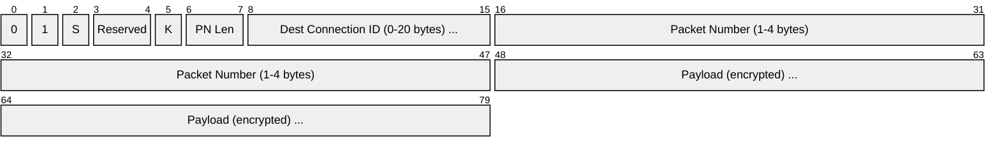
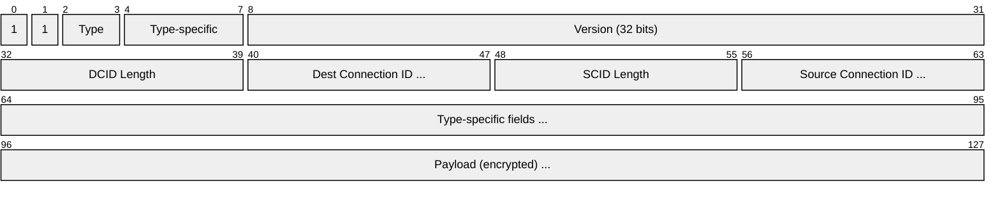
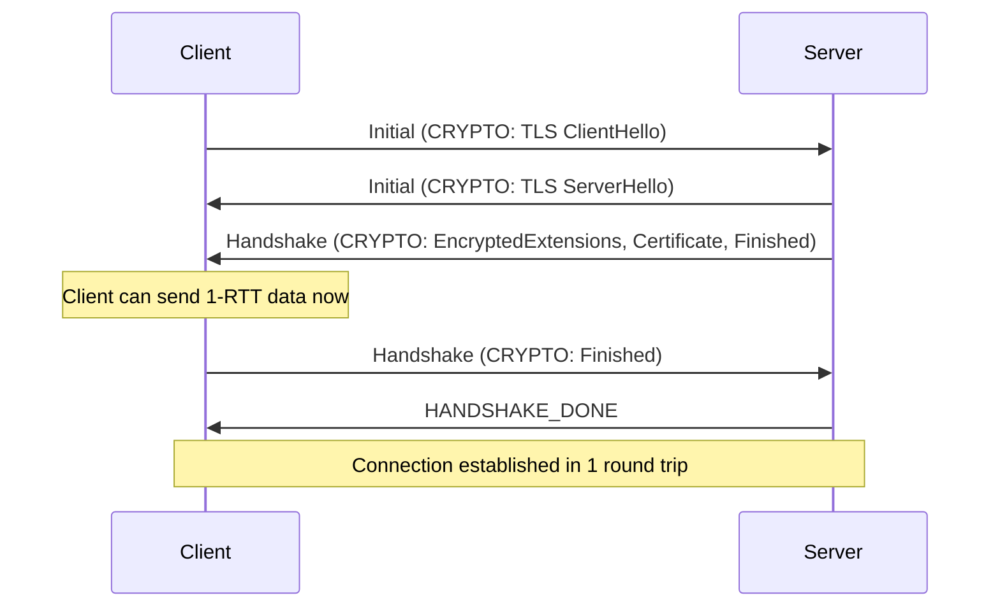
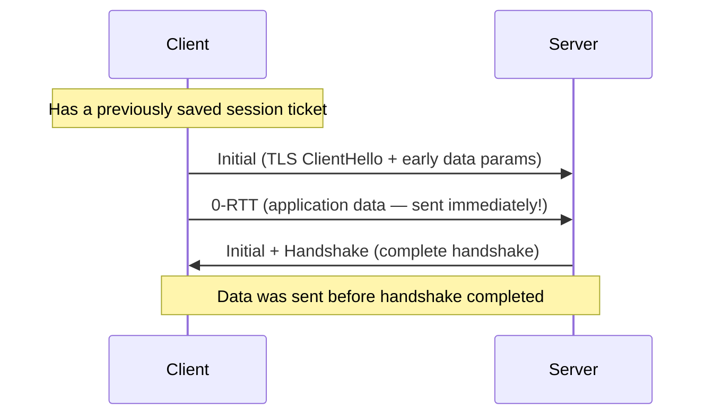
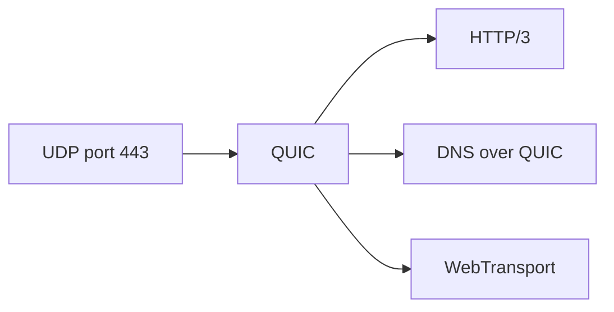

# QUIC

> **Standard:** [RFC 9000](https://www.rfc-editor.org/rfc/rfc9000) | **Layer:** Transport (Layer 4) | **Wireshark filter:** `quic`

QUIC is a modern transport protocol built on UDP that provides reliable, multiplexed, encrypted connections with reduced latency. Originally developed by Google and standardized by the IETF, QUIC integrates TLS 1.3 encryption into the transport layer, eliminating the separate TLS handshake. It supports multiple independent streams within a single connection (no head-of-line blocking), connection migration across network changes, and 0-RTT connection resumption. QUIC is the transport for HTTP/3 and is rapidly replacing TCP+TLS for web traffic.

## Packet (Short Header — most data packets)

## Packet (Long Header — handshake packets)

## Key Fields

| Field | Size | Description |
|-------|------|-------------|
| Header Form | 1 bit | 0 = Short header, 1 = Long header |
| Fixed Bit | 1 bit | Always 1 (for demuxing from other protocols) |
| Type (long) | 2 bits | Initial, 0-RTT, Handshake, or Retry |
| Spin Bit (short) | 1 bit | Latency measurement signal |
| Key Phase (short) | 1 bit | Indicates which key generation is in use |
| Version | 32 bits | QUIC version (1 = RFC 9000) |
| Dest Connection ID | 0-20 bytes | Identifies the connection at the receiver |
| Source Connection ID | 0-20 bytes | Identifies the connection at the sender (long header only) |
| Packet Number | 1-4 bytes | Per-packet-number-space sequence number |
| Payload | Variable | Encrypted frames |

## Long Header Types

| Type | Value | Description |
|------|-------|-------------|
| Initial | 0x00 | First handshake packet (carries CRYPTO frames with TLS ClientHello) |
| 0-RTT | 0x01 | Early data sent before handshake completes |
| Handshake | 0x02 | Continues the TLS handshake |
| Retry | 0x03 | Server requests address validation |

## Frame Types

QUIC payloads contain one or more frames:

| Type | Name | Description |
|------|------|-------------|
| 0x00 | PADDING | No-op padding |
| 0x01 | PING | Keepalive / elicit ACK |
| 0x02-0x03 | ACK | Acknowledge received packets |
| 0x04 | RESET_STREAM | Abruptly terminate a stream |
| 0x05 | STOP_SENDING | Request peer stop sending on a stream |
| 0x06 | CRYPTO | TLS handshake data (replaces TLS record layer) |
| 0x07 | NEW_TOKEN | Token for future 0-RTT connection |
| 0x08-0x0F | STREAM | Application data on a stream |
| 0x10 | MAX_DATA | Connection-level flow control |
| 0x11 | MAX_STREAM_DATA | Stream-level flow control |
| 0x12-0x13 | MAX_STREAMS | Limit on number of streams |
| 0x18 | NEW_CONNECTION_ID | Provide alternative connection IDs |
| 0x19 | RETIRE_CONNECTION_ID | Retire a connection ID |
| 0x1A | PATH_CHALLENGE | Path validation |
| 0x1B | PATH_RESPONSE | Response to path validation |
| 0x1C-0x1D | CONNECTION_CLOSE | Close the connection (with error) |
| 0x1E | HANDSHAKE_DONE | Server confirms handshake complete |

## Connection Establishment

### 1-RTT Handshake

### 0-RTT Resumption

0-RTT data is vulnerable to replay attacks — servers must handle this.

## Streams

QUIC multiplexes multiple independent streams within a single connection:

| Stream ID Bits | Type |
|----------------|------|
| Least significant 2 bits = 00 | Client-initiated, bidirectional |
| Least significant 2 bits = 01 | Server-initiated, bidirectional |
| Least significant 2 bits = 10 | Client-initiated, unidirectional |
| Least significant 2 bits = 11 | Server-initiated, unidirectional |

Key advantage: **no head-of-line blocking**. A lost packet on stream 1 doesn't stall streams 2 and 3 (unlike TCP where all streams share one byte sequence).

## Connection Migration

QUIC connections are identified by Connection IDs, not IP:port tuples. When a device changes networks (Wi-Fi → cellular), it can:

1. Send a PATH_CHALLENGE on the new path
2. Receive PATH_RESPONSE validating the path
3. Continue the connection seamlessly — no new handshake needed

## QUIC vs TCP+TLS

| Feature | TCP + TLS 1.3 | QUIC |
|---------|---------------|------|
| Handshake | 2 RTT (TCP + TLS) or 1 RTT (TFO + TLS) | 1 RTT (0-RTT for resumption) |
| Encryption | Optional (STARTTLS) | Mandatory (built-in TLS 1.3) |
| Multiplexing | Application-level only | Native streams (no HOL blocking) |
| Connection migration | Not supported | Supported via Connection IDs |
| Loss recovery | Per-connection | Per-stream |
| Header encryption | No | Partial (packet number encrypted) |
| Middlebox ossification | High (TCP options often stripped) | Resistant (encrypted, UDP-based) |

## Encapsulation

## Standards

| Document | Title |
|----------|-------|
| [RFC 9000](https://www.rfc-editor.org/rfc/rfc9000) | QUIC: A UDP-Based Multiplexed and Secure Transport |
| [RFC 9001](https://www.rfc-editor.org/rfc/rfc9001) | Using TLS to Secure QUIC |
| [RFC 9002](https://www.rfc-editor.org/rfc/rfc9002) | QUIC Loss Detection and Congestion Control |
| [RFC 9114](https://www.rfc-editor.org/rfc/rfc9114) | HTTP/3 |
| [RFC 9221](https://www.rfc-editor.org/rfc/rfc9221) | QUIC Datagrams (unreliable) |
| [RFC 9250](https://www.rfc-editor.org/rfc/rfc9250) | DNS over Dedicated QUIC Connections |

## See Also

- [UDP](udp.md) — QUIC runs over UDP
- [TCP](tcp.md) — the transport protocol QUIC aims to replace
- [TLS](../application-layer/tls.md) — QUIC integrates TLS 1.3
- [HTTP](../application-layer/http.md) — HTTP/3 runs over QUIC
