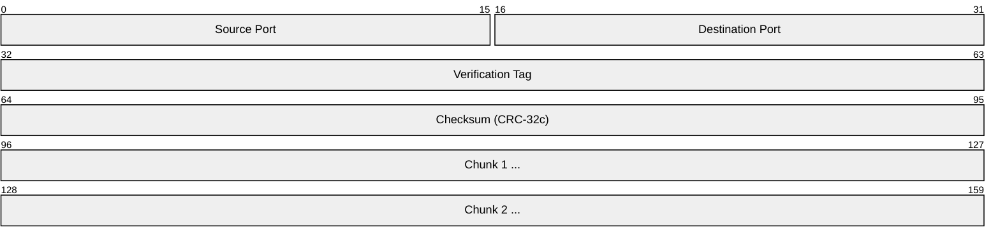
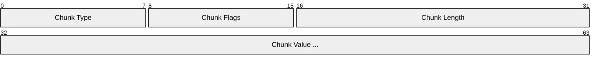
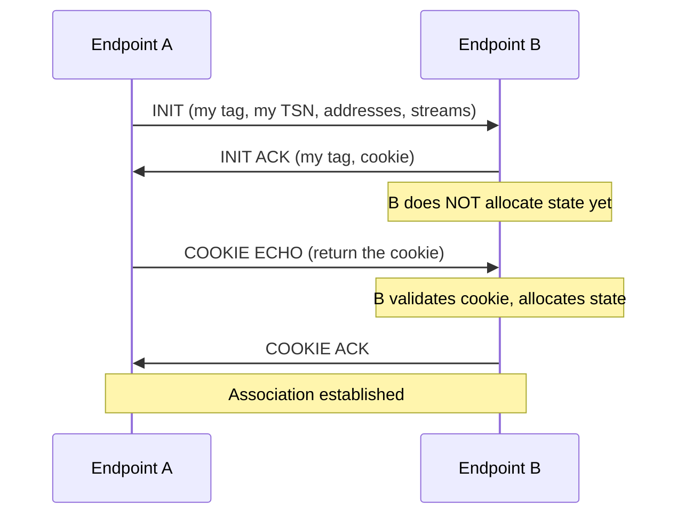
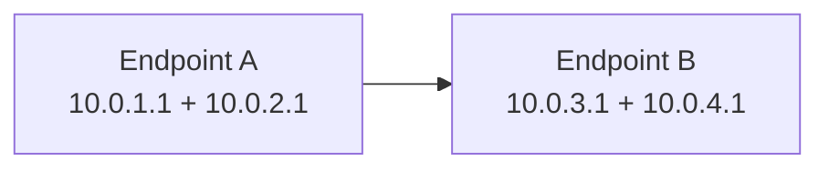
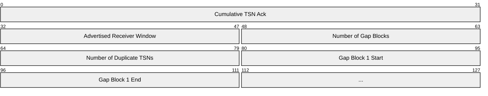
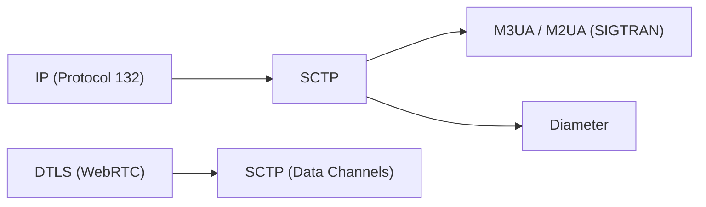

# SCTP (Stream Control Transmission Protocol)

> **Standard:** [RFC 9260](https://www.rfc-editor.org/rfc/rfc9260) | **Layer:** Transport (Layer 4) | **Wireshark filter:** `sctp`

SCTP is a reliable, message-oriented transport protocol that combines features of TCP and UDP. It provides reliable delivery like TCP but preserves message boundaries (not a byte stream), supports multiple independent streams within a single association (no head-of-line blocking), and offers multi-homing (multiple IP addresses per endpoint for failover). SCTP is used by SIGTRAN (SS7 over IP), Diameter (LTE AAA), WebRTC data channels (inside DTLS), and some HPC applications.

## Packet

An SCTP packet has a 12-byte common header followed by one or more chunks.

## Key Fields

| Field | Size | Description |
|-------|------|-------------|
| Source Port | 16 bits | Sender's port |
| Destination Port | 16 bits | Receiver's port |
| Verification Tag | 32 bits | Association identifier (anti-spoofing) |
| Checksum | 32 bits | CRC-32c over the entire packet |
| Chunks | Variable | One or more typed chunks |

## Chunk Format

### Chunk Types

| Type | Name | Description |
|------|------|-------------|
| 0 | DATA | User data |
| 1 | INIT | Initiate an association |
| 2 | INIT ACK | Acknowledge initiation (with cookie) |
| 3 | SACK | Selective Acknowledgment |
| 4 | HEARTBEAT | Path keepalive |
| 5 | HEARTBEAT ACK | Heartbeat response |
| 6 | ABORT | Abort the association |
| 7 | SHUTDOWN | Graceful close (no more data from sender) |
| 8 | SHUTDOWN ACK | Acknowledge shutdown |
| 9 | ERROR | Report error conditions |
| 10 | COOKIE ECHO | Send cookie for association validation |
| 11 | COOKIE ACK | Acknowledge cookie |
| 14 | SHUTDOWN COMPLETE | Close complete |
| 0xC0 | FORWARD TSN | Skip undeliverable chunks (RFC 3758) |

## Association Setup (4-Way Handshake)

SCTP uses a 4-way handshake with a cookie to prevent SYN flood attacks:

No state is allocated at the responder until the COOKIE ECHO is validated — DoS resistant by design.

## Key Features

### Multi-Streaming

Multiple independent streams within one association — loss on stream 1 doesn't block stream 2:

| Feature | TCP | SCTP |
|---------|-----|------|
| Streams | 1 byte stream | N independent message streams |
| HOL blocking | Yes (one lost segment blocks all) | No (only affected stream stalls) |
| Message boundaries | No (byte stream) | Yes (message-oriented) |

### Multi-Homing

Each endpoint can have multiple IP addresses. If one path fails, traffic fails over:

HEARTBEAT chunks monitor reachability of each path. On failure, traffic switches to an alternate path.

### Selective Acknowledgment (SACK)

## SCTP vs TCP vs UDP

| Feature | TCP | UDP | SCTP |
|---------|-----|-----|------|
| Connection | Stream | Connectionless | Association |
| Reliability | Full | None | Full or partial (PR-SCTP) |
| Message boundaries | No | Yes | Yes |
| Multi-streaming | No | N/A | Yes |
| Multi-homing | No | No | Yes |
| Head-of-line blocking | Yes | No | No (per stream) |
| Setup | 3-way handshake | None | 4-way handshake (cookie) |

## Encapsulation

## Standards

| Document | Title |
|----------|-------|
| [RFC 9260](https://www.rfc-editor.org/rfc/rfc9260) | Stream Control Transmission Protocol (current) |
| [RFC 3758](https://www.rfc-editor.org/rfc/rfc3758) | Partial Reliability Extension (PR-SCTP) |
| [RFC 5061](https://www.rfc-editor.org/rfc/rfc5061) | Dynamic Address Reconfiguration |

## See Also

- [TCP](tcp.md) — reliable byte-stream transport
- [UDP](udp.md) — unreliable datagram transport
- [SS7](../telecom/ss7.md) — SIGTRAN carries SS7 over SCTP
- [WebRTC](../application-layer/webrtc.md) — data channels use SCTP over DTLS
