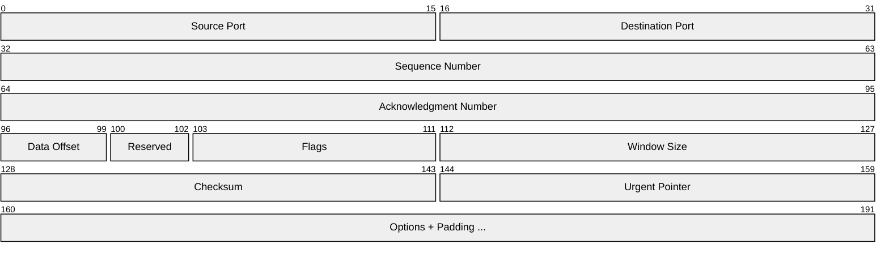
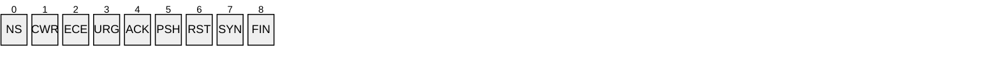
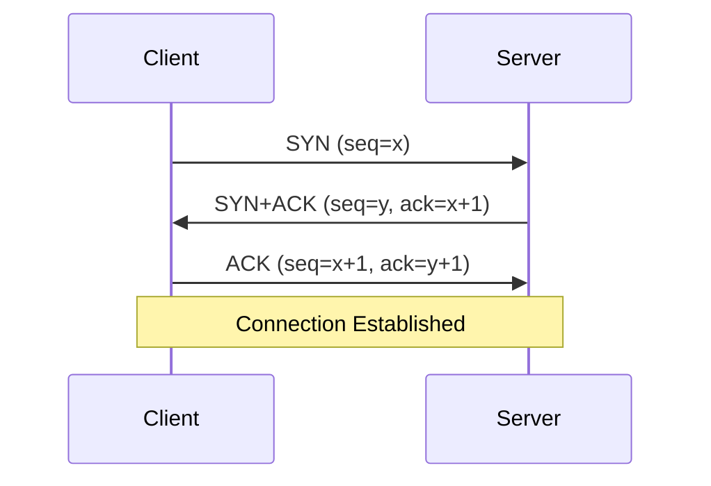
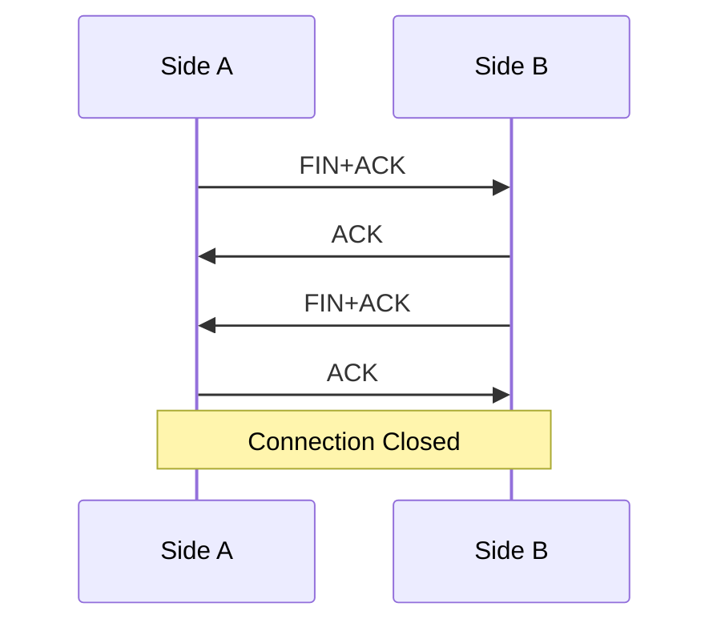
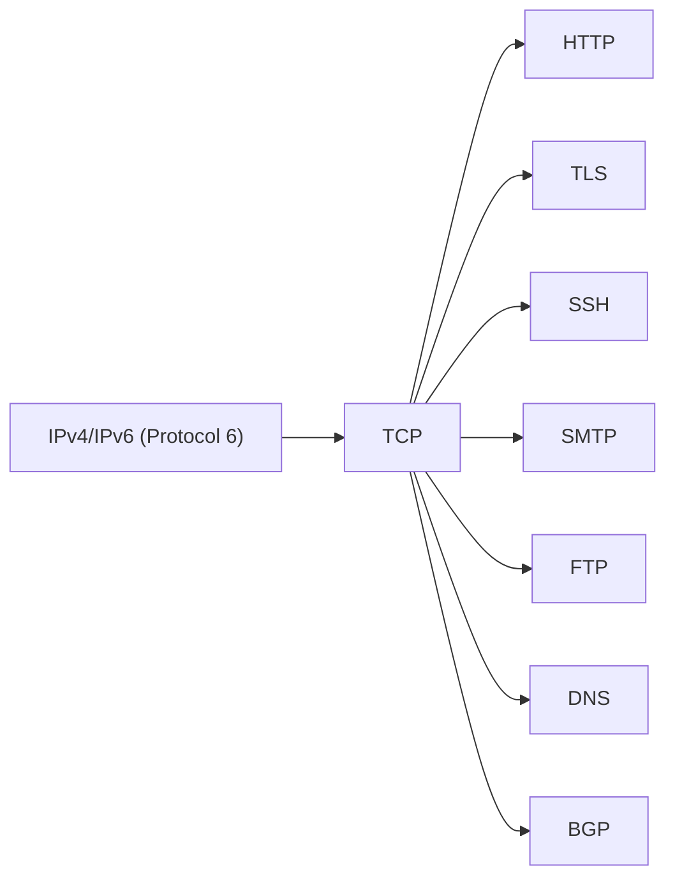

# TCP (Transmission Control Protocol)

> **Standard:** [RFC 9293](https://www.rfc-editor.org/rfc/rfc9293) | **Layer:** Transport (Layer 4) | **Wireshark filter:** `tcp`

TCP provides reliable, ordered, connection-oriented byte-stream delivery over IP. It handles segmentation, flow control (sliding window), congestion control, and retransmission of lost data. TCP is the transport behind HTTP, SSH, SMTP, FTP, and most connection-oriented Internet applications.

## Header

The minimum header size is 20 bytes (Data Offset = 5). Options extend it up to 60 bytes.

## Key Fields

| Field | Size | Description |
|-------|------|-------------|
| Source Port | 16 bits | Sender's port number |
| Destination Port | 16 bits | Receiver's port number |
| Sequence Number | 32 bits | Byte offset of the first data byte in this segment |
| Acknowledgment Number | 32 bits | Next sequence number the sender expects to receive |
| Data Offset | 4 bits | Header length in 32-bit words (min 5, max 15) |
| Reserved | 3 bits | Reserved for future use; must be zero |
| Flags | 9 bits | Control flags |
| Window Size | 16 bits | Receiver's available buffer space in bytes |
| Checksum | 16 bits | Error check over header, data, and pseudo-header |
| Urgent Pointer | 16 bits | Offset from sequence number to last urgent data byte |
| Options | Variable | Optional fields (MSS, window scale, timestamps, SACK, etc.) |

## Field Details

### Flags

| Flag | Name | Description |
|------|------|-------------|
| NS | ECN-Nonce | ECN nonce concealment protection |
| CWR | Congestion Window Reduced | Sender reduced its congestion window |
| ECE | ECN-Echo | ECN capability or congestion experienced |
| URG | Urgent | Urgent pointer field is valid |
| ACK | Acknowledgment | Acknowledgment number field is valid |
| PSH | Push | Receiver should deliver data to application immediately |
| RST | Reset | Abort the connection |
| SYN | Synchronize | Initiate a connection (synchronize sequence numbers) |
| FIN | Finish | Sender has finished sending data |

### Three-Way Handshake

### Connection Teardown

### Common Options

| Kind | Length | Name | Description |
|------|--------|------|-------------|
| 0 | 1 | End of Options | Marks end of options list |
| 1 | 1 | No-Operation | Padding for alignment |
| 2 | 4 | MSS | Maximum Segment Size (typically 1460 for Ethernet) |
| 3 | 3 | Window Scale | Multiplier for Window Size field (up to 2^14) |
| 4 | 2 | SACK Permitted | Selective Acknowledgment is supported |
| 5 | Variable | SACK | Selective Acknowledgment data blocks |
| 8 | 10 | Timestamps | Round-trip time measurement and PAWS |

### Well-Known Ports

| Port | Service |
|------|---------|
| 20, 21 | FTP |
| 22 | [SSH](../remote-access/ssh.md) |
| 23 | Telnet |
| 25 | SMTP |
| 53 | [DNS](../naming/dns.md) |
| 80 | [HTTP](../web/http.md) |
| 110 | POP3 |
| 143 | IMAP |
| 443 | HTTPS ([TLS](../security/tls.md)) |
| 993 | IMAPS |
| 3389 | RDP |

## Encapsulation

## Standards

| Document | Title |
|----------|-------|
| [RFC 9293](https://www.rfc-editor.org/rfc/rfc9293) | Transmission Control Protocol (TCP) — current spec (replaces RFC 793) |
| [RFC 793](https://www.rfc-editor.org/rfc/rfc793) | Transmission Control Protocol — original specification |
| [RFC 7323](https://www.rfc-editor.org/rfc/rfc7323) | TCP Extensions for High Performance (window scaling, timestamps) |
| [RFC 2018](https://www.rfc-editor.org/rfc/rfc2018) | TCP Selective Acknowledgment Options (SACK) |
| [RFC 5681](https://www.rfc-editor.org/rfc/rfc5681) | TCP Congestion Control |
| [RFC 6298](https://www.rfc-editor.org/rfc/rfc6298) | Computing TCP's Retransmission Timer |
| [RFC 3168](https://www.rfc-editor.org/rfc/rfc3168) | Explicit Congestion Notification (ECN) |

## See Also

- [UDP](udp.md)
- [IPv4](../network-layer/ip.md)
- [IPv6](../network-layer/ipv6.md)
- [TLS](../security/tls.md)
- [HTTP](../web/http.md)
