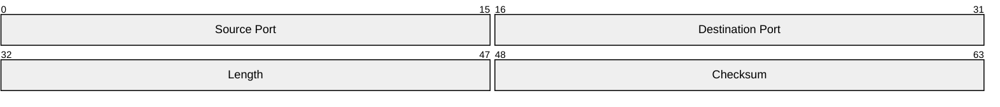
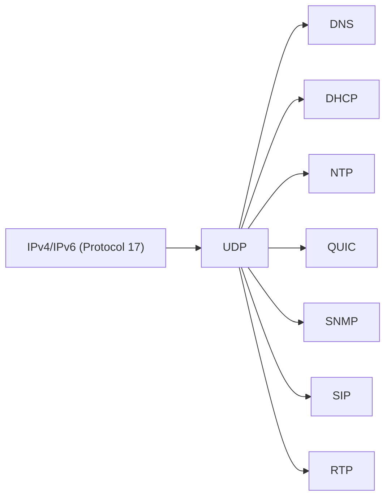

# UDP (User Datagram Protocol)

> **Standard:** [RFC 768](https://www.rfc-editor.org/rfc/rfc768) | **Layer:** Transport (Layer 4) | **Wireshark filter:** `udp`

UDP provides a minimal, connectionless transport service. It adds port-based multiplexing and an optional checksum to IP, but offers no reliability, ordering, or flow control. This simplicity makes UDP ideal for latency-sensitive applications (VoIP, gaming, video streaming), service discovery (DNS, DHCP, mDNS), and as the foundation for protocols that implement their own reliability (QUIC, DTLS).

## Header

The UDP header is exactly 8 bytes — one of the simplest headers in the protocol stack.

## Key Fields

| Field | Size | Description |
|-------|------|-------------|
| Source Port | 16 bits | Sender's port (optional; 0 if not used) |
| Destination Port | 16 bits | Receiver's port |
| Length | 16 bits | Total datagram size in bytes (header + payload), minimum 8 |
| Checksum | 16 bits | Error check over header, data, and pseudo-header (optional in IPv4, mandatory in IPv6) |

## Field Details

### Checksum

The checksum is computed over a pseudo-header (source IP, destination IP, protocol, UDP length), the UDP header, and the payload. In IPv4, a checksum value of 0 means no checksum was computed. In IPv6, the checksum is mandatory per [RFC 8200](https://www.rfc-editor.org/rfc/rfc8200).

### Well-Known Ports

| Port | Service |
|------|---------|
| 53 | [DNS](../naming/dns.md) |
| 67, 68 | [DHCP](../naming/dhcp.md) |
| 69 | TFTP |
| 123 | [NTP](../naming/ntp.md) |
| 161, 162 | SNMP |
| 443 | QUIC / HTTP/3 |
| 500 | IKE (IPsec) |
| 514 | Syslog |
| 1900 | SSDP (UPnP) |
| 4500 | IPsec NAT Traversal |
| 5353 | mDNS |
| 5060 | SIP |

### UDP vs TCP

| Feature | UDP | TCP |
|---------|-----|-----|
| Connection | Connectionless | Connection-oriented |
| Reliability | None | Retransmission, ordering |
| Flow Control | None | Sliding window |
| Header Size | 8 bytes | 20-60 bytes |
| Latency | Lower | Higher (handshake + ACKs) |
| Broadcast/Multicast | Supported | Not supported |

## Encapsulation

## Standards

| Document | Title |
|----------|-------|
| [RFC 768](https://www.rfc-editor.org/rfc/rfc768) | User Datagram Protocol |
| [RFC 8085](https://www.rfc-editor.org/rfc/rfc8085) | UDP Usage Guidelines |
| [RFC 8200](https://www.rfc-editor.org/rfc/rfc8200) | IPv6 — mandates UDP checksum |

## See Also

- [TCP](tcp.md)
- [DNS](../naming/dns.md)
- [DHCP](../naming/dhcp.md)
- [NTP](../naming/ntp.md)
- [IPv4](../network-layer/ip.md)
