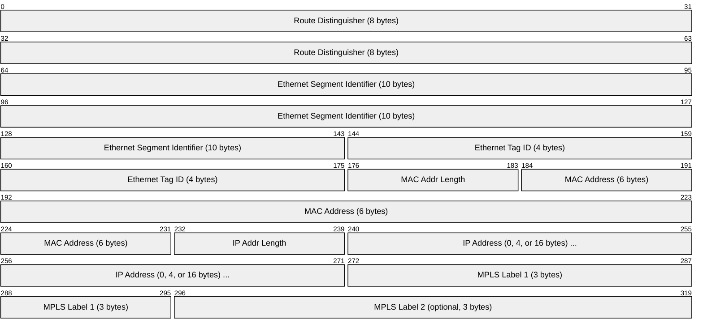
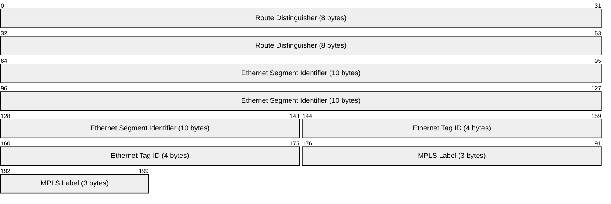
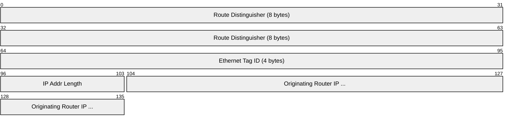
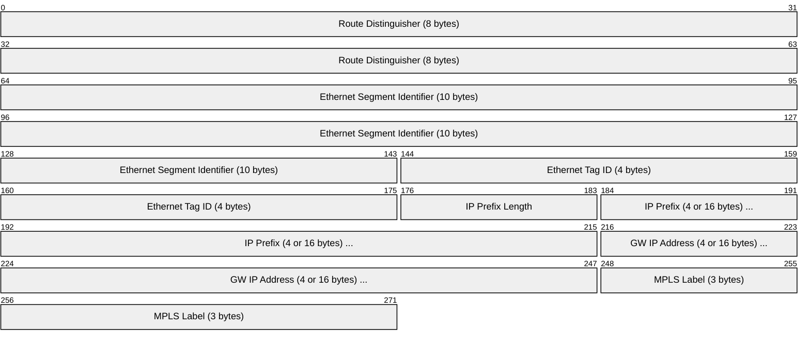
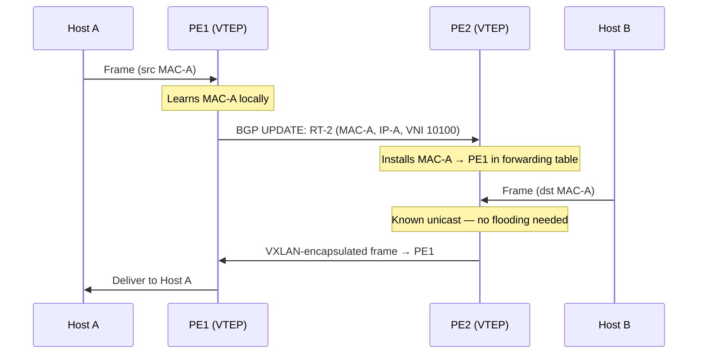
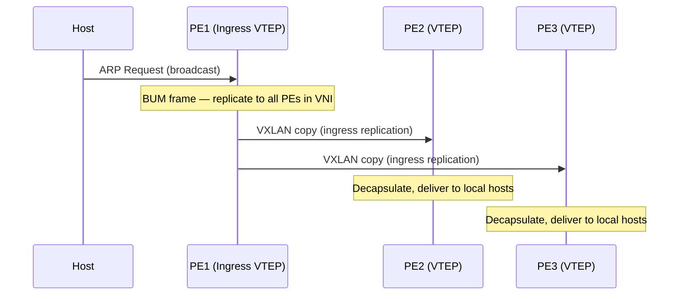
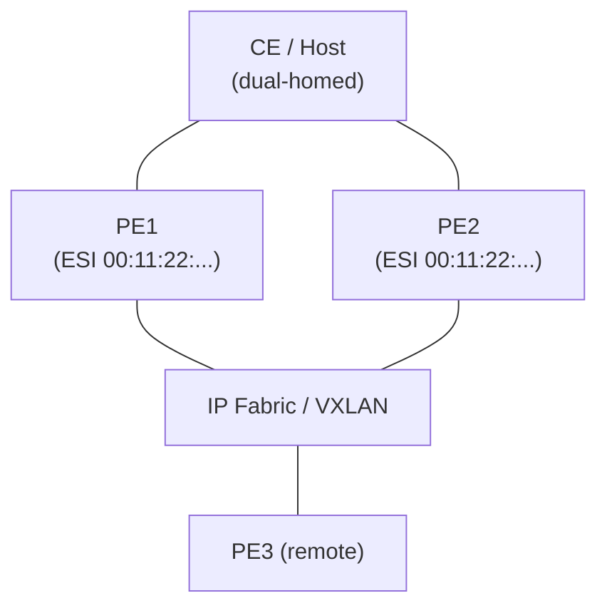

# EVPN (Ethernet VPN)

> **Standard:** [RFC 7432](https://www.rfc-editor.org/rfc/rfc7432) | **Layer:** Control Plane (BGP address family) | **Wireshark filter:** `bgp.evpn`

EVPN is a BGP-based control plane for Layer 2 and Layer 3 VPN services over an IP/MPLS or IP/VXLAN fabric. It replaces traditional flood-and-learn with a control-plane-driven MAC (and IP) advertisement model, eliminating most BUM (Broadcast, Unknown unicast, Multicast) flooding. EVPN is the standard overlay control plane for modern data center fabrics (VXLAN/EVPN), service provider Ethernet VPN services, and multi-tenant networks. It supports all-active multihoming, MAC mobility, ARP/ND suppression, and integrated routing and bridging (IRB).

## BGP EVPN Address Family

EVPN is carried as a BGP address family using Multiprotocol BGP (MP-BGP):

| Parameter | Value |
|-----------|-------|
| AFI | 25 (L2VPN) |
| SAFI | 70 (EVPN) |
| TCP Port | 179 (standard BGP) |
| Encapsulation | VXLAN (RFC 8365), MPLS, or NVGRE |

## EVPN NLRI (Route Types)

All EVPN routes are carried in BGP UPDATE messages as MP_REACH_NLRI or MP_UNREACH_NLRI attributes. Each route type serves a distinct function:

| Route Type | Name | Purpose |
|------------|------|---------|
| 1 | Ethernet Auto-Discovery (A-D) | Multihoming — fast convergence, aliasing, split horizon |
| 2 | MAC/IP Advertisement | Advertise MAC and optional IP bindings |
| 3 | Inclusive Multicast Ethernet Tag | Discover PEs and build BUM flooding trees |
| 4 | Ethernet Segment | Designated Forwarder (DF) election for multihoming |
| 5 | IP Prefix | Advertise IP prefixes for inter-subnet routing |

## Route Type 2 (MAC/IP Advertisement)

The workhorse route type. Each learned MAC (and optionally its IP binding) is advertised via BGP:

| Field | Size | Description |
|-------|------|-------------|
| Route Distinguisher (RD) | 8 bytes | Makes the route unique per PE (Type:Value format) |
| Ethernet Segment Identifier (ESI) | 10 bytes | Identifies the multihomed Ethernet segment (0 = single-homed) |
| Ethernet Tag ID | 4 bytes | VLAN or service instance identifier (0 in VLAN-based mode) |
| MAC Address Length | 1 byte | Always 48 (bits) for Ethernet |
| MAC Address | 6 bytes | The learned MAC address |
| IP Address Length | 1 byte | 0 (MAC only), 32 (IPv4), or 128 (IPv6) |
| IP Address | 0, 4, or 16 bytes | Host IP for ARP/ND suppression and IRB |
| MPLS Label 1 | 3 bytes | VNI/label for Layer 2 (maps to VXLAN VNI) |
| MPLS Label 2 | 3 bytes | VNI/label for Layer 3 (optional, for asymmetric IRB) |

## Route Type 1 (Ethernet Auto-Discovery)

Used for multihoming — advertised per Ethernet Segment (per-ES) or per EVI (per-VLAN):

| Function | Scope | Description |
|----------|-------|-------------|
| Aliasing | Per-EVI | Allows remote PEs to load-balance to all active PEs on a segment |
| Fast convergence | Per-ES | Mass withdraw all MACs when a link fails |
| Split horizon | Per-ES | Prevents BUM loops in multihoming |

## Route Type 3 (Inclusive Multicast)

Advertised by each PE to indicate participation in a given broadcast domain. Used to build ingress replication lists or multicast trees for BUM traffic:

## Route Type 5 (IP Prefix)

Advertises IP prefixes for inter-subnet (Layer 3) routing across the EVPN fabric:

## MAC Learning via BGP

In traditional bridging, MACs are learned from the data plane (flood-and-learn). EVPN moves MAC learning to the control plane:

## BUM Traffic Handling

Broadcast, Unknown unicast, and Multicast traffic is handled via ingress replication (head-end replication) or multicast underlay:

## Multihoming

EVPN supports a host or CE device being connected to multiple PEs via the same Ethernet Segment:

### Multihoming Modes

| Mode | Description |
|------|-------------|
| All-Active | All PEs forward traffic simultaneously — full load balancing |
| Single-Active | Only one PE (the DF) forwards — standby takes over on failure |

### Designated Forwarder (DF) Election

Route Type 4 (Ethernet Segment route) is exchanged between PEs sharing an ES to elect the Designated Forwarder for each VLAN:

| Step | Description |
|------|-------------|
| 1 | Each PE advertises RT-4 with its ESI and Originating Router IP |
| 2 | All PEs on the segment discover each other |
| 3 | A deterministic algorithm assigns each VLAN to one PE as DF |
| 4 | Only the DF forwards BUM traffic for that VLAN (prevents duplicates) |

### Ethernet Segment Identifier (ESI)

| Byte | Description |
|------|-------------|
| Type (1 byte) | 0x00 = manual, 0x01 = LACP, 0x02 = STP, 0x03 = MAC-based, 0x05 = router ID |
| Value (9 bytes) | Unique identifier derived from the type-specific method |

An ESI of all zeros (Type 0, Value 0) means the CE is single-homed.

## ARP/ND Suppression

EVPN PEs cache MAC-IP bindings from RT-2 routes. When a host sends an ARP Request or IPv6 Neighbor Solicitation, the local PE can reply directly (proxy ARP/ND) without flooding:

| Benefit | Description |
|---------|-------------|
| Reduced flooding | ARP broadcasts do not cross the fabric |
| Lower latency | Local PE responds immediately from its cache |
| Fabric efficiency | Saves bandwidth, especially in large-scale fabrics |

## EVPN with VXLAN (RFC 8365)

The most common deployment model for data center fabrics:

| Component | Mapping |
|-----------|---------|
| EVPN Instance (EVI) | One per tenant or per VLAN |
| VNI | VXLAN Network Identifier (L2 VNI per bridge domain) |
| VTEP | VXLAN Tunnel Endpoint (the PE) |
| RT-2 MPLS Label field | Carries the VXLAN VNI value |
| UDP port | 4789 (standard VXLAN) |
| Route Target | Controls route distribution between VTEPs |

### Encapsulation

## EVPN vs VPLS

| Feature | EVPN | VPLS |
|---------|------|------|
| MAC learning | Control plane (BGP) | Data plane (flood-and-learn) |
| BUM handling | Ingress replication or multicast | Full mesh flooding |
| All-active multihoming | Yes | No (only single-active) |
| MAC mobility | Built-in (sequence numbers) | Not supported |
| ARP suppression | Yes | No |
| Integrated L3 (IRB) | Yes (RT-5, symmetric/asymmetric) | Separate |
| Scalability | Superior (reduced flooding) | Limited by BUM flooding |
| Standards | RFC 7432 | RFC 4761 / RFC 4762 |

## Standards

| Document | Title |
|----------|-------|
| [RFC 7432](https://www.rfc-editor.org/rfc/rfc7432) | BGP MPLS-Based Ethernet VPN |
| [RFC 8365](https://www.rfc-editor.org/rfc/rfc8365) | A Network Virtualization Overlay Solution Using EVPN |
| [RFC 9135](https://www.rfc-editor.org/rfc/rfc9135) | Integrated Routing and Bridging in EVPN |
| [RFC 9136](https://www.rfc-editor.org/rfc/rfc9136) | IP Prefix Advertisement in EVPN |
| [RFC 7209](https://www.rfc-editor.org/rfc/rfc7209) | Requirements for Ethernet VPN |
| [RFC 8584](https://www.rfc-editor.org/rfc/rfc8584) | Framework for EVPN Designated Forwarder Election |

## See Also

- [BGP](../routing/bgp.md) — the control-plane protocol that carries EVPN routes
- [VXLAN](vxlan.md) — the most common data-plane encapsulation for EVPN
- [Geneve](geneve.md) — alternative overlay encapsulation
- [L2TP](l2tp.md) — older Layer 2 tunneling
- [VLAN 802.1Q](../link-layer/vlan8021q.md) — traditional Layer 2 segmentation
