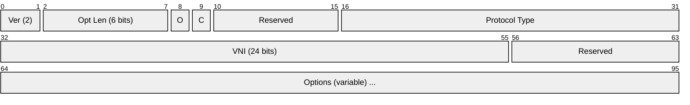
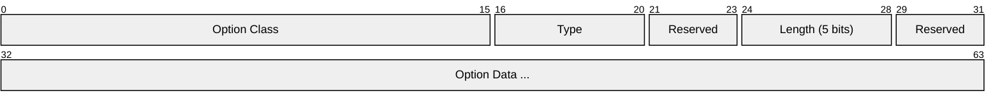
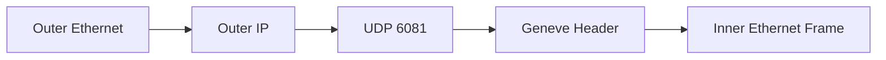

# Geneve (Generic Network Virtualization Encapsulation)

> **Standard:** [RFC 8926](https://www.rfc-editor.org/rfc/rfc8926) | **Layer:** Tunneling (Layer 2 over Layer 3) | **Wireshark filter:** `geneve`

Geneve is a network virtualization overlay protocol designed to be the single flexible encapsulation format that unifies and replaces VXLAN, NVGRE, and STT. Like VXLAN, it encapsulates Layer 2 frames in UDP/IP, but adds a variable-length options field that makes it extensally extensible without protocol revisions. Geneve is the default overlay in Open vSwitch (OVS), AWS VPC networking, and several SDN platforms. It is designed to be "future-proof" — new features are added via TLV options, not new protocol versions.

## Header

| Field | Size | Description |
|-------|------|-------------|
| Version | 2 bits | Always 0 |
| Opt Len | 6 bits | Length of options in 4-byte units |
| O (OAM) | 1 bit | 1 = this is an OAM packet (not data) |
| C (Critical) | 1 bit | 1 = contains critical options the receiver must understand |
| Protocol Type | 16 bits | EtherType of the inner payload (0x6558 = Ethernet) |
| VNI | 24 bits | Virtual Network Identifier (same as VXLAN VNI) |
| Options | Variable | Zero or more TLV options |

### Option TLV

| Field | Size | Description |
|-------|------|-------------|
| Option Class | 16 bits | Namespace for the option (vendor or standard) |
| Type | 5 bits | Option identifier within the class |
| Length | 5 bits | Option data length in 4-byte units |
| Data | Variable | Option-specific data |

## Geneve vs VXLAN

| Feature | VXLAN | Geneve |
|---------|-------|--------|
| Header size | Fixed 8 bytes | 8 bytes + variable options |
| Extensibility | None (flags only) | TLV options (unlimited) |
| VNI | 24 bits | 24 bits |
| OAM flag | No | Yes |
| Critical option flag | No | Yes |
| Protocol type | Implicit (always Ethernet) | Explicit (can carry non-Ethernet) |
| Inner payload | Ethernet only | Ethernet, IPv4, IPv6 (via Protocol Type) |
| UDP port | 4789 | 6081 |
| Adoption | Widespread | Growing (AWS, OVS, Linux kernel) |

## Encapsulation

## Standards

| Document | Title |
|----------|-------|
| [RFC 8926](https://www.rfc-editor.org/rfc/rfc8926) | Geneve: Generic Network Virtualization Encapsulation |

## See Also

- [VXLAN](vxlan.md) — simpler overlay (Geneve is its extensible successor)
- [GRE](../network-layer/gre.md) — generic tunneling (no VNI)
- [L2TP](l2tp.md) — Layer 2 tunneling for VPN
- [UDP](../transport-layer/udp.md)
