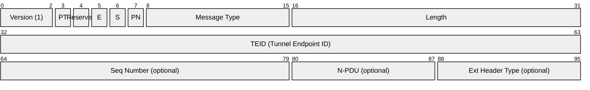
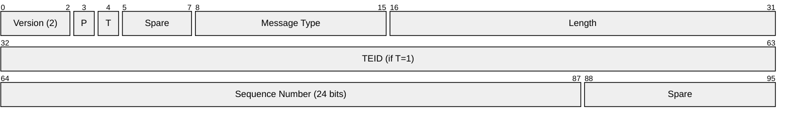
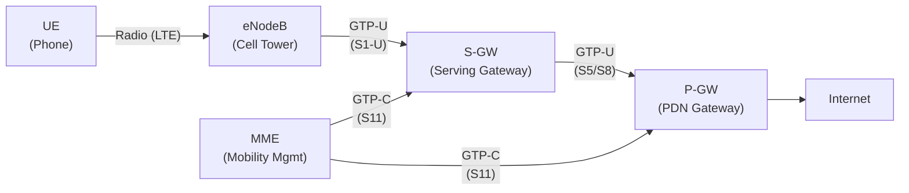
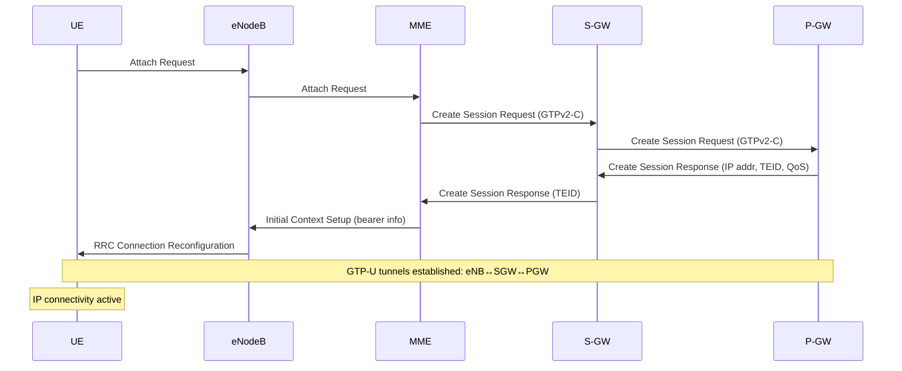
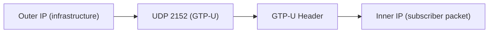

# GTP (GPRS Tunneling Protocol)

> **Standard:** [3GPP TS 29.060](https://www.3gpp.org/DynaReport/29060.htm) (GTPv1) / [3GPP TS 29.274](https://www.3gpp.org/DynaReport/29274.htm) (GTPv2) | **Layer:** Tunneling (Layer 2/3) | **Wireshark filter:** `gtp` or `gtpv2`

GTP is the tunneling protocol used in mobile networks (3G, 4G LTE, 5G) to carry user data and signaling between core network elements. It encapsulates subscriber IP packets inside UDP/IP tunnels, identified by Tunnel Endpoint Identifiers (TEIDs), allowing mobile devices to roam between cell sites while maintaining their IP session. GTP has two variants: GTP-C (control plane — session management) and GTP-U (user plane — data tunneling).

## GTP Variants

| Variant | Purpose | Transport | Description |
|---------|---------|-----------|-------------|
| GTP-C (v1) | Control | UDP 2123 | Session management in 3G (SGSN↔GGSN) |
| GTP-C (v2) | Control | UDP 2123 | Session management in 4G/5G (MME↔SGW↔PGW) |
| GTP-U | User data | UDP 2152 | Tunnel subscriber IP packets |
| GTP' (prime) | Charging | TCP/UDP 3386 | Charging data records to billing |

## GTP-U Header

## Key Fields

| Field | Size | Description |
|-------|------|-------------|
| Version | 3 bits | GTP version (1 for GTPv1-U) |
| PT | 1 bit | Protocol Type — 1 = GTP, 0 = GTP' (charging) |
| E | 1 bit | Extension header flag |
| S | 1 bit | Sequence number present |
| PN | 1 bit | N-PDU number present |
| Message Type | 8 bits | 0xFF = T-PDU (tunneled user data) for GTP-U |
| Length | 16 bits | Payload length (excluding first 8 bytes of header) |
| TEID | 32 bits | Tunnel Endpoint Identifier — uniquely identifies the tunnel |

### TEID

The TEID is the key concept in GTP — it identifies a specific bearer/tunnel at the receiving endpoint. Each side of a tunnel has its own TEID, negotiated during session setup. A single subscriber may have multiple TEIDs for different bearers (e.g., default bearer + dedicated QoS bearer).

## GTPv2-C Header

## GTPv2-C Message Types

| Type | Name | Description |
|------|------|-------------|
| 1 | Echo Request | Path keepalive |
| 2 | Echo Response | Path keepalive reply |
| 32 | Create Session Request | Establish a new PDN connection (attach/handover) |
| 33 | Create Session Response | Response with TEIDs, IP address, QoS |
| 34 | Modify Bearer Request | Update tunnel after handover |
| 35 | Modify Bearer Response | Handover update confirmed |
| 36 | Delete Session Request | Tear down a PDN connection (detach) |
| 37 | Delete Session Response | Session removed |
| 170 | Release Access Bearers Request | Suspend bearers (idle mode) |
| 171 | Release Access Bearers Response | Bearers suspended |

## 4G LTE Architecture with GTP

| Interface | Protocol | Between | Purpose |
|-----------|----------|---------|---------|
| S1-U | GTP-U | eNodeB ↔ S-GW | User data (bearer traffic) |
| S5/S8 | GTP-U + GTP-C | S-GW ↔ P-GW | User data + session control |
| S11 | GTP-C (v2) | MME ↔ S-GW | Session management, bearer setup |

### LTE Attach / Session Establishment

### Handover (S1-based)

During handover between cell towers, the MME sends a Modify Bearer Request to update the GTP-U tunnel endpoint from the old eNodeB to the new one — the subscriber's IP session and TEID remain unchanged.

## 5G and GTP

5G uses a split user/control architecture:

| 5G Element | Replaces | GTP Interface |
|------------|----------|---------------|
| gNB (5G base station) | eNodeB | N3 (GTP-U) |
| UPF (User Plane Function) | S-GW + P-GW user plane | N3/N9 (GTP-U) |
| SMF (Session Management) | MME + P-GW control plane | N4 (PFCP, not GTP) |

GTP-U remains the user plane tunnel in 5G. The control plane replaced GTP-C with PFCP ([RFC 8805](https://www.rfc-editor.org/rfc/rfc8805)) between SMF and UPF.

## Encapsulation

## Standards

| Document | Title |
|----------|-------|
| [3GPP TS 29.060](https://www.3gpp.org/DynaReport/29060.htm) | GTPv1 (3G GPRS/UMTS) |
| [3GPP TS 29.274](https://www.3gpp.org/DynaReport/29274.htm) | GTPv2-C (4G LTE / EPC) |
| [3GPP TS 29.281](https://www.3gpp.org/DynaReport/29281.htm) | GTP-U (user plane) |
| [3GPP TS 23.401](https://www.3gpp.org/DynaReport/23401.htm) | EPS (LTE) architecture |
| [3GPP TS 23.501](https://www.3gpp.org/DynaReport/23501.htm) | 5G system architecture |

## See Also

- [IPsec](../network-layer/ipsec.md) — sometimes used to encrypt GTP tunnels between operators
- [L2TP](l2tp.md) — alternative Layer 2 tunneling
- [VXLAN](vxlan.md) — data center tunneling
- [UDP](../transport-layer/udp.md) — GTP transport
- [SS7](../telecom/ss7.md) — legacy mobile signaling (GTP replaced GPRS tunneling over SS7)
