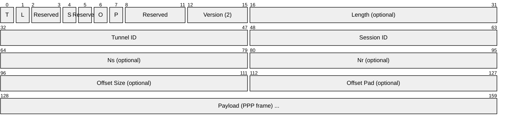
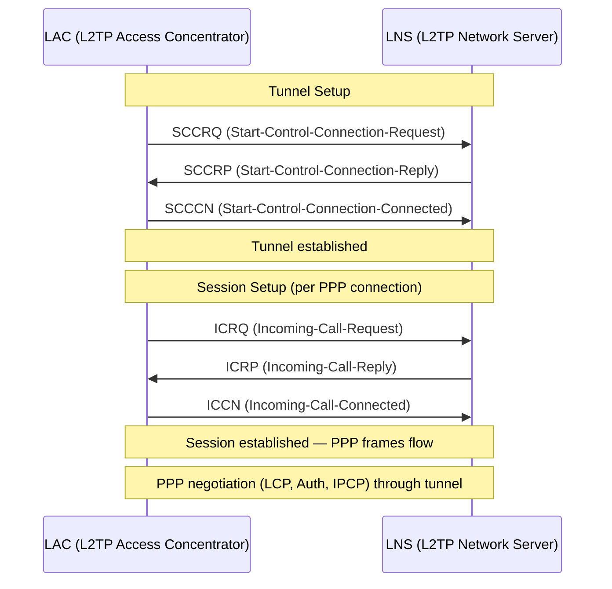
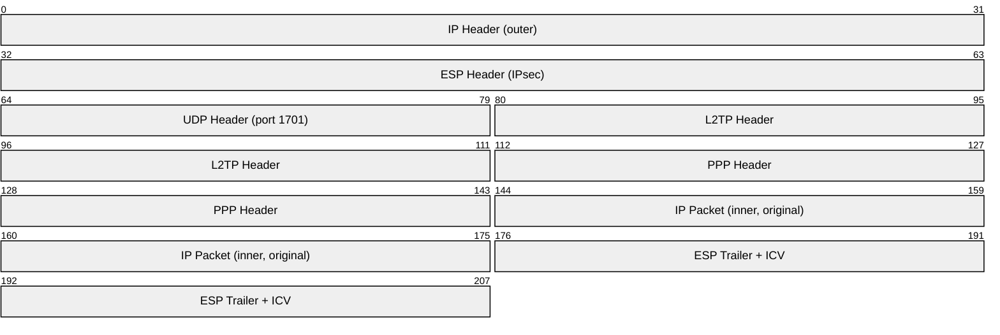
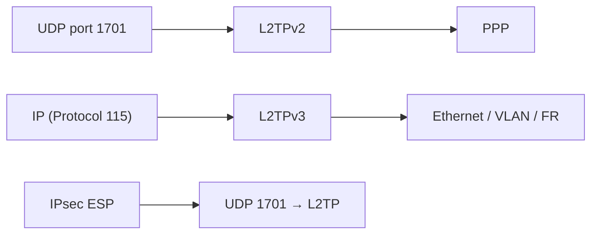

# L2TP (Layer 2 Tunneling Protocol)

> **Standard:** [RFC 2661](https://www.rfc-editor.org/rfc/rfc2661) (L2TPv2) / [RFC 3931](https://www.rfc-editor.org/rfc/rfc3931) (L2TPv3) | **Layer:** Data Link / Tunneling (Layer 2) | **Wireshark filter:** `l2tp`

L2TP tunnels Layer 2 (PPP) frames across an IP network, creating a virtual point-to-point connection between two endpoints. It was developed by combining Cisco's L2F and Microsoft's PPTP. L2TP itself provides **no encryption** — it is almost always paired with IPsec (L2TP/IPsec) for secure VPN connections. L2TPv2 tunnels PPP; L2TPv3 extends this to tunnel Ethernet, VLAN, Frame Relay, and other Layer 2 protocols.

## L2TPv2 Header

## Key Fields

| Field | Size | Description |
|-------|------|-------------|
| T (Type) | 1 bit | 0 = data message, 1 = control message |
| L (Length) | 1 bit | 1 = Length field present (mandatory for control) |
| S (Sequence) | 1 bit | 1 = Ns/Nr fields present (mandatory for control) |
| O (Offset) | 1 bit | 1 = Offset field present |
| P (Priority) | 1 bit | 1 = priority processing for this control message |
| Version | 4 bits | Always 2 for L2TPv2 |
| Length | 16 bits | Total message length (optional for data) |
| Tunnel ID | 16 bits | Identifies the tunnel (locally significant) |
| Session ID | 16 bits | Identifies the session within the tunnel |
| Ns | 16 bits | Sequence number of this message (control) |
| Nr | 16 bits | Expected next sequence number (control) |
| Payload | Variable | PPP frame (data messages) or AVPs (control messages) |

## Tunnel Establishment

## Control Message Types

| Type | Name | Description |
|------|------|-------------|
| 1 | SCCRQ | Start tunnel (request) |
| 2 | SCCRP | Start tunnel (reply) |
| 3 | SCCCN | Start tunnel (connected) |
| 4 | StopCCN | Close the tunnel |
| 6 | HELLO | Tunnel keepalive |
| 10 | ICRQ | Incoming call (request) |
| 11 | ICRP | Incoming call (reply) |
| 12 | ICCN | Incoming call (connected) |
| 14 | CDN | Call Disconnect Notify |
| 7 | OCRQ | Outgoing call (request) |
| 8 | OCRP | Outgoing call (reply) |
| 9 | OCCN | Outgoing call (connected) |
| 20 | SLI | Set-Link-Info (PPP negotiation update) |

## L2TP Roles

| Role | Name | Description |
|------|------|-------------|
| LAC | L2TP Access Concentrator | Near the user — accepts PPP connections and tunnels them to the LNS |
| LNS | L2TP Network Server | Remote end — terminates PPP sessions, assigns IP addresses |

### Voluntary vs Compulsory Tunneling

| Mode | Description |
|------|-------------|
| Compulsory | ISP's NAS (LAC) tunnels PPP to the enterprise LNS — user is unaware |
| Voluntary | User's device acts as the LAC — software L2TP client on the endpoint |

## L2TP/IPsec

L2TP alone is unencrypted. The standard VPN combination wraps L2TP in IPsec:

| Layer | Protocol |
|-------|----------|
| Outer IP | IP endpoints of the tunnel |
| IPsec ESP | Encryption + authentication |
| UDP 1701 | L2TP transport |
| L2TP | Tunnel/session framing |
| PPP | Point-to-point framing |
| Inner IP | Original user traffic |

## L2TPv3

L2TPv3 (RFC 3931) extends L2TP beyond PPP:

| Feature | L2TPv2 | L2TPv3 |
|---------|--------|--------|
| Payload | PPP only | Ethernet, VLAN, FR, ATM, HDLC, PPP |
| Transport | UDP | UDP or directly over IP (protocol 115) |
| Tunnel/Session ID | 16-bit | 32-bit |
| Cookies | No | Yes (for spoofing protection) |
| Use case | Remote access VPN | L2 pseudowires, carrier Ethernet |

## Encapsulation

## Standards

| Document | Title |
|----------|-------|
| [RFC 2661](https://www.rfc-editor.org/rfc/rfc2661) | Layer Two Tunneling Protocol (L2TPv2) |
| [RFC 3931](https://www.rfc-editor.org/rfc/rfc3931) | Layer Two Tunneling Protocol Version 3 (L2TPv3) |
| [RFC 3193](https://www.rfc-editor.org/rfc/rfc3193) | Securing L2TP using IPsec |

## See Also

- [PPP](../link-layer/ppp.md) — the Layer 2 protocol L2TPv2 tunnels
- [IPsec](../network-layer/ipsec.md) — provides encryption for L2TP/IPsec VPN
- [GRE](../network-layer/gre.md) — alternative tunneling protocol
- [VXLAN](vxlan.md) — modern L2 overlay tunneling
