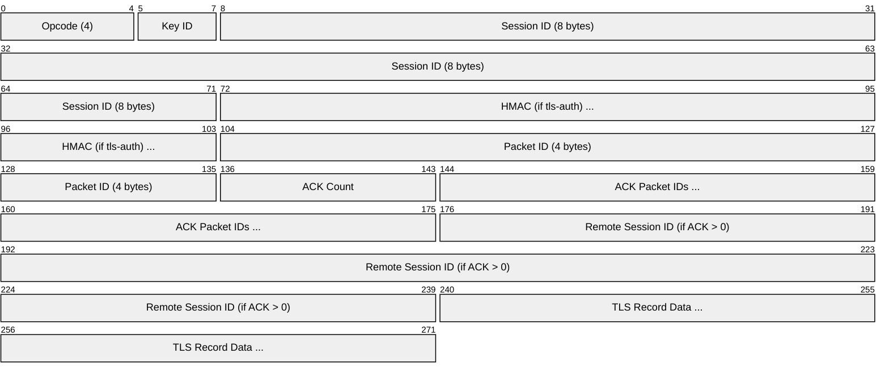
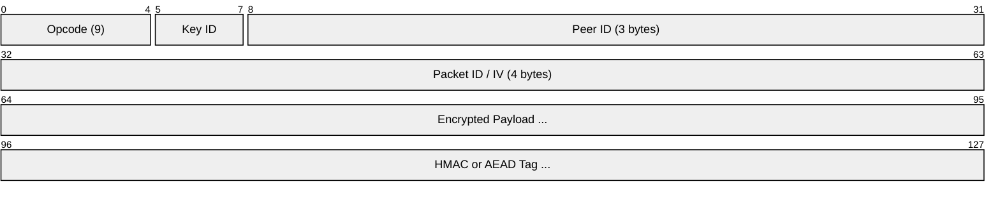
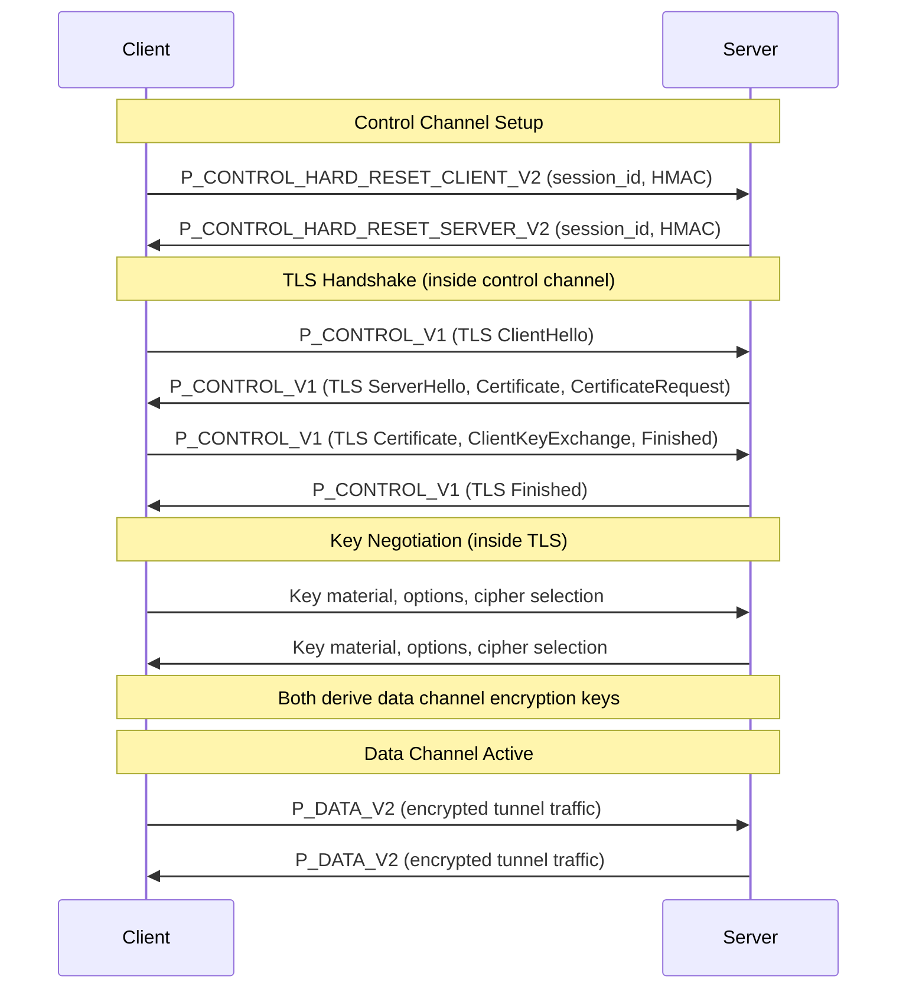
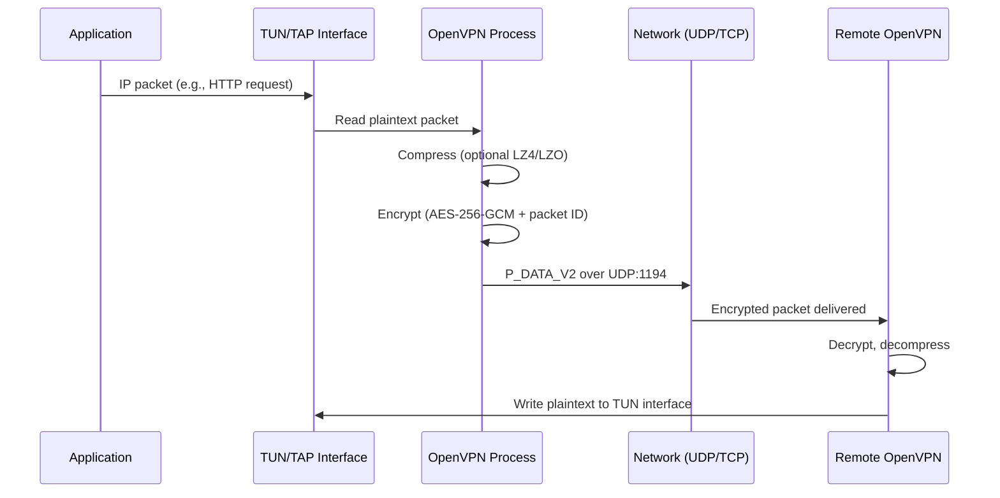
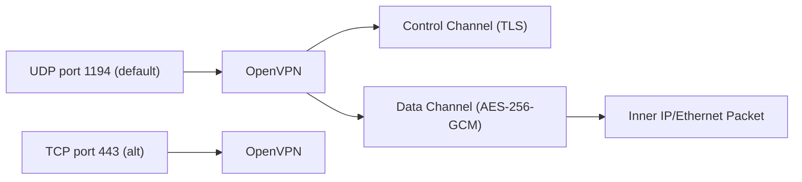

# OpenVPN

> **Standard:** [OpenVPN Protocol](https://openvpn.net/community-resources/openvpn-protocol/) | **Layer:** Application / VPN (Layer 3 or Layer 2) | **Wireshark filter:** `openvpn`

OpenVPN is the most widely deployed open-source VPN protocol. It uses SSL/TLS for key exchange and authentication, then encrypts data channel traffic with a symmetric cipher (AES-256-GCM by default). OpenVPN operates in two modes: TUN (Layer 3, routing IP packets) and TAP (Layer 2, bridging Ethernet frames). It runs over UDP (preferred, port 1194) or TCP (port 443 for firewall bypass) and is available on all major platforms. OpenVPN uses a split-channel design: a reliable TLS-based control channel for handshake and key negotiation, and a fast data channel for encrypted tunnel traffic.

## Packet Structure

All OpenVPN packets begin with a 1-byte opcode/key_id field:

## Opcodes

| Value | Name | Description |
|-------|------|-------------|
| 1 | P_CONTROL_HARD_RESET_CLIENT_V1 | Initial client handshake (deprecated) |
| 2 | P_CONTROL_HARD_RESET_SERVER_V1 | Initial server handshake (deprecated) |
| 3 | P_CONTROL_SOFT_RESET_V1 | Renegotiate keys on existing session |
| 4 | P_CONTROL_V1 | Control channel packet (carries TLS records) |
| 5 | P_ACK_V1 | Acknowledgment for control channel reliability |
| 6 | P_DATA_V1 | Data channel packet (encrypted tunnel traffic) |
| 7 | P_CONTROL_HARD_RESET_CLIENT_V2 | Initial client handshake (current) |
| 8 | P_CONTROL_HARD_RESET_SERVER_V2 | Initial server handshake (current) |
| 9 | P_DATA_V2 | Data channel packet with peer-id (current) |
| 10 | P_CONTROL_HARD_RESET_CLIENT_V3 | Client handshake with tls-crypt-v2 metadata |

## Control Channel Packet (P_CONTROL_V1)

## Data Channel Packet (P_DATA_V2)

## Key Fields

| Field | Size | Description |
|-------|------|-------------|
| Opcode | 5 bits | Packet type (control, data, reset, ack) |
| Key ID | 3 bits | Identifies which key set is in use (0-7, allows renegotiation overlap) |
| Session ID | 8 bytes | Unique session identifier per endpoint |
| HMAC | 20 bytes | HMAC-SHA1 authentication (when tls-auth is enabled) |
| Packet ID | 4 bytes | Sequence number for replay protection and reliability |
| Peer ID | 3 bytes | Server-assigned peer identifier (P_DATA_V2 only) |
| Encrypted Payload | Variable | AES-256-GCM (or other cipher) encrypted tunnel data |
| AEAD Tag | 16 bytes | GCM authentication tag (in AEAD mode) |

## Connection Establishment

## Data Flow

## Control Channel Protection

| Option | Description |
|--------|-------------|
| tls-auth | Pre-shared HMAC key authenticates control packets; prevents DoS and port scanning |
| tls-crypt | Encrypts and authenticates the entire control channel; hides TLS handshake from DPI |
| tls-crypt-v2 | Per-client tls-crypt keys wrapped with server key; scalable tls-crypt |

## TUN vs TAP Modes

| Feature | TUN (Layer 3) | TAP (Layer 2) |
|---------|---------------|---------------|
| Tunnels | IP packets | Ethernet frames |
| Use case | Routed VPN (most common) | Bridged VPN (LAN extension) |
| Broadcast | No | Yes (ARP, DHCP, NetBIOS) |
| Protocols | IPv4, IPv6 only | Any Ethernet protocol |
| Overhead | Lower | Higher (Ethernet header) |
| OS support | All platforms | Limited on some mobile platforms |

## OpenVPN vs WireGuard vs IPsec

| Feature | OpenVPN | WireGuard | IPsec (IKEv2) |
|---------|---------|-----------|----------------|
| Codebase | ~100,000 lines | ~4,000 lines | 400,000+ lines |
| Cipher negotiation | Yes (configurable) | None (fixed) | Yes (extensive) |
| Transport | UDP or TCP | UDP only | ESP (IP 50) or UDP |
| Firewall bypass | TCP 443 (looks like HTTPS) | UDP only | NAT-T (UDP 4500) |
| Architecture | Userspace | Kernel (Linux 5.6+) | Kernel (xfrm) |
| Performance | Good (userspace overhead) | Excellent | Good |
| Layer 2 support | Yes (TAP mode) | No (Layer 3 only) | L2TP/IPsec |
| Certificate PKI | Full X.509 PKI | Simple public keys | Full X.509 PKI |
| NAT traversal | Built-in | Built-in | MOBIKE |
| Default port | UDP 1194 | UDP 51820 | UDP 500/4500 |
| DPI resistance | tls-crypt hides handshake | Identifiable | Identifiable |

## Encapsulation

## Standards

| Document | Title |
|----------|-------|
| [OpenVPN Protocol](https://openvpn.net/community-resources/openvpn-protocol/) | OpenVPN protocol specification |
| [OpenVPN Source](https://github.com/OpenVPN/openvpn) | Reference implementation |
| [RFC 5246](https://www.rfc-editor.org/rfc/rfc5246) | TLS 1.2 (used by OpenVPN control channel) |

## See Also

- [WireGuard](../security/wireguard.md) -- modern VPN with fixed cryptography and kernel integration
- [L2TP](l2tp.md) -- Layer 2 tunneling, often paired with IPsec
- [TLS](../security/tls.md) -- OpenVPN control channel runs TLS inside its own reliability layer
- [GRE](../network-layer/gre.md) -- unencrypted tunneling
