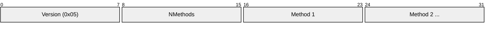
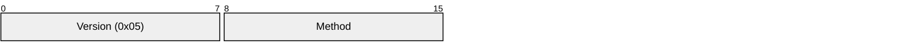
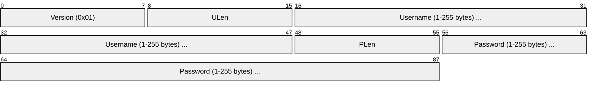
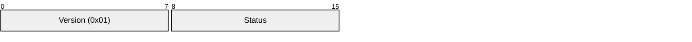
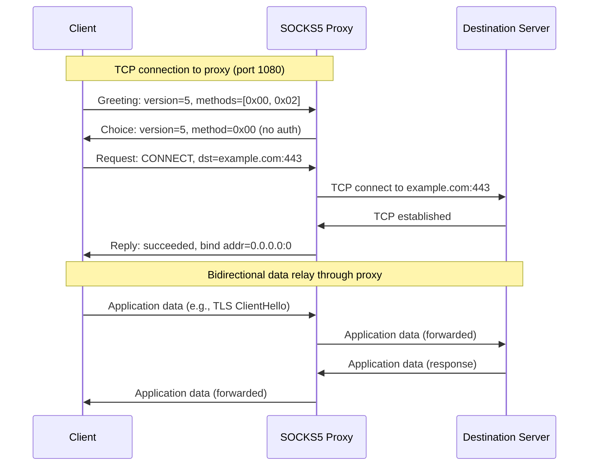
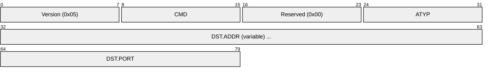
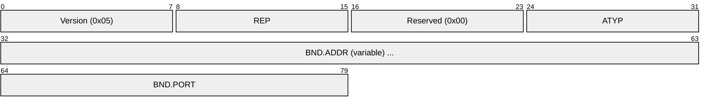
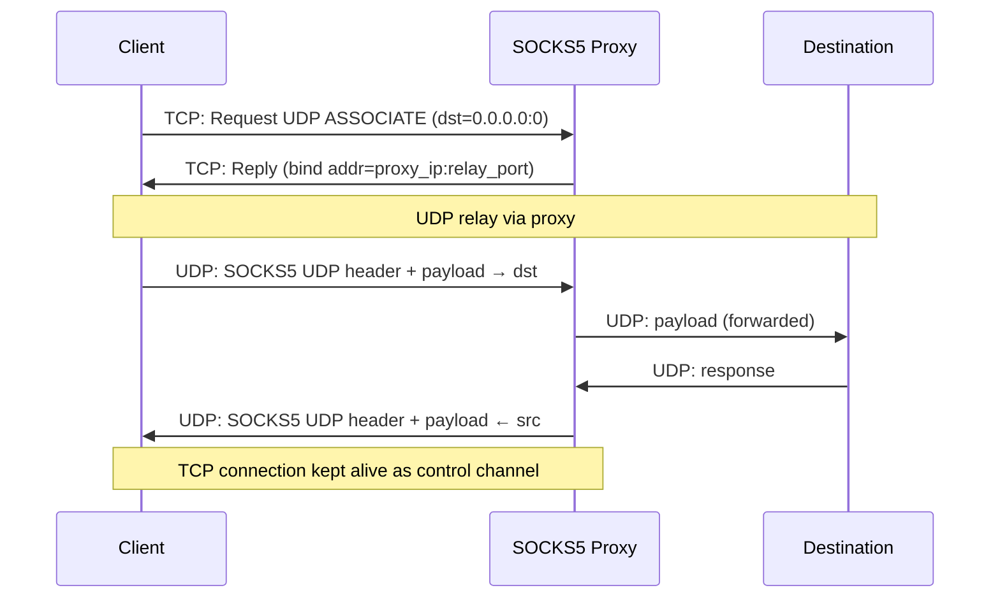
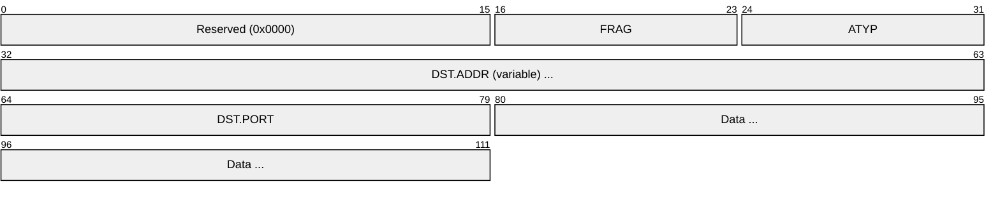
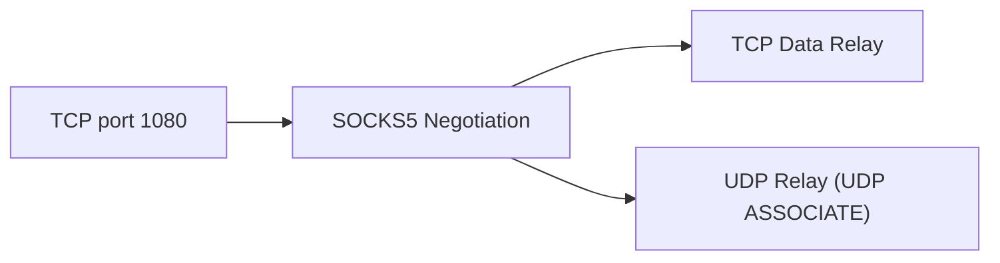

# SOCKS5 (Socket Secure Protocol Version 5)

> **Standard:** [RFC 1928](https://www.rfc-editor.org/rfc/rfc1928) | **Layer:** Session (Layer 5) | **Wireshark filter:** `socks`

SOCKS is a general-purpose proxy protocol that relays TCP and UDP traffic through an intermediary server on behalf of a client. Unlike HTTP proxies, SOCKS operates below the application layer and is protocol-agnostic — it can tunnel any TCP or UDP traffic without understanding the payload. SOCKS5 (RFC 1928) added authentication, IPv6, and UDP support over the earlier SOCKS4. The default port is **1080/tcp**. SOCKS5 is widely used for SSH dynamic port forwarding (`ssh -D`), Tor anonymity circuits, and corporate proxy gateways.

## Greeting (Method Negotiation)

The client opens a TCP connection to the SOCKS server and sends a greeting listing supported authentication methods. The server selects one.

### Client Greeting

### Server Choice

| Field | Size | Description |
|-------|------|-------------|
| Version | 1 byte | SOCKS version: `0x05` |
| NMethods | 1 byte | Number of authentication methods the client supports |
| Methods | 1-255 bytes | List of supported method identifiers |
| Method (reply) | 1 byte | Server's chosen method (or `0xFF` to reject) |

### Authentication Methods

| Value | Method | Description |
|-------|--------|-------------|
| `0x00` | No Authentication | No auth required |
| `0x01` | GSSAPI | GSS-API authentication ([RFC 1961](https://www.rfc-editor.org/rfc/rfc1961)) |
| `0x02` | Username/Password | Username/password sub-negotiation ([RFC 1929](https://www.rfc-editor.org/rfc/rfc1929)) |
| `0x03`-`0x7F` | IANA Assigned | Reserved for IANA-assigned methods |
| `0x80`-`0xFE` | Private Methods | Reserved for private use |
| `0xFF` | No Acceptable Methods | Server rejects all offered methods |

## Username/Password Authentication (RFC 1929)

If the server selects method `0x02`, a sub-negotiation occurs:

### Auth Request

### Auth Response

| Field | Size | Description |
|-------|------|-------------|
| Version | 1 byte | Sub-negotiation version: `0x01` |
| ULen | 1 byte | Username length |
| Username | 1-255 bytes | Username string |
| PLen | 1 byte | Password length |
| Password | 1-255 bytes | Password string |
| Status | 1 byte | `0x00` = success, any other = failure |

## CONNECT Flow

## Request

After authentication succeeds, the client sends a connection request:

| Field | Size | Description |
|-------|------|-------------|
| Version | 1 byte | `0x05` |
| CMD | 1 byte | Command code |
| Reserved | 1 byte | `0x00` |
| ATYP | 1 byte | Address type of the destination |
| DST.ADDR | Variable | Destination address |
| DST.PORT | 2 bytes | Destination port (network byte order) |

### Commands (CMD)

| Value | Command | Description |
|-------|---------|-------------|
| `0x01` | CONNECT | Establish a TCP connection to the destination |
| `0x02` | BIND | Listen for an inbound TCP connection (for FTP-like protocols) |
| `0x03` | UDP ASSOCIATE | Establish a UDP relay |

### Address Types (ATYP)

| Value | Type | Address Format |
|-------|------|----------------|
| `0x01` | IPv4 | 4 bytes (e.g., `C0 A8 01 01` = 192.168.1.1) |
| `0x03` | Domain Name | 1 byte length + domain string (e.g., `0B 65 78 61 6D 70 6C 65 2E 63 6F 6D` = example.com) |
| `0x04` | IPv6 | 16 bytes |

## Reply

| Field | Size | Description |
|-------|------|-------------|
| Version | 1 byte | `0x05` |
| REP | 1 byte | Reply status code |
| Reserved | 1 byte | `0x00` |
| ATYP | 1 byte | Address type of the bound address |
| BND.ADDR | Variable | Server-bound address |
| BND.PORT | 2 bytes | Server-bound port |

### Reply Codes (REP)

| Value | Status | Description |
|-------|--------|-------------|
| `0x00` | Succeeded | Request granted |
| `0x01` | General failure | General SOCKS server failure |
| `0x02` | Not allowed | Connection not allowed by ruleset |
| `0x03` | Network unreachable | Network unreachable |
| `0x04` | Host unreachable | Host unreachable |
| `0x05` | Connection refused | Connection refused by destination |
| `0x06` | TTL expired | TTL expired |
| `0x07` | Command not supported | Command not supported |
| `0x08` | Address type not supported | Address type not supported |

## UDP ASSOCIATE

For UDP relay, the client sends a `UDP ASSOCIATE` request over TCP. The proxy replies with a UDP relay address/port. The client then sends UDP datagrams encapsulated with a SOCKS5 UDP header to the relay:

### UDP Request Header

| Field | Size | Description |
|-------|------|-------------|
| Reserved | 2 bytes | `0x0000` |
| FRAG | 1 byte | Fragment number (0 = standalone, no fragmentation) |
| ATYP | 1 byte | Address type |
| DST.ADDR | Variable | Target address |
| DST.PORT | 2 bytes | Target port |
| Data | Variable | UDP payload |

## SOCKS4 vs SOCKS4a vs SOCKS5

| Feature | SOCKS4 | SOCKS4a | SOCKS5 |
|---------|--------|---------|--------|
| RFC | None (NEC) | None (NEC) | RFC 1928 |
| Authentication | User ID only | User ID only | Pluggable (none, user/pass, GSSAPI, ...) |
| Address types | IPv4 only | IPv4 + domain names | IPv4, IPv6, domain names |
| UDP support | No | No | Yes (UDP ASSOCIATE) |
| BIND command | Yes | Yes | Yes |
| Domain resolution | Client-side | Server-side (proxy resolves) | Server-side |
| IPv6 | No | No | Yes |

SOCKS4a extended SOCKS4 by allowing the client to send a domain name instead of an IP, letting the proxy perform DNS resolution. SOCKS5 formalized and extended this with a full address type system.

## Common Use Cases

| Use Case | Description |
|----------|-------------|
| SSH dynamic tunneling | `ssh -D 1080 user@host` creates a local SOCKS5 proxy |
| Tor | Tor exposes a SOCKS5 interface (default 9050) for application tunneling |
| Corporate proxies | Route application traffic through monitored gateways |
| Browser proxy | Firefox, Chrome support SOCKS5 proxy configuration |
| Application tunneling | `tsocks`, `proxychains` force applications through SOCKS |

## Encapsulation

## Standards

| Document | Title |
|----------|-------|
| [RFC 1928](https://www.rfc-editor.org/rfc/rfc1928) | SOCKS Protocol Version 5 |
| [RFC 1929](https://www.rfc-editor.org/rfc/rfc1929) | Username/Password Authentication for SOCKS V5 |
| [RFC 1961](https://www.rfc-editor.org/rfc/rfc1961) | GSS-API Authentication Method for SOCKS V5 |

## See Also

- [HTTP](../web/http.md) — HTTP CONNECT method provides application-layer proxying
- [SSH](../remote-access/ssh.md) — `ssh -D` creates a SOCKS5 proxy via SSH tunnel
- [WireGuard](../security/wireguard.md) — VPN-level tunneling alternative
- [TLS](../security/tls.md) — SOCKS does not encrypt; often combined with TLS
