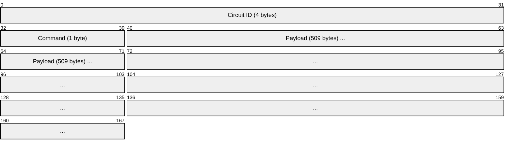
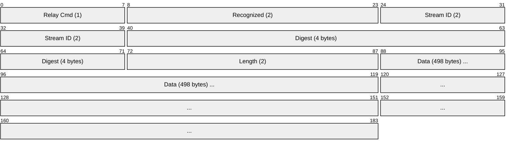
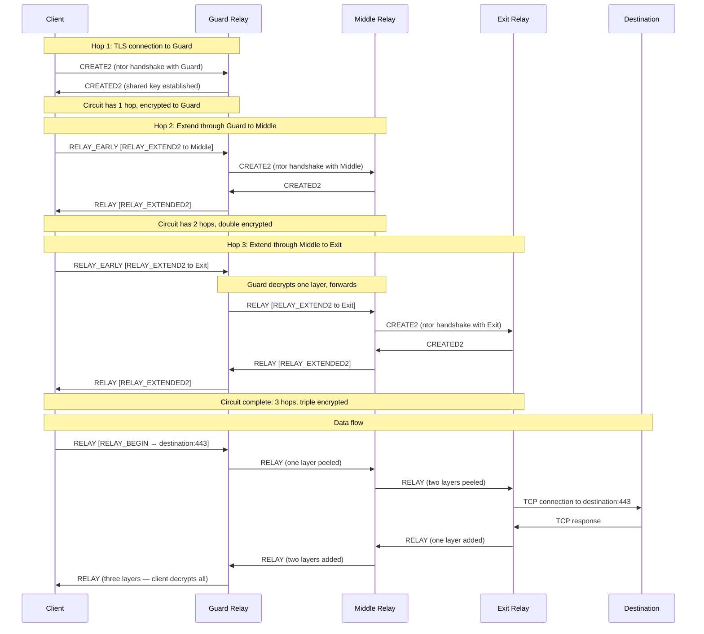
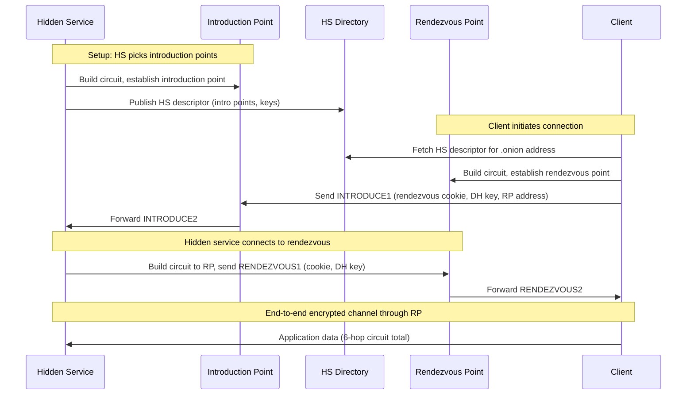

# Tor (The Onion Router)

> **Standard:** [Tor Protocol Specification (tor-spec.txt)](https://spec.torproject.org/tor-spec/) | **Layer:** Application / Overlay (Layer 7) | **Wireshark filter:** `ssl || tls`

Tor is an anonymous overlay network protocol that routes traffic through a series of encrypted relays to conceal a user's identity and location. It uses a cell-based protocol with fixed 514-byte cells transported inside TLS connections between relays. Clients build three-hop circuits (Guard, Middle, Exit) using telescoping encryption --- each relay peels one layer of AES-CTR encryption, so no single relay knows both the source and destination. Tor powers the Tor Browser, onion services (.onion), and censorship circumvention tools. Over 6,000 volunteer relays carry traffic for millions of daily users.

## Cell Format

Every Tor cell is exactly 514 bytes (fixed-size to resist traffic analysis):

For link protocol versions below 4, the Circuit ID is 2 bytes (making cells 512 bytes).

## Key Fields

| Field | Size | Description |
|-------|------|-------------|
| Circuit ID | 4 bytes | Identifies the circuit on this link (2 bytes for link protocol < 4) |
| Command | 1 byte | Cell command type (see table below) |
| Payload | 509 bytes | Cell content (padded to fixed size) |

## Cell Commands

| Command | Value | Description |
|---------|-------|-------------|
| PADDING | 0 | Keepalive / traffic padding (ignored by receiver) |
| CREATE | 1 | Create a circuit (TAP handshake) |
| CREATED | 2 | Acknowledge circuit creation |
| RELAY | 3 | Encrypted relay cell (carries end-to-end data) |
| DESTROY | 4 | Tear down a circuit |
| CREATE_FAST | 5 | Create circuit with fast handshake (one-hop, non-PFS) |
| CREATED_FAST | 6 | Acknowledge fast circuit creation |
| VERSIONS | 7 | Link protocol version negotiation |
| NETINFO | 8 | Exchange IP address and timestamp info |
| RELAY_EARLY | 9 | Relay cell during circuit extension (limited to 8 per circuit) |
| CREATE2 | 10 | Create circuit (ntor handshake, modern) |
| CREATED2 | 11 | Acknowledge ntor circuit creation |
| PADDING_NEGOTIATE | 12 | Negotiate padding parameters |
| VPADDING | 128 | Variable-length padding cell |
| CERTS | 129 | TLS certificate exchange |
| AUTH_CHALLENGE | 130 | Authentication challenge from responder |
| AUTHENTICATE | 131 | Authentication response from initiator |
| AUTHORIZE | 132 | Reserved for future authorization |

Commands 128+ are variable-length cells (length field replaces fixed 509-byte payload).

## Relay Cell Format

RELAY and RELAY_EARLY cells carry an inner relay header within the 509-byte payload:

| Field | Size | Description |
|-------|------|-------------|
| Relay Command | 1 byte | Relay sub-command (see table below) |
| Recognized | 2 bytes | Set to 0 when cell is for this hop (else encrypted garbage) |
| Stream ID | 2 bytes | Identifies the TCP stream within the circuit |
| Digest | 4 bytes | Running SHA-1 digest for integrity verification |
| Length | 2 bytes | Length of the data portion |
| Data | 498 bytes | Relay payload (padded to fill cell) |

## Relay Commands

| Command | Value | Description |
|---------|-------|-------------|
| RELAY_BEGIN | 1 | Open a TCP stream to a destination (from client via exit) |
| RELAY_DATA | 2 | Carry TCP stream data |
| RELAY_END | 3 | Close a TCP stream |
| RELAY_CONNECTED | 4 | Confirm stream connection succeeded |
| RELAY_SENDME | 5 | Flow control acknowledgment (window-based) |
| RELAY_EXTEND | 6 | Extend circuit by one hop (TAP handshake) |
| RELAY_EXTENDED | 7 | Confirm circuit extension |
| RELAY_TRUNCATE | 8 | Tear down part of a circuit |
| RELAY_TRUNCATED | 9 | Confirm partial circuit teardown |
| RELAY_DROP | 10 | Padding cell (ignored at destination) |
| RELAY_RESOLVE | 11 | DNS resolve request through exit |
| RELAY_RESOLVED | 12 | DNS resolve response |
| RELAY_BEGIN_DIR | 13 | Open a stream to a relay's directory port |
| RELAY_EXTEND2 | 14 | Extend circuit by one hop (ntor handshake, modern) |
| RELAY_EXTENDED2 | 15 | Confirm ntor circuit extension |

## Circuit Building

Tor clients build circuits using telescoping creation --- each hop is added one at a time, so each relay only knows its immediate neighbors:

## Onion Encryption

Each hop shares a unique AES-128-CTR key with the client. When the client sends data:

| Direction | Encryption Layers |
|-----------|-------------------|
| Client sends | Encrypt with Exit key, then Middle key, then Guard key |
| Guard receives | Decrypt Guard layer, forward to Middle |
| Middle receives | Decrypt Middle layer, forward to Exit |
| Exit receives | Decrypt Exit layer, send plaintext to destination |

No single relay can observe both the source IP and the destination. The Guard knows who you are but not where you are going. The Exit knows where traffic is going but not who sent it.

## Hidden Services (Onion Services v3)

Onion services (.onion addresses) allow servers to receive connections without revealing their IP address. v3 uses Ed25519 keys and produces 56-character addresses.

### v3 Onion Address Structure

The 56-character .onion address encodes:

| Component | Size | Description |
|-----------|------|-------------|
| Public Key | 32 bytes | Ed25519 public key of the hidden service |
| Checksum | 2 bytes | SHA-3 checksum |
| Version | 1 byte | Always 0x03 for v3 |

## Directory System

Tor relies on a set of trusted directory authorities to distribute relay information:

| Component | Description |
|-----------|-------------|
| Directory Authorities | 9 hardcoded trusted servers that vote on network consensus |
| Consensus Document | Signed list of all relays, updated hourly |
| Relay Descriptors | Self-published relay capabilities, keys, policies |
| Bandwidth Authorities | Measure relay speeds for load balancing |
| Bridge Authority | Maintains list of unpublished bridge relays |

## Entry Guards and Bridges

| Concept | Description |
|---------|-------------|
| Entry Guard | Persistent first hop (rotated infrequently) to limit exposure to malicious relays |
| Bridge Relay | Unpublished relay used to circumvent censorship when direct Tor access is blocked |
| Pluggable Transports | Obfuscation layers (obfs4, Snowflake, meek) that disguise Tor traffic as normal HTTPS |

## Tor vs VPN

| Feature | Tor | VPN |
|---------|-----|-----|
| Anonymity model | Distributed trust across 3+ relays | Single trust point (VPN provider) |
| Encryption layers | 3 (one per hop) | 1 (client to VPN server) |
| Knows your IP | Guard relay only | VPN provider |
| Knows your destination | Exit relay only | VPN provider |
| Speed | Slower (multiple hops, volunteer relays) | Faster (direct, commercial infrastructure) |
| Latency | Higher (3+ hops across the globe) | Lower (single hop) |
| Hidden services | Yes (.onion) | No |
| Protocol | Cell-based overlay over TLS | Tunnel (WireGuard, OpenVPN, IPsec) |
| Censorship resistance | Bridges, pluggable transports | Server IP can be blocked |
| Typical use | Anonymity, censorship circumvention | Privacy, geo-unblocking, corporate access |

## Encapsulation

## Standards

| Document | Title |
|----------|-------|
| [tor-spec.txt](https://spec.torproject.org/tor-spec/) | Tor Protocol Specification |
| [dir-spec.txt](https://spec.torproject.org/dir-spec/) | Tor Directory Protocol Specification |
| [rend-spec-v3.txt](https://spec.torproject.org/rend-spec-v3/) | Tor Rendezvous (Hidden Service) Specification v3 |
| [pt-spec.txt](https://spec.torproject.org/pt-spec/) | Pluggable Transport Specification |

## See Also

- [TLS](../security/tls.md) --- outer transport encryption for Tor links
- [WireGuard](../security/wireguard.md) --- modern VPN (different threat model)
- [L2TP](l2tp.md) --- tunneling protocol (no anonymity)
- [GRE](../network-layer/gre.md) --- simple tunneling alternative
