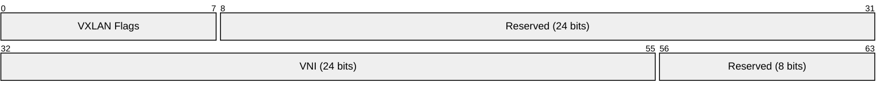
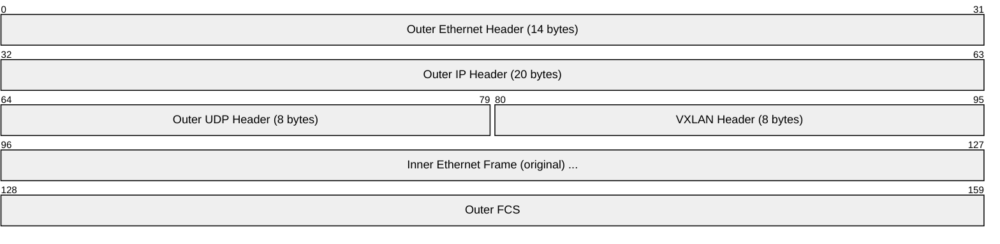
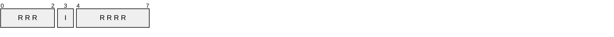
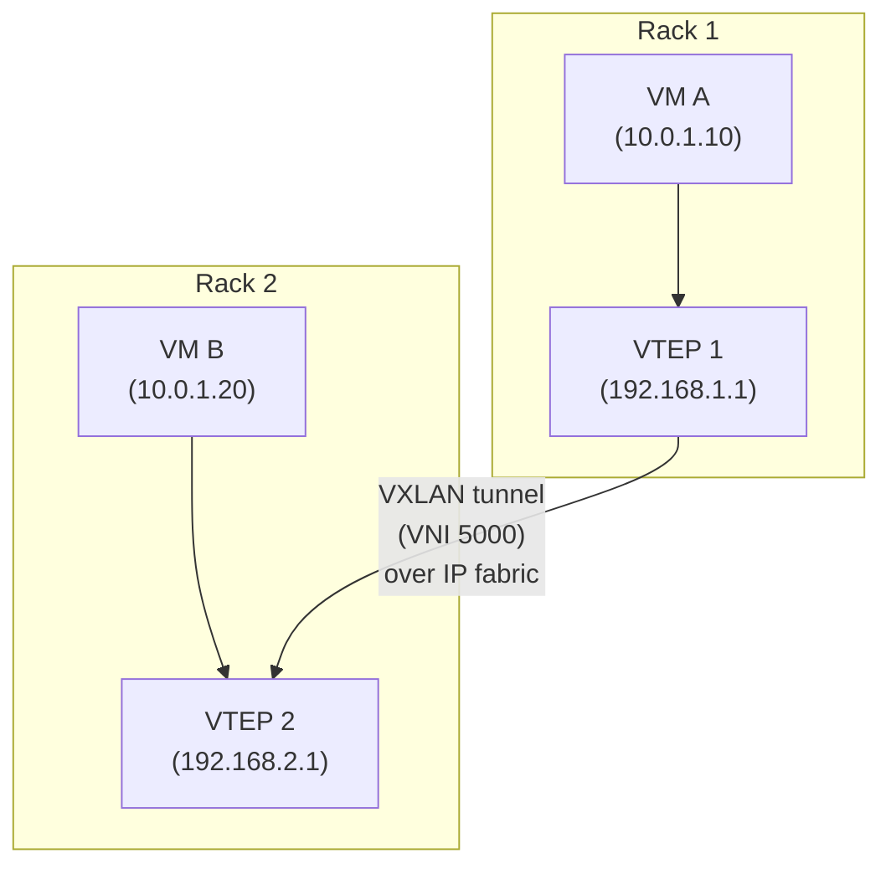
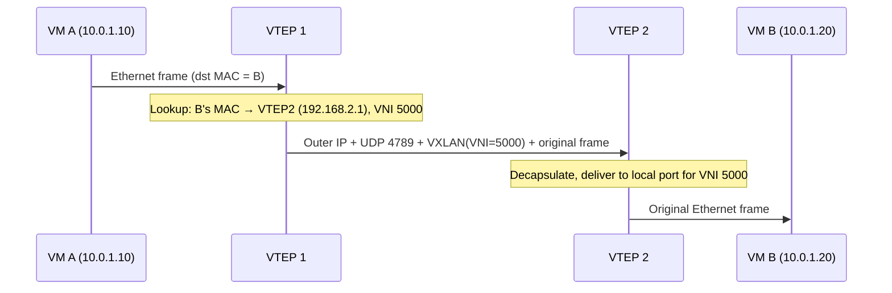
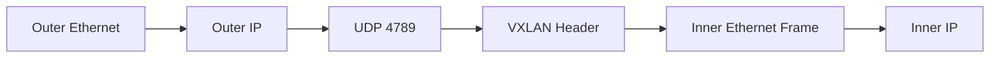

# VXLAN (Virtual Extensible LAN)

> **Standard:** [RFC 7348](https://www.rfc-editor.org/rfc/rfc7348) | **Layer:** Data Link / Tunneling (Layer 2 over Layer 3) | **Wireshark filter:** `vxlan`

VXLAN is an overlay tunneling protocol that encapsulates Layer 2 Ethernet frames within UDP/IP packets, allowing Layer 2 networks to be extended across Layer 3 boundaries. It was designed to solve the scalability limitations of VLANs (4094 IDs) in large data centers by providing a 24-bit segment ID space (over 16 million virtual networks). VXLAN is the dominant overlay protocol in modern data center fabrics and cloud networking, used by VMware NSX, Linux bridges, Cisco ACI, and most cloud providers.

## Packet Format

The 8-byte VXLAN header encapsulates a complete inner Ethernet frame:

### Full Encapsulation Stack

## Key Fields

| Field | Size | Description |
|-------|------|-------------|
| Flags | 8 bits | Bit 3 (I flag) must be 1; indicates valid VNI |
| Reserved | 24 bits | Must be zero |
| VNI | 24 bits | VXLAN Network Identifier (0 - 16,777,215) |
| Reserved | 8 bits | Must be zero |

### Flags Detail

Only the **I flag** (bit 3) is defined. When set to 1, the VNI field is valid. All other bits are reserved and set to 0.

## Outer UDP Header

| Field | Value | Description |
|-------|-------|-------------|
| Source Port | Hash-based | Hash of inner frame headers (for ECMP load balancing) |
| Destination Port | 4789 | IANA-assigned VXLAN port |
| Length | Variable | UDP length including VXLAN header and inner frame |
| Checksum | 0 or computed | Often set to 0 (inner frame has its own FCS) |

The source port is derived from a hash of the inner frame's headers (src/dst MAC, IP, L4 ports), ensuring that flows between the same endpoints take the same path while different flows are distributed across ECMP paths.

## How VXLAN Works

| Term | Description |
|------|-------------|
| VTEP | VXLAN Tunnel Endpoint — encapsulates/decapsulates VXLAN |
| VNI | VXLAN Network Identifier — isolates virtual networks (like VLAN ID but 24-bit) |
| Underlay | Physical IP network connecting VTEPs |
| Overlay | Virtual L2 network carried inside VXLAN |

### Traffic Flow

## MAC Learning

VTEPs learn remote MAC-to-VTEP mappings through:

| Method | Description |
|--------|-------------|
| Data plane learning | Inspect source MAC of received VXLAN packets (flood-and-learn) |
| Multicast | Unknown unicast/broadcast/multicast flooded via IP multicast group per VNI |
| EVPN (BGP) | Control plane distributes MAC/IP→VTEP mappings (no flooding needed) |
| Static | Manual VTEP-MAC configuration |

EVPN ([RFC 7432](https://www.rfc-editor.org/rfc/rfc7432)) is the modern preferred approach — it eliminates flooding and provides efficient ARP suppression.

## VXLAN vs VLAN

| Feature | VLAN (802.1Q) | VXLAN |
|---------|---------------|-------|
| ID space | 12 bits (4,094) | 24 bits (16,777,216) |
| Scope | Single L2 domain | Across L3 boundaries |
| Encapsulation | 4-byte tag in Ethernet header | Full UDP/IP encapsulation |
| Scalability | Limited by STP, MAC table size | Data center scale |
| Multi-tenancy | Limited | Native (millions of segments) |
| MTU overhead | 4 bytes | 50 bytes (requires jumbo frames) |

## MTU Considerations

VXLAN adds 50 bytes of overhead:

| Component | Size |
|-----------|------|
| Outer Ethernet | 14 bytes |
| Outer IP | 20 bytes |
| Outer UDP | 8 bytes |
| VXLAN header | 8 bytes |
| **Total overhead** | **50 bytes** |

With a standard 1500-byte MTU, the inner frame MTU is 1450 bytes. Most data center fabrics use **jumbo frames (9000+ byte MTU)** on the underlay to avoid fragmentation.

## VXLAN-GPE (Generic Protocol Extension)

[RFC 8926](https://www.rfc-editor.org/rfc/rfc8926) extends VXLAN with a Next Protocol field, allowing encapsulation of non-Ethernet payloads (IPv4, IPv6, NSH).

## Encapsulation

## Standards

| Document | Title |
|----------|-------|
| [RFC 7348](https://www.rfc-editor.org/rfc/rfc7348) | Virtual eXtensible Local Area Network (VXLAN) |
| [RFC 8365](https://www.rfc-editor.org/rfc/rfc8365) | A Network Virtualization Overlay Solution Using EVPN |
| [RFC 7432](https://www.rfc-editor.org/rfc/rfc7432) | BGP MPLS-Based Ethernet VPN (EVPN) |
| [RFC 8926](https://www.rfc-editor.org/rfc/rfc8926) | Geneve — Generic Network Virtualization Encapsulation |

## See Also

- [Ethernet](../link-layer/ethernet.md) — the inner frames VXLAN encapsulates
- [UDP](../transport-layer/udp.md) — VXLAN transport
- [GRE](../network-layer/gre.md) — alternative tunneling protocol
- [L2TP](l2tp.md) — another L2 tunneling protocol
- [MPLS](../network-layer/mpls.md) — carrier-grade L2/L3 VPN alternative
- [BGP](../routing/bgp.md) — EVPN control plane for VXLAN
