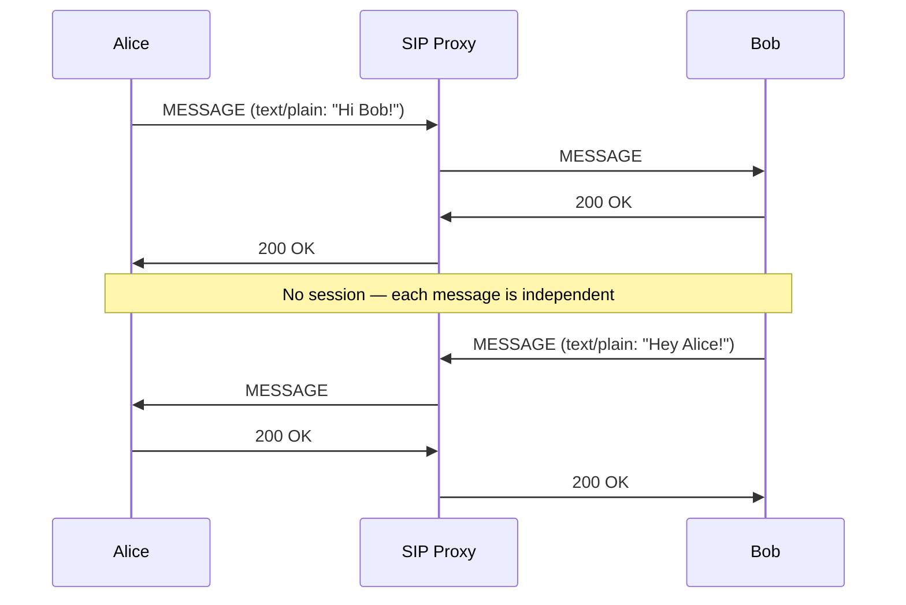
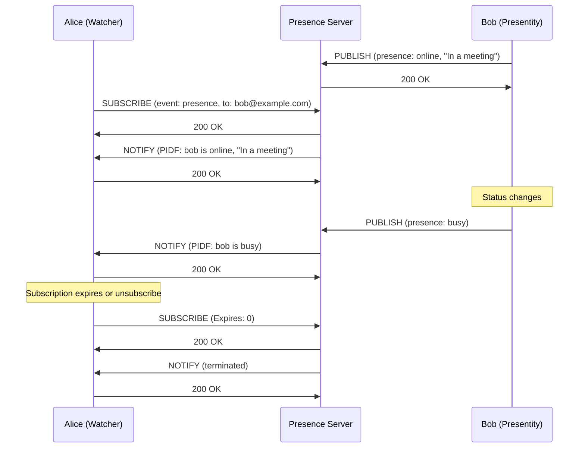
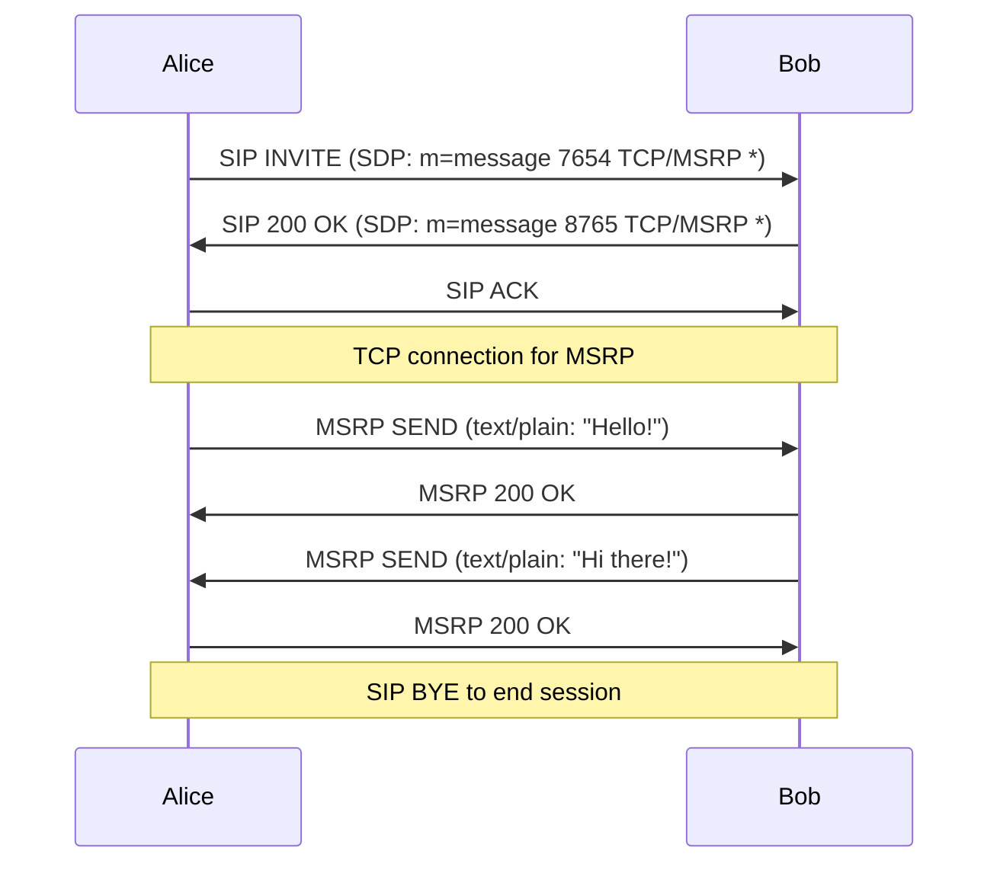
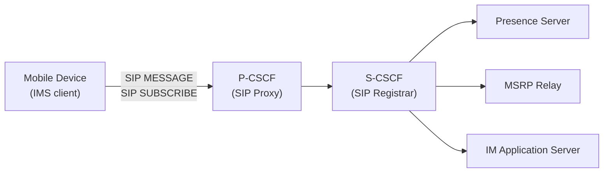
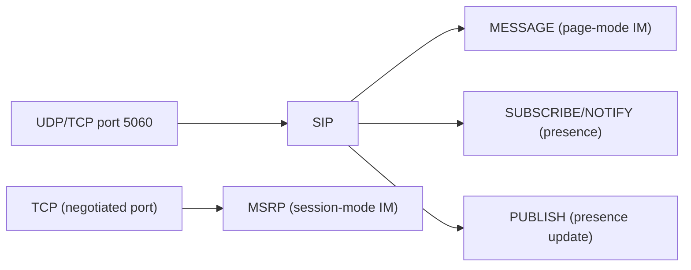

# SIMPLE (SIP for Instant Messaging and Presence Leveraging Extensions)

> **Standard:** [RFC 3428](https://www.rfc-editor.org/rfc/rfc3428) (MESSAGE) / [RFC 3856](https://www.rfc-editor.org/rfc/rfc3856) (Presence) / [RFC 4975](https://www.rfc-editor.org/rfc/rfc4975) (MSRP) | **Layer:** Application (Layer 7) | **Wireshark filter:** `sip` (SIMPLE uses SIP methods)

SIMPLE is a set of SIP extensions that add instant messaging (IM) and presence to SIP-based communication systems. Rather than being a separate protocol, SIMPLE is a collection of RFCs that extend SIP with the MESSAGE method (page-mode IM), SUBSCRIBE/NOTIFY for presence (online/busy/away status), and MSRP for session-based messaging (chat sessions with typing indicators, file transfer, and message history). SIMPLE is the IM/presence standard in IMS (IP Multimedia Subsystem) used by mobile carriers, and was the basis of Microsoft's Office Communications Server (now Skype for Business/Teams) and many enterprise UC platforms.

## Components

| Component | RFCs | Description |
|-----------|------|-------------|
| Page-Mode Messaging | RFC 3428 | SIP MESSAGE method — fire-and-forget IM |
| Presence | RFC 3856, 3903 | SUBSCRIBE/NOTIFY + PUBLISH for online status |
| Session-Mode Messaging | RFC 4975 (MSRP) | Persistent chat sessions with rich features |
| Presence Data Format | RFC 3863 (PIDF) | XML format for presence information |
| Watcher Info | RFC 3857 | Who is watching my presence |
| Resource Lists | RFC 4826 | Subscribe to multiple contacts in one request |
| Partial Presence | RFC 5263 | Efficient partial updates to presence state |

## Page-Mode Messaging (SIP MESSAGE)

The simplest form — a standalone SIP request carrying an IM:

```
MESSAGE sip:bob@example.com SIP/2.0
Via: SIP/2.0/TCP client.example.com;branch=z9hG4bK776
From: "Alice" <sip:alice@example.com>;tag=49583
To: "Bob" <sip:bob@example.com>
Call-ID: asd88asd77a@client.example.com
CSeq: 1 MESSAGE
Max-Forwards: 70
Content-Type: text/plain
Content-Length: 18

Hi Bob, are you free?
```

Response:

```
SIP/2.0 200 OK
```

### MESSAGE Flow



Page-mode is simple but has no delivery receipts, typing indicators, or message history. Each MESSAGE is a standalone SIP transaction.

### Content Types

| Content-Type | Description |
|-------------|-------------|
| text/plain | Plain text message |
| text/html | HTML formatted message |
| application/im-iscomposing+xml | "Is typing" indication (RFC 3994) |
| message/cpim | Common Presence and Instant Messaging format (wrapper) |
| multipart/mixed | Message with attachments |

## Presence

SIMPLE presence uses SIP's event framework (RFC 6665) with the `presence` event package:

### Presence Flow



### PUBLISH (RFC 3903)

The presentity (user) publishes their status to the presence server:

```
PUBLISH sip:bob@example.com SIP/2.0
Event: presence
Content-Type: application/pidf+xml
Expires: 3600

<?xml version="1.0" encoding="UTF-8"?>
<presence xmlns="urn:ietf:params:xml:ns:pidf"
  entity="sip:bob@example.com">
  <tuple id="mobile">
    <status>
      <basic>open</basic>
    </status>
    <note>In a meeting until 3pm</note>
  </tuple>
</presence>
```

### PIDF (Presence Information Data Format — RFC 3863)

| Element | Description |
|---------|-------------|
| `<presence>` | Root element, `entity` = presentity URI |
| `<tuple>` | One per device/endpoint, `id` attribute |
| `<status><basic>` | `open` (available) or `closed` (unavailable) |
| `<note>` | Human-readable status text |
| `<contact>` | Reachable URI for this tuple |
| `<timestamp>` | Last update time |

### RPID (Rich Presence — RFC 4480)

Extends PIDF with detailed status:

| Element | Values | Description |
|---------|--------|-------------|
| `<activities>` | on-the-phone, busy, away, holiday, in-transit, meeting, etc. | What the user is doing |
| `<mood>` | happy, sad, angry, nervous, etc. | Emotional state |
| `<place-type>` | office, home, airport, etc. | Location type |
| `<privacy>` | — | User wants privacy |

## Session-Mode Messaging (MSRP — RFC 4975)

MSRP (Message Session Relay Protocol) provides a persistent chat session with richer features than page-mode:

### MSRP vs PAGE-MODE

| Feature | Page-Mode (MESSAGE) | Session-Mode (MSRP) |
|---------|--------------------|--------------------|
| Session | None — each message standalone | SIP INVITE establishes session |
| Typing indicators | Separate MESSAGE request | In-session indication |
| Delivery reports | No | Yes (REPORT mechanism) |
| Large messages | Limited by SIP message size | Chunked, unlimited |
| File transfer | No | Yes |
| Message history | No | Within session |
| Complexity | Very simple | Requires MSRP relay infrastructure |

### MSRP Session Setup



### MSRP Message

```
MSRP d93kswow SEND
To-Path: msrp://bob.example.com:8765/chat;tcp
From-Path: msrp://alice.example.com:7654/chat;tcp
Message-ID: 87652
Byte-Range: 1-25/25
Content-Type: text/plain

Hello, how are you doing?
-------d93kswow$
```

### MSRP Methods

| Method | Description |
|--------|-------------|
| SEND | Send a message (or chunk of a message) |
| REPORT | Delivery/display report |
| AUTH | Authenticate with an MSRP relay (RFC 4976) |

## IMS Integration

In 3GPP IMS networks, SIMPLE provides the standard IM and presence service:



## SIMPLE vs XMPP

| Feature | SIMPLE | XMPP |
|---------|--------|------|
| Base protocol | SIP extensions | Dedicated XML protocol |
| IM model | PAGE (MESSAGE) + SESSION (MSRP) | Persistent XML stream |
| Presence format | PIDF (XML) | Native XML stanzas |
| Federation | SIP routing (DNS SRV, SIP proxy) | Server-to-server (s2s, DNS SRV) |
| Multi-user chat | Conference focus (SIP) | MUC (XEP-0045) |
| Adoption | IMS/carriers, enterprise UC | Open source, consumer |
| Standards body | IETF | IETF + XSF |

## Encapsulation



## Standards

| Document | Title |
|----------|-------|
| [RFC 3428](https://www.rfc-editor.org/rfc/rfc3428) | SIP Extension for Instant Messaging (MESSAGE method) |
| [RFC 3856](https://www.rfc-editor.org/rfc/rfc3856) | A Presence Event Package for SIP |
| [RFC 3903](https://www.rfc-editor.org/rfc/rfc3903) | SIP Extension for Event State Publication (PUBLISH) |
| [RFC 3863](https://www.rfc-editor.org/rfc/rfc3863) | Presence Information Data Format (PIDF) |
| [RFC 4480](https://www.rfc-editor.org/rfc/rfc4480) | Rich Presence Extensions to PIDF (RPID) |
| [RFC 4975](https://www.rfc-editor.org/rfc/rfc4975) | The Message Session Relay Protocol (MSRP) |
| [RFC 4976](https://www.rfc-editor.org/rfc/rfc4976) | Relay Extensions for MSRP |
| [RFC 3994](https://www.rfc-editor.org/rfc/rfc3994) | Indication of Message Composition ("is typing") |
| [RFC 6665](https://www.rfc-editor.org/rfc/rfc6665) | SIP-Specific Event Notification (SUBSCRIBE/NOTIFY) |

## See Also

- [SIP](sip.md) — base protocol that SIMPLE extends
- [XMPP](../messaging/xmpp.md) — alternative IM/presence protocol
- [RTP](rtp.md) — media transport (SIP+SIMPLE combines voice/video + IM + presence)
- [WebRTC](webrtc.md) — browser-based alternative
- [TCP](../transport-layer/tcp.md)
