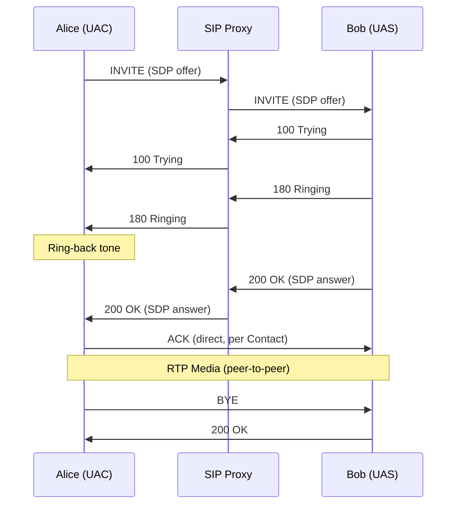
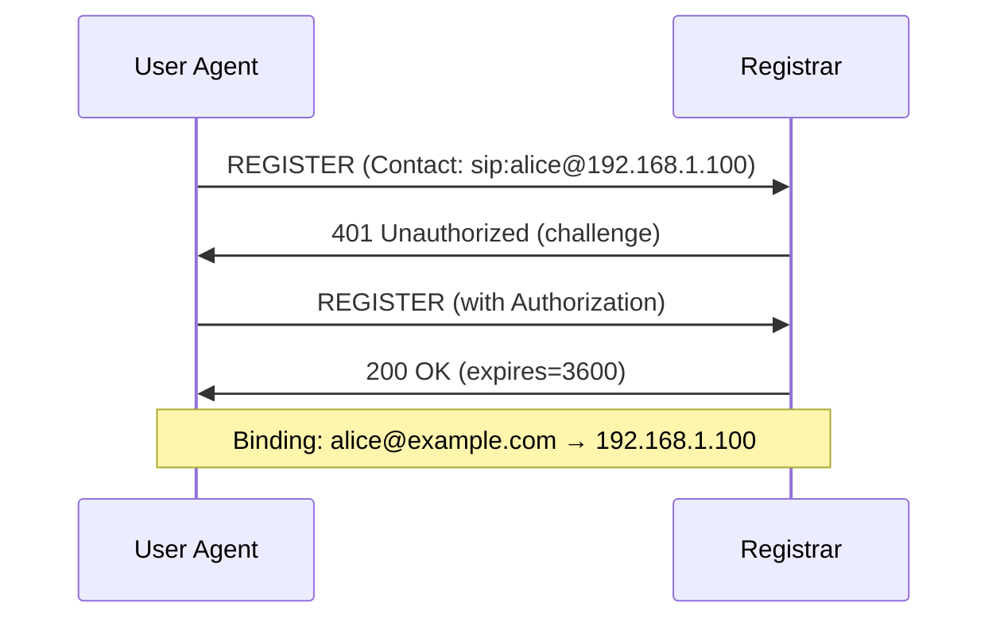
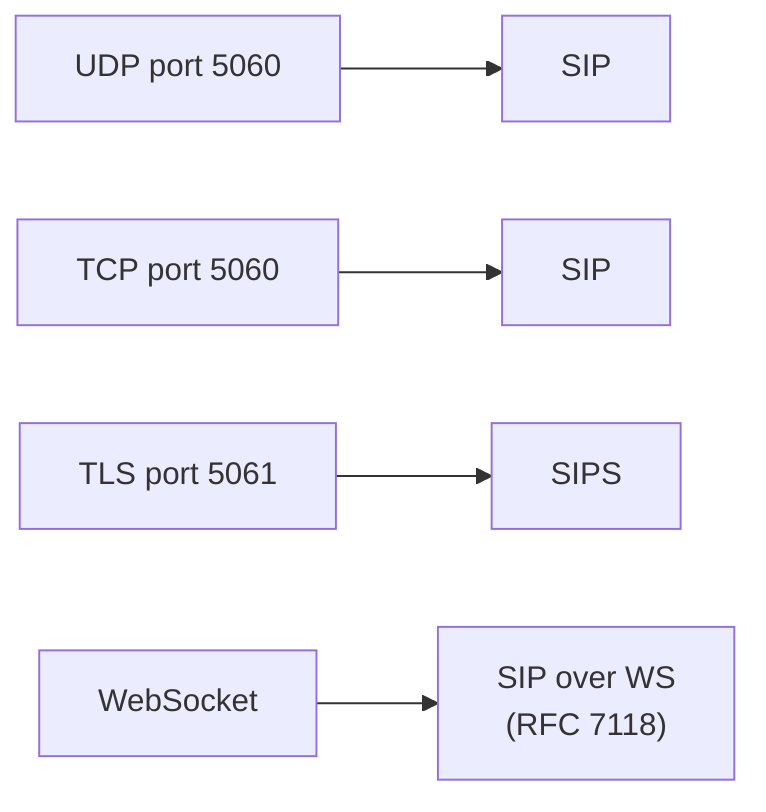

# SIP (Session Initiation Protocol)

> **Standard:** [RFC 3261](https://www.rfc-editor.org/rfc/rfc3261) | **Layer:** Application (Layer 7) | **Wireshark filter:** `sip`

SIP is a signaling protocol for initiating, modifying, and terminating multimedia sessions — primarily voice and video calls (VoIP). It handles session setup, participant discovery, and capability negotiation, but does not carry the media itself (that's RTP/SRTP). SIP follows an HTTP-like request/response model with text-based messages. It is the dominant signaling protocol in VoIP, IMS (mobile telephony), and many unified communications systems.

## Message Structure

SIP messages are text-based, similar to HTTP. Like HTTP, there is no fixed binary header — messages use CRLF-delimited text lines.

### Request

```
METHOD sip:user@domain SIP/2.0\r\n
Via: SIP/2.0/UDP client.example.com:5060;branch=z9hG4bK776asdhds\r\n
From: "Alice" <sip:alice@example.com>;tag=1928301774\r\n
To: "Bob" <sip:bob@example.com>\r\n
Call-ID: a84b4c76e66710@client.example.com\r\n
CSeq: 314159 INVITE\r\n
Contact: <sip:alice@192.168.1.100:5060>\r\n
Content-Type: application/sdp\r\n
Content-Length: 142\r\n
\r\n
[SDP body]
```

### Response

```
SIP/2.0 200 OK\r\n
Via: SIP/2.0/UDP client.example.com:5060;branch=z9hG4bK776asdhds\r\n
From: "Alice" <sip:alice@example.com>;tag=1928301774\r\n
To: "Bob" <sip:bob@example.com>;tag=a6c85cf\r\n
Call-ID: a84b4c76e66710@client.example.com\r\n
CSeq: 314159 INVITE\r\n
Contact: <sip:bob@192.168.1.200:5060>\r\n
Content-Type: application/sdp\r\n
Content-Length: 131\r\n
\r\n
[SDP body]
```

## Methods

| Method | Description |
|--------|-------------|
| INVITE | Initiate a session (call setup) |
| ACK | Confirm receipt of final response to INVITE |
| BYE | Terminate an established session |
| CANCEL | Cancel a pending INVITE |
| REGISTER | Register a user's contact address with a registrar |
| OPTIONS | Query capabilities of a server or user agent |
| SUBSCRIBE | Subscribe to event notifications (RFC 6665) |
| NOTIFY | Deliver an event notification (RFC 6665) |
| REFER | Ask recipient to issue a request (call transfer, RFC 3515) |
| MESSAGE | Instant messaging (RFC 3428) |
| INFO | Carry application-level information mid-dialog (RFC 6086) |
| UPDATE | Modify a session before it's established (RFC 3311) |
| PRACK | Provisional response acknowledgment (RFC 3262) |

## Response Codes

| Range | Category | Examples |
|-------|----------|----------|
| 1xx | Provisional | 100 Trying, 180 Ringing, 183 Session Progress |
| 2xx | Success | 200 OK, 202 Accepted |
| 3xx | Redirection | 301 Moved Permanently, 302 Moved Temporarily |
| 4xx | Client Error | 400 Bad Request, 401 Unauthorized, 403 Forbidden, 404 Not Found, 408 Request Timeout, 486 Busy Here |
| 5xx | Server Error | 500 Internal Server Error, 503 Service Unavailable |
| 6xx | Global Failure | 600 Busy Everywhere, 603 Decline |

## Key Headers

| Header | Description |
|--------|-------------|
| Via | Records each hop; used to route responses back |
| From | Logical identity of the request originator (with tag) |
| To | Logical identity of the request target (with tag in responses) |
| Call-ID | Globally unique identifier for the dialog |
| CSeq | Command sequence number + method name |
| Contact | Direct reachable URI of the sender |
| Max-Forwards | Hop limit (like TTL), default 70 |
| Record-Route / Route | Force requests through proxies |
| Authorization / WWW-Authenticate | Digest authentication (RFC 8760) |
| Supported / Require | Feature negotiation |

## Call Flow

### Basic Call Setup and Teardown



### Registration



## SIP URI Schemes

| Scheme | Description |
|--------|-------------|
| `sip:user@domain` | Unencrypted SIP |
| `sips:user@domain` | SIP over TLS (mandatory encryption) |
| `tel:+15551234567` | Telephone number (RFC 3966) |

## SIP Architecture

| Component | Role |
|-----------|------|
| User Agent Client (UAC) | Initiates requests |
| User Agent Server (UAS) | Responds to requests |
| Proxy Server | Routes requests on behalf of users |
| Registrar | Accepts REGISTER requests, maintains location database |
| Redirect Server | Returns alternative URIs (3xx responses) |
| Back-to-Back User Agent (B2BUA) | Acts as both UAC and UAS (session border controllers, PBXs) |

## Encapsulation



SIP over UDP is most common. SIP over TLS (SIPS) provides hop-by-hop encryption. SIP over WebSocket enables browser-based VoIP.

## Standards

| Document | Title |
|----------|-------|
| [RFC 3261](https://www.rfc-editor.org/rfc/rfc3261) | SIP: Session Initiation Protocol |
| [RFC 3262](https://www.rfc-editor.org/rfc/rfc3262) | Reliability of Provisional Responses (PRACK) |
| [RFC 3263](https://www.rfc-editor.org/rfc/rfc3263) | Locating SIP Servers (DNS SRV/NAPTR) |
| [RFC 3264](https://www.rfc-editor.org/rfc/rfc3264) | An Offer/Answer Model with SDP |
| [RFC 3515](https://www.rfc-editor.org/rfc/rfc3515) | The REFER Method (call transfer) |
| [RFC 6665](https://www.rfc-editor.org/rfc/rfc6665) | SIP-Specific Event Notification (SUBSCRIBE/NOTIFY) |
| [RFC 7118](https://www.rfc-editor.org/rfc/rfc7118) | The WebSocket Protocol as a Transport for SIP |
| [RFC 8866](https://www.rfc-editor.org/rfc/rfc8866) | SDP: Session Description Protocol |
| [RFC 3428](https://www.rfc-editor.org/rfc/rfc3428) | SIP Extension for Instant Messaging |

## See Also

- [RTP](rtp.md) — carries the actual media streams set up by SIP
- [RTCP](rtcp.md) — quality feedback for RTP sessions
- [WebRTC](webrtc.md) — browser-based alternative (uses custom signaling instead of SIP)
- [TLS](../security/tls.md) — used by SIPS for encrypted signaling
- [DNS](../naming/dns.md) — SRV/NAPTR records for SIP server discovery
- [UDP](../transport-layer/udp.md)
- [TCP](../transport-layer/tcp.md)
