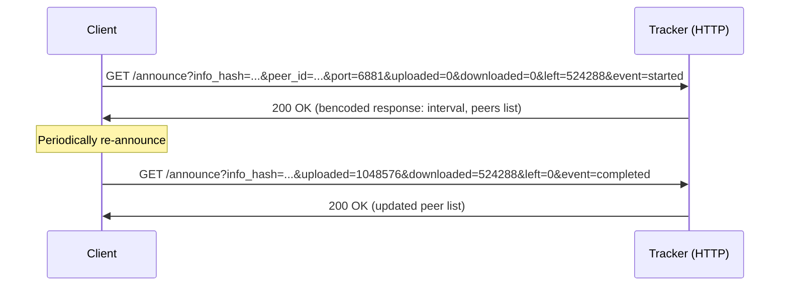
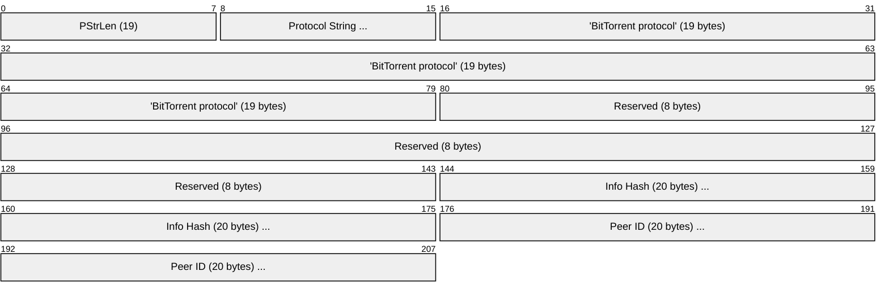
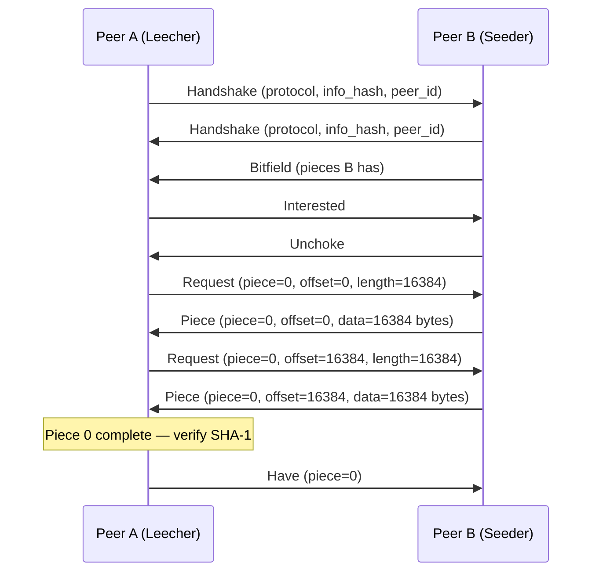
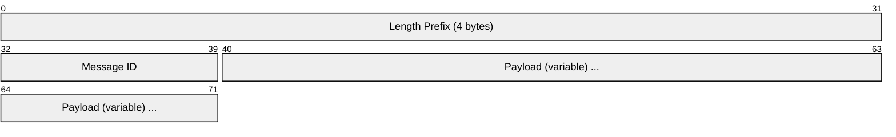
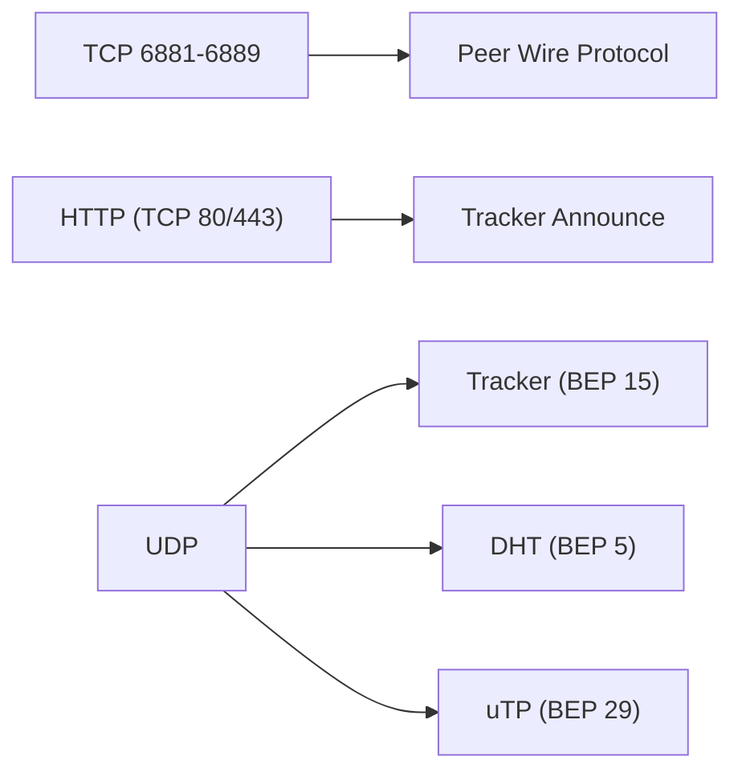

# BitTorrent

> **Standard:** [BEP 3](https://www.bittorrent.org/beps/bep_0003.html) | **Layer:** Application (Layer 7) | **Wireshark filter:** `bittorrent`

BitTorrent is a peer-to-peer file sharing protocol that distributes large files by splitting them into small pieces and downloading different pieces from multiple peers simultaneously. Instead of a single server bearing all load, every downloading client also uploads pieces it has already received, creating a decentralized swarm. A `.torrent` file (or magnet link) identifies the content via a SHA-1 hash (`info_hash`), and peers discover each other through trackers, DHT (Distributed Hash Table), or PEX (Peer Exchange). BitTorrent uses TCP for the peer wire protocol and HTTP/UDP for tracker communication.

## Piece and Block Structure

Files are split into fixed-size **pieces** (typically 256 KB to 4 MB), each identified by a SHA-1 hash in the torrent metadata. Peers request **blocks** within pieces (typically 16 KB), which are the smallest transfer unit.

| Concept | Size | Description |
|---------|------|-------------|
| Piece | 256 KB - 4 MB | Unit of integrity verification (SHA-1 hash per piece) |
| Block | 16 KB (typical) | Unit of transfer (what `request` messages ask for) |
| Info Hash | 20 bytes | SHA-1 of the bencoded `info` dictionary in the torrent metadata |
| Peer ID | 20 bytes | Unique identifier for each client instance |

## Tracker Communication

Clients announce themselves to a tracker (HTTP or UDP) to discover peers in the swarm.

### HTTP Tracker Announce



### Tracker Request Parameters

| Parameter | Description |
|-----------|-------------|
| `info_hash` | 20-byte SHA-1 hash of the `info` dictionary (URL-encoded) |
| `peer_id` | 20-byte unique client identifier |
| `port` | Port the client is listening on (typically 6881-6889) |
| `uploaded` | Total bytes uploaded since `started` event |
| `downloaded` | Total bytes downloaded since `started` event |
| `left` | Bytes remaining to download |
| `event` | `started`, `completed`, `stopped`, or empty (periodic) |
| `compact` | `1` = request compact peer list (6 bytes per peer: 4 IP + 2 port) |
| `numwant` | Number of peers desired (default 50) |

### Tracker Response Fields

| Field | Description |
|-------|-------------|
| `interval` | Seconds between re-announces |
| `peers` | List of peers (compact: concatenated 6-byte entries, or list of dicts) |
| `complete` | Number of seeders |
| `incomplete` | Number of leechers |

## Peer Wire Protocol (TCP)

### Handshake

After connecting to a peer via TCP, both sides exchange a handshake:



| Field | Size | Description |
|-------|------|-------------|
| PStrLen | 1 byte | Length of protocol string: `19` |
| Protocol String | 19 bytes | `BitTorrent protocol` |
| Reserved | 8 bytes | Extension flags (bit 20 = DHT, bit 44 = Extension Protocol BEP 10) |
| Info Hash | 20 bytes | SHA-1 hash identifying the torrent |
| Peer ID | 20 bytes | Client's unique identifier |

### Peer Wire Handshake and Piece Exchange



### Message Format

All messages after the handshake are length-prefixed:



### Message Types

| ID | Name | Payload | Description |
|----|------|---------|-------------|
| -- | Keep-Alive | (none, length=0) | Sent to maintain connection (no message ID) |
| 0 | Choke | (none) | Sender will not upload to receiver |
| 1 | Unchoke | (none) | Sender will upload to receiver |
| 2 | Interested | (none) | Sender wants data the receiver has |
| 3 | Not Interested | (none) | Sender does not want data the receiver has |
| 4 | Have | piece index (4 bytes) | Sender has completed and verified this piece |
| 5 | Bitfield | bitfield (variable) | Bitmap of all pieces the sender has (sent once after handshake) |
| 6 | Request | index (4) + begin (4) + length (4) | Request a block within a piece |
| 7 | Piece | index (4) + begin (4) + block (variable) | Deliver a block of data |
| 8 | Cancel | index (4) + begin (4) + length (4) | Cancel a pending request |
| 9 | Port | port (2 bytes) | DHT listening port (BEP 5) |

## Choking Algorithm

BitTorrent uses a tit-for-tat incentive mechanism:

| Concept | Description |
|---------|-------------|
| Choked | Peer will not send data (default state) |
| Unchoked | Peer is willing to send data |
| Interested | Peer wants something the other has |
| Optimistic Unchoke | Periodically unchoke a random peer (every 30s) to discover faster peers |
| Regular Unchoke | Unchoke top 4 peers by upload rate (re-evaluated every 10s) |

## DHT (Distributed Hash Table) — BEP 5

DHT enables trackerless peer discovery using a Kademlia-based distributed hash table over UDP.

| Concept | Description |
|---------|-------------|
| Node ID | 160-bit identifier (same space as info_hash) |
| Distance | XOR metric between node IDs |
| Routing Table | K-buckets of known nodes |
| UDP Port | Same as peer wire port (or declared via `port` message) |

### DHT Queries (Krpc Protocol)

| Query | Description |
|-------|-------------|
| `ping` | Check if a node is alive |
| `find_node` | Find nodes closest to a target ID |
| `get_peers` | Find peers for a specific info_hash |
| `announce_peer` | Announce that this node is downloading a torrent |

## Magnet Links

Magnet links encode the info_hash so torrents can be found via DHT without a `.torrent` file:

```
magnet:?xt=urn:btih:{info_hash}&dn={display_name}&tr={tracker_url}
```

| Parameter | Description |
|-----------|-------------|
| `xt` | Exact Topic — `urn:btih:` + hex or base32 info_hash |
| `dn` | Display Name — human-readable title |
| `tr` | Tracker URL (optional, can be repeated) |

The client uses BEP 9 (Extension for Peers to Send Metadata Files) to fetch the full torrent metadata from peers in the swarm.

## Extensions

### PEX (Peer Exchange) — BEP 11

Peers share their known peer lists with each other, reducing tracker dependency. Exchanged via the Extension Protocol (BEP 10) with message ID `ut_pex`.

### uTP (Micro Transport Protocol) — BEP 29

A UDP-based transport for BitTorrent that uses LEDBAT (Low Extra Delay Background Transport) congestion control, yielding to TCP traffic to avoid degrading other applications on the same connection.

| Feature | TCP | uTP |
|---------|-----|-----|
| Transport | TCP | UDP |
| Congestion control | Standard TCP (CUBIC, etc.) | LEDBAT (delay-based, low priority) |
| Impact on other traffic | Can saturate link | Yields to TCP traffic |
| NAT traversal | Standard | Better (UDP hole punching) |

## Key BEPs (BitTorrent Enhancement Proposals)

| BEP | Title | Description |
|-----|-------|-------------|
| [BEP 3](https://www.bittorrent.org/beps/bep_0003.html) | The BitTorrent Protocol | Base protocol specification |
| [BEP 5](https://www.bittorrent.org/beps/bep_0005.html) | DHT Protocol | Kademlia-based trackerless peer discovery |
| [BEP 9](https://www.bittorrent.org/beps/bep_0009.html) | Extension for Peers to Send Metadata | Enables magnet links (metadata transfer) |
| [BEP 10](https://www.bittorrent.org/beps/bep_0010.html) | Extension Protocol | Extensible messaging framework |
| [BEP 11](https://www.bittorrent.org/beps/bep_0011.html) | Peer Exchange (PEX) | Peers share known peer lists |
| [BEP 15](https://www.bittorrent.org/beps/bep_0015.html) | UDP Tracker Protocol | Compact UDP tracker announce |
| [BEP 29](https://www.bittorrent.org/beps/bep_0029.html) | uTP | UDP-based LEDBAT transport |

## Encapsulation



## Standards

| Document | Title |
|----------|-------|
| [BEP 3](https://www.bittorrent.org/beps/bep_0003.html) | The BitTorrent Protocol Specification |
| [BEP 5](https://www.bittorrent.org/beps/bep_0005.html) | DHT Protocol |
| [BEP 10](https://www.bittorrent.org/beps/bep_0010.html) | Extension Protocol |
| [BEP Index](https://www.bittorrent.org/beps/bep_0000.html) | Index of BitTorrent Enhancement Proposals |

## See Also

- [HTTP](http.md) — used for tracker communication
- [UDP](../transport-layer/udp.md) — DHT and uTP transport
- [TCP](../transport-layer/tcp.md) — peer wire protocol transport
