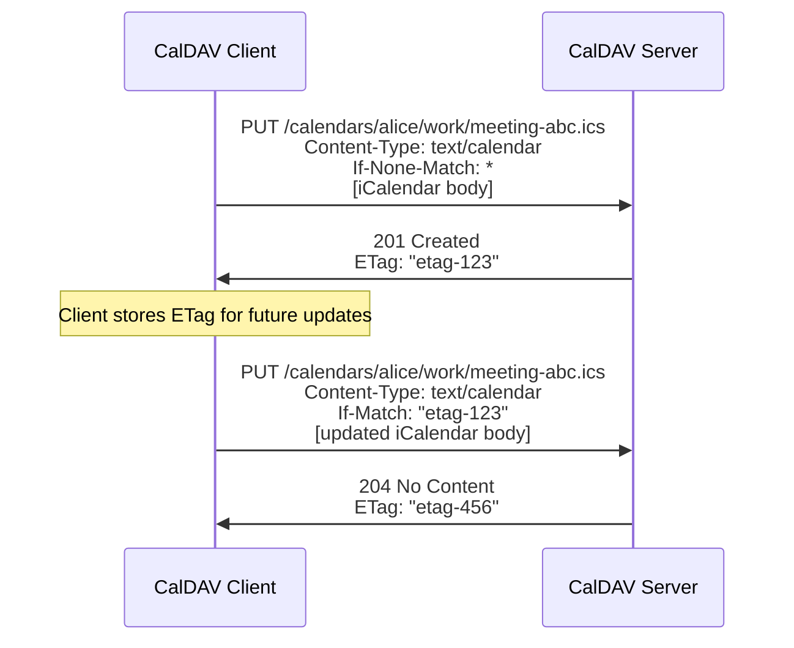
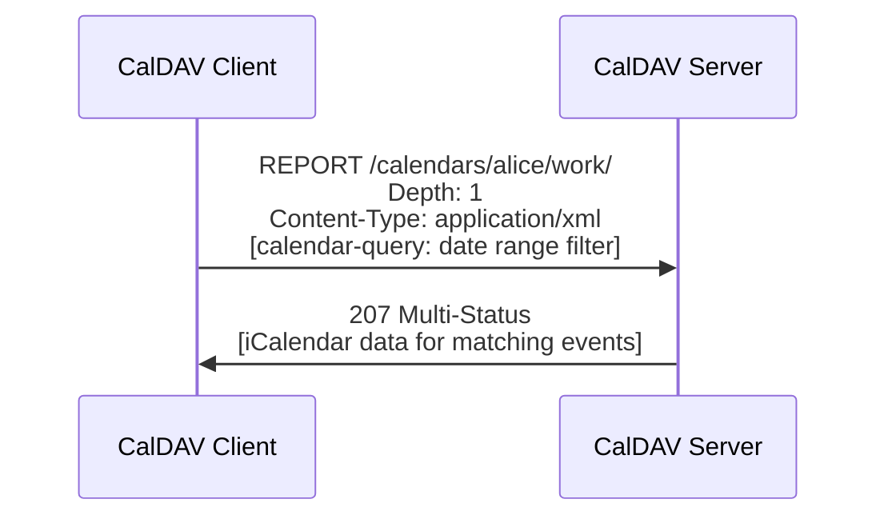

# CalDAV (Calendaring Extensions to WebDAV)

> **Standard:** [RFC 4791](https://www.rfc-editor.org/rfc/rfc4791) | **Layer:** Application (Layer 7) | **Wireshark filter:** `http` (CalDAV runs over HTTPS)

CalDAV is a calendar synchronization protocol built on top of WebDAV (HTTP extensions for distributed authoring). It allows clients to create, retrieve, update, and delete calendar events on a remote server using standard HTTP methods plus WebDAV extensions. Each calendar is a WebDAV collection, and each event is a resource stored as an iCalendar (`.ics`) object. CalDAV is the open standard behind calendar sync in Apple Calendar, Thunderbird, GNOME Calendar, and dozens of other clients, competing with proprietary sync protocols like Exchange ActiveSync and Google Calendar API.

## Architecture

CalDAV organizes calendars as a hierarchy of WebDAV collections:

```
/calendars/                              ← Calendar home (root)
  alice/                                 ← User principal
    work/                                ← Calendar collection
      meeting-abc123.ics                 ← Event resource (iCalendar)
      standup-def456.ics                 ← Event resource
    personal/                            ← Another calendar collection
      birthday-ghi789.ics               ← Event resource
```

## HTTP Methods

CalDAV uses standard HTTP methods plus WebDAV extensions:

| Method | Description |
|--------|-------------|
| GET | Retrieve a single `.ics` event resource |
| PUT | Create or update an event (client provides the `.ics` body) |
| DELETE | Remove an event resource |
| MKCALENDAR | Create a new calendar collection |
| PROPFIND | Query properties of calendars or events (WebDAV) |
| PROPPATCH | Modify properties of a calendar (WebDAV) |
| REPORT | Execute a query — calendar-query, calendar-multiget, free-busy-query |

## Event Creation Flow



`If-None-Match: *` prevents overwriting an existing event. `If-Match` ensures no concurrent modification (optimistic locking via ETags).

## Calendar Query (REPORT)

The calendar-query REPORT retrieves events matching filter criteria without fetching every resource individually:



### calendar-query Request Body

```xml
<?xml version="1.0" encoding="utf-8" ?>
<C:calendar-query xmlns:D="DAV:" xmlns:C="urn:ietf:params:xml:ns:caldav">
  <D:prop>
    <D:getetag/>
    <C:calendar-data/>
  </D:prop>
  <C:filter>
    <C:comp-filter name="VCALENDAR">
      <C:comp-filter name="VEVENT">
        <C:time-range start="20240301T000000Z" end="20240401T000000Z"/>
      </C:comp-filter>
    </C:comp-filter>
  </C:filter>
</C:calendar-query>
```

### REPORT Types

| Report | Description |
|--------|-------------|
| calendar-query | Filter events by component type, date range, or property |
| calendar-multiget | Fetch specific events by their href/UID (bulk retrieval) |
| free-busy-query | Request free/busy information for a time range |

## CalDAV Properties

Properties are queried via PROPFIND and modified via PROPPATCH:

| Property | Namespace | Description |
|----------|-----------|-------------|
| calendar-home-set | CalDAV | URL of the user's calendar home collection |
| supported-calendar-component-set | CalDAV | Which components the calendar accepts (VEVENT, VTODO, etc.) |
| calendar-description | CalDAV | Human-readable calendar description |
| calendar-timezone | CalDAV | Default time zone for the calendar (VTIMEZONE) |
| max-resource-size | CalDAV | Maximum size of an individual iCalendar resource |
| supported-calendar-data | CalDAV | Supported iCalendar versions and formats |
| displayname | DAV | Calendar display name |
| getctag | CS (CalendarServer) | Calendar collection tag — changes when any event changes |
| getetag | DAV | Entity tag for individual resources (concurrency control) |
| sync-token | DAV | Incremental sync token (RFC 6578) |
| calendar-color | Apple | Calendar color (e.g., `#FF5733FF`) |
| calendar-order | Apple | Sort order for calendar display |

## Synchronization

Clients need to detect changes efficiently without re-downloading all events:

| Strategy | How It Works |
|----------|-------------|
| CTag polling | Client stores `getctag` value; if it changes, something in the calendar changed — then use PROPFIND to find changed ETags |
| ETag comparison | PROPFIND for all ETags, compare with local cache, GET only changed items |
| WebDAV Sync (RFC 6578) | Client sends `sync-token`, server returns only resources changed since that token |

WebDAV Sync (RFC 6578) is the most efficient approach and is supported by all modern servers.

## Service Discovery

CalDAV clients discover the server automatically using two mechanisms:

| Method | Description |
|--------|-------------|
| `.well-known` URI | Client requests `https://example.com/.well-known/caldav` and follows the redirect |
| DNS SRV records | `_caldavs._tcp.example.com` (TLS) or `_caldav._tcp.example.com` (plain) |
| DNS TXT record | `_caldavs._tcp.example.com` TXT `path=/calendars/` |

Discovery defined in [RFC 6764](https://www.rfc-editor.org/rfc/rfc6764). The full discovery flow:

1. Look up DNS SRV record `_caldavs._tcp.example.com`
2. Or try `https://example.com/.well-known/caldav` (expect 301/302 redirect)
3. PROPFIND on redirect target to find `current-user-principal`
4. PROPFIND on principal to find `calendar-home-set`
5. PROPFIND on home set to enumerate calendar collections

## Scheduling Extensions (RFC 6638)

When organizer and attendees share the same CalDAV server, scheduling can happen automatically:

| Component | Description |
|-----------|-------------|
| schedule-outbox | Collection where the client submits scheduling messages (invitations, replies) |
| schedule-inbox | Collection where the server delivers incoming scheduling messages |
| Implicit scheduling | Server automatically sends iTIP REQUEST/REPLY/CANCEL when events are created/modified |
| schedule-tag | ETag-like value that changes only when scheduling-relevant properties change |

With implicit scheduling, the client simply PUTs an event with ATTENDEEs, and the server handles iTIP delivery automatically.

## Authentication

| Method | Description |
|--------|-------------|
| HTTP Basic over TLS | Username/password (most common for self-hosted) |
| HTTP Digest | Challenge-response (less common) |
| OAuth 2.0 | Token-based (Google Calendar, Microsoft) |
| Client certificates | TLS mutual authentication |

## CalDAV vs Proprietary Sync

| Feature | CalDAV | Exchange (EAS/EWS) | Google Calendar API |
|---------|--------|-------------------|-------------------|
| Protocol | HTTP/WebDAV + XML | HTTP + WBXML (EAS) / SOAP (EWS) | HTTP + JSON (REST) |
| Data format | iCalendar (text/calendar) | Proprietary XML/WBXML | JSON (proprietary schema) |
| Open standard | Yes (RFC 4791) | No (licensed) | No (proprietary) |
| Scheduling | iTIP via RFC 6638 | Built-in | Built-in |
| Discovery | .well-known + SRV | Autodiscover | OAuth + hardcoded endpoints |
| Offline sync | ETag/sync-token based | Sync keys | Sync tokens |
| Server implementations | Many (open-source and commercial) | Microsoft Exchange only | Google only |

## Major Implementations

| Implementation | Type | Notes |
|----------------|------|-------|
| Apple iCloud Calendar | Server + Client | macOS/iOS native CalDAV support |
| Google Calendar | Server | CalDAV access alongside proprietary API |
| Nextcloud | Server | Open-source, self-hosted |
| Radicale | Server | Lightweight Python CalDAV/CardDAV server |
| Baikal | Server | Lightweight PHP CalDAV/CardDAV server |
| DAViCal | Server | PostgreSQL-backed CalDAV server |
| Cyrus IMAP | Server | Also provides CalDAV/CardDAV |
| Thunderbird | Client | Via built-in CalDAV support |
| GNOME Calendar | Client | Native CalDAV |
| DAVx5 | Client | Android CalDAV/CardDAV sync adapter |

## Standards

| Document | Title |
|----------|-------|
| [RFC 4791](https://www.rfc-editor.org/rfc/rfc4791) | Calendaring Extensions to WebDAV (CalDAV) |
| [RFC 6638](https://www.rfc-editor.org/rfc/rfc6638) | Scheduling Extensions to CalDAV |
| [RFC 6764](https://www.rfc-editor.org/rfc/rfc6764) | Locating Services for Calendaring Extensions to WebDAV (CalDAV) and vCard Extensions to WebDAV (CardDAV) |
| [RFC 4918](https://www.rfc-editor.org/rfc/rfc4918) | HTTP Extensions for Web Distributed Authoring and Versioning (WebDAV) |
| [RFC 6578](https://www.rfc-editor.org/rfc/rfc6578) | Collection Synchronization for WebDAV |
| [RFC 5545](https://www.rfc-editor.org/rfc/rfc5545) | iCalendar (the data format CalDAV carries) |

## See Also

- [iCalendar](../data-formats/icalendar.md) — the data format CalDAV stores and transports
- [CardDAV](carddav.md) — sister protocol for contact sync (also WebDAV-based)
- [HTTP](http.md) — the transport protocol underneath CalDAV
- [WebSocket](websocket.md) — some CalDAV servers support push notifications via WebSocket
- [JMAP](../email/jmap.md) — modern alternative with JSCalendar support (RFC 8984)
