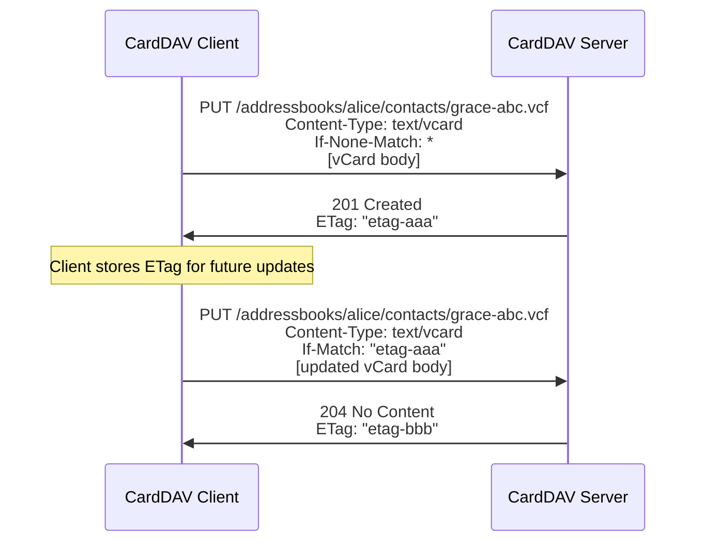
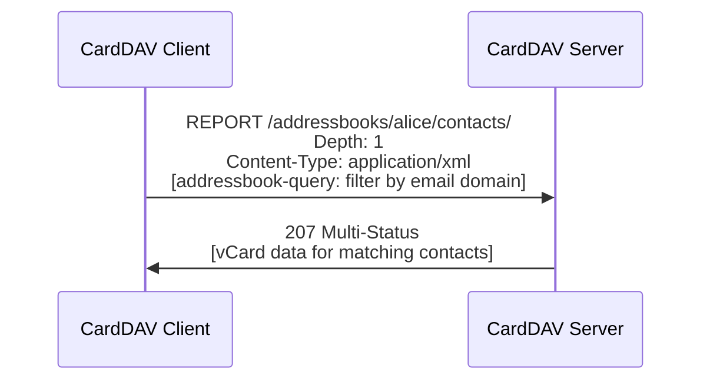

# CardDAV (vCard Extensions to WebDAV)

> **Standard:** [RFC 6352](https://www.rfc-editor.org/rfc/rfc6352) | **Layer:** Application (Layer 7) | **Wireshark filter:** `http` (CardDAV runs over HTTPS)

CardDAV is a contact synchronization protocol built on top of WebDAV (HTTP extensions for distributed authoring). It allows clients to create, retrieve, update, and delete contacts on a remote server using standard HTTP methods plus WebDAV extensions. Each address book is a WebDAV collection, and each contact is a resource stored as a vCard (`.vcf`) object. CardDAV is the open standard behind contact sync in Apple Contacts, Thunderbird, GNOME Contacts, and Android (via DAVx5), serving as the contact counterpart to CalDAV for calendars.

## Architecture

CardDAV organizes contacts as a hierarchy of WebDAV collections:

```
/addressbooks/                           ← Address book home (root)
  alice/                                 ← User principal
    contacts/                            ← Address book collection
      grace-abc123.vcf                   ← Contact resource (vCard)
      alan-def456.vcf                    ← Contact resource
    coworkers/                           ← Another address book collection
      bob-ghi789.vcf                     ← Contact resource
```

## HTTP Methods

CardDAV uses standard HTTP methods plus WebDAV extensions:

| Method | Description |
|--------|-------------|
| GET | Retrieve a single `.vcf` contact resource |
| PUT | Create or update a contact (client provides the vCard body) |
| DELETE | Remove a contact resource |
| PROPFIND | Query properties of address books or contacts (WebDAV) |
| PROPPATCH | Modify properties of an address book (WebDAV) |
| REPORT | Execute a query — addressbook-query, addressbook-multiget |

Unlike CalDAV, CardDAV has no `MKCOL`-equivalent extension (address books are created via standard WebDAV `MKCOL` with the appropriate resource type).

## Contact Creation Flow



`If-None-Match: *` prevents overwriting an existing contact. `If-Match` ensures no concurrent modification (optimistic locking via ETags).

## Address Book Query (REPORT)

The addressbook-query REPORT retrieves contacts matching filter criteria without downloading every resource:



### addressbook-query Request Body

```xml
<?xml version="1.0" encoding="utf-8" ?>
<C:addressbook-query xmlns:D="DAV:" xmlns:C="urn:ietf:params:xml:ns:carddav">
  <D:prop>
    <D:getetag/>
    <C:address-data/>
  </D:prop>
  <C:filter>
    <C:prop-filter name="EMAIL">
      <C:text-match collation="i;unicode-casemap" match-type="contains">
        @example.com
      </C:text-match>
    </C:prop-filter>
  </C:filter>
</C:addressbook-query>
```

### REPORT Types

| Report | Description |
|--------|-------------|
| addressbook-query | Filter contacts by vCard property values (name, email, phone, etc.) |
| addressbook-multiget | Fetch specific contacts by their href/UID (bulk retrieval) |

### Filter Match Types

| Match Type | Description |
|------------|-------------|
| equals | Exact match |
| contains | Substring match |
| starts-with | Prefix match |
| ends-with | Suffix match |

All text matches support the `i;unicode-casemap` collation for case-insensitive comparison.

## CardDAV Properties

Properties are queried via PROPFIND and modified via PROPPATCH:

| Property | Namespace | Description |
|----------|-----------|-------------|
| addressbook-home-set | CardDAV | URL of the user's address book home collection |
| supported-address-data | CardDAV | Supported vCard versions (3.0, 4.0) and content types |
| max-resource-size | CardDAV | Maximum size of an individual vCard resource |
| displayname | DAV | Address book display name |
| getctag | CS (CalendarServer) | Collection tag — changes when any contact changes |
| getetag | DAV | Entity tag for individual resources (concurrency control) |
| sync-token | DAV | Incremental sync token (RFC 6578) |
| resourcetype | DAV | Includes `addressbook` to identify address book collections |

## Synchronization

Clients need to detect changes efficiently without re-downloading all contacts:

| Strategy | How It Works |
|----------|-------------|
| CTag polling | Client stores `getctag`; if it changes, re-enumerate ETags via PROPFIND |
| ETag comparison | PROPFIND for all ETags, compare with local cache, GET only changed items |
| WebDAV Sync (RFC 6578) | Client sends `sync-token`, server returns only resources changed since that token |

WebDAV Sync (RFC 6578) is the most efficient approach. A typical sync cycle:

1. Client sends `sync-collection` REPORT with stored `sync-token`
2. Server returns new/modified/deleted hrefs plus a new `sync-token`
3. Client uses `addressbook-multiget` to fetch changed contacts in bulk
4. Client stores the new `sync-token` for the next cycle

## Service Discovery

CardDAV clients discover the server automatically using the same mechanisms as CalDAV:

| Method | Description |
|--------|-------------|
| `.well-known` URI | Client requests `https://example.com/.well-known/carddav` and follows the redirect |
| DNS SRV records | `_carddavs._tcp.example.com` (TLS) or `_carddav._tcp.example.com` (plain) |
| DNS TXT record | `_carddavs._tcp.example.com` TXT `path=/addressbooks/` |

Discovery defined in [RFC 6764](https://www.rfc-editor.org/rfc/rfc6764). The full discovery flow:

1. Look up DNS SRV record `_carddavs._tcp.example.com`
2. Or try `https://example.com/.well-known/carddav` (expect 301/302 redirect)
3. PROPFIND on redirect target to find `current-user-principal`
4. PROPFIND on principal to find `addressbook-home-set`
5. PROPFIND on home set to enumerate address book collections

## Authentication

| Method | Description |
|--------|-------------|
| HTTP Basic over TLS | Username/password (most common for self-hosted) |
| HTTP Digest | Challenge-response (less common) |
| OAuth 2.0 | Token-based (Google Contacts, Microsoft) |
| Client certificates | TLS mutual authentication |

## CardDAV vs LDAP vs Proprietary Sync

| Feature | CardDAV | LDAP | Google People API | Exchange (EAS) |
|---------|---------|------|-------------------|----------------|
| Protocol | HTTP/WebDAV + XML | Binary over TCP | HTTP + JSON (REST) | HTTP + WBXML |
| Data format | vCard (text/vcard) | Directory entries (ASN.1/BER) | JSON (proprietary schema) | Proprietary WBXML |
| Open standard | Yes (RFC 6352) | Yes (RFC 4511) | No (proprietary) | No (licensed) |
| Primary use | Contact sync (personal) | Directory lookup (enterprise) | Contact sync (Google) | Contact sync (Microsoft) |
| Bidirectional sync | Yes | Limited (mostly read) | Yes | Yes |
| Search/filter | addressbook-query REPORT | LDAP search filters | API query parameters | Sync commands |
| Discovery | .well-known + SRV | DNS SRV (_ldap._tcp) | OAuth + hardcoded endpoints | Autodiscover |
| Offline sync | ETag/sync-token based | Not designed for offline | Sync tokens | Sync keys |
| Photo support | vCard PHOTO property | jpegPhoto attribute | API field | EAS field |

## Major Implementations

| Implementation | Type | Notes |
|----------------|------|-------|
| Apple iCloud Contacts | Server + Client | macOS/iOS native CardDAV support |
| Google Contacts | Server | CardDAV access alongside People API |
| Nextcloud | Server | Open-source, self-hosted |
| Radicale | Server | Lightweight Python CalDAV/CardDAV server |
| Baikal | Server | Lightweight PHP CalDAV/CardDAV server |
| Cyrus IMAP | Server | Also provides CalDAV/CardDAV |
| Thunderbird | Client | Via built-in CardDAV support |
| GNOME Contacts | Client | Native CardDAV via GNOME Online Accounts |
| DAVx5 | Client | Android CalDAV/CardDAV sync adapter |
| Evolution | Client | GNOME PIM client with CardDAV support |

## Standards

| Document | Title |
|----------|-------|
| [RFC 6352](https://www.rfc-editor.org/rfc/rfc6352) | CardDAV: vCard Extensions to Web Distributed Authoring and Versioning (WebDAV) |
| [RFC 6764](https://www.rfc-editor.org/rfc/rfc6764) | Locating Services for CalDAV and CardDAV |
| [RFC 4918](https://www.rfc-editor.org/rfc/rfc4918) | HTTP Extensions for Web Distributed Authoring and Versioning (WebDAV) |
| [RFC 6578](https://www.rfc-editor.org/rfc/rfc6578) | Collection Synchronization for WebDAV |
| [RFC 6350](https://www.rfc-editor.org/rfc/rfc6350) | vCard Format Specification (the data format CardDAV carries) |

## See Also

- [vCard](../data-formats/vcard.md) — the data format CardDAV stores and transports
- [CalDAV](caldav.md) — sister protocol for calendar sync (also WebDAV-based)
- [LDAP](../naming/ldap.md) — directory protocol for enterprise contact lookup
- [HTTP](http.md) — the transport protocol underneath CardDAV
- [SCIM](../security/scim.md) — identity provisioning protocol (user management, not contact sync)
