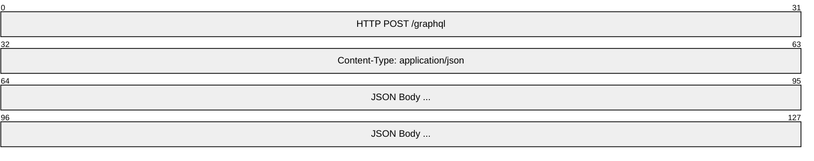
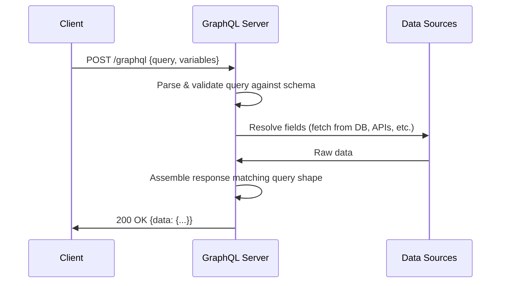
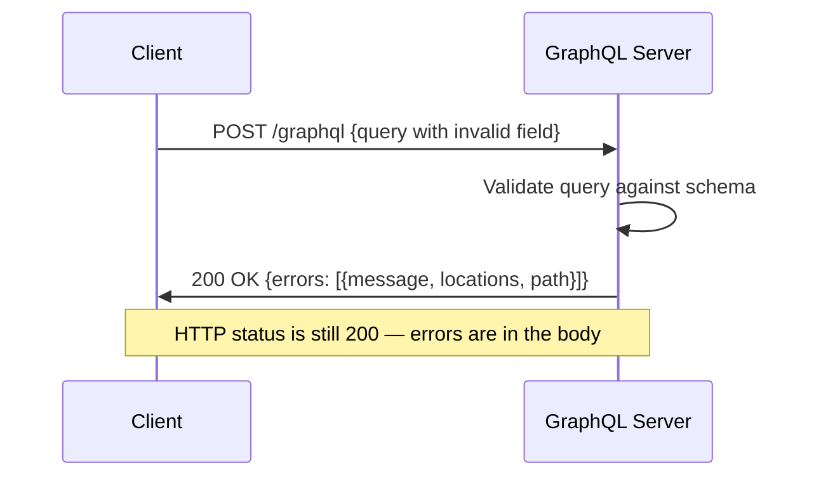
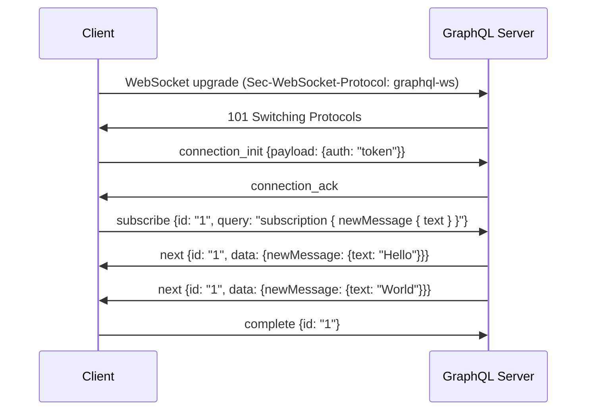
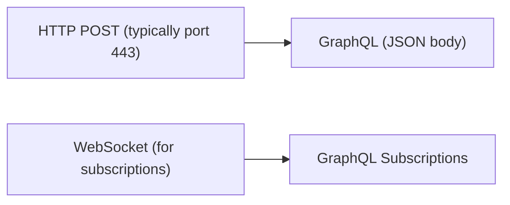

# GraphQL

> **Standard:** [GraphQL Specification](https://graphql.github.io/graphql-spec/) | **Layer:** Application (Layer 7) | **Wireshark filter:** `http`

GraphQL is a query language and runtime for APIs, developed by Facebook and open-sourced in 2015. Unlike REST, where the server defines fixed endpoints returning fixed data shapes, GraphQL lets clients specify exactly what data they need in a single request. A GraphQL service exposes a strongly typed schema; clients send queries, mutations, or subscriptions against that schema. The transport is typically HTTP POST with a JSON body, though subscriptions commonly use WebSocket. The GraphQL Foundation (under the Linux Foundation) maintains the specification.

## HTTP Transport Format

GraphQL requests are typically sent as HTTP POST with `Content-Type: application/json`:



### Request JSON Body

| Field | Type | Required | Description |
|-------|------|----------|-------------|
| query | String | Yes | The GraphQL document (query, mutation, or subscription) |
| variables | Object | No | Variable values for parameterized queries |
| operationName | String | No | Name of the operation to execute (when document contains multiple) |

### Response JSON Body

| Field | Type | Present | Description |
|-------|------|---------|-------------|
| data | Object | On success | The result of the executed operation, shaped to match the query |
| errors | Array | On error | List of error objects with `message`, `locations`, `path`, `extensions` |
| extensions | Object | Optional | Implementation-specific metadata (tracing, caching hints) |

## Operation Types

| Type | Keyword | Description |
|------|---------|-------------|
| Query | `query` | Read-only fetch (analogous to GET) |
| Mutation | `mutation` | Write then fetch (analogous to POST/PUT/DELETE) |
| Subscription | `subscription` | Long-lived connection pushing data on events |

### Query Example

```graphql
query GetUser($id: ID!) {
  user(id: $id) {
    name
    email
    posts(first: 5) {
      title
      createdAt
    }
  }
}
```

Variables: `{ "id": "42" }`

## Type System

GraphQL schemas are built from these type kinds:

| Kind | Description | Example |
|------|-------------|---------|
| Scalar | Primitive leaf values | `Int`, `Float`, `String`, `Boolean`, `ID`, custom scalars |
| Object | Named type with fields | `type User { name: String! }` |
| Interface | Abstract type with required fields | `interface Node { id: ID! }` |
| Union | One of several object types | `union SearchResult = User \| Post` |
| Enum | Fixed set of allowed values | `enum Status { ACTIVE, INACTIVE }` |
| Input Object | Object type for arguments | `input CreateUserInput { name: String! }` |
| List | Ordered collection | `[String]` |
| Non-Null | Value guaranteed present | `String!` |

## Key Language Features

| Feature | Description |
|---------|-------------|
| Selection Sets | Nested field selections that shape the response |
| Arguments | Parameters on fields (`user(id: "42")`) |
| Variables | Parameterized values (`$id: ID!`) passed separately from the query |
| Fragments | Reusable field selections (`fragment UserFields on User { ... }`) |
| Directives | Annotations modifying execution (`@include(if: $flag)`, `@skip`, `@deprecated`) |
| Aliases | Rename fields in the response (`admin: user(role: ADMIN) { name }`) |
| Inline Fragments | Type-conditional selections (`... on Post { title }`) |

## Introspection

GraphQL services must support introspection queries, allowing clients and tools to discover the schema at runtime:

| Query | Description |
|-------|-------------|
| `__schema` | Root introspection entry — returns types, directives, queryType, mutationType |
| `__type(name: "User")` | Details of a specific named type — fields, interfaces, enum values |
| `__typename` | Meta-field returning the concrete type name of any object |

## Query Flow



### Error Response



## Subscriptions over WebSocket

GraphQL subscriptions use a persistent WebSocket connection. The `graphql-ws` protocol (newer) and `subscriptions-transport-ws` (legacy) define the message exchange:

### graphql-ws Sub-protocol

| Message Type | Direction | Description |
|-------------|-----------|-------------|
| `connection_init` | Client -> Server | Initialize connection (optionally with auth payload) |
| `connection_ack` | Server -> Client | Acknowledge connection |
| `subscribe` | Client -> Server | Start a subscription (includes query and variables) |
| `next` | Server -> Client | Subscription event data |
| `error` | Server -> Client | Subscription error |
| `complete` | Either | Subscription ended |
| `ping` / `pong` | Either | Keep-alive |



## Batched Queries

Some GraphQL servers accept an array of operations in a single HTTP request:

```json
[
  {"query": "{ user(id: 1) { name } }"},
  {"query": "{ user(id: 2) { name } }"}
]
```

The server returns an array of responses in the same order. This reduces HTTP round trips but is not part of the official specification — it is a common server extension.

## GraphQL vs REST

| Feature | GraphQL | REST |
|---------|---------|------|
| Endpoint | Single endpoint (`/graphql`) | Multiple endpoints (`/users`, `/posts`) |
| Data fetching | Client specifies exact fields needed | Server defines fixed response shape |
| Over-fetching | Eliminated — client requests only what it needs | Common — endpoints return full resources |
| Under-fetching | Eliminated — nested data in one query | Common — requires multiple round trips |
| Versioning | Schema evolution with `@deprecated` | URL versioning (`/v1/`, `/v2/`) |
| Caching | More complex (POST body, persisted queries) | Simple (HTTP GET caching, ETags) |
| Type system | Built-in, strongly typed schema | External (OpenAPI/Swagger) |
| Real-time | Subscriptions (WebSocket) | SSE, polling, or WebSocket (ad hoc) |
| File uploads | Not in spec (multipart extension) | Native multipart/form-data |
| Tooling | Introspection enables auto-generated docs, IDEs | Depends on OpenAPI adoption |
| Error handling | Always HTTP 200, errors in response body | HTTP status codes (4xx, 5xx) |

## Encapsulation



## Standards

| Document | Title |
|----------|-------|
| [GraphQL Specification](https://graphql.github.io/graphql-spec/) | GraphQL Language and Type System Specification |
| [graphql-ws Protocol](https://github.com/enisdenjo/graphql-ws/blob/master/PROTOCOL.md) | GraphQL over WebSocket Protocol |
| [GraphQL over HTTP](https://graphql.github.io/graphql-over-http/) | GraphQL over HTTP Specification (working draft) |
| [GraphQL Multipart Request](https://github.com/jaydenseric/graphql-multipart-request-spec) | GraphQL multipart request spec (file uploads) |

## See Also

- [HTTP](http.md) -- primary transport for GraphQL
- [gRPC](grpc.md) -- alternative RPC framework (binary, schema-driven)
- [WebSocket](websocket.md) -- transport for GraphQL subscriptions
- [CoAP](coap.md) -- constrained application protocol (different domain, similar request-response model)
