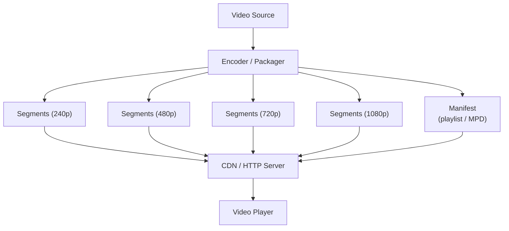
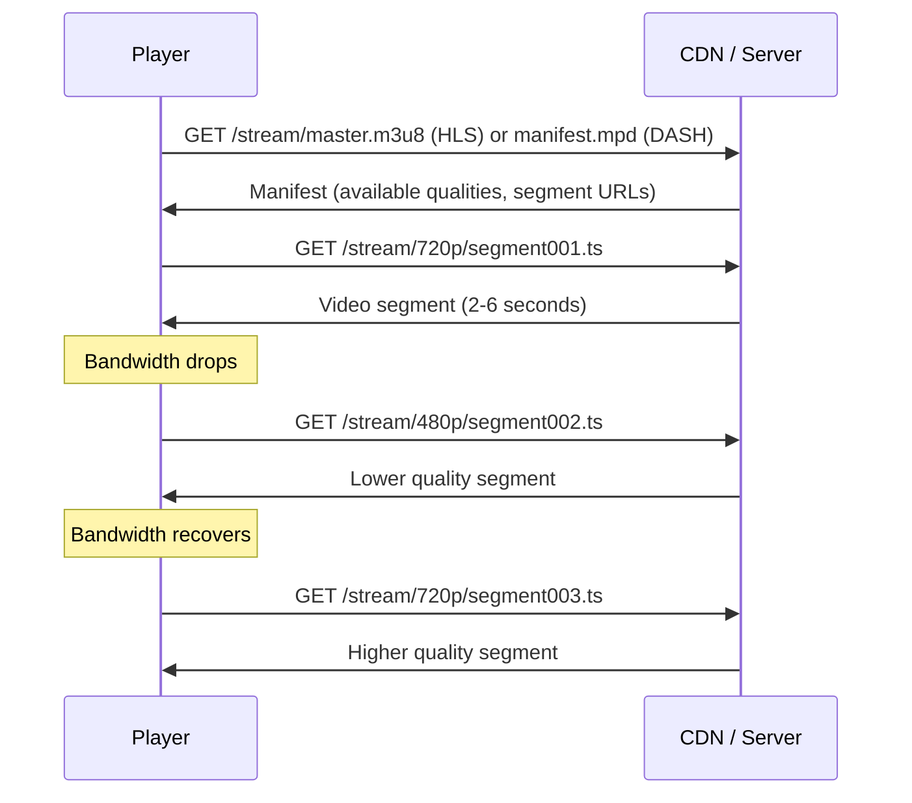
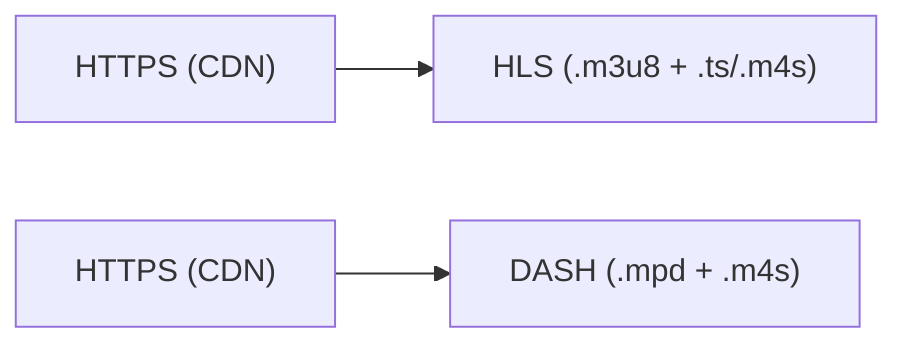

# HLS / MPEG-DASH (Adaptive Bitrate Streaming)

> **Standard:** [RFC 8216 (HLS)](https://www.rfc-editor.org/rfc/rfc8216) / [ISO 23009-1 (DASH)](https://www.iso.org/standard/79329.html) | **Layer:** Application (Layer 7) | **Wireshark filter:** `http` (HLS and DASH run over HTTP)

HLS (HTTP Live Streaming) and MPEG-DASH (Dynamic Adaptive Streaming over HTTP) are the two dominant protocols for video streaming over the Internet. Both work by dividing media into small segments (typically 2-10 seconds) served over standard HTTP/HTTPS, with a manifest file describing available quality levels. The client adaptively selects segment quality based on network conditions. HLS was created by Apple; DASH is the ISO standard. Together they power Netflix, YouTube, Disney+, live sports, and virtually all modern video delivery.

## How Adaptive Streaming Works



### Playback Flow



## HLS (HTTP Live Streaming)

### Master Playlist (Multi-Variant)

```
#EXTM3U
#EXT-X-STREAM-INF:BANDWIDTH=800000,RESOLUTION=640x360
360p/playlist.m3u8
#EXT-X-STREAM-INF:BANDWIDTH=2400000,RESOLUTION=1280x720
720p/playlist.m3u8
#EXT-X-STREAM-INF:BANDWIDTH=5000000,RESOLUTION=1920x1080
1080p/playlist.m3u8
```

### Media Playlist

```
#EXTM3U
#EXT-X-VERSION:7
#EXT-X-TARGETDURATION:6
#EXT-X-MEDIA-SEQUENCE:1
#EXTINF:6.006,
segment001.ts
#EXTINF:6.006,
segment002.ts
#EXTINF:5.338,
segment003.ts
```

### Key HLS Tags

| Tag | Description |
|-----|-------------|
| #EXTM3U | Playlist header |
| #EXT-X-STREAM-INF | Variant stream (bandwidth, resolution, codecs) |
| #EXTINF | Segment duration |
| #EXT-X-TARGETDURATION | Maximum segment duration |
| #EXT-X-MEDIA-SEQUENCE | Sequence number of first segment |
| #EXT-X-ENDLIST | VOD playlist end (not present for live) |
| #EXT-X-KEY | Encryption key (AES-128 or SAMPLE-AES) |
| #EXT-X-MAP | Initialization segment (fMP4) |
| #EXT-X-DATERANGE | Date-range metadata (ad markers, program info) |
| #EXT-X-PART | LL-HLS partial segment |
| #EXT-X-PRELOAD-HINT | LL-HLS preload hint |

### Container Formats

| Format | Extension | Description |
|--------|-----------|-------------|
| MPEG-TS | .ts | Original HLS container (H.264 + AAC) |
| fMP4 | .m4s + init.mp4 | Fragmented MP4 (HLS + DASH compatible, preferred for HEVC/AV1) |

## MPEG-DASH

### MPD (Media Presentation Description)

DASH uses an XML manifest:

```xml
<MPD type="dynamic" minBufferTime="PT2S" availabilityStartTime="2026-03-21T10:00:00Z">
  <Period>
    <AdaptationSet mimeType="video/mp4" contentType="video">
      <Representation id="720p" bandwidth="2400000" width="1280" height="720">
        <SegmentTemplate media="seg_$Number$.m4s" initialization="init.mp4"
          timescale="90000" duration="540000"/>
      </Representation>
      <Representation id="1080p" bandwidth="5000000" width="1920" height="1080">
        <SegmentTemplate media="seg_$Number$.m4s" initialization="init.mp4"
          timescale="90000" duration="540000"/>
      </Representation>
    </AdaptationSet>
  </Period>
</MPD>
```

### Key DASH Concepts

| Concept | Description |
|---------|-------------|
| MPD | Media Presentation Description (XML manifest) |
| Period | Time period (can change available streams, e.g., ad break) |
| AdaptationSet | Group of interchangeable Representations (same content, different quality) |
| Representation | Specific quality level (bandwidth, resolution, codec) |
| Segment | Individual media chunk |
| SegmentTemplate | URL pattern for segments |

## HLS vs DASH

| Feature | HLS | MPEG-DASH |
|---------|-----|-----------|
| Manifest | M3U8 (text) | MPD (XML) |
| Container | TS or fMP4 | fMP4 (or WebM) |
| DRM | FairPlay (Apple) | Widevine, PlayReady, ClearKey |
| Browser support | Safari native; MSE elsewhere | MSE (all browsers except Safari TS) |
| Low latency | LL-HLS (Apple) | CMAF + chunked transfer |
| Segment duration | Typically 6s (2s for LL-HLS) | Typically 2-6s |
| Live | Yes | Yes |
| Standard body | IETF (RFC 8216) | ISO (23009-1) |

## Low-Latency Streaming

| Protocol | Latency | Method |
|----------|---------|--------|
| Traditional HLS | 15-30s | 6s segments, 3-segment buffer |
| LL-HLS | 2-4s | Partial segments, preload hints, blocking playlist reload |
| Low-Latency DASH | 2-4s | CMAF chunks, chunked transfer encoding |
| WebRTC | <1s | Peer-to-peer RTP (not HTTP-based) |

## Encapsulation



Both protocols use standard HTTP/HTTPS — no special ports or transport.

## Standards

| Document | Title |
|----------|-------|
| [RFC 8216](https://www.rfc-editor.org/rfc/rfc8216) | HTTP Live Streaming |
| [RFC 8216bis](https://datatracker.ietf.org/doc/draft-pantos-hls-rfc8216bis/) | HLS 2nd Edition (LL-HLS, fMP4) |
| [ISO 23009-1](https://www.iso.org/standard/79329.html) | MPEG-DASH |
| [CMAF (ISO 23000-19)](https://www.iso.org/standard/79106.html) | Common Media Application Format |

## See Also

- [HTTP](http.md) — transport for both HLS and DASH
- [TLS](../security/tls.md) — HTTPS encryption for streaming
- [RTP](../voip/rtp.md) — alternative real-time media transport (lower latency)
- [WebRTC](../voip/webrtc.md) — sub-second latency alternative
