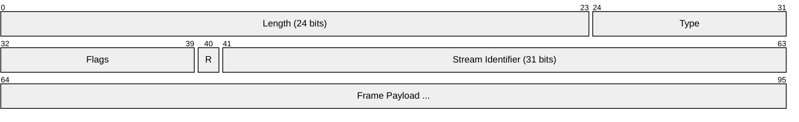
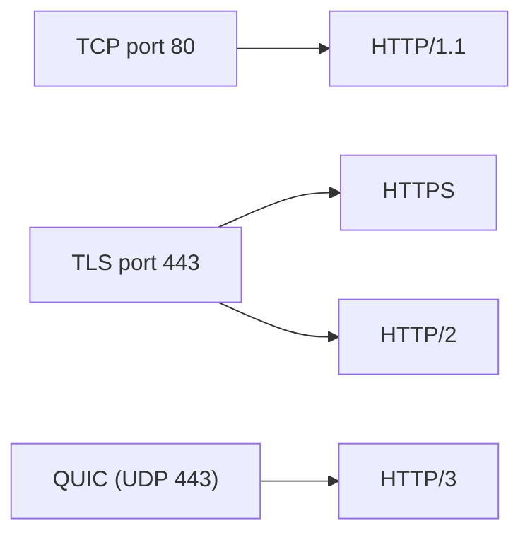

# HTTP (Hypertext Transfer Protocol)

> **Standard:** [RFC 9110](https://www.rfc-editor.org/rfc/rfc9110) | **Layer:** Application (Layer 7) | **Wireshark filter:** `http` or `http2`

HTTP is the protocol of the World Wide Web, used for transferring hypertext documents, APIs, and any resource identified by a URL. It follows a request-response model where a client sends a request (method + URL + headers) and a server returns a response (status code + headers + body). HTTP is a text-based protocol in versions 1.0 and 1.1, and binary-framed in HTTP/2 and HTTP/3.

## Message Structure

HTTP/1.1 uses a text-based format. Unlike lower-layer protocols, HTTP does not have a fixed-width binary header — it uses CRLF-delimited text lines.

### Request

```
METHOD /path HTTP/1.1\r\n
Header-Name: Header-Value\r\n
Header-Name: Header-Value\r\n
\r\n
[optional body]
```

### Response

```
HTTP/1.1 STATUS-CODE Reason-Phrase\r\n
Header-Name: Header-Value\r\n
Header-Name: Header-Value\r\n
\r\n
[optional body]
```

## HTTP/2 Frame

HTTP/2 ([RFC 9113](https://www.rfc-editor.org/rfc/rfc9113)) uses a binary framing layer:



| Field | Size | Description |
|-------|------|-------------|
| Length | 24 bits | Payload length (not including the 9-byte header) |
| Type | 8 bits | Frame type |
| Flags | 8 bits | Type-specific flags |
| R | 1 bit | Reserved, must be zero |
| Stream ID | 31 bits | Identifies the stream (0 for connection-level frames) |

### HTTP/2 Frame Types

| Type | Name | Description |
|------|------|-------------|
| 0 | DATA | Carries request/response body |
| 1 | HEADERS | Carries HTTP headers (compressed with HPACK) |
| 2 | PRIORITY | Stream priority (deprecated in RFC 9113) |
| 3 | RST_STREAM | Abort a stream |
| 4 | SETTINGS | Connection configuration parameters |
| 5 | PUSH_PROMISE | Server push notification |
| 6 | PING | Keepalive / round-trip time measurement |
| 7 | GOAWAY | Graceful connection shutdown |
| 8 | WINDOW_UPDATE | Flow control window adjustment |
| 9 | CONTINUATION | Continues a HEADERS or PUSH_PROMISE frame |

## Key Fields

### Request Methods

| Method | Description |
|--------|-------------|
| GET | Retrieve a resource |
| HEAD | Like GET but response has no body |
| POST | Submit data to a resource |
| PUT | Replace a resource |
| DELETE | Remove a resource |
| PATCH | Partial modification of a resource |
| OPTIONS | Describe communication options |
| CONNECT | Establish a tunnel (used for HTTPS proxying) |
| TRACE | Loop-back test |

### Response Status Codes

| Range | Category | Examples |
|-------|----------|----------|
| 1xx | Informational | 100 Continue, 101 Switching Protocols |
| 2xx | Success | 200 OK, 201 Created, 204 No Content |
| 3xx | Redirection | 301 Moved Permanently, 304 Not Modified |
| 4xx | Client Error | 400 Bad Request, 401 Unauthorized, 403 Forbidden, 404 Not Found |
| 5xx | Server Error | 500 Internal Server Error, 502 Bad Gateway, 503 Service Unavailable |

### Common Headers

| Header | Direction | Description |
|--------|-----------|-------------|
| Host | Request | Target hostname (required in HTTP/1.1) |
| Content-Type | Both | MIME type of the body |
| Content-Length | Both | Size of the body in bytes |
| Authorization | Request | Authentication credentials |
| User-Agent | Request | Client software identifier |
| Accept | Request | Acceptable response media types |
| Cache-Control | Both | Caching directives |
| Set-Cookie | Response | Set a client cookie |
| Cookie | Request | Send stored cookies |
| Location | Response | Redirect target URL |

## Version Comparison

| Feature | HTTP/1.0 | HTTP/1.1 | HTTP/2 | HTTP/3 |
|---------|----------|----------|--------|--------|
| Connections | One request per connection | Persistent, pipelined | Multiplexed streams | Multiplexed (QUIC) |
| Header format | Text | Text | Binary (HPACK) | Binary (QPACK) |
| Transport | TCP | TCP | TCP + TLS | QUIC (UDP) |
| Server push | No | No | Yes | Yes |
| Head-of-line blocking | Per connection | Per connection | Per connection (TCP) | Eliminated |

## Encapsulation



## Standards

| Document | Title |
|----------|-------|
| [RFC 9110](https://www.rfc-editor.org/rfc/rfc9110) | HTTP Semantics |
| [RFC 9112](https://www.rfc-editor.org/rfc/rfc9112) | HTTP/1.1 |
| [RFC 9113](https://www.rfc-editor.org/rfc/rfc9113) | HTTP/2 |
| [RFC 9114](https://www.rfc-editor.org/rfc/rfc9114) | HTTP/3 |
| [RFC 6265](https://www.rfc-editor.org/rfc/rfc6265) | HTTP State Management Mechanism (Cookies) |
| [RFC 7540](https://www.rfc-editor.org/rfc/rfc7540) | HTTP/2 (original, superseded by RFC 9113) |

## See Also

- [TCP](../transport-layer/tcp.md)
- [TLS](../security/tls.md)
- [DNS](../naming/dns.md) — resolves hostnames before HTTP connections
